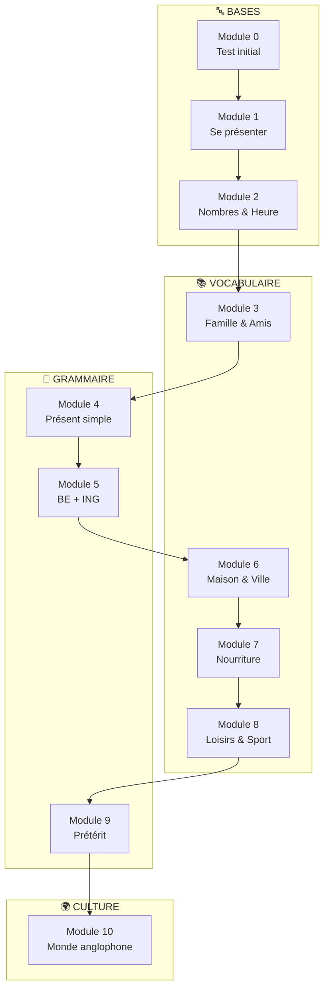

# Formation Anglais 6ème

!!! info "Bienvenue dans ta formation d'Anglais !"
    Cette formation complète te permettra de maîtriser les bases de l'anglais niveau 6ème.

    **Niveau** : A1 vers A2 (CECRL)

    **Durée totale estimée** : 25-30 heures

---

## Objectifs de la formation

À la fin de cette formation, tu seras capable de :

- Se présenter et parler de soi en anglais
- Comprendre et utiliser le vocabulaire du quotidien
- Maîtriser les temps de base (présent simple, BE+ING, prétérit)
- Poser des questions et y répondre
- Comprendre des textes simples
- Découvrir la culture anglophone

---

## Programme des modules

---

## Détail des modules

### Bases et communication

| Module | Titre | Contenu | Durée |
|--------|-------|---------|-------|
| 0 | Test de départ | Évalue ton niveau initial | 30 min |
| 1 | Se présenter | Hello, my name is..., BE au présent | 2-3h |
| 2 | Nombres et heure | Compter, dire l'heure, dates | 2-3h |

### Vocabulaire thématique

| Module | Titre | Contenu | Durée |
|--------|-------|---------|-------|
| 3 | Famille et amis | Membres de la famille, description | 2-3h |
| 6 | Maison et ville | Pièces, meubles, lieux en ville | 2-3h |
| 7 | Nourriture | Aliments, repas, au restaurant | 2-3h |
| 8 | Loisirs et sport | Activités, hobbies, sports | 2-3h |

### Grammaire essentielle

| Module | Titre | Contenu | Durée |
|--------|-------|---------|-------|
| 4 | Présent simple | Affirmation, négation, questions | 2-3h |
| 5 | BE + ING | Actions en cours, différence avec présent simple | 2-3h |
| 9 | Prétérit | Parler du passé, verbes réguliers/irréguliers | 2-3h |

### Culture

| Module | Titre | Contenu | Durée |
|--------|-------|---------|-------|
| 10 | Monde anglophone | UK, USA, traditions, fêtes | 2-3h |

---

## Comment utiliser cette formation ?

!!! tip "Conseils pour bien progresser"

    1. **Commence par le Module 0** pour évaluer ton niveau
    2. **Suis l'ordre des modules** (ils sont progressifs)
    3. **Écoute et répète** à voix haute (la prononciation est importante !)
    4. **Fais tous les exercices** avant de regarder les corrections
    5. **Révise régulièrement** le vocabulaire appris
    6. **N'aie pas peur de te tromper** - les erreurs font progresser !

---

## Tableau de suivi

| Module | Titre | État | Score |
|--------|-------|:----:|:-----:|
| 0 | Test initial | ⬜ | /20 |
| 1 | Se présenter | ⬜ | /20 |
| 2 | Nombres et heure | ⬜ | /20 |
| 3 | Famille et amis | ⬜ | /20 |
| 4 | Présent simple | ⬜ | /20 |
| 5 | BE + ING | ⬜ | /20 |
| 6 | Maison et ville | ⬜ | /20 |
| 7 | Nourriture | ⬜ | /20 |
| 8 | Loisirs et sport | ⬜ | /20 |
| 9 | Prétérit | ⬜ | /20 |
| 10 | Monde anglophone | ⬜ | /20 |

---

## Ressources complémentaires

!!! example "Pour aller plus loin"

    - **Écouter** : Regarder des dessins animés en anglais (avec sous-titres)
    - **Lire** : Livres adaptés niveau A1-A2
    - **Parler** : Répéter les dialogues, se parler à soi-même en anglais
    - **Écrire** : Tenir un petit journal en anglais

---

## Let's go!

!!! success "Prêt à commencer ?"
    Clique sur le bouton ci-dessous pour faire le test de départ !

[Commencer le Module 0 - Test initial](module-00-depart.md){ .md-button .md-button--primary }
