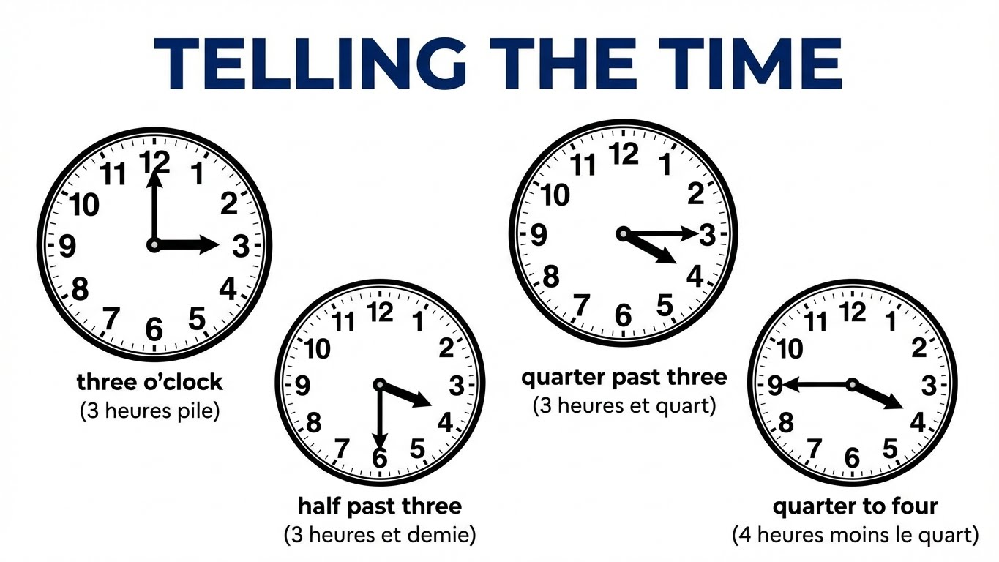

# Module 2 - Les nombres et l'heure / Numbers and Time

!!! info "Objectifs du module"
    À la fin de ce module, tu sauras :

    - 🎯 Compter de 0 à 100 en anglais
    - 🎯 Dire et demander l'heure
    - 🎯 Connaître les jours et les mois
    - 🎯 Dire la date

    **Durée estimée : 2-3 heures**

---

## 🎮 In Real Life: Numbers are everywhere!

!!! tip "Les nombres en anglais dans ta vie"

    **Dans les jeux :**

    | Ce que tu vois | Signification |
    |----------------|---------------|
    | **Score: 1,000** | One thousand points |
    | **Level 25** | Twenty-five |
    | **100 HP** | One hundred Health Points |
    | **Timer: 3:45** | Three forty-five |

    **Dans les vidéos YouTube :**

    - **1M views** = One million views (1 million de vues)
    - **500K subscribers** = Five hundred thousand subscribers

!!! example "L'heure dans la vie quotidienne"

    **Rendez-vous de gaming :**

    - "Let's play at **5 o'clock**!" = On joue à 17h !
    - "Stream starts at **8 PM**!" = Le stream commence à 20h !

    **AM vs PM :**

    | Abréviation | Signification | Période |
    |-------------|---------------|---------|
    | **AM** | Ante Meridiem | Minuit → Midi |
    | **PM** | Post Meridiem | Midi → Minuit |

    **9 AM = 9h du matin / 9 PM = 21h**

!!! warning "Les pièges des nombres"

    **Attention à bien prononcer :**

    | Nombre | Prononciation | Piège |
    |--------|---------------|-------|
    | **13** | thir-TEEN | Accent sur -teen |
    | **30** | THIR-ty | Accent sur thir- |
    | **15** | fif-TEEN | Accent sur -teen |
    | **50** | FIF-ty | Accent sur fif- |

    **Conseil : écoute bien l'accent dans les jeux !**

??? warning "⚠️ Pièges à éviter : nombres et heure"

    **Piège 1 : Confondre -TEEN et -TY**

    | -TEEN (13-19) | -TY (20-90) |
    |---------------|-------------|
    | thir**TEEN** (13) | **THIR**ty (30) |
    | four**TEEN** (14) | **FOR**ty (40) |
    | fif**TEEN** (15) | **FIF**ty (50) |

    **L'accent change de place !**
    - 13 = accent sur **-TEEN**
    - 30 = accent sur **THIR-**

    ---

    **Piège 2 : L'orthographe de FORTY**

    - ❌ "fourty" (on garde le "u" de four)
    - ✅ **forty** (pas de "u" !)

    C'est la seule exception où on perd le "u" de four.

    ---

    **Piège 3 : Le tiret dans les nombres composés**

    - ❌ "twenty one", "thirty two"
    - ✅ "twenty**-**one" (21), "thirty**-**two" (32)

    **Entre 21 et 99, on met un TIRET !**

    ---

    **Piège 4 : Confondre AM et PM**

    | AM | PM |
    |----|-----|
    | **A**nte **M**eridiem | **P**ost **M**eridiem |
    | AVANT midi | APRÈS midi |
    | 0h → 11h59 | 12h → 23h59 |

    - 9 **AM** = 9h du matin
    - 9 **PM** = 21h (9h du soir)

    ---

    **Piège 5 : Les jours et mois en majuscule**

    - ❌ "monday", "january"
    - ✅ "**M**onday", "**J**anuary"

    **En anglais, jours et mois prennent TOUJOURS une MAJUSCULE !**

    ---

    **Piège 6 : Le format de date UK vs US**

    | UK (comme en France) | USA (attention !) |
    |---------------------|-------------------|
    | jour/mois/année | **mois/jour**/année |
    | 5/6/2024 = 5 juin | 5/6/2024 = **6 mai** ! |

    **Aux USA, 6/5 = June 5th, pas le 6 mai !**

!!! example "Les dates importantes pour toi"

    **Comment dire ta date d'anniversaire :**

    - "My birthday is on **March 15th**" (15 mars)
    - "I was born in **2012**" (two thousand twelve)

    **Les mois à connaître pour les événements gaming :**

    - **June** = E3 (événement jeux vidéo)
    - **November** = Black Friday sales
    - **December** = Christmas sales

??? abstract "🔄 Autre façon de comprendre : les nombres et l'heure"
    **Les nombres en anglais = quelques règles simples !**

    **De 13 à 19 : le suffixe -TEEN**
    - 13 = thir**teen**, 14 = four**teen**, 15 = fif**teen**...
    - **Attention :** l'accent est sur -TEEN (thirTEEN)

    **Les dizaines : le suffixe -TY**
    - 20 = twen**ty**, 30 = thir**ty**, 40 = for**ty**, 50 = fif**ty**...
    - **Attention :** l'accent est au début (THIRty)

    **Comment distinguer 13/30, 14/40, etc. ?**
    - 13 = thirTEEN (accent sur teen)
    - 30 = THIRty (accent sur thir)

    ---

    **L'heure en anglais : deux façons !**

    **Façon simple (digitale) :**
    - 3:45 = "three forty-five"
    - 8:30 = "eight thirty"

    **Façon traditionnelle :**
    - 3:15 = "quarter past three" (quart après 3h)
    - 3:30 = "half past three" (moitié après 3h)
    - 3:45 = "quarter to four" (quart avant 4h)

    ---

    **AM vs PM = matin vs après-midi**

    - AM = Ante Meridiem = avant midi (0h-12h)
    - PM = Post Meridiem = après midi (12h-24h)

    **9 AM = 9h du matin**
    **9 PM = 21h (9h du soir)**

---

## 1. Les nombres - Numbers

### 1.1 De 0 à 20

```
    NUMBERS 0-20

    0  zero          10  ten
    1  one           11  eleven
    2  two           12  twelve
    3  three         13  thirteen
    4  four          14  fourteen
    5  five          15  fifteen
    6  six           16  sixteen
    7  seven         17  seventeen
    8  eight         18  eighteen
    9  nine          19  nineteen
                     20  twenty
```

!!! tip "Astuce 13-19"
    Les nombres de 13 à 19 finissent tous par **-teen** (comme "teenager" = adolescent)

### 1.2 Les dizaines (20-90)

```
    DIZAINES (TENS)

    20  twenty       60  sixty
    30  thirty       70  seventy
    40  forty        80  eighty
    50  fifty        90  ninety
```

!!! warning "Attention"
    **Forty** s'écrit sans "u" (pas "fourty") !

### 1.3 Nombres composés (21-99)

```
    CONSTRUCTION : dizaine + tiret + unité

    21  twenty-one
    32  thirty-two
    45  forty-five
    58  fifty-eight
    63  sixty-three
    74  seventy-four
    86  eighty-six
    99  ninety-nine
```

### 1.4 100 et au-delà

| Nombre | Anglais |
|--------|---------|
| 100 | one hundred |
| 101 | one hundred and one |
| 200 | two hundred |
| 1,000 | one thousand |
| 1,000,000 | one million |

---

## 2. L'heure - Telling the time

### 2.1 Demander l'heure

```
    DEMANDER L'HEURE

    What time is it?        →  Quelle heure est-il ?
    What's the time?        →  Quelle heure est-il ?
    Do you have the time?   →  Tu as l'heure ?
```

### 2.2 Dire l'heure (méthode simple)

```
    MÉTHODE SIMPLE : heure + minutes

    8:00   →  It's eight o'clock
    8:15   →  It's eight fifteen
    8:30   →  It's eight thirty
    8:45   →  It's eight forty-five
    9:05   →  It's nine oh five (le "oh" pour le zéro)
```

### 2.3 Dire l'heure (méthode traditionnelle)

{ width="100%" loading=lazy }

**Exemples :**

- 8:15  →  quarter past eight (un quart après 8h)
- 8:30  →  half past eight (8h et demie)
- 8:45  →  quarter to nine (un quart avant 9h)

### 2.4 Tableau récapitulatif

| Heure | Méthode simple | Méthode traditionnelle |
|-------|----------------|----------------------|
| 3:00 | three o'clock | three o'clock |
| 3:05 | three oh five | five past three |
| 3:15 | three fifteen | quarter past three |
| 3:30 | three thirty | half past three |
| 3:45 | three forty-five | quarter to four |
| 3:50 | three fifty | ten to four |

### 2.5 AM et PM

```
    AM / PM

    AM = Ante Meridiem (avant midi)  →  00:00 à 11:59
    PM = Post Meridiem (après midi)  →  12:00 à 23:59

    8:00 AM  =  8h du matin
    8:00 PM  =  20h (8h du soir)

    12:00 PM =  midi (noon)
    12:00 AM =  minuit (midnight)
```

---

## 3. Les jours et les mois - Days and Months

{ width="100%" loading=lazy }

### 3.1 Les jours de la semaine - Days of the week

| English | Français |
|---------|----------|
| **Monday** | lundi |
| **Tuesday** | mardi |
| **Wednesday** | mercredi |
| **Thursday** | jeudi |
| **Friday** | vendredi |
| **Saturday** | samedi |
| **Sunday** | dimanche |

!!! warning "Attention"
    Toujours avec une **MAJUSCULE** en anglais !

!!! tip "Moyens mnémotechniques"
    - **Monday** = Moon day (jour de la Lune)
    - **Sunday** = Sun day (jour du Soleil)
    - **Saturday** = Saturn day (jour de Saturne)

---

### 3.2 Les mois de l'année - Months of the year

| English | Français |
|---------|----------|
| **January** | janvier |
| **February** | février |
| **March** | mars |
| **April** | avril |
| **May** | mai |
| **June** | juin |
| **July** | juillet |
| **August** | août |
| **September** | septembre |
| **October** | octobre |
| **November** | novembre |
| **December** | décembre |

!!! warning "Attention"
    Toujours avec une **MAJUSCULE** en anglais !

---

## 5. La date - The date

### 5.1 Les nombres ordinaux

```
    ORDINAL NUMBERS (Nombres ordinaux)

    1st   first         11th  eleventh
    2nd   second        12th  twelfth
    3rd   third         13th  thirteenth
    4th   fourth        20th  twentieth
    5th   fifth         21st  twenty-first
    6th   sixth         22nd  twenty-second
    7th   seventh       23rd  twenty-third
    8th   eighth        30th  thirtieth
    9th   ninth         31st  thirty-first
    10th  tenth
```

### 5.2 Dire la date

```
    FORMAT DE LA DATE

    En anglais britannique :
    Day + Month + Year
    "the fifth of June" ou "June the fifth"

    Écrit : 5th June 2024 ou 5/6/2024

    En anglais américain :
    Month + Day + Year
    "June fifth"

    Écrit : June 5th, 2024 ou 6/5/2024

    ⚠️ Attention : Les Américains écrivent mois/jour !
```

### 5.3 Demander la date

| Question | Réponse |
|----------|---------|
| What's the date today? | It's the 15th of March. |
| What day is it today? | It's Monday. |
| When is your birthday? | It's on July 8th. |

---

## Exercices

### Exercice 1 : Écris les nombres en lettres

??? question "Write in words"
    1. 17 = ___
    2. 45 = ___
    3. 83 = ___
    4. 100 = ___
    5. 56 = ___

    ??? success "Answers"
        1. 17 = **seventeen**
        2. 45 = **forty-five**
        3. 83 = **eighty-three**
        4. 100 = **one hundred**
        5. 56 = **fifty-six**

### Exercice 2 : Quelle heure est-il ?

??? question "Write the time in words"
    1. 9:00 = ___
    2. 6:30 = ___
    3. 4:15 = ___
    4. 7:45 = ___
    5. 10:20 = ___

    ??? success "Answers"
        1. 9:00 = **nine o'clock**
        2. 6:30 = **half past six** / **six thirty**
        3. 4:15 = **quarter past four** / **four fifteen**
        4. 7:45 = **quarter to eight** / **seven forty-five**
        5. 10:20 = **twenty past ten** / **ten twenty**

### Exercice 3 : Les jours et mois

??? question "Translate"
    1. mercredi = ___
    2. août = ___
    3. vendredi = ___
    4. mars = ___
    5. dimanche = ___

    ??? success "Answers"
        1. mercredi = **Wednesday**
        2. août = **August**
        3. vendredi = **Friday**
        4. mars = **March**
        5. dimanche = **Sunday**

---

## Évaluation

??? question "Question 1 : Comment dit-on 67 en anglais ?"

    ??? success "Answer"
        **Sixty-seven**

??? question "Question 2 : Traduis : 'Il est 8h30'"

    ??? success "Answer"
        **It's half past eight** / **It's eight thirty**

??? question "Question 3 : What day comes after Thursday?"

    ??? success "Answer"
        **Friday**

??? question "Question 4 : Écris ta date d'anniversaire en anglais"

    ??? success "Example answer"
        My birthday is on **July 15th** / **the 15th of July**

---

## Bonus : Comptine des jours

!!! example "Days of the Week Song"

    🎵 *Monday, Tuesday, Wednesday too,*

    *Thursday, Friday, just for you,*

    *Saturday, Sunday, that's the end,*

    *Now let's say the days again!* 🎵

---

## Fiche de révision

!!! abstract "L'essentiel à retenir"

    **NOMBRES**
    - 0-12 : à apprendre par coeur
    - 13-19 : finissent en -teen
    - 20, 30... 90 : finissent en -ty
    - 21-99 : dizaine-unité (forty-two)

    **HEURE**
    - O'clock = heure pile
    - Half past = et demie
    - Quarter past = et quart
    - Quarter to = moins le quart
    - AM (matin) / PM (après-midi/soir)

    **JOURS & MOIS**
    - Toujours avec MAJUSCULE
    - Monday, Tuesday, Wednesday...
    - January, February, March...

    **DATE**
    - Ordinaux : 1st, 2nd, 3rd, 4th...
    - UK : day/month | US : month/day

---

## Navigation

[⬅️ Module 1 - Se présenter](module-01-presentation.md){ .md-button }
[➡️ Module 3 - Famille et amis](module-03-famille.md){ .md-button .md-button--primary }
