# Formation Français 6ème

!!! success "Bienvenue dans ta formation !"
    Cette formation est conçue pour t'accompagner tout au long de l'année de 6ème en français. Elle est divisée en **10 modules progressifs** couvrant grammaire, conjugaison, orthographe, vocabulaire et rédaction.

---

## Comment utiliser cette formation ?

### Le parcours

```mermaid
graph LR
    M0[Module 0<br>Test initial] --> M1[Module 1<br>Classes de mots]
    M1 --> M2[Module 2<br>Fonctions]
    M2 --> M3[Module 3<br>Conjugaison 1]
    M3 --> M4[Module 4<br>Conjugaison 2]
    M4 --> M5[Module 5<br>Orthographe gram.]
    M5 --> M6[Module 6<br>Orthographe lex.]
    M6 --> M7[Module 7<br>Vocabulaire]
    M7 --> M8[Module 8<br>La phrase]
    M8 --> M9[Module 9<br>Lecture]
    M9 --> M10[Module 10<br>Rédaction]
```

### Durée estimée

| Module | Durée conseillée |
|--------|:----------------:|
| Module 0 | 30 min |
| Modules 1-10 | 2-3 heures chacun |
| **Total** | ~25-30 heures |

!!! tip "Conseil"
    Travaille **20-30 minutes par jour** plutôt que plusieurs heures d'un coup. C'est plus efficace pour mémoriser !

### Structure de chaque module

Chaque module contient :

| Section | Contenu |
|---------|---------|
| 🎯 **Objectifs** | Ce que tu vas apprendre |
| 📚 **Leçon** | Explications claires avec exemples |
| ✏️ **Exercices guidés** | Exercices avec aide pas à pas |
| 🏋️ **Entraînement** | Exercices à faire seul |
| 🏆 **Évaluation** | Quiz pour valider le module |
| 💡 **Astuces** | Moyens mnémotechniques |

---

## Les 10 modules

### 📊 Module 0 - Point de départ
> Test de positionnement pour identifier tes points forts et axes de travail

[Commencer le Module 0](module-00-depart.md){ .md-button .md-button--primary }

---

### 📝 Module 1 - Les classes de mots (natures)
> Nom, verbe, adjectif, déterminant, pronom, adverbe...

| Compétences | Pré-requis |
|-------------|------------|
| Identifier la nature d'un mot | Aucun |
| Distinguer les mots variables/invariables | Aucun |
| Connaître les sous-catégories | Aucun |

[Accéder au Module 1](module-01-classes-mots.md){ .md-button }

---

### 🔗 Module 2 - Les fonctions dans la phrase
> Sujet, COD, COI, attribut, compléments circonstanciels...

| Compétences | Pré-requis |
|-------------|------------|
| Identifier le sujet et le verbe | Module 1 |
| Reconnaître les compléments | Module 1 |
| Analyser une phrase | Module 1 |

[Accéder au Module 2](module-02-fonctions.md){ .md-button }

---

### ⏰ Module 3 - Conjugaison (partie 1)
> Présent, imparfait et futur de l'indicatif

| Compétences | Pré-requis |
|-------------|------------|
| Conjuguer au présent (3 groupes) | Module 1 |
| Conjuguer à l'imparfait | Module 1 |
| Conjuguer au futur simple | Module 1 |

[Accéder au Module 3](module-03-conjugaison-1.md){ .md-button }

---

### ⌛ Module 4 - Conjugaison (partie 2)
> Passé composé, passé simple et impératif

| Compétences | Pré-requis |
|-------------|------------|
| Conjuguer au passé composé | Module 3 |
| Conjuguer au passé simple | Module 3 |
| Conjuguer à l'impératif | Module 3 |

[Accéder au Module 4](module-04-conjugaison-2.md){ .md-button }

---

### ✅ Module 5 - Orthographe grammaticale
> Accords, homophones grammaticaux

| Compétences | Pré-requis |
|-------------|------------|
| Accorder dans le groupe nominal | Modules 1-2 |
| Accorder le verbe avec le sujet | Modules 1-3 |
| Distinguer les homophones | Modules 1-2 |

[Accéder au Module 5](module-05-orthographe-gram.md){ .md-button }

---

### 📖 Module 6 - Orthographe lexicale
> Règles d'écriture des mots

| Compétences | Pré-requis |
|-------------|------------|
| Appliquer les règles du m/b/p | Aucun |
| Maîtriser les doubles consonnes | Aucun |
| Écrire les sons difficiles | Aucun |

[Accéder au Module 6](module-06-orthographe-lex.md){ .md-button }

---

### 📚 Module 7 - Le vocabulaire
> Familles de mots, synonymes, antonymes, sens propre/figuré

| Compétences | Pré-requis |
|-------------|------------|
| Utiliser les familles de mots | Module 1 |
| Maîtriser préfixes et suffixes | Module 1 |
| Enrichir son vocabulaire | Aucun |

[Accéder au Module 7](module-07-vocabulaire.md){ .md-button }

---

### ❗ Module 8 - La phrase et la ponctuation
> Types de phrases, formes, ponctuation

| Compétences | Pré-requis |
|-------------|------------|
| Reconnaître les types de phrases | Aucun |
| Utiliser la ponctuation | Aucun |
| Construire des phrases complexes | Modules 1-2 |

[Accéder au Module 8](module-08-phrase.md){ .md-button }

---

### 📖 Module 9 - Lire et comprendre
> Stratégies de lecture, types de textes

| Compétences | Pré-requis |
|-------------|------------|
| Identifier le type de texte | Aucun |
| Repérer les informations | Aucun |
| Comprendre l'implicite | Modules 1-2 |

[Accéder au Module 9](module-09-lecture.md){ .md-button }

---

### ✍️ Module 10 - Écrire et rédiger
> Méthodes de rédaction, types d'écrits

| Compétences | Pré-requis |
|-------------|------------|
| Organiser ses idées | Tous les modules |
| Rédiger différents textes | Tous les modules |
| Se relire et corriger | Modules 5-6 |

[Accéder au Module 10](module-10-redaction.md){ .md-button }

---

## Suivi de progression

### Ta fiche de suivi

Imprime ou recopie ce tableau pour suivre ta progression :

| Module | Démarré le | Terminé le | Score éval | Statut |
|:------:|:----------:|:----------:|:----------:|:------:|
| 0 | ___/___/___ | ___/___/___ | ___/20 | ⬜ |
| 1 | ___/___/___ | ___/___/___ | ___/20 | ⬜ |
| 2 | ___/___/___ | ___/___/___ | ___/20 | ⬜ |
| 3 | ___/___/___ | ___/___/___ | ___/20 | ⬜ |
| 4 | ___/___/___ | ___/___/___ | ___/20 | ⬜ |
| 5 | ___/___/___ | ___/___/___ | ___/20 | ⬜ |
| 6 | ___/___/___ | ___/___/___ | ___/20 | ⬜ |
| 7 | ___/___/___ | ___/___/___ | ___/20 | ⬜ |
| 8 | ___/___/___ | ___/___/___ | ___/20 | ⬜ |
| 9 | ___/___/___ | ___/___/___ | ___/20 | ⬜ |
| 10 | ___/___/___ | ___/___/___ | ___/20 | ⬜ |

### Barème de validation

| Score | Statut | Action |
|:-----:|:------:|--------|
| 16-20/20 | ✅ Validé | Passe au module suivant |
| 12-15/20 | 🟡 À consolider | Refais les exercices ratés |
| 0-11/20 | 🔴 À revoir | Reprends la leçon |

---

## Conseils pour réussir

!!! tip "Les 5 règles d'or"
    1. **Régularité** : 20-30 min par jour, c'est mieux que 3h d'un coup
    2. **Lire à voix haute** : ça aide à mémoriser et repérer les erreurs
    3. **Écrire** : recopie les règles et les exemples
    4. **Chercher les mots** : utilise un dictionnaire
    5. **Relire** : relis toujours ce que tu écris

!!! warning "Avant de commencer"
    Assure-toi d'avoir :

    - [ ] Un cahier ou des feuilles
    - [ ] Un stylo et des crayons de couleur
    - [ ] Un dictionnaire
    - [ ] Un Bescherelle ou tableau de conjugaison

---

## Prêt à commencer ?

[🚀 Démarrer avec le Module 0](module-00-depart.md){ .md-button .md-button--primary }
