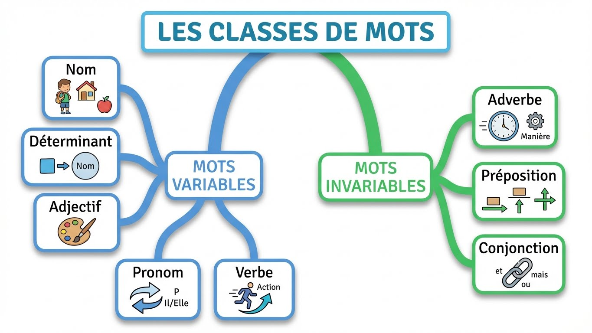

# Module 1 - Les classes de mots (natures)

!!! info "Objectifs du module"
    À la fin de ce module, tu sauras :

    - ✅ Distinguer les mots variables et invariables
    - ✅ Identifier les noms, verbes, adjectifs, déterminants
    - ✅ Reconnaître les pronoms et adverbes
    - ✅ Identifier les prépositions et conjonctions
    - ✅ Trouver la nature de n'importe quel mot

    **Durée estimée : 2-3 heures** | **Pré-requis : Aucun**

---

## 🎮 Dans la vraie vie : les mots ont une identité !

!!! tip "Chaque mot a une nature, comme toi tu as une identité !"

    **Imagine que les mots sont des personnages de jeu vidéo :**

    - **NOMS** = les personnages et objets (épée, maison, Zelda, Mario)
    - **VERBES** = les actions (courir, sauter, combattre, parler)
    - **ADJECTIFS** = les caractéristiques (fort, rapide, légendaire)
    - **DÉTERMINANTS** = les petits mots qui accompagnent (le, une, mon, ces)
    - **PRONOMS** = les remplaçants (il, elle, celui-ci)
    - **ADVERBES** = les modificateurs (très, rapidement, toujours)

    **Dans tes messages et réseaux sociaux :**
    - "**Je** mange **une** **pizza** **délicieuse**" → pronom + verbe + déterminant + nom + adjectif
    - "**C'est** **trop** **bien** !" → pronom + adverbe + adverbe
    - "**Mon** **pote** **arrive** **bientôt**" → déterminant + nom + verbe + adverbe

    **Pourquoi c'est utile de connaître les natures ?**
    - Pour faire les **accords** correctement
    - Pour comprendre la **construction des phrases**
    - Pour ne plus faire de fautes dans tes **copies** et **messages**
    - Pour mieux **écrire** et être plus clair

!!! example "Le même mot peut changer de sens selon sa nature !"
    ```
    "Le FERME est grand"     → FERME = nom (une ferme, un bâtiment)
    "Je FERME la porte"      → FERME = verbe (l'action de fermer)
    "Un ton FERME"           → FERME = adjectif (une manière décidée)
    ```

    C'est comme dans un jeu : le contexte détermine le rôle du mot !

---

## Leçon 1 : Variables et invariables

### La règle fondamentale

!!! info "Définition"
    La **nature** (ou **classe grammaticale**) d'un mot, c'est son identité.
    Elle ne change **jamais**, quel que soit le contexte.

    Les mots se divisent en deux grandes familles :

    - **Mots variables** : ils peuvent changer de forme (genre, nombre, personne)
    - **Mots invariables** : ils ne changent jamais

{ width="100%" loading=lazy }

### Les mots variables

| Classe | Change en... | Exemple |
|--------|--------------|---------|
| **Nom** | genre et nombre | chat → chats, chatte |
| **Déterminant** | genre et nombre | le → la, les |
| **Adjectif** | genre et nombre | grand → grande, grands |
| **Pronom** | genre, nombre, personne | il → elle, ils, elles |
| **Verbe** | personne, temps, mode | mange → mangeons, mangeait |

### Les mots invariables

| Classe | Exemples |
|--------|----------|
| **Adverbe** | toujours, bien, très, hier |
| **Préposition** | à, de, pour, avec, sans |
| **Conjonction** | et, ou, mais, car, donc, que |
| **Interjection** | oh ! ah ! hélas ! |

!!! tip "Astuce mémo"
    **"PACMAN"** pour les mots invariables :

    - **P**réposition
    - **A**dverbe
    - **C**onjonction
    - **M**ot-outil
    - **A**dverbe
    - i**N**terjection

??? warning "⚠️ Pièges à éviter : les classes de mots"
    **Piège 1 : Confondre nature et fonction**

    - **NATURE** = ce que le mot EST (comme ta carte d'identité)
    - **FONCTION** = ce que le mot FAIT dans la phrase (comme ton rôle dans un jeu)

    "chat" est TOUJOURS un nom (nature), mais il peut être sujet ou COD (fonction)

    ---

    **Piège 2 : Confondre déterminant et pronom**

    - "**Leur** maison est grande" → DEVANT un nom = **déterminant**
    - "Je **leur** parle" → PAS devant un nom = **pronom**

    **Le test : y a-t-il un nom juste après ?**

    ---

    **Piège 3 : Confondre adjectif et adverbe**

    - "Il est **rapide**" → décrit "il" (nom/pronom) = **adjectif**
    - "Il court **rapidement**" → décrit "court" (verbe) = **adverbe**

    **Adverbe = modifie un verbe, adjectif ou autre adverbe (souvent en -ment)**

    ---

    **Piège 4 : Le mot "que" a plusieurs natures**

    - "Je sais **que** tu viens" → **conjonction** de subordination
    - "Le livre **que** j'ai lu" → **pronom** relatif
    - "**Que** veux-tu ?" → **pronom** interrogatif

    **Regarde le contexte pour trouver la bonne nature !**

??? abstract "🔄 Autre façon de comprendre : Variable vs Invariable"
    **Pense à des objets du quotidien :**

    - **Mots variables** = comme des **vêtements** qu'on peut ajuster
      - Un t-shirt peut être en S, M, L, XL → le mot s'adapte (singulier/pluriel, masculin/féminin)
      - "chat" → "chats", "chatte", "chattes"

    - **Mots invariables** = comme des **objets rigides** qui ne changent pas
      - Une brique reste une brique, on ne peut pas l'étirer
      - "toujours" reste "toujours", "avec" reste "avec"

    ---

    **Autre image : les Lego :**

    - **Variables** = pièces qu'on peut transformer (ajouter des extensions)
    - **Invariables** = pièces fixes qui restent identiques

---

## Exercices guidés - Leçon 1

### Exercice 1.1 : Variable ou invariable ?

!!! question "Classe ces mots : chien, toujours, belle, avec, dormir, très"

??? success "Correction"
    **Variables :** chien (nom), belle (adjectif), dormir (verbe)

    **Invariables :** toujours (adverbe), avec (préposition), très (adverbe)

---

## Leçon 2 : Le nom

### Définition

!!! info "Le nom"
    Le **nom** désigne une personne, un animal, une chose, une idée.

    Il est généralement précédé d'un **déterminant**.

### Les types de noms

| Type | Définition | Exemples |
|------|------------|----------|
| **Nom commun** | Désigne un élément général | table, chien, idée |
| **Nom propre** | Désigne un élément unique (majuscule) | Paris, Marie, France |

### Genre et nombre

!!! example "Le nom varie en genre et en nombre"
    - **Genre** : masculin / féminin
      - un chat → une chatte
      - un ami → une amie

    - **Nombre** : singulier / pluriel
      - le livre → les livres
      - un cheval → des chevaux

!!! tip "Comment reconnaître un nom ?"
    Pose la question : **Peut-on mettre "un", "une" ou "des" devant ?**

    - *un* chat → ✅ nom
    - *un* manger → ❌ pas un nom (c'est un verbe)

??? abstract "🔄 Autre façon de comprendre : le nom"
    **Le nom, c'est ce qu'on peut TOUCHER ou IMAGINER :**

    - **Concret** (on peut toucher) : table, téléphone, pizza
    - **Abstrait** (on peut imaginer) : amour, liberté, courage

    **Test du dessin :**
    Si tu peux le **dessiner** (même de façon simple) ou le **représenter**, c'est probablement un nom !

    - "chat" → je peux dessiner un chat ✅
    - "rapidement" → je ne peux pas dessiner "rapidement" ❌

    ---

    **Le nom propre a une majuscule car il est UNIQUE :**
    - Il n'y a qu'une seule **Tour Eiffel** → majuscule
    - Il y a plein de **tours** → minuscule

---

## Exercices guidés - Leçon 2

### Exercice 2.1 : Identifier les noms

!!! question "Trouve les noms dans cette phrase"
    « Marie promène son chien dans le parc de la ville. »

??? success "Correction"
    - **Marie** (nom propre)
    - **chien** (nom commun)
    - **parc** (nom commun)
    - **ville** (nom commun)

### Exercice 2.2 : Nom propre ou commun ?

!!! question "Classe ces noms : France, montagne, Méditerranée, fleuve, Seine"

??? success "Correction"
    **Noms propres :** France, Méditerranée, Seine

    **Noms communs :** montagne, fleuve

---

## Leçon 3 : Le déterminant

### Définition

!!! info "Le déterminant"
    Le **déterminant** est un petit mot placé **devant le nom**.
    Il indique le genre et le nombre du nom.

### Les types de déterminants

| Type | Exemples | Usage |
|------|----------|-------|
| **Articles définis** | le, la, l', les | chose connue |
| **Articles indéfinis** | un, une, des | chose non précisée |
| **Articles partitifs** | du, de la, de l' | quantité indéterminée |
| **Dét. possessifs** | mon, ton, son, ma, ta, sa, mes, tes, ses, notre, votre, leur, nos, vos, leurs | appartenance |
| **Dét. démonstratifs** | ce, cet, cette, ces | désignation |
| **Dét. numéraux** | un, deux, trois... | quantité précise |
| **Dét. indéfinis** | quelques, plusieurs, chaque, tout | quantité vague |
| **Dét. interrogatifs** | quel, quelle, quels, quelles | question |

!!! example "Exemples"
    - **Le** chat (article défini)
    - **Mon** chat (possessif)
    - **Ce** chat (démonstratif)
    - **Trois** chats (numéral)
    - **Quelques** chats (indéfini)

!!! tip "Astuce mémo pour les possessifs"
    | Possesseur | Singulier | Pluriel |
    |------------|-----------|---------|
    | je | mon, ma, mes | |
    | tu | ton, ta, tes | |
    | il/elle | son, sa, ses | |
    | nous | notre, nos | |
    | vous | votre, vos | |
    | ils/elles | leur, leurs | |

??? abstract "🔄 Autre façon de comprendre : le déterminant"
    **Le déterminant, c'est le BADGE du nom :**

    Imagine que le nom est une personne à une fête. Le déterminant, c'est son badge d'identification !

    - "**le** chat" → badge qui dit "ce chat précis, celui qu'on connaît"
    - "**un** chat" → badge qui dit "un chat quelconque, on ne sait pas lequel"
    - "**mon** chat" → badge qui dit "ce chat m'appartient"
    - "**ce** chat" → badge qui dit "celui-là, que je montre du doigt"

    ---

    **Un nom sans déterminant, c'est bizarre :**
    - "J'ai vu chat" ❌ → Il manque le badge !
    - "J'ai vu **un** chat" ✅ → Maintenant on sait de quel type de chat on parle

---

## Exercices guidés - Leçon 3

### Exercice 3.1 : Identifier les déterminants

!!! question "Trouve les déterminants et donne leur type"
    « Ce matin, ma sœur a trouvé trois euros dans la rue. »

??? success "Correction"
    - **Ce** → démonstratif
    - **ma** → possessif
    - **trois** → numéral
    - **la** → article défini

---

## Leçon 4 : L'adjectif qualificatif

### Définition

!!! info "L'adjectif qualificatif"
    L'**adjectif qualificatif** donne une précision sur le nom.
    Il s'accorde en **genre** et en **nombre** avec le nom qu'il qualifie.

!!! example "Exemples"
    - un **grand** garçon → une **grande** fille
    - un chat **noir** → des chats **noirs**
    - une robe **bleue** → des robes **bleues**

### Place de l'adjectif

!!! tip "Où placer l'adjectif ?"
    - **Avant le nom** : petit, grand, beau, joli, jeune, vieux, bon, mauvais
      → un **petit** chat

    - **Après le nom** : la plupart des autres adjectifs
      → un chat **noir**

!!! tip "Comment reconnaître un adjectif ?"
    Pose la question : **Peut-on dire « il est... » ou « elle est... » ?**

    - Il est *grand* → ✅ adjectif
    - Il est *table* → ❌ pas un adjectif

??? abstract "🔄 Autre façon de comprendre : l'adjectif"
    **L'adjectif, c'est le FILTRE Instagram du nom !**

    Comme un filtre qui modifie l'apparence d'une photo, l'adjectif modifie le nom :

    - "un chat" → photo normale
    - "un **gros** chat **noir**" → photo avec filtres (taille + couleur)

    ---

    **Autre image : les options d'un personnage de jeu vidéo**

    Quand tu crées un personnage, tu choisis des caractéristiques :
    - Taille : **grand** / **petit**
    - Apparence : **musclé** / **mince**
    - Couleur : **blond** / **brun**

    Ces options = les adjectifs du personnage !

---

## Exercices guidés - Leçon 4

### Exercice 4.1 : Trouver les adjectifs

!!! question "Trouve les adjectifs dans cette phrase"
    « La petite fille portait une jolie robe rouge. »

??? success "Correction"
    - **petite** (qualifie « fille »)
    - **jolie** (qualifie « robe »)
    - **rouge** (qualifie « robe »)

---

## Leçon 5 : Le verbe

### Définition

!!! info "Le verbe"
    Le **verbe** exprime une action ou un état.
    Il se conjugue selon la **personne**, le **temps** et le **mode**.

### Les trois groupes

| Groupe | Terminaison | Exemples |
|:------:|-------------|----------|
| **1er groupe** | -er | chanter, manger, aimer |
| **2ème groupe** | -ir (→ -issons) | finir, choisir, réussir |
| **3ème groupe** | autres | prendre, venir, être, avoir |

!!! tip "Comment reconnaître le 2ème groupe ?"
    À la 1ère personne du pluriel au présent, on ajoute **-issons**.

    - finir → nous fin**issons** ✅ 2ème groupe
    - venir → nous venons ❌ 3ème groupe

### Verbes d'état

!!! info "Les verbes d'état"
    Ils expriment un état, pas une action :

    **être, paraître, sembler, devenir, rester, demeurer, avoir l'air**

    → Ils introduisent un **attribut du sujet** (voir Module 2).

!!! tip "Comment reconnaître un verbe ?"
    Pose la question : **Peut-on le conjuguer ?**

    - je *mange*, tu *manges*, il *mange* → ✅ verbe
    - je *table*, tu *table* → ❌ pas un verbe

??? abstract "🔄 Autre façon de comprendre : le verbe"
    **Le verbe, c'est le MOTEUR de la phrase !**

    Sans verbe, la phrase ne "démarre" pas :
    - "Le chat sur le canapé" → phrase cassée, pas de moteur
    - "Le chat **dort** sur le canapé" → phrase complète, le moteur fonctionne !

    ---

    **Autre test : le temps qui passe**

    Si tu peux changer le moment (hier, maintenant, demain), c'est un verbe :

    - Hier, je **mangeais** / Maintenant, je **mange** / Demain, je **mangerai**
    - Le verbe change avec le temps = c'est son super-pouvoir !

    ---

    **Verbe d'ACTION vs verbe d'ÉTAT :**
    - ACTION = quelque chose se passe (courir, manger, sauter)
    - ÉTAT = rien ne bouge, on décrit (être, sembler, rester)

---

## Exercices guidés - Leçon 5

### Exercice 5.1 : Identifier les verbes et leur groupe

!!! question "Donne l'infinitif et le groupe de ces verbes conjugués"
    a) nous chantons
    b) ils finissent
    c) tu prends
    d) elle rougit

??? success "Correction"
    a) **chanter** → 1er groupe

    b) **finir** → 2ème groupe (nous finissons)

    c) **prendre** → 3ème groupe

    d) **rougir** → 2ème groupe (nous rougissons)

---

## Leçon 6 : Le pronom

### Définition

!!! info "Le pronom"
    Le **pronom** remplace un nom ou un groupe nominal.
    Il évite les répétitions.

### Les types de pronoms

| Type | Exemples | Usage |
|------|----------|-------|
| **Personnels** | je, tu, il, elle, nous, vous, ils, elles, me, te, le, la, lui, leur... | remplace une personne |
| **Possessifs** | le mien, la tienne, les nôtres... | possession |
| **Démonstratifs** | celui, celle, ceux, celles, ce, ceci, cela | désignation |
| **Indéfinis** | on, quelqu'un, personne, rien, tout... | imprécis |
| **Relatifs** | qui, que, quoi, dont, où, lequel... | relie deux propositions |
| **Interrogatifs** | qui ?, que ?, quoi ?, lequel ?... | question |

!!! example "Exemples"
    - **Marie** mange une pomme. → **Elle** mange une pomme.
    - J'ai vu **le film**. → Je **l'**ai vu.
    - C'est **mon vélo**. → C'est **le mien**.

!!! warning "Ne pas confondre !"
    - **Déterminant** : toujours DEVANT un nom → *leur* maison
    - **Pronom** : REMPLACE un nom → Je *leur* parle.

??? abstract "🔄 Autre façon de comprendre : le pronom"
    **Le pronom, c'est le DOUBLURE du nom !**

    Au cinéma, quand l'acteur principal ne peut pas faire une cascade, on utilise une doublure. Le pronom fait pareil :

    - "**Marie** mange une pomme. **Marie** est contente." → répétition ennuyeuse
    - "**Marie** mange une pomme. **Elle** est contente." → la doublure "elle" remplace "Marie"

    ---

    **Liste des doublures les plus courantes :**

    | Le nom | Sa doublure (pronom) |
    |--------|---------------------|
    | Marie | elle |
    | le livre | il, le |
    | les enfants | ils, eux |
    | la pizza | elle, la |

    **Avantage :** ça évite de répéter le même mot 10 fois !

---

## Exercices guidés - Leçon 6

### Exercice 6.1 : Identifier les pronoms

!!! question "Trouve les pronoms et leur type"
    « Elle lui a donné son livre, car le sien était abîmé. »

??? success "Correction"
    - **Elle** → pronom personnel sujet
    - **lui** → pronom personnel COI
    - **le sien** → pronom possessif

---

## Leçon 7 : Les mots invariables

### L'adverbe

!!! info "L'adverbe"
    L'**adverbe** modifie le sens d'un verbe, d'un adjectif ou d'un autre adverbe.
    Il est **invariable**.

| Type | Exemples |
|------|----------|
| **Manière** | bien, mal, vite, lentement, doucement |
| **Temps** | hier, aujourd'hui, demain, toujours, jamais |
| **Lieu** | ici, là, partout, dehors, dessus |
| **Quantité** | très, peu, beaucoup, trop, assez |
| **Négation** | ne...pas, ne...jamais, ne...plus |

!!! tip "Beaucoup d'adverbes de manière finissent en -ment"
    lent → lente**ment**, doux → douce**ment**, rapide → rapide**ment**

### La préposition

!!! info "La préposition"
    La **préposition** introduit un complément.
    Elle est **invariable**.

!!! tip "Astuce mémo : « Adam part pour Anvers avec deux cents sous »"
    **À, D**ans, **A** (de), **M** (par), **P**our, **A**nvers (en), **AVEC**, **D**eux (de), **C**ents (chez), **S**ous (sans, sur)

    → à, dans, par, pour, en, avec, de, chez, sans, sur...

### La conjonction

!!! info "La conjonction"
    La **conjonction** relie des mots ou des propositions.

| Type | Exemples | Usage |
|------|----------|-------|
| **Coordination** | mais, ou, et, donc, or, ni, car | relie des éléments de même fonction |
| **Subordination** | que, quand, lorsque, si, parce que... | introduit une proposition subordonnée |

!!! tip "Astuce mémo pour les conjonctions de coordination"
    **« Mais où est donc Ornicar ? »**

    → **M**ais, **O**ù, **E**t, **D**onc, **O**r, **N**i, **C**ar

---

## Exercices guidés - Leçon 7

### Exercice 7.1 : Identifier les mots invariables

!!! question "Trouve la nature des mots soulignés"
    « **Hier**, je suis allé **à** Paris **et** j'ai marché **longtemps**. »

??? success "Correction"
    - **Hier** → adverbe de temps
    - **à** → préposition
    - **et** → conjonction de coordination
    - **longtemps** → adverbe de temps

---

## Entraînement

### Série 1 : Identifier la nature

Donne la nature de chaque mot souligné :

1. « **Cette** maison est **grande**. »
2. « **Il** parle **doucement**. »
3. « Je vais **à** Paris **avec** **mes** amis. »

??? success "Corrections"
    1. **Cette** = déterminant démonstratif | **grande** = adjectif qualificatif
    2. **Il** = pronom personnel | **doucement** = adverbe
    3. **à** = préposition | **avec** = préposition | **mes** = déterminant possessif

### Série 2 : Classer les mots

Classe ces mots selon leur nature :
*table, manger, bleu, le, toujours, Paris, ils, car, joli*

??? success "Correction"
    - **Noms** : table, Paris
    - **Verbe** : manger
    - **Adjectifs** : bleu, joli
    - **Déterminant** : le
    - **Pronom** : ils
    - **Adverbe** : toujours
    - **Conjonction** : car

---

## Tableau récapitulatif

!!! warning "À mémoriser !"
    | Nature | Variable ? | Question pour l'identifier |
    |--------|:----------:|---------------------------|
    | Nom | ✅ | Peut-on mettre un/une/des devant ? |
    | Déterminant | ✅ | Est-il devant un nom ? |
    | Adjectif | ✅ | Peut-on dire « il est... » ? |
    | Pronom | ✅ | Remplace-t-il un nom ? |
    | Verbe | ✅ | Peut-on le conjuguer ? |
    | Adverbe | ❌ | Modifie-t-il un verbe/adjectif ? |
    | Préposition | ❌ | Introduit-il un complément ? |
    | Conjonction | ❌ | Relie-t-il des mots/propositions ? |

---

## Évaluation du module (sur 20)

**Q1.** Le mot « toujours » est-il variable ou invariable ? (1 pt)

**Q2.** Quelle est la nature de « chat » dans « Le chat dort » ? (1 pt)

**Q3.** Quelle est la nature de « bleu » dans « un ciel bleu » ? (1 pt)

**Q4.** Quelle est la nature de « elle » dans « Elle chante » ? (1 pt)

**Q5.** À quel groupe appartient le verbe « finir » ? (1 pt)

**Q6.** « Son » dans « son livre » est-il un déterminant ou un pronom ? (1 pt)

**Q7.** Donne le type de déterminant de « ces » dans « ces livres ». (1 pt)

**Q8.** Quelle est la nature de « rapidement » ? (1 pt)

**Q9.** Cite les 7 conjonctions de coordination. (2 pts)

**Q10.** Dans « Je vais à Paris », quelle est la nature de « à » ? (1 pt)

**Q11.** Donne la nature de chaque mot : « Le petit chat noir dort. » (5 pts)

**Q12-13.** Classe tous les mots de cette phrase selon leur nature (4 pts) :
« Marie mange tranquillement son dessert car elle a faim. »

??? success "Corrections"
    Q1. **Invariable**
    Q2. **Nom commun**
    Q3. **Adjectif qualificatif**
    Q4. **Pronom personnel**
    Q5. **2ème groupe**
    Q6. **Déterminant** (possessif)
    Q7. **Déterminant démonstratif**
    Q8. **Adverbe** (de manière)
    Q9. **Mais, ou, et, donc, or, ni, car**
    Q10. **Préposition**
    Q11.
    - Le = déterminant (article défini)
    - petit = adjectif qualificatif
    - chat = nom commun
    - noir = adjectif qualificatif
    - dort = verbe

    Q12-13.
    - Marie = nom propre
    - mange = verbe
    - tranquillement = adverbe
    - son = déterminant possessif
    - dessert = nom commun
    - car = conjonction de coordination
    - elle = pronom personnel
    - a = verbe (avoir)
    - faim = nom commun

---

## Prochaine étape

[Module 2 - Les fonctions dans la phrase](module-02-fonctions.md){ .md-button .md-button--primary }

[Retour à l'index](index.md){ .md-button }
