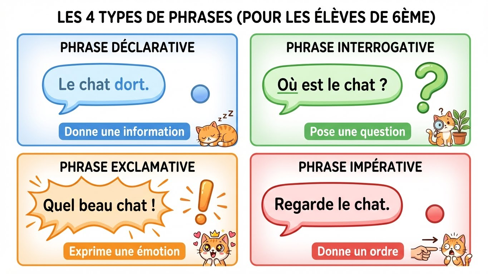

# Module 8 - La phrase et la ponctuation

!!! info "Objectifs du module"
    À la fin de ce module, tu sauras :

    - ✅ Reconnaître les types de phrases
    - ✅ Reconnaître les formes de phrases
    - ✅ Utiliser correctement la ponctuation
    - ✅ Construire des phrases simples et complexes

    **Durée estimée : 2-3 heures** | **Pré-requis : Modules 1-2**

---

## 🎮 Dans la vraie vie : bien ponctuer, c'est essentiel !

!!! tip "La ponctuation change tout le sens !"

    **Compare ces messages :**

    | Sans ponctuation | Avec ponctuation | Différence |
    |------------------|------------------|------------|
    | « on mange mamie » | « On mange, mamie ! » | Sans virgule, tu manges ta mamie ! |
    | « viens on joue » | « Viens, on joue ! » | Plus clair et enthousiaste |
    | « non je veux pas » | « Non, je ne veux pas. » | Plus poli et correct |
    | « cest nul » | « C'est nul ! » | Exprime vraiment ton émotion |

!!! example "Les types de phrases dans tes messages"

    **Déclarative (information) :**
    - « Je suis en ligne. »
    - « J'ai fini mes devoirs. »

    **Interrogative (question) :**
    - « Tu joues ? »
    - « On fait une partie ? »

    **Exclamative (émotion) :**
    - « J'ai gagné ! »
    - « Trop fort ! »

    **Impérative (ordre/conseil) :**
    - « Rejoins-moi ! »
    - « Regarde cette vidéo. »

!!! warning "Le piège du « ne » oublié à l'oral"

    **Ce qu'on dit souvent :**

    - ❌ « J'ai pas compris »
    - ❌ « Je sais pas »
    - ❌ « Y'a personne »

    **Ce qu'il faut écrire :**

    - ✅ « Je **n'**ai **pas** compris »
    - ✅ « Je **ne** sais **pas** »
    - ✅ « Il **n'**y a **personne** »

    **À l'oral c'est toléré, mais à l'écrit le « ne » est OBLIGATOIRE !**

{ width="100%" loading=lazy }

??? warning "⚠️ Pièges à éviter : la phrase"
    **Piège 1 : Confondre les 4 types de phrases**

    | Type | Ponctuation | Exemple |
    |------|-------------|---------|
    | Déclarative | **.** | "Il fait beau." |
    | Interrogative | **?** | "Il fait beau ?" |
    | Exclamative | **!** | "Qu'il fait beau !" |
    | Impérative | **.** ou **!** | "Viens ici !" |

    **Attention : l'impérative n'a pas toujours "!" !**

    ---

    **Piège 2 : L'inversion sujet-verbe mal formée**

    - ❌ "Va-tu au cinéma ?" → ✅ "**Vas**-tu au cinéma ?"
    - ❌ "A il faim ?" → ✅ "**A-t-il** faim ?"

    **On ajoute -t- entre deux voyelles pour la prononciation !**

    ---

    **Piège 3 : La virgule qui sépare sujet et verbe**

    - ❌ "Marie, mange une pomme."
    - ✅ "Marie mange une pomme."

    **JAMAIS de virgule entre sujet et verbe !**

    ---

    **Piège 4 : Confondre phrase simple et complexe**

    Compte les **verbes conjugués** :
    - 1 verbe = phrase **simple**
    - 2+ verbes = phrase **complexe**

    "Le chat dort et le chien joue" = **complexe** (2 verbes)

!!! example "La ponctuation dans les jeux et sur les réseaux"

    **Points d'exclamation = enthousiasme/émotion**
    - « GG ! » (Good Game !)
    - « Trop bien ! »
    - « VICTOIRE !!! »

    **Points d'interrogation = questions**
    - « Tu viens ? »
    - « C'est quoi ton pseudo ? »

    **Points de suspension = hésitation/suspense**
    - « Je sais pas trop... »
    - « Et là... il a ragequit. »

---

## Leçon 1 : Les types de phrases

### Les 4 types

!!! info "Types de phrases"
    | Type | Usage | Ponctuation |
    |------|-------|:-----------:|
    | **Déclarative** | Donne une information | **.** |
    | **Interrogative** | Pose une question | **?** |
    | **Exclamative** | Exprime une émotion forte | **!** |
    | **Impérative** | Donne un ordre ou un conseil | **.** ou **!** |

### La phrase déclarative

!!! example "Exemples"
    - Le chat dort sur le canapé.
    - Marie aime les gâteaux.
    - Il fait beau aujourd'hui.

### La phrase interrogative

!!! info "Les 3 façons de poser une question"
    | Niveau | Construction | Exemple |
    |--------|--------------|---------|
    | Familier | Intonation montante | Tu viens ? |
    | Courant | Est-ce que... | Est-ce que tu viens ? |
    | Soutenu | Inversion sujet-verbe | Viens-tu ? |

!!! warning "L'inversion sujet-verbe"
    On ajoute un trait d'union entre le verbe et le pronom :

    - **Viens-tu** demain ?
    - **A-t-il** faim ? (on ajoute « -t- » pour la prononciation)
    - **Où va-t-elle** ?

### La phrase exclamative

!!! example "Exemples"
    - Quel beau paysage !
    - Comme il fait chaud !
    - Que c'est beau !

!!! tip "Mots exclamatifs"
    Quel(le)(s), comme, que, qu'est-ce que...

??? abstract "🔄 Autre façon de comprendre : les 4 types de phrases"
    **Les 4 types = 4 intentions différentes**

    Imagine que tu es dans un jeu :

    | Type | Tu veux... | Exemple dans un jeu |
    |------|-----------|---------------------|
    | **Déclarative** | Informer | "L'ennemi est à 200m." |
    | **Interrogative** | Demander | "Tu as des munitions ?" |
    | **Exclamative** | Exprimer une émotion | "On a gagné !" |
    | **Impérative** | Donner un ordre | "Couvre-moi !" |

    ---

    **L'astuce de la ponctuation :**
    ```
    Information → .  (point calme)
    Question    → ?  (crochet pour accrocher une réponse)
    Émotion     → !  (bâton dressé d'enthousiasme)
    Ordre       → . ou !  (selon l'intensité)
    ```

### La phrase impérative

!!! example "Exemples"
    - Ferme la porte. (ordre calme)
    - Ferme la porte ! (ordre fort)
    - Écoute bien ce conseil. (conseil)

---

## Exercices guidés - Leçon 1

### Exercice 1.1 : Identifier le type

!!! question "Quel est le type de chaque phrase ?"
    a) Où vas-tu ?
    b) Viens ici tout de suite !
    c) Le soleil brille.
    d) Quel magnifique spectacle !

??? success "Correction"
    a) **Interrogative** (question)
    b) **Impérative** (ordre)
    c) **Déclarative** (information)
    d) **Exclamative** (émotion)

### Exercice 1.2 : Transformer

!!! question "Transforme en phrase interrogative (niveau soutenu)"
    a) Tu as compris.
    b) Elle vient demain.

??? success "Correction"
    a) **As-tu** compris ?
    b) **Vient-elle** demain ?

---

## Leçon 2 : Les formes de phrases

### Forme affirmative et négative

!!! info "Définition"
    - **Forme affirmative** : dit « oui » à quelque chose
    - **Forme négative** : dit « non » à quelque chose

### Les mots de la négation

!!! warning "Structure de la négation"
    La négation encadre le verbe : **ne... pas**, **ne... plus**, **ne... jamais**, etc.

| Affirmatif | Négatif |
|------------|---------|
| Je mange. | Je **ne** mange **pas**. |
| Il mange toujours. | Il **ne** mange **jamais**. |
| Elle mange encore. | Elle **ne** mange **plus**. |
| Tu vois quelque chose. | Tu **ne** vois **rien**. |
| Il voit quelqu'un. | Il **ne** voit **personne**. |

!!! warning "Ne pas oublier le « ne » !"
    À l'oral, on oublie souvent le « ne », mais à l'écrit, il est **obligatoire**.

    - ❌ J'ai pas compris.
    - ✅ Je **n'**ai **pas** compris.

??? abstract "🔄 Autre façon de comprendre : la négation"
    **La négation, c'est un SANDWICH !**

    Le verbe est la viande, et la négation est le pain qui l'entoure :

    ```
    Pain supérieur : NE / N'
         Viande    : VERBE
    Pain inférieur : PAS / PLUS / JAMAIS / RIEN / PERSONNE
    ```

    **Exemples de sandwichs :**
    - Je **ne** mange **pas** → sandwich classique
    - Je **ne** mange **plus** → sandwich "arrêt"
    - Je **ne** mange **jamais** → sandwich "zéro fois"
    - Je **ne** mange **rien** → sandwich "zéro chose"

    ---

    **Pourquoi on oublie le "ne" à l'oral ?**

    À l'oral, on parle vite et le "ne" est tout petit, alors on le zappe :
    - "J'ai pas faim" (oral) → "Je **n'**ai **pas** faim" (écrit)

    **Mais à l'écrit, le sandwich doit être COMPLET !**

### Place de la négation avec les temps composés

!!! tip "Règle"
    La négation encadre l'**auxiliaire** (pas le participe passé).

!!! example "Exemples"
    - Je **n'**ai **pas** mangé. (ne...pas autour de « ai »)
    - Elle **n'**est **jamais** venue. (ne...jamais autour de « est »)

---

## Exercices guidés - Leçon 2

### Exercice 2.1 : Mettre à la forme négative

!!! question "Transforme"
    a) J'ai faim.
    b) Il mange toujours à la cantine.
    c) Elle a encore du travail.
    d) J'ai vu quelqu'un.

??? success "Correction"
    a) Je **n'**ai **pas** faim.
    b) Il **ne** mange **jamais** à la cantine.
    c) Elle **n'**a **plus** de travail.
    d) Je **n'**ai vu **personne**.

---

## Leçon 3 : La ponctuation

### Les signes de fin de phrase

| Signe | Nom | Usage |
|:-----:|-----|-------|
| **.** | Point | Fin de phrase déclarative |
| **?** | Point d'interrogation | Fin de question |
| **!** | Point d'exclamation | Fin de phrase exclamative ou impérative |
| **...** | Points de suspension | Phrase inachevée, hésitation |

### Les signes intérieurs

| Signe | Nom | Usage |
|:-----:|-----|-------|
| **,** | Virgule | Petite pause, énumération |
| **;** | Point-virgule | Pause moyenne, lien entre deux idées |
| **:** | Deux-points | Introduction (explication, liste, citation) |

### La virgule

!!! tip "Quand utiliser la virgule ?"
    1. **Énumération** : J'aime les pommes, les poires, les bananes.
    2. **Après un CC en début de phrase** : Hier, je suis allé au cinéma.
    3. **Pour encadrer un mot en apposition** : Marie, ma sœur, est venue.
    4. **Avant mais, car, donc** : Je suis fatigué, mais je continue.

!!! danger "Ne pas séparer sujet et verbe !"
    - ❌ Marie, mange une pomme.
    - ✅ Marie mange une pomme.

??? abstract "🔄 Autre façon de comprendre : la ponctuation"
    **La ponctuation, c'est comme la respiration !**

    Quand tu parles, tu fais des pauses. À l'écrit, la ponctuation représente ces pauses :

    | Signe | Durée de pause | Quand |
    |-------|----------------|-------|
    | **,** | Courte pause | Entre les éléments d'une liste, après un CC |
    | **;** | Pause moyenne | Entre deux idées liées |
    | **.** | Longue pause | Fin de phrase |
    | **:** | "Attention, voici..." | Avant une explication ou une liste |

    ---

    **L'astuce "manger mamie" :**

    Compare :
    - "On mange mamie" → Tu manges ta grand-mère ! 😱
    - "On mange, mamie" → Tu dis à mamie qu'on mange 😊

    **La virgule sauve des vies !**

    ---

    **Quand mettre une virgule :**
    1. **Énumération** : "J'aime le foot, le basket et le tennis."
    2. **Après un CC en début** : "Hier, je suis allé au parc."
    3. **Avant mais/car/donc** : "Je suis fatigué, mais je continue."

### Les deux-points

!!! tip "Usages des deux-points"
    1. **Avant une énumération** : J'ai acheté : des pommes, des poires, des bananes.
    2. **Avant une explication** : Il est absent : il est malade.
    3. **Avant une citation** : Il a dit : « Je reviendrai. »

### Les guillemets et tirets

!!! info "Le dialogue"
    - Les **guillemets** « » encadrent les paroles rapportées
    - Le **tiret** — indique un changement d'interlocuteur

!!! example "Exemple de dialogue"
    ```
    Marie demanda :
    « Où vas-tu ?
    — Je vais au cinéma, répondit Paul.
    — Je peux venir avec toi ?
    — Bien sûr ! »
    ```

---

## Exercices guidés - Leçon 3

### Exercice 3.1 : Ajouter la ponctuation

!!! question "Ponctue correctement"
    a) Comment vas tu
    b) Demain nous irons à Paris
    c) J aime les fruits les pommes les poires les oranges

??? success "Correction"
    a) Comment vas**-**tu **?**
    b) Demain**,** nous irons à Paris**.**
    c) J'aime les fruits **:** les pommes**,** les poires**,** les oranges**.**

---

## Leçon 4 : Phrase simple et phrase complexe

### Définitions

!!! info "Phrase simple"
    Une **phrase simple** contient un seul verbe conjugué (= une seule proposition).

!!! info "Phrase complexe"
    Une **phrase complexe** contient plusieurs verbes conjugués (= plusieurs propositions).

!!! example "Comparaison"
    - **Phrase simple** : Le chat dort. (1 verbe)
    - **Phrase complexe** : Le chat dort **et** le chien joue. (2 verbes)

### Les propositions

!!! info "Définition"
    Une **proposition** est un groupe de mots organisé autour d'un verbe conjugué.

!!! example "Exemple"
    « Je pense **que** tu as raison. »

    - Proposition 1 : « Je pense » (verbe : pense)
    - Proposition 2 : « que tu as raison » (verbe : as)

### Les types de propositions

| Type | Définition | Exemple |
|------|------------|---------|
| **Indépendante** | Se suffit à elle-même | Le chat dort. |
| **Principale** | Commande une autre | Je pense (+ que...) |
| **Subordonnée** | Dépend d'une autre | ...que tu as raison |

### Comment relier les propositions ?

!!! tip "3 façons de relier"
    1. **Juxtaposition** (virgule, point-virgule) : Le chat dort, le chien joue.
    2. **Coordination** (et, ou, mais, donc...) : Le chat dort et le chien joue.
    3. **Subordination** (que, qui, quand, si...) : Je pense que tu as raison.

??? abstract "🔄 Autre façon de comprendre : phrase simple et complexe"
    **Compte les verbes conjugués = compte les propositions !**

    - 1 verbe conjugué = 1 proposition = phrase **simple**
    - 2+ verbes conjugués = 2+ propositions = phrase **complexe**

    ```
    "Le chat dort."
         ↓
    1 verbe (dort) = phrase SIMPLE

    "Le chat dort et le chien joue."
         ↓              ↓
    2 verbes (dort, joue) = phrase COMPLEXE
    ```

    ---

    **Les 3 façons de relier = 3 types de "colle"**

    | Type de colle | Comment ça colle | Exemple |
    |---------------|------------------|---------|
    | **Juxtaposition** | Juste posé à côté (virgule) | "Il pleut, je reste." |
    | **Coordination** | Collé avec un mot-lien | "Il pleut **et** je reste." |
    | **Subordination** | Une phrase dépend de l'autre | "Je reste **parce qu'**il pleut." |

    ---

    **Les mots qui relient :**
    - **Coordination** : mais, ou, et, donc, or, ni, car (MAIS OÙ EST DONC ORNICAR ?)
    - **Subordination** : que, qui, quand, si, parce que, lorsque, comme...

---

## Exercices guidés - Leçon 4

### Exercice 4.1 : Simple ou complexe ?

!!! question "Cette phrase est-elle simple ou complexe ?"
    a) Marie mange une pomme.
    b) Je pense que tu as tort.
    c) Il pleut et je reste à la maison.
    d) Le soleil brille.

??? success "Correction"
    a) **Simple** (1 verbe : mange)
    b) **Complexe** (2 verbes : pense, as)
    c) **Complexe** (2 verbes : pleut, reste)
    d) **Simple** (1 verbe : brille)

### Exercice 4.2 : Compter les propositions

!!! question "Combien de propositions ?"
    « Quand il pleut, je reste à la maison et je lis un livre. »

??? success "Correction"
    **3 propositions** :

    - « Quand il pleut » (subordonnée)
    - « je reste à la maison » (principale)
    - « je lis un livre » (coordonnée)

---

## Entraînement

### Série 1 : Types et formes

1. Transforme en question (niveau soutenu) : « Tu as compris. »
2. Mets à la forme négative : « Elle mange toujours à la cantine. »
3. Quel est le type ? « Comme c'est beau ! »

??? success "Corrections"
    1. **As-tu compris ?**
    2. Elle **ne** mange **jamais** à la cantine.
    3. **Exclamative**

### Série 2 : Ponctuation

1. Ponctue : « Où vas tu demain à Paris ou à Lyon »
2. Place les virgules : « Hier après la pluie le soleil est revenu. »

??? success "Corrections"
    1. Où vas**-**tu demain**,** à Paris ou à Lyon **?**
    2. Hier**,** après la pluie**,** le soleil est revenu.

### Série 3 : Phrases complexes

1. Cette phrase est-elle simple ou complexe ? « Le chien que j'ai vu était grand. »
2. Combien de propositions ? « Je suis content car j'ai réussi. »

??? success "Corrections"
    1. **Complexe** (2 verbes : ai vu, était)
    2. **2 propositions** : « Je suis content » et « car j'ai réussi »

---

## Évaluation du module (sur 20)

**Q1.** Cite les 4 types de phrases. (2 pts)

**Q2.** Quel est le type de « Viens ici ! » ? (1 pt)

**Q3.** Transforme en question (niveau soutenu) : « Il vient demain. » (2 pts)

**Q4.** Mets à la forme négative : « J'ai vu quelqu'un. » (2 pts)

**Q5.** Quand utilise-t-on les deux-points ? (2 pts)

**Q6.** Ponctue : « Marie qui est ma sœur arrive demain » (2 pts)

**Q7.** Qu'est-ce qu'une phrase simple ? (1 pt)

**Q8.** Combien de propositions : « Je pense que tu as raison. » (1 pt)

**Q9.** Simple ou complexe ? « Le chat dort paisiblement. » (1 pt)

**Q10-11.** Exercice complet (6 pts) :
Écris un court texte de 3 phrases contenant :
- Une phrase déclarative avec une énumération
- Une phrase interrogative (niveau soutenu)
- Une phrase complexe avec « car » ou « mais »

??? success "Corrections"
    Q1. Déclarative, interrogative, exclamative, impérative
    Q2. **Impérative**
    Q3. **Vient-il** demain ?
    Q4. Je **n'**ai vu **personne**.
    Q5. Avant une énumération, une explication ou une citation
    Q6. Marie**,** qui est ma sœur**,** arrive demain**.**
    Q7. Une phrase avec un seul verbe conjugué
    Q8. **2** propositions
    Q9. **Simple**
    Q10-11. Exemple :
    « J'aime les sports : le foot, le basket et le tennis. Aimes-tu le sport ? Je préfère le foot, mais j'aime aussi le tennis. »

---

## Prochaine étape

[Module 9 - Lire et comprendre](module-09-lecture.md){ .md-button .md-button--primary }

[Retour à l'index](index.md){ .md-button }
