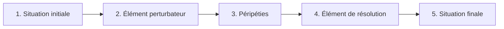

# Lecture & Culture littéraire

## Les genres littéraires

### Le récit

!!! info "Définition"
    Texte qui raconte une **histoire** avec des personnages, des actions, dans un lieu et un temps.

| Type de récit | Caractéristiques | Exemples |
|---------------|------------------|----------|
| **Conte** | Histoire imaginaire, merveilleux, morale | Cendrillon, Le Petit Chaperon rouge |
| **Nouvelle** | Récit court, chute finale | Maupassant |
| **Roman** | Récit long, personnages développés | Harry Potter, Le Petit Prince |
| **Fable** | Récit court avec animaux, morale | La Fontaine |
| **Mythe** | Récit sacré, origine du monde | Mythologie grecque |
| **Légende** | Récit populaire, base historique | Le roi Arthur |

### La poésie

!!! info "Définition"
    Texte qui joue avec les **sons**, le **rythme** et les **images**.

| Élément | Description | Exemple |
|---------|-------------|---------|
| **Vers** | Ligne d'un poème | "Maître Corbeau, sur un arbre perché" |
| **Strophe** | Groupe de vers | Quatrain = 4 vers |
| **Rime** | Sons identiques en fin de vers | perché / bec |
| **Alexandrin** | Vers de 12 syllabes | "Je / le / vis, / je / rou/gis, / je / pâ/lis / à / sa / vue" |

### Le théâtre

!!! info "Définition"
    Texte écrit pour être **joué** sur scène.

| Élément | Description |
|---------|-------------|
| **Acte** | Grande partie de la pièce |
| **Scène** | Subdivision de l'acte |
| **Réplique** | Paroles d'un personnage |
| **Didascalie** | Indication de mise en scène (en italique) |
| **Monologue** | Personnage seul qui parle |
| **Dialogue** | Échange entre personnages |

| Genre | Ton | Fin |
|-------|-----|-----|
| **Comédie** | Comique, léger | Heureuse |
| **Tragédie** | Grave, sérieux | Malheureuse |

---

## Le schéma narratif

Tout récit suit généralement 5 étapes :

| Étape | Rôle | Exemple (Cendrillon) |
|-------|------|----------------------|
| **Situation initiale** | Présente le cadre, les personnages | Cendrillon vit malheureuse chez sa belle-mère |
| **Élément perturbateur** | Événement qui lance l'action | Invitation au bal du prince |
| **Péripéties** | Actions, aventures | Transformation, bal, fuite à minuit |
| **Élément de résolution** | Ce qui dénoue l'histoire | L'essayage de la pantoufle |
| **Situation finale** | Nouvel équilibre | Cendrillon épouse le prince |

---

## Les personnages

### Le schéma actantiel

| Fonction | Rôle | Exemple |
|----------|------|---------|
| **Sujet** | Héros qui agit | Cendrillon |
| **Objet** | Ce que le sujet recherche | Aller au bal / épouser le prince |
| **Destinateur** | Ce qui pousse à agir | La marraine fée |
| **Destinataire** | Qui bénéficie de l'action | Cendrillon elle-même |
| **Adjuvants** | Qui aide le héros | La marraine, les souris |
| **Opposants** | Qui empêche le héros | La belle-mère, les sœurs |

### Caractérisation des personnages

On caractérise un personnage par :

- Son **portrait physique** : apparence, vêtements
- Son **portrait moral** : caractère, qualités, défauts
- Ses **actions** : ce qu'il fait
- Ses **paroles** : ce qu'il dit
- Ce que les **autres** disent de lui

---

## Le point de vue narratif

| Point de vue | Le narrateur... | Indice |
|--------------|-----------------|--------|
| **Omniscient** | Sait tout (pensées, passé, futur) | "Il ne savait pas que..." |
| **Interne** | Voit par les yeux d'un personnage | "Je", sensations, émotions |
| **Externe** | Observe de l'extérieur seulement | Description objective |

---

## Les temps du récit

### Système du passé (récit)

| Temps | Usage | Exemple |
|-------|-------|---------|
| **Imparfait** | Décor, description, action longue | Il **faisait** beau. |
| **Passé simple** | Action ponctuelle, événement | Soudain, il **partit**. |
| **Plus-que-parfait** | Action antérieure | Il **avait mangé** avant. |

!!! example "Dans un récit au passé"
    "Le soleil **brillait** (imparfait = décor). Tout à coup, un cri **retentit** (passé simple = action)."

### Système du présent (dialogue, théâtre)

| Temps | Usage |
|-------|-------|
| **Présent** | Action en cours |
| **Passé composé** | Action passée |
| **Futur** | Action à venir |

---

## Les figures de style

### Figures de comparaison

| Figure | Définition | Exemple |
|--------|------------|---------|
| **Comparaison** | Rapprochement avec "comme" | Il est rusé **comme** un renard. |
| **Métaphore** | Comparaison sans "comme" | C'est **un renard**. |
| **Personnification** | Attribuer des traits humains | Le vent **murmure**. |

### Figures de répétition

| Figure | Définition | Exemple |
|--------|------------|---------|
| **Anaphore** | Répétition en début de phrase | "Paris ! Paris ! Paris !" |
| **Énumération** | Liste d'éléments | "Il prit son sac, son manteau, ses clés." |

### Figures d'exagération

| Figure | Définition | Exemple |
|--------|------------|---------|
| **Hyperbole** | Exagération | "Je meurs de faim !" |
| **Euphémisme** | Atténuation | "Il nous a quittés" (= il est mort) |
| **Antithèse** | Opposition de deux idées | "Petit homme, grande ambition." |

---

## La mythologie grecque

### Les dieux de l'Olympe

| Dieu grec | Dieu romain | Domaine |
|-----------|-------------|---------|
| **Zeus** | Jupiter | Roi des dieux, ciel, foudre |
| **Héra** | Junon | Mariage, famille |
| **Poséidon** | Neptune | Mer, tremblements de terre |
| **Hadès** | Pluton | Enfers, morts |
| **Athéna** | Minerve | Sagesse, guerre stratégique |
| **Apollon** | Apollon | Soleil, arts, musique |
| **Artémis** | Diane | Chasse, lune |
| **Arès** | Mars | Guerre |
| **Aphrodite** | Vénus | Amour, beauté |
| **Hermès** | Mercure | Messager, commerce, voyageurs |
| **Héphaïstos** | Vulcain | Forge, feu |
| **Dionysos** | Bacchus | Vin, fête |

### Héros célèbres

| Héros | Exploits |
|-------|----------|
| **Héraclès** (Hercule) | Les 12 travaux |
| **Ulysse** | Voyage de retour de Troie (Odyssée) |
| **Thésée** | Combat contre le Minotaure |
| **Persée** | Tue Méduse |
| **Orphée** | Descend aux Enfers chercher Eurydice |
| **Achille** | Héros de la guerre de Troie |

---

## L'Odyssée d'Homère

### Résumé

!!! info "L'œuvre"
    Épopée grecque racontant le retour d'**Ulysse** à Ithaque après la guerre de Troie. Voyage de 10 ans semé d'obstacles.

### Épisodes célèbres

| Épisode | Ce qui se passe |
|---------|-----------------|
| **Le Cyclope** | Ulysse aveugle Polyphème et s'échappe |
| **Circé** | La magicienne transforme les marins en porcs |
| **Les Sirènes** | Ulysse se fait attacher pour écouter leur chant |
| **Charybde et Scylla** | Monstres marins entre lesquels il faut naviguer |
| **Les Lotophages** | Mangeurs de lotus qui font oublier le retour |
| **Calypso** | Nymphe qui retient Ulysse 7 ans |

### Personnages principaux

| Personnage | Rôle |
|------------|------|
| **Ulysse** | Héros rusé, roi d'Ithaque |
| **Pénélope** | Femme fidèle d'Ulysse |
| **Télémaque** | Fils d'Ulysse |
| **Athéna** | Déesse protectrice d'Ulysse |
| **Poséidon** | Dieu qui poursuit Ulysse de sa colère |

---

## Quiz express

??? question "Quelles sont les 5 étapes du schéma narratif ?"
    1. Situation initiale
    2. Élément perturbateur
    3. Péripéties
    4. Élément de résolution
    5. Situation finale

??? question "Quelle figure de style : 'Il est fort comme un lion' ?"
    Une **comparaison** (présence du mot "comme")

??? question "Quel temps utilise-t-on pour le décor dans un récit au passé ?"
    L'**imparfait**

??? question "Qui est le dieu grec de la mer ?"
    **Poséidon** (Neptune chez les Romains)

??? question "Comment s'appelle le fils d'Ulysse ?"
    **Télémaque**
