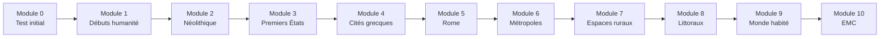

# Formation Histoire-Géographie 6ème

!!! success "Bienvenue dans ta formation !"
    Cette formation est conçue pour t'accompagner tout au long de l'année de 6ème en Histoire-Géographie. Elle est divisée en **10 modules progressifs** couvrant le programme officiel.

---

## Comment utiliser cette formation ?

### Le parcours

### Organisation du programme

| Partie | Thèmes | Modules |
|--------|--------|:-------:|
| **Histoire** | De la Préhistoire à l'Antiquité | 1 à 5 |
| **Géographie** | Habiter le monde | 6 à 9 |
| **EMC** | Vivre ensemble | 10 |

### Durée estimée

| Module | Durée conseillée |
|--------|:----------------:|
| Module 0 | 30 min |
| Modules 1-10 | 2-3 heures chacun |
| **Total** | ~25-30 heures |

!!! tip "Conseil"
    Travaille **20-30 minutes par jour** plutôt que plusieurs heures d'un coup. Alterner Histoire et Géographie permet de varier les plaisirs !

### Structure de chaque module

Chaque module contient :

| Section | Contenu |
|---------|---------|
| 🎯 **Objectifs** | Ce que tu vas apprendre |
| 📚 **Cours** | Leçon complète avec documents |
| 🗺️ **Documents** | Cartes, frises, images à analyser |
| ✏️ **Exercices guidés** | Exercices avec aide pas à pas |
| 🏋️ **Entraînement** | Exercices à faire seul |
| 🏆 **Évaluation** | Quiz pour valider le module |
| 🎮 **Bonus** | Anecdotes et défis |

### Système de progression

| Symbole | Signification |
|:-------:|---------------|
| ⬜ | Pas encore commencé |
| 🟡 | En cours |
| ✅ | Validé |
| ⭐ | Maîtrisé (bonus réussi) |

---

## Les 10 modules

### 📊 Module 0 - Point de départ
> Test de positionnement pour identifier tes points forts et axes de travail

[➡️ Commencer le Module 0](module-00-depart.md){ .md-button .md-button--primary }

---

## HISTOIRE - La longue histoire de l'humanité

### 🦴 Module 1 - Les débuts de l'humanité
> L'apparition des premiers humains et leur mode de vie au Paléolithique

| Compétences | Pré-requis |
|-------------|------------|
| Situer l'apparition de l'humanité | Aucun |
| Décrire le mode de vie des premiers humains | Aucun |
| Comprendre l'évolution humaine | Aucun |

[➡️ Accéder au Module 1](module-01-humanite.md){ .md-button }

---

### 🌾 Module 2 - La révolution néolithique
> Le passage à l'agriculture et la sédentarisation

| Compétences | Pré-requis |
|-------------|------------|
| Expliquer la révolution néolithique | Module 1 |
| Comparer Paléolithique et Néolithique | Module 1 |
| Situer les premiers villages | Module 1 |

[➡️ Accéder au Module 2](module-02-neolithique.md){ .md-button }

---

### ✍️ Module 3 - Premiers États, premières écritures
> La naissance des civilisations en Mésopotamie et en Égypte

| Compétences | Pré-requis |
|-------------|------------|
| Situer l'Orient ancien | Module 2 |
| Expliquer la naissance de l'écriture | Module 2 |
| Décrire l'organisation d'un État | Module 2 |

[➡️ Accéder au Module 3](module-03-premiers-etats.md){ .md-button }

---

### 🏛️ Module 4 - Le monde des cités grecques
> Athènes, Sparte et la civilisation grecque

| Compétences | Pré-requis |
|-------------|------------|
| Situer le monde grec | Module 3 |
| Comprendre la démocratie athénienne | Module 3 |
| Découvrir la mythologie grecque | — |

[➡️ Accéder au Module 4](module-04-grece.md){ .md-button }

---

### ⚔️ Module 5 - Rome, du mythe à l'histoire
> La fondation de Rome et l'Empire romain

| Compétences | Pré-requis |
|-------------|------------|
| Connaître les origines de Rome | Module 4 |
| Comprendre la République romaine | Module 4 |
| Décrire l'Empire romain | Module 4 |

[➡️ Accéder au Module 5](module-05-rome.md){ .md-button }

---

## GÉOGRAPHIE - Habiter le monde

### 🏙️ Module 6 - Habiter une métropole
> Les grandes villes du monde et leurs caractéristiques

| Compétences | Pré-requis |
|-------------|------------|
| Définir une métropole | Aucun |
| Comparer métropoles des pays riches et pauvres | Aucun |
| Analyser un paysage urbain | — |

[➡️ Accéder au Module 6](module-06-metropole.md){ .md-button }

---

### 🌲 Module 7 - Habiter un espace de faible densité
> Les espaces ruraux et les contraintes naturelles

| Compétences | Pré-requis |
|-------------|------------|
| Définir un espace de faible densité | Module 6 |
| Comprendre les contraintes naturelles | Module 6 |
| Comparer espaces agricoles et déserts | — |

[➡️ Accéder au Module 7](module-07-faible-densite.md){ .md-button }

---

### 🏖️ Module 8 - Habiter les littoraux
> Les côtes touristiques et industrialo-portuaires

| Compétences | Pré-requis |
|-------------|------------|
| Définir un littoral | Module 7 |
| Distinguer les types de littoraux | Module 7 |
| Comprendre les enjeux environnementaux | Module 7 |

[➡️ Accéder au Module 8](module-08-littoraux.md){ .md-button }

---

### 🌍 Module 9 - Le monde habité
> La répartition de la population mondiale

| Compétences | Pré-requis |
|-------------|------------|
| Lire une carte de densité | Modules 6-8 |
| Expliquer les foyers de peuplement | Modules 6-8 |
| Comprendre la croissance démographique | — |

[➡️ Accéder au Module 9](module-09-monde-habite.md){ .md-button }

---

## EMC - Enseignement Moral et Civique

### 🤝 Module 10 - Vivre ensemble
> La citoyenneté, les valeurs de la République et le respect

| Compétences | Pré-requis |
|-------------|------------|
| Connaître les valeurs de la République | Aucun |
| Comprendre les droits et devoirs | Aucun |
| Pratiquer le débat argumenté | — |

[➡️ Accéder au Module 10](module-10-emc.md){ .md-button }

---

## Suivi de progression

### Ta fiche de suivi

Imprime ou recopie ce tableau pour suivre ta progression :

| Module | Démarré le | Terminé le | Score éval | Statut |
|:------:|:----------:|:----------:|:----------:|:------:|
| 0 | ___/___/___ | ___/___/___ | ___/20 | ⬜ |
| 1 | ___/___/___ | ___/___/___ | ___/20 | ⬜ |
| 2 | ___/___/___ | ___/___/___ | ___/20 | ⬜ |
| 3 | ___/___/___ | ___/___/___ | ___/20 | ⬜ |
| 4 | ___/___/___ | ___/___/___ | ___/20 | ⬜ |
| 5 | ___/___/___ | ___/___/___ | ___/20 | ⬜ |
| 6 | ___/___/___ | ___/___/___ | ___/20 | ⬜ |
| 7 | ___/___/___ | ___/___/___ | ___/20 | ⬜ |
| 8 | ___/___/___ | ___/___/___ | ___/20 | ⬜ |
| 9 | ___/___/___ | ___/___/___ | ___/20 | ⬜ |
| 10 | ___/___/___ | ___/___/___ | ___/20 | ⬜ |

### Barème de validation

| Score | Statut | Action |
|:-----:|:------:|--------|
| 16-20/20 | ✅ Validé | Passe au module suivant |
| 12-15/20 | 🟡 À consolider | Refais les exercices ratés |
| 0-11/20 | 🔴 À revoir | Reprends la leçon |

---

## Conseils pour réussir

!!! tip "Les 5 règles d'or"
    1. **Régularité** : 20-30 min par jour, c'est mieux que 3h d'un coup
    2. **Apprends les dates** : Fais des fiches avec les dates clés
    3. **Utilise les cartes** : Localise toujours les lieux sur une carte
    4. **Fais des liens** : Relie les événements entre eux
    5. **Raconte** : Explique ce que tu as appris à quelqu'un

!!! warning "Avant de commencer"
    Assure-toi d'avoir :

    - [ ] Un cahier ou des feuilles
    - [ ] Des crayons de couleur
    - [ ] Un crayon à papier et une gomme
    - [ ] Un atlas ou accès à des cartes en ligne

---

## Prêt à commencer ?

[🚀 Démarrer avec le Module 0](module-00-depart.md){ .md-button .md-button--primary }
