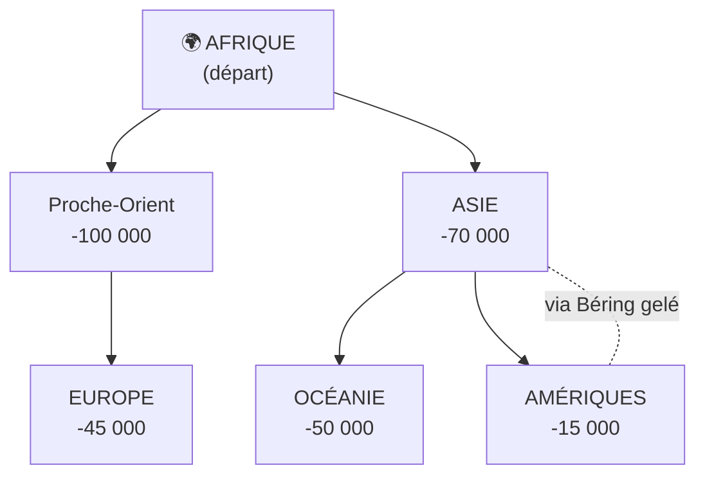

# Module 1 - Les débuts de l'humanité

!!! info "Objectifs du module"
    À la fin de ce module, tu sauras :

    - 🎯 Situer l'apparition des premiers humains dans le temps et l'espace
    - 🎯 Décrire le mode de vie des humains au Paléolithique
    - 🎯 Expliquer comment les humains ont peuplé la Terre
    - 🎯 Connaître les grandes étapes de l'évolution humaine

    **Durée estimée : 2-3 heures**

---

## 🎮 Dans la vraie vie : la Préhistoire est partout !

!!! tip "Tu connais déjà la Préhistoire sans le savoir !"

    **Dans les films et séries :**

    - **L'Âge de Glace** → Mammouths, humains préhistoriques, glaciations
    - **Les Croods** → Vie des premiers humains, grottes, découverte du feu
    - **Jurassic Park** → Attention, les dinosaures ont disparu AVANT les humains !

    **Dans les jeux vidéo :**

    - **Far Cry Primal** → Tu joues un chasseur préhistorique
    - **ARK: Survival** → Survie façon préhistorique (avec des dinosaures, mais c'est du jeu !)
    - **Minecraft** → Au début tu craftes des outils en pierre... comme au Paléolithique !

!!! example "La Préhistoire autour de toi"

    | Ce que tu connais | Lien avec la Préhistoire |
    |-------------------|-------------------------|
    | Faire un feu de camp | Nos ancêtres l'ont maîtrisé il y a 400 000 ans |
    | Manger de la viande | Chasseurs depuis des millions d'années |
    | Dessiner, peindre | L'art existe depuis 40 000 ans (Lascaux) |
    | Avoir un chien | Premier animal domestiqué (-15 000 ans) |
    | Utiliser des outils | Invention humaine depuis 3 millions d'années |

!!! warning "Les fausses idées sur la Préhistoire"

    **Ce qu'on croit (à cause des films) :**

    - ❌ Les humains vivaient avec les dinosaures
    - ❌ Ils étaient bêtes et violents ("Ugh ugh !")
    - ❌ Ils habitaient tous dans des grottes sombres

    **La réalité :**

    - ✅ Les dinosaures ont disparu 65 millions d'années AVANT les humains
    - ✅ Ils étaient très intelligents (outils, art, langage)
    - ✅ Ils vivaient surtout sous des tentes et en plein air

---

## Introduction

!!! question "Problématique"
    **D'où venons-nous ? Comment les premiers humains vivaient-ils ?**

L'histoire de l'humanité commence il y a des millions d'années, bien avant l'invention de l'écriture. Cette période s'appelle la **Préhistoire**.

```
┌─────────────────────────────────────────────────────────────────────┐
│                    FRISE CHRONOLOGIQUE SIMPLIFIÉE                    │
├─────────────────────────────────────────────────────────────────────┤
│                                                                      │
│  -7 millions     -3 millions    -300 000    -3 300                  │
│      │               │             │           │                     │
│      ▼               ▼             ▼           ▼                     │
│  Premiers       Premiers      Homo        Invention                  │
│  hominidés      outils       sapiens     écriture                   │
│                                                                      │
│  ◄──────────── PRÉHISTOIRE ─────────────►│◄── HISTOIRE ──►          │
│                                                                      │
│  ◄────────────── PALÉOLITHIQUE ──────────►│                         │
└─────────────────────────────────────────────────────────────────────┘
```

---

## 1. L'apparition des premiers humains

### 1.1 Le berceau africain

!!! success "À retenir"
    Les premiers humains sont apparus en **Afrique** il y a environ **7 millions d'années**.

Les scientifiques ont découvert des fossiles (os très anciens) qui prouvent que l'Afrique est le « berceau de l'humanité ».

```
                    🌍 L'AFRIQUE : BERCEAU DE L'HUMANITÉ

                         ┌─────────────┐
                         │   EUROPE    │
                         └──────┬──────┘
                                │
              ┌─────────────────┼─────────────────┐
              │     AFRIQUE     │                 │
              │                 │                 │
              │    ★ Tchad      │                 │
              │    (Toumaï)     │    ★ Éthiopie   │
              │                 │    (Lucy)       │
              │                 │                 │
              │        ★ Kenya  │                 │
              │        (Turkana)│                 │
              └─────────────────┴─────────────────┘

    ★ = Sites de découvertes importantes
```

### 1.2 Les grandes découvertes

| Nom | Date découverte | Âge | Lieu |
|-----|:---------------:|:---:|------|
| **Toumaï** | 2001 | 7 millions d'années | Tchad |
| **Lucy** | 1974 | 3,2 millions d'années | Éthiopie |
| **Homo habilis** | 1960 | 2,5 millions d'années | Tanzanie |

!!! example "Lucy, notre ancêtre célèbre"
    Lucy est le squelette d'une Australopithèque découvert en Éthiopie en 1974. Elle mesurait environ 1,10 m et marchait déjà debout sur ses deux jambes (bipédie). Son nom vient de la chanson "Lucy in the Sky with Diamonds" des Beatles !

### 1.3 L'évolution humaine

L'être humain a évolué progressivement sur des millions d'années :

```
    ÉVOLUTION HUMAINE (très simplifiée)

    -7 Ma          -4 Ma           -2,5 Ma         -300 000 ans
       │              │               │                 │
       ▼              ▼               ▼                 ▼
    ┌──────┐      ┌──────┐       ┌──────┐         ┌──────┐
    │Toumaï│  →   │Lucy  │   →   │Homo  │    →    │Homo  │
    │      │      │      │       │habilis│        │sapiens│
    └──────┘      └──────┘       └──────┘         └──────┘
       │              │               │                 │
    Premiers      Marche          Premiers         Nous !
    hominidés     bipède          outils

    Ma = millions d'années
```

!!! warning "Attention aux idées reçues !"
    L'humain **ne descend pas du singe** ! Nous avons un **ancêtre commun** avec les grands singes actuels (chimpanzés, gorilles). C'est comme des cousins qui ont le même arrière-arrière-grand-père.

??? warning "⚠️ Pièges à éviter : la Préhistoire"
    **Piège 1 : "L'Homme descend du singe"**

    - ❌ L'Homme descend du singe → FAUX !
    - ✅ L'Homme et les singes ont un **ancêtre commun**

    On est comme des cousins, pas des descendants !

    ---

    **Piège 2 : Confondre "chiffre de" et dates en Préhistoire**

    - -3 000 000 (3 millions d'années) → Préhistoire
    - -3 000 (3 000 ans avant J.-C.) → Antiquité

    **Le nombre de zéros change tout !**

    ---

    **Piège 3 : Croire que les hommes vivaient avec les dinosaures**

    - Dinosaures : disparus il y a **65 millions** d'années
    - Premiers humains : il y a **7 millions** d'années

    **58 millions d'années séparent les deux !** (contrairement aux films)

    ---

    **Piège 4 : Confondre Paléolithique et Néolithique**

    | Paléolithique | Néolithique |
    |---------------|-------------|
    | Pierre **taillée** | Pierre **polie** |
    | **Nomades** | **Sédentaires** |
    | Chasse-cueillette | Agriculture |
    | -3 Ma à -10 000 | -10 000 à -3 000 |

??? abstract "🔄 Autre façon de comprendre : l'évolution humaine"
    **L'évolution, c'est comme un arbre généalogique géant !**

    Imagine ta famille :
    - Tu as des cousins (vous avez les mêmes grands-parents)
    - Tu ne descends pas de ton cousin → vous avez un ancêtre commun

    C'est pareil pour les singes :
    - Les humains et les chimpanzés sont comme des "cousins"
    - On ne descend pas DU singe, mais on a un ancêtre COMMUN
    - C'était il y a environ 7 millions d'années

    ```mermaid
    flowchart TD
        A["Ancêtre commun<br>(il y a 7 Ma)"] --> B["Branche des singes actuels"]
        A --> C["Branche des humains actuels"]
    ```

    ---

    **Pourquoi l'Afrique ?**

    C'est comme dans un jeu : le "spawn point" de l'humanité, c'est l'Afrique !
    - Tous les plus vieux fossiles ont été trouvés là-bas
    - Lucy, Toumaï... tous africains
    - Puis les humains ont "migré" vers les autres continents

---

## 2. Le mode de vie au Paléolithique

### 2.1 Des chasseurs-cueilleurs nomades

!!! success "À retenir"
    Au Paléolithique, les humains sont **nomades** : ils se déplacent pour suivre le gibier et trouver de la nourriture. Ils vivent de **chasse**, de **pêche** et de **cueillette**.

```
    MODE DE VIE AU PALÉOLITHIQUE

    ┌─────────────────────────────────────────────────────┐
    │                                                      │
    │     🦌 CHASSE           🐟 PÊCHE        🍇 CUEILLETTE │
    │     ────────           ──────         ────────────   │
    │     Mammouths          Poissons       Fruits         │
    │     Rennes             Coquillages    Baies          │
    │     Bisons                            Racines        │
    │     Chevaux                           Champignons    │
    │                                                      │
    │     ════════════════════════════════════════════     │
    │                     NOMADISME                        │
    │       Se déplacer selon les saisons et le gibier    │
    └─────────────────────────────────────────────────────┘
```

### 2.2 L'habitat

Les humains du Paléolithique vivaient :
- Dans des **grottes** et **abris sous roche**
- Sous des **tentes** faites de peaux et de branchages
- Dans des **huttes** de mammouths (ossements recouverts de peaux)

```
    TYPES D'HABITATS AU PALÉOLITHIQUE

           GROTTE                    TENTE                 HUTTE
        ___________              /\      /\            .--""--.
       /           \            /  \    /  \          /  ____  \
      /             \          / || \  / || \        | /      \ |
     |    🔥         |        /  ||  \/  ||  \       ||   🔥   ||
     |   (feu)       |       /   ||      ||   \      ||        ||
     |_______________|      /____|________|____\     |__________|
                            Peaux d'animaux         Os + peaux
```

### 2.3 Les outils

!!! success "À retenir"
    Les premiers outils en **pierre taillée** apparaissent il y a environ **3 millions d'années**. C'est le début du **Paléolithique** (= âge de la pierre ancienne).

| Outil | Utilisation | Matériau |
|-------|-------------|----------|
| **Biface** | Couper, gratter, creuser | Silex |
| **Propulseur** | Lancer des sagaies plus loin | Os, bois |
| **Harpon** | Pêcher | Os |
| **Aiguille** | Coudre les peaux | Os |
| **Grattoir** | Préparer les peaux | Silex |

```
    ÉVOLUTION DES OUTILS

    Galet aménagé        Biface             Lame fine
    (très ancien)       (plus travaillé)    (très précis)

       _____              _____              |     |
      /     \            /     \             |     |
     |       |          /       \            |     |
     |       |         |         |           |     |
     |_______|          \_______/            |_____|

    -3 Ma              -1,5 Ma             -40 000 ans
```

### 2.4 La maîtrise du feu

!!! success "À retenir"
    Les humains maîtrisent le **feu** depuis environ **400 000 ans**.

Le feu permet de :
- **Se chauffer** contre le froid
- **S'éclairer** dans les grottes
- **Cuire** les aliments (plus faciles à manger et à digérer)
- **Se protéger** des animaux sauvages
- **Fabriquer** des outils (durcir le bois)

??? abstract "🔄 Autre façon de comprendre : la vie au Paléolithique"
    **Imagine que tu dois survivre en mode "hardcore" dans Minecraft ou ARK...**

    - Pas de base permanente → tu te déplaces tout le temps (NOMADE)
    - Tu dois chasser et cueillir ta nourriture chaque jour
    - Tu fabriques tes outils avec ce que tu trouves (pierre, os, bois)
    - La nuit, tu te protèges avec le feu

    ---

    **Le feu = le plus grand "power-up" de la Préhistoire !**

    | Avant le feu | Après le feu |
    |--------------|--------------|
    | Froid la nuit | Chaleur |
    | Viande crue (difficile à mâcher) | Viande cuite (+ facile à digérer) |
    | Peur des prédateurs | Les animaux fuient le feu |
    | Nuit = danger | Lumière pour voir |

    Le feu a littéralement changé l'évolution humaine : avec la cuisson, notre cerveau a pu grossir car on dépensait moins d'énergie à digérer !

```
    LES USAGES DU FEU

                         🔥
                        /|\
                       / | \
                      /  |  \
                     /   |   \
              ┌─────┴───┬┴───┬┴─────┐
              │         │    │      │
              ▼         ▼    ▼      ▼
           Chaleur   Lumière Cuisson Protection
```

---

## 3. Le peuplement de la Terre

### 3.1 Les migrations humaines

!!! success "À retenir"
    Partis d'Afrique, les humains ont progressivement peuplé **tous les continents** en migrant pendant des centaines de milliers d'années.



### 3.2 L'adaptation aux environnements

Les humains ont su s'adapter à tous les climats :
- **Zones froides** : vêtements en fourrure, habitats isolés
- **Zones chaudes** : abris légers, moins de vêtements
- **Bords de mer** : pêche, coquillages
- **Forêts** : chasse, cueillette

---

## 4. L'art préhistorique

### 4.1 Les premières expressions artistiques

!!! success "À retenir"
    Les humains préhistoriques ont créé de l'**art** il y a plus de **40 000 ans** : peintures, gravures, sculptures.

```
    L'ART AU PALÉOLITHIQUE

    ┌──────────────────┬──────────────────┬──────────────────┐
    │  PEINTURES       │   GRAVURES       │   SCULPTURES     │
    │                  │                  │                  │
    │  Sur les parois  │  Sur os ou       │  Statuettes      │
    │  des grottes     │  pierre          │  en ivoire       │
    │                  │                  │  ou pierre       │
    │  🦬 Animaux      │  Lignes,         │                  │
    │  🖐️ Mains        │  motifs          │  "Vénus"         │
    │                  │                  │                  │
    └──────────────────┴──────────────────┴──────────────────┘
```

### 4.2 La grotte de Lascaux

!!! example "Lascaux, la « chapelle Sixtine de la Préhistoire »"
    Découverte en 1940 en Dordogne (France) par quatre adolescents, la grotte de Lascaux contient des centaines de peintures d'animaux (chevaux, taureaux, cerfs) vieilles de **17 000 ans**. Les couleurs utilisées : ocre (jaune, rouge), charbon (noir).

### 4.3 Pourquoi cet art ?

Les hypothèses des scientifiques :
- **Rituels magiques** pour la chasse
- **Croyances religieuses** et spirituelles
- **Transmission** de connaissances
- Simple **plaisir** de créer

---

## Exercices guidés

### Exercice 1 : Compléter une frise

??? question "Place ces événements sur la frise : apparition d'Homo sapiens, découverte de Lucy, premiers outils"
    ```
    -7 Ma     -3 Ma        -300 000     aujourd'hui
       │         │             │             │
       │         │             │             │
    ───┴─────────┴─────────────┴─────────────┴───
    ```

    ??? success "Correction"
        ```
        -7 Ma     -3 Ma        -300 000     aujourd'hui
           │         │             │             │
           │    Premiers      Homo sapiens       │
           │    outils                           │
        ───┴─────────┴─────────────┴─────────────┴───

        Lucy : -3,2 millions d'années (entre -7 Ma et -3 Ma)
        ```

### Exercice 2 : Vrai ou Faux

??? question "Réponds par vrai ou faux"
    1. L'Homme descend du singe.
    2. Lucy a été découverte en Afrique.
    3. Le Paléolithique signifie "âge de la pierre nouvelle".
    4. Les humains préhistoriques étaient nomades.
    5. Le feu a été maîtrisé il y a 1000 ans.

    ??? success "Correction"
        1. **FAUX** - L'Homme et les grands singes ont un ancêtre commun
        2. **VRAI** - En Éthiopie
        3. **FAUX** - C'est "âge de la pierre ancienne" (Néolithique = pierre nouvelle)
        4. **VRAI** - Ils se déplaçaient pour suivre le gibier
        5. **FAUX** - Il y a environ 400 000 ans

### Exercice 3 : Associer

??? question "Relie chaque terme à sa définition"
    | Terme | Définition |
    |-------|------------|
    | 1. Nomade | A. Personne qui vit de la chasse et de la cueillette |
    | 2. Biface | B. Région où sont apparus les premiers humains |
    | 3. Chasseur-cueilleur | C. Outil en pierre taillée |
    | 4. Berceau de l'humanité | D. Personne qui se déplace régulièrement |

    ??? success "Correction"
        - 1 → D (Nomade = personne qui se déplace)
        - 2 → C (Biface = outil en pierre)
        - 3 → A (Chasseur-cueilleur = vit de chasse et cueillette)
        - 4 → B (Berceau = Afrique)

---

## Entraînement

### Exercice 4 : Questions de cours

??? question "Réponds aux questions suivantes"
    1. Où et quand sont apparus les premiers humains ?
    2. Cite trois usages du feu au Paléolithique.
    3. Qu'est-ce qui caractérise le mode de vie au Paléolithique ?
    4. Pourquoi dit-on que l'Afrique est le "berceau de l'humanité" ?

    ??? success "Correction"
        1. En **Afrique**, il y a environ **7 millions d'années**
        2. Se chauffer, s'éclairer, cuire les aliments, se protéger, fabriquer des outils (3 réponses parmi celles-ci)
        3. Les humains sont **nomades**, ils vivent de **chasse**, **pêche** et **cueillette**
        4. C'est en Afrique qu'on a trouvé les plus anciens **fossiles** d'ancêtres de l'Homme

### Exercice 5 : Décrire une image

??? question "Imagine que tu es un guide à Lascaux. Décris ce que les visiteurs pourraient voir."

    ??? success "Éléments de réponse"
        - Des **peintures d'animaux** sur les parois : chevaux, taureaux, cerfs, bisons
        - Des **couleurs** naturelles : ocre jaune, ocre rouge, noir (charbon)
        - Des **techniques** : peinture au doigt, soufflée, avec des pinceaux
        - L'**ancienneté** : environ 17 000 ans
        - Le **mystère** : on ne sait pas exactement pourquoi ils peignaient

---

## Évaluation

### Quiz de validation (10 questions)

??? question "Question 1 : Où sont apparus les premiers humains ?"
    - A) En Europe
    - B) En Asie
    - C) En Afrique
    - D) En Amérique

    ??? success "Réponse"
        **C) En Afrique**

??? question "Question 2 : Qui est Lucy ?"
    - A) Une scientifique française
    - B) Un squelette d'Australopithèque
    - C) Une grotte préhistorique
    - D) Un outil en silex

    ??? success "Réponse"
        **B) Un squelette d'Australopithèque** découvert en Éthiopie en 1974

??? question "Question 3 : Que signifie 'Paléolithique' ?"
    - A) Âge du bronze
    - B) Âge de la pierre nouvelle
    - C) Âge de la pierre ancienne
    - D) Âge du fer

    ??? success "Réponse"
        **C) Âge de la pierre ancienne** (paléo = ancien, lithique = pierre)

??? question "Question 4 : Les humains du Paléolithique étaient..."
    - A) Sédentaires (ils restaient au même endroit)
    - B) Nomades (ils se déplaçaient)
    - C) Agriculteurs
    - D) Éleveurs

    ??? success "Réponse"
        **B) Nomades** - ils se déplaçaient pour suivre le gibier

??? question "Question 5 : Depuis quand les humains maîtrisent-ils le feu ?"
    - A) 1000 ans
    - B) 10 000 ans
    - C) 400 000 ans
    - D) 7 millions d'années

    ??? success "Réponse"
        **C) Environ 400 000 ans**

??? question "Question 6 : Quel est le premier matériau utilisé pour fabriquer des outils ?"
    - A) Le fer
    - B) Le bronze
    - C) La pierre (silex)
    - D) Le plastique

    ??? success "Réponse"
        **C) La pierre (silex)**

??? question "Question 7 : Où se trouve la grotte de Lascaux ?"
    - A) En Espagne
    - B) En Dordogne (France)
    - C) En Allemagne
    - D) En Italie

    ??? success "Réponse"
        **B) En Dordogne (France)**

??? question "Question 8 : Comment les premiers humains ont-ils peuplé les autres continents ?"
    - A) En avion
    - B) Par migrations successives
    - C) Ils sont apparus partout en même temps
    - D) Par bateau à moteur

    ??? success "Réponse"
        **B) Par migrations successives** sur des centaines de milliers d'années

??? question "Question 9 : L'Homme descend du singe. Cette affirmation est..."
    - A) Vraie
    - B) Fausse

    ??? success "Réponse"
        **B) Fausse** - L'Homme et les grands singes ont un ancêtre commun

??? question "Question 10 : Cite deux animaux chassés au Paléolithique."

    ??? success "Réponse"
        Parmi : **mammouth, renne, bison, cheval, cerf, ours**...

---

## Bonus

### Le savais-tu ?

!!! tip "Anecdotes fascinantes"
    - **Toumaï** signifie "espoir de vie" en langue tchadienne
    - Les **empreintes de mains** dans les grottes sont souvent des mains gauches (les artistes tenaient le pigment de la main droite)
    - Un mammouth pouvait peser jusqu'à **6 tonnes** (comme un éléphant d'Afrique)
    - Les humains préhistoriques vivaient en moyenne **30-35 ans** (mais certains dépassaient 50 ans !)

### Défi

??? question "Défi : Fabrique un outil préhistorique"
    **Mission** : Avec l'accord d'un adulte, essaie de fabriquer un outil simple avec des matériaux naturels (bâton, pierre, ficelle naturelle).

    ⚠️ Attention : Ne taille pas de silex (c'est dangereux et coupant !)

    Tu peux par exemple :
    - Attacher une pierre à un bâton avec de la ficelle (comme un marteau)
    - Tailler un bâton en pointe (propulseur simplifié)
    - Créer un pinceau avec des poils ou de l'herbe

---

## Fiche de révision

!!! abstract "L'essentiel à retenir"

    **DATES CLÉS**

    - -7 millions d'années : premiers hominidés (Afrique)
    - -3 millions d'années : premiers outils en pierre
    - -400 000 ans : maîtrise du feu
    - -300 000 ans : apparition d'Homo sapiens
    - -17 000 ans : peintures de Lascaux

    **VOCABULAIRE**

    - **Préhistoire** : période avant l'invention de l'écriture
    - **Paléolithique** : âge de la pierre ancienne
    - **Nomade** : qui se déplace régulièrement
    - **Chasseur-cueilleur** : qui vit de chasse, pêche et cueillette
    - **Biface** : outil en pierre taillée des deux côtés

    **IDÉES PRINCIPALES**

    1. Les premiers humains viennent d'**Afrique**
    2. Ils ont peuplé la Terre par **migrations**
    3. Ils vivaient de **chasse, pêche et cueillette**
    4. Ils étaient **nomades**
    5. Ils ont inventé les **outils** et maîtrisé le **feu**
    6. Ils ont créé de l'**art** (peintures, sculptures)

---

## Navigation

[⬅️ Retour à l'index](index.md){ .md-button }
[➡️ Module 2 - La révolution néolithique](module-02-neolithique.md){ .md-button .md-button--primary }
