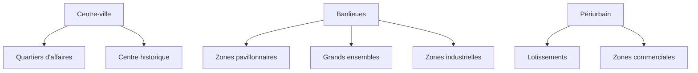

# Géographie

## Thème 1 : Habiter une métropole

### Qu'est-ce qu'une métropole ?

!!! info "Définition"
    Une **métropole** est une grande ville qui exerce une influence sur un vaste territoire grâce à ses fonctions de commandement.

| Caractéristique | Description |
|-----------------|-------------|
| **Population** | Plusieurs millions d'habitants |
| **Fonctions** | Économiques, politiques, culturelles |
| **Rayonnement** | Influence nationale ou mondiale |

### Les différents espaces de la métropole

| Espace | Caractéristiques |
|--------|------------------|
| **Centre-ville** | Dense, commerces, monuments, cher |
| **Banlieue** | Habitat varié, industries |
| **Périurbain** | Maisons individuelles, dépendance à la voiture |

### Métropoles des pays riches vs pays pauvres

| | Pays développés | Pays en développement |
|---|-----------------|----------------------|
| **Exemples** | Paris, New York, Tokyo | Lagos, Mumbai, São Paulo |
| **Croissance** | Lente | Très rapide |
| **Problèmes** | Congestion, pollution | + Bidonvilles, accès à l'eau |
| **Transports** | Réseau développé | Souvent insuffisant |

!!! warning "Bidonville"
    Habitat précaire, auto-construit, sans accès aux services de base (eau, électricité, égouts)

---

## Thème 2 : Habiter un espace de faible densité

### Les espaces à faible densité

!!! info "Densité"
    Nombre d'habitants par km² (habitants/km²)

    - **Faible densité** : < 30 hab/km²
    - **Forte densité** : > 200 hab/km²

### Les espaces ruraux

| Type | Caractéristiques | Exemples |
|------|------------------|----------|
| **Rural agricole** | Agriculture dominante | Beauce, Middle West |
| **Rural touristique** | Paysages, patrimoine | Alpes, Provence |
| **Rural en déprise** | Population en déclin | Massif Central |

### Les contraintes des espaces de faible densité

| Contrainte | Impact |
|------------|--------|
| **Éloignement** | Moins de services, trajets longs |
| **Climat difficile** | Montagne, désert, froid |
| **Relief** | Pentes, accès difficile |

### Habiter un espace de faible densité à vocation agricole

!!! example "L'agriculture en France"
    - **Openfield** : grandes parcelles céréalières (Beauce)
    - **Bocage** : haies, élevage (Normandie)
    - **Cultures spécialisées** : vignes, vergers (Sud)

### Habiter un espace touristique

| Atouts | Aménagements |
|--------|--------------|
| Paysages, patrimoine | Hébergements, routes |
| Climat | Stations de ski, plages |
| Culture | Musées, festivals |

---

## Thème 3 : Habiter les littoraux

### Qu'est-ce qu'un littoral ?

!!! info "Définition"
    Zone de contact entre la terre et la mer

### Les activités sur les littoraux

| Activité | Description |
|----------|-------------|
| **Tourisme balnéaire** | Plages, stations, croisières |
| **Pêche** | Traditionnelle ou industrielle |
| **Ports** | Commerce, industries |
| **Aquaculture** | Élevage de poissons, coquillages |

### Littoraux industrialo-portuaires

!!! example "Exemples"
    Shanghai, Rotterdam, Singapour : grands ports mondiaux

| Élément | Fonction |
|---------|----------|
| **ZIP** (Zone Industrialo-Portuaire) | Industries lourdes près des ports |
| **Conteneurs** | Transport maritime standardisé |
| **Hinterland** | Arrière-pays desservi par le port |

### Littoraux touristiques

| Aménagements | Exemples |
|--------------|----------|
| Stations balnéaires | Côte d'Azur, Cancún |
| Marinas | Ports de plaisance |
| Promenades | Boardwalks, corniche |

### Les risques sur les littoraux

| Risque | Cause |
|--------|-------|
| **Érosion** | Vagues, courants |
| **Submersion** | Tempêtes, montée des eaux |
| **Pollution** | Industries, déchets, marées noires |
| **Urbanisation excessive** | Bétonisation du littoral |

---

## Thème 4 : Le monde habité

### La répartition de la population mondiale

!!! info "Population mondiale"
    Environ **8 milliards** d'habitants (2023)

#### Les foyers de peuplement

| Foyer | Population | Localisation |
|-------|------------|--------------|
| **Asie de l'Est** | ~1,5 milliard | Chine, Japon, Corée |
| **Asie du Sud** | ~1,8 milliard | Inde, Pakistan, Bangladesh |
| **Europe** | ~750 millions | De l'Atlantique à l'Oural |

#### Les déserts humains

| Type | Exemples | Contrainte |
|------|----------|------------|
| **Déserts chauds** | Sahara, Arabie | Aridité |
| **Déserts froids** | Sibérie, Canada | Froid extrême |
| **Hautes montagnes** | Himalaya, Andes | Altitude |
| **Forêts denses** | Amazonie, Congo | Humidité, végétation |

### Densité et répartition

| Densité | Caractéristiques | Exemples |
|---------|------------------|----------|
| **Très forte** (>500 hab/km²) | Grandes villes | Tokyo, Paris |
| **Forte** (100-500) | Régions urbanisées | Europe de l'Ouest |
| **Moyenne** (30-100) | Rural dynamique | France rurale |
| **Faible** (<30) | Contraintes naturelles | Sahara, Sibérie |

### La croissance démographique

| Région | Croissance | Tendance |
|--------|------------|----------|
| **Afrique** | Très forte | En hausse |
| **Asie** | Modérée | Ralentissement |
| **Europe** | Faible/négative | Vieillissement |
| **Amérique** | Modérée | Stable |

---

## Les outils du géographe

### La carte

| Élément | Fonction |
|---------|----------|
| **Titre** | Sujet de la carte |
| **Légende** | Explication des symboles |
| **Échelle** | Rapport de réduction |
| **Orientation** | Nord (rose des vents) |
| **Source** | Origine des données |

### L'échelle

!!! note "Définition"
    L'**échelle** indique le rapport entre la distance sur la carte et la distance réelle.

| Échelle | Type | Usage |
|---------|------|-------|
| **1:25 000** | Grande échelle | Détail (randonnée) |
| **1:100 000** | Moyenne échelle | Région |
| **1:1 000 000** | Petite échelle | Pays, continent |

!!! tip "Calcul"
    1 cm sur la carte à 1:100 000 = 1 km en réalité

    (100 000 cm = 1 000 m = 1 km)

### Les types de cartes

| Type | Représente |
|------|------------|
| **Topographique** | Relief, routes, villes |
| **Thématique** | Un sujet précis (population, climat) |
| **Choroplèthe** | Données par zones colorées |

---

## Quiz express

??? question "Qu'est-ce qu'une métropole ?"
    Une **grande ville** qui exerce une influence sur un vaste territoire grâce à ses fonctions de commandement.

??? question "Qu'est-ce que le périurbain ?"
    L'espace situé **entre la ville et la campagne**, caractérisé par des lotissements et une forte dépendance à la voiture.

??? question "Cite les 3 grands foyers de peuplement mondiaux."
    1. Asie de l'Est (Chine, Japon)
    2. Asie du Sud (Inde)
    3. Europe

??? question "Pourquoi le Sahara est-il peu peuplé ?"
    C'est un **désert chaud** : contrainte de l'aridité (manque d'eau).

??? question "Que signifie ZIP ?"
    **Zone Industrialo-Portuaire** : zone d'industries situées près d'un port.
