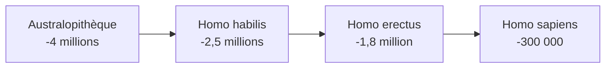

# Histoire

## Thème 1 : La longue histoire de l'humanité

### Les débuts de l'humanité

!!! info "Préhistoire"
    Période avant l'invention de l'écriture (avant -3300 environ)

#### L'évolution humaine



| Espèce | Époque | Caractéristiques |
|--------|--------|------------------|
| **Australopithèque** | -4 à -2 millions | Bipède, petit cerveau |
| **Homo habilis** | -2,5 millions | Premiers outils (galets taillés) |
| **Homo erectus** | -1,8 million | Maîtrise du feu, migration hors d'Afrique |
| **Homo sapiens** | -300 000 | Nous ! Art, langage complexe |

!!! tip "À retenir"
    **Lucy** : squelette d'australopithèque découvert en Éthiopie (1974), 3,2 millions d'années

#### Le Paléolithique

| Période | Mode de vie | Inventions |
|---------|-------------|------------|
| **Paléolithique** | Nomades, chasseurs-cueilleurs | Outils en pierre taillée, feu, art pariétal |

!!! example "Art pariétal"
    **Grotte de Lascaux** (France, -17 000) : peintures d'animaux (chevaux, aurochs, cerfs)

#### La révolution néolithique

!!! info "Néolithique (vers -10 000)"
    Passage de la prédation à la production : agriculture et élevage

| Avant (Paléolithique) | Après (Néolithique) |
|----------------------|---------------------|
| Nomades | **Sédentaires** |
| Chasse, cueillette | **Agriculture, élevage** |
| Campements | **Villages** |
| Outils taillés | Outils **polis** |

!!! tip "Conséquences"
    - Premiers villages (ex : Çatal Höyük en Turquie)
    - Poterie, tissage
    - Hiérarchie sociale, guerres

---

### Premiers États, premières écritures

#### La Mésopotamie

!!! info "Mésopotamie"
    "Pays entre les fleuves" (Tigre et Euphrate), actuel Irak

| Élément | Description |
|---------|-------------|
| **Cité-État** | Ville + territoire agricole avec son roi |
| **Ziggourat** | Temple en forme de pyramide à étages |
| **Écriture cunéiforme** | En forme de clous, sur tablettes d'argile |

!!! example "Première écriture"
    Inventée à **Uruk** (Mésopotamie) vers **-3300** : l'écriture **cunéiforme**

#### L'Égypte ancienne

| Élément | Description |
|---------|-------------|
| **Pharaon** | Roi-dieu de l'Égypte |
| **Nil** | Fleuve vital (crues fertilisantes) |
| **Hiéroglyphes** | Écriture sacrée égyptienne |
| **Pyramides** | Tombeaux des pharaons |

!!! tip "Chronologie Égypte"
    - Unification : vers -3100 (Narmer)
    - Pyramides de Gizeh : vers -2500
    - Toutankhamon : vers -1330

---

## Thème 2 : Récits fondateurs et citoyenneté

### Le monde des cités grecques

#### Organisation de la Grèce

!!! info "Cité grecque (polis)"
    État indépendant = ville + campagne + sanctuaires

| Élément | Description |
|---------|-------------|
| **Acropole** | Ville haute, temples |
| **Agora** | Place publique, marché, politique |
| **Sanctuaire panhellénique** | Lieu sacré pour tous les Grecs (Olympie, Delphes) |

#### Athènes, une démocratie

!!! info "Démocratie"
    "Pouvoir du peuple" - système politique né à Athènes au Ve siècle av. J.-C.

| Institution | Rôle |
|-------------|------|
| **Ecclésia** | Assemblée de tous les citoyens |
| **Boulè** | Conseil qui prépare les lois (500 membres tirés au sort) |
| **Stratèges** | 10 chefs militaires élus |

!!! warning "Limites de la démocratie athénienne"
    Seuls les **citoyens** votent : hommes, adultes, nés de père et mère athéniens

    Exclus : femmes, métèques (étrangers), esclaves

#### Mythologie et religion grecques

| Dieu | Domaine |
|------|---------|
| **Zeus** | Roi des dieux, ciel |
| **Athéna** | Sagesse, guerre |
| **Poséidon** | Mer |
| **Apollon** | Soleil, arts |
| **Artémis** | Chasse |

!!! example "Mythes fondateurs"
    - **L'Iliade** : guerre de Troie
    - **L'Odyssée** : retour d'Ulysse
    - **Héraclès** : les 12 travaux

---

### Rome, du mythe à l'histoire

#### La fondation de Rome

!!! info "Mythe de Romulus et Rémus"
    Jumeaux abandonnés, recueillis par une louve, fondent Rome en **-753**

#### Les régimes politiques romains

| Période | Dates | Caractéristiques |
|---------|-------|------------------|
| **Royauté** | -753 à -509 | 7 rois légendaires |
| **République** | -509 à -27 | Consuls, Sénat, comices |
| **Empire** | -27 à 476 | Empereur (Auguste premier) |

#### La République romaine

| Institution | Rôle |
|-------------|------|
| **Consuls** | 2 magistrats élus pour 1 an |
| **Sénat** | Assemblée des anciens magistrats |
| **Comices** | Assemblées du peuple |

#### Patriciens et plébéiens

| Groupe | Description |
|--------|-------------|
| **Patriciens** | Familles nobles, anciennes |
| **Plébéiens** | Peuple, roturiers |

#### L'Empire romain

!!! info "Auguste"
    Premier empereur (-27 à 14), période de paix : **Pax Romana**

| Élément | Description |
|---------|-------------|
| **Limes** | Frontières fortifiées de l'Empire |
| **Romanisation** | Diffusion de la culture romaine |
| **Thermes, amphithéâtres** | Bâtiments typiques romains |

---

## Thème 3 : Empires chrétiens du Moyen Âge

### Les débuts du christianisme

!!! info "Jésus-Christ"
    Prédicateur juif en Palestine, crucifié vers 30. Ses disciples répandent son message.

| Élément | Description |
|---------|-------------|
| **Évangiles** | Récits de la vie de Jésus (Matthieu, Marc, Luc, Jean) |
| **Apôtres** | 12 disciples de Jésus |
| **Paul** | Grand diffuseur du christianisme |

#### Persécutions puis triomphe

| Date | Événement |
|------|-----------|
| Ier-IIIe s. | Persécutions des chrétiens |
| **313** | Édit de Milan : liberté de culte |
| **380** | Édit de Thessalonique : christianisme religion officielle |
| **392** | Interdiction des cultes païens |

---

### L'Empire byzantin

!!! info "Byzance / Constantinople"
    Empire romain d'Orient, capitale : Constantinople (ancienne Byzance, actuelle Istanbul)

| Caractéristique | Description |
|-----------------|-------------|
| **Durée** | 395 à 1453 |
| **Religion** | Christianisme orthodoxe |
| **Empereur** | Pouvoir absolu, chef religieux |
| **Sainte-Sophie** | Grande basilique de Constantinople |

---

## Frise chronologique

```
Préhistoire                    Antiquité                 Moyen Âge
|--------------------------|------------------------|--------------->
        -3300                   476
     (écriture)          (chute de Rome)
```

| Période | Début | Fin |
|---------|-------|-----|
| **Préhistoire** | Origines | -3300 (écriture) |
| **Antiquité** | -3300 | 476 (chute de Rome) |
| **Moyen Âge** | 476 | 1492 (Amérique) |

---

## Quiz express

??? question "Comment s'appelle le premier représentant du genre Homo ?"
    **Homo habilis** ("homme habile"), premiers outils

??? question "Où et quand apparaît l'écriture ?"
    En **Mésopotamie** (Uruk), vers **-3300** (cunéiforme)

??? question "Qu'est-ce qu'une cité grecque ?"
    Un **État indépendant** composé d'une ville et de sa campagne

??? question "Qui peut voter dans la démocratie athénienne ?"
    Les **citoyens** : hommes adultes nés de père et mère athéniens

??? question "En quelle année Rome est-elle fondée selon la légende ?"
    **-753** (Romulus et Rémus)

??? question "Quel édit autorise le christianisme en 313 ?"
    L'**Édit de Milan** (Constantin)
