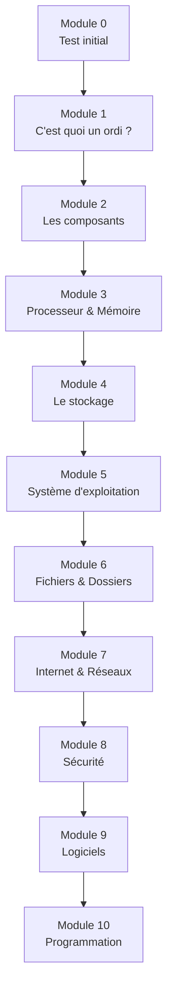

# Formation Informatique - Comment fonctionne un ordinateur

!!! success "Bienvenue dans ta formation !"
    Cette formation va te faire découvrir le monde fascinant de l'informatique. Tu comprendras comment fonctionne un ordinateur, de ses composants physiques jusqu'à la programmation.

    **Aucun pré-requis** - on part de zéro !

---

## Pourquoi apprendre l'informatique ?

!!! info "L'informatique est partout !"
    - 💻 Ordinateurs, tablettes, smartphones
    - 🎮 Consoles de jeux
    - 🚗 Voitures modernes
    - 🏠 Objets connectés (montres, thermostats...)
    - 🏥 Médecine, science, industrie...

    Comprendre l'informatique, c'est comprendre le monde d'aujourd'hui !

---

## Le parcours de la formation

### Durée estimée

| Module | Durée conseillée |
|--------|:----------------:|
| Module 0 | 20 min |
| Modules 1-10 | 1-2 heures chacun |
| **Total** | ~15-20 heures |

---

## Les 10 modules

### 🎯 Module 0 - Point de départ
> Test pour voir ce que tu connais déjà

[Commencer le Module 0](module-00-depart.md){ .md-button .md-button--primary }

---

### 💡 Module 1 - C'est quoi un ordinateur ?
> Histoire, définition et types d'ordinateurs

| Tu apprendras | Pré-requis |
|---------------|------------|
| L'histoire de l'informatique | Aucun |
| Ce qu'est vraiment un ordinateur | Aucun |
| Les différents types d'appareils | Aucun |

[Accéder au Module 1](module-01-ordinateur.md){ .md-button }

---

### 🔧 Module 2 - Les composants matériels (Hardware)
> Les pièces physiques de l'ordinateur

| Tu apprendras | Pré-requis |
|---------------|------------|
| Les composants internes | Module 1 |
| Les périphériques | Module 1 |
| Comment tout est connecté | Module 1 |

[Accéder au Module 2](module-02-hardware.md){ .md-button }

---

### 🧠 Module 3 - Le processeur et la mémoire
> Le cerveau et la mémoire de travail

| Tu apprendras | Pré-requis |
|---------------|------------|
| Comment fonctionne un processeur | Module 2 |
| Les différents types de mémoire | Module 2 |
| Le langage binaire (0 et 1) | Module 2 |

[Accéder au Module 3](module-03-cpu-memoire.md){ .md-button }

---

### 💾 Module 4 - Le stockage des données
> Disques durs, SSD et clés USB

| Tu apprendras | Pré-requis |
|---------------|------------|
| Comment les données sont stockées | Module 3 |
| Les différents supports | Module 3 |
| Les unités de mesure (Go, To) | Module 3 |

[Accéder au Module 4](module-04-stockage.md){ .md-button }

---

### 🖥️ Module 5 - Le système d'exploitation
> Windows, macOS, Linux...

| Tu apprendras | Pré-requis |
|---------------|------------|
| Le rôle du système d'exploitation | Module 4 |
| Windows, macOS, Linux, Android, iOS | Module 4 |
| Le bureau et les fenêtres | Module 4 |

[Accéder au Module 5](module-05-os.md){ .md-button }

---

### 📁 Module 6 - Les fichiers et dossiers
> Organiser ses données

| Tu apprendras | Pré-requis |
|---------------|------------|
| Qu'est-ce qu'un fichier | Module 5 |
| Les extensions (.jpg, .pdf, .mp3...) | Module 5 |
| Organiser et retrouver ses fichiers | Module 5 |

[Accéder au Module 6](module-06-fichiers.md){ .md-button }

---

### 🌐 Module 7 - Internet et les réseaux
> Comment les ordinateurs communiquent

| Tu apprendras | Pré-requis |
|---------------|------------|
| C'est quoi Internet | Module 6 |
| Les adresses IP et les sites web | Module 6 |
| Le Wi-Fi et les réseaux | Module 6 |

[Accéder au Module 7](module-07-internet.md){ .md-button }

---

### 🔒 Module 8 - La sécurité informatique
> Protéger son ordinateur et ses données

| Tu apprendras | Pré-requis |
|---------------|------------|
| Les virus et les malwares | Module 7 |
| Les mots de passe | Module 7 |
| Naviguer en sécurité | Module 7 |

[Accéder au Module 8](module-08-securite.md){ .md-button }

---

### 📱 Module 9 - Les logiciels et applications
> Installer et utiliser des programmes

| Tu apprendras | Pré-requis |
|---------------|------------|
| Logiciel vs Application | Module 5 |
| Installer et désinstaller | Module 6 |
| Les différentes catégories | Module 6 |

[Accéder au Module 9](module-09-logiciels.md){ .md-button }

---

### 👨‍💻 Module 10 - Introduction à la programmation
> Tes premiers pas en code

| Tu apprendras | Pré-requis |
|---------------|------------|
| C'est quoi la programmation | Tous les modules |
| Les algorithmes | Tous les modules |
| Créer ton premier programme | Tous les modules |

[Accéder au Module 10](module-10-programmation.md){ .md-button }

---

## Suivi de progression

### Ta fiche de suivi

| Module | Démarré le | Terminé le | Score | Statut |
|:------:|:----------:|:----------:|:-----:|:------:|
| 0 | ___/___/___ | ___/___/___ | ___/20 | ⬜ |
| 1 | ___/___/___ | ___/___/___ | ___/20 | ⬜ |
| 2 | ___/___/___ | ___/___/___ | ___/20 | ⬜ |
| 3 | ___/___/___ | ___/___/___ | ___/20 | ⬜ |
| 4 | ___/___/___ | ___/___/___ | ___/20 | ⬜ |
| 5 | ___/___/___ | ___/___/___ | ___/20 | ⬜ |
| 6 | ___/___/___ | ___/___/___ | ___/20 | ⬜ |
| 7 | ___/___/___ | ___/___/___ | ___/20 | ⬜ |
| 8 | ___/___/___ | ___/___/___ | ___/20 | ⬜ |
| 9 | ___/___/___ | ___/___/___ | ___/20 | ⬜ |
| 10 | ___/___/___ | ___/___/___ | ___/20 | ⬜ |

---

## Conseils pour réussir

!!! tip "Les 5 règles d'or"
    1. **Pratique** : manipule un vrai ordinateur en parallèle
    2. **Curiosité** : ouvre ton ordinateur (avec un adulte) pour voir les composants
    3. **Expérimente** : n'aie pas peur de cliquer et d'explorer
    4. **Note** : garde un carnet pour les termes importants
    5. **Questionne** : demande de l'aide si tu bloques

!!! warning "Ce dont tu auras besoin"
    - [ ] Un ordinateur (Windows, Mac ou Linux)
    - [ ] Une connexion Internet
    - [ ] Un cahier pour prendre des notes
    - [ ] De la curiosité !

---

## Prêt à commencer ?

[🚀 Démarrer avec le Module 0](module-00-depart.md){ .md-button .md-button--primary }
