# Module 1 - C'est quoi un ordinateur ?

!!! info "Objectifs du module"
    À la fin de ce module, tu sauras :

    - Définir ce qu'est un ordinateur
    - Connaître l'histoire de l'informatique
    - Distinguer les différents types d'appareils informatiques
    - Comprendre le principe de base : entrée → traitement → sortie

    **Durée estimée : 1-2 heures** | **Pré-requis : Aucun**

---

## Leçon 1 : Qu'est-ce qu'un ordinateur ?

### Définition simple

!!! tip "Définition"
    Un **ordinateur** est une machine électronique capable de :

    1. **Recevoir** des informations (entrées)
    2. **Traiter** ces informations (calculs)
    3. **Produire** des résultats (sorties)
    4. **Stocker** des données (mémoire)

### Le principe fondamental

```mermaid
graph LR
    A[ENTRÉE<br>clavier, souris] --> B[TRAITEMENT<br>processeur]
    B --> C[SORTIE<br>écran, son]
    B <--> D[STOCKAGE<br>disque dur]
```



!!! tip "Imagine une usine ! 🏭"
    ```
    ┌─────────────────────────────────────────────────────────────┐
    │                         USINE                               │
    │  ┌──────────┐      ┌──────────┐      ┌──────────┐          │
    │  │ LIVRAISON│ ──▶  │  ATELIER │ ──▶  │ EXPÉDITION│         │
    │  │ (Entrée) │      │(Travail) │      │ (Sortie)  │         │
    │  │ 📦       │      │ 🔧       │      │ 🚚        │         │
    │  └──────────┘      └────┬─────┘      └──────────┘          │
    │                         │                                   │
    │                    ┌────▼─────┐                             │
    │                    │ ENTREPÔT │                             │
    │                    │(Stockage)│                             │
    │                    │ 🏪       │                             │
    │                    └──────────┘                             │
    └─────────────────────────────────────────────────────────────┘
    ```

    - **Livraison** = ce qu'on apporte (clavier, souris) → **ENTRÉE**
    - **Atelier** = où on fabrique/transforme (processeur) → **TRAITEMENT**
    - **Expédition** = ce qui sort (écran, imprimante) → **SORTIE**
    - **Entrepôt** = où on garde les choses (disque dur) → **STOCKAGE**

!!! example "Exemple concret"
    Quand tu écris un texte :

    1. **Entrée** : Tu tapes sur le clavier
    2. **Traitement** : L'ordinateur transforme les touches en lettres
    3. **Sortie** : Les lettres s'affichent à l'écran
    4. **Stockage** : Tu enregistres ton fichier

### Ce qui fait un ordinateur

!!! info "Les 4 caractéristiques essentielles"
    | Caractéristique | Explication |
    |-----------------|-------------|
    | **Automatique** | Il exécute des instructions sans intervention humaine |
    | **Programmable** | On peut lui donner différentes tâches |
    | **Universel** | Il peut faire plein de choses différentes |
    | **Rapide** | Il effectue des milliards de calculs par seconde |

---

## Exercices guidés - Leçon 1

### Exercice 1.1 : Identifier entrée/sortie

!!! question "Classe ces éléments"
    a) L'écran
    b) Le clavier
    c) L'imprimante
    d) La souris
    e) Les haut-parleurs
    f) Le microphone

??? success "Correction"
    **Entrées** (vers l'ordinateur) : b) clavier, d) souris, f) microphone

    **Sorties** (depuis l'ordinateur) : a) écran, c) imprimante, e) haut-parleurs

---

## Leçon 2 : L'histoire de l'informatique

### Les ancêtres de l'ordinateur

!!! info "Avant les ordinateurs"
    | Époque | Invention | Inventeur |
    |--------|-----------|-----------|
    | Antiquité | Boulier | Chinois/Babyloniens |
    | 1642 | Pascaline | Blaise Pascal |
    | 1834 | Machine analytique | Charles Babbage |
    | 1890 | Machine à cartes perforées | Herman Hollerith |

### Les pionniers

!!! tip "Les personnages clés"
    - **Ada Lovelace** (1815-1852) : Considérée comme la première programmeuse de l'histoire
    - **Alan Turing** (1912-1954) : Père de l'informatique moderne, créateur du concept de "machine universelle"
    - **Grace Hopper** (1906-1992) : Créatrice du premier compilateur

### L'évolution des ordinateurs

!!! info "Les générations d'ordinateurs"
    | Génération | Époque | Technologie | Taille |
    |:----------:|--------|-------------|--------|
    | 1ère | 1945-1955 | Tubes à vide | Salle entière |
    | 2ème | 1955-1965 | Transistors | Armoire |
    | 3ème | 1965-1980 | Circuits intégrés | Bureau |
    | 4ème | 1980-2000 | Microprocesseurs | Portable |
    | 5ème | 2000-... | Multi-cœurs, IA | Poche (smartphone) |

### L'ENIAC : le premier ordinateur

!!! example "L'ENIAC (1945) 🖥️"
    - **Poids** : 30 tonnes
    - **Taille** : 167 m² (comme un appartement !)
    - **Consommation** : 150 000 watts
    - **Puissance** : Moins qu'une calculatrice actuelle !

    Aujourd'hui, ton smartphone est **des millions de fois** plus puissant !

!!! tip "Compare la taille ! 📏"
    ```
    ENIAC (1945)                          Smartphone (aujourd'hui)
    ┌────────────────────────────┐        ┌─────┐
    │                            │        │     │
    │   167 m² = un appartement  │        │ 📱  │  ← Des millions de fois
    │   30 tonnes                │   VS   │     │    plus puissant !
    │   🏠🏠🏠🏠🏠🏠🏠🏠🏠🏠    │        │     │
    │                            │        └─────┘
    └────────────────────────────┘         ~150g
    ```

    C'est comme comparer un **dinosaure** à une **fourmi super-intelligente** ! 🦕 → 🐜

### La révolution du PC

!!! info "Les dates clés"
    - **1976** : Apple I (Steve Jobs et Steve Wozniak)
    - **1981** : IBM PC (ordinateur personnel)
    - **1984** : Macintosh (premier ordinateur grand public avec souris)
    - **1985** : Windows 1.0 (Microsoft)
    - **2007** : iPhone (smartphone moderne)

---

## Exercices guidés - Leçon 2

### Exercice 2.1 : Chronologie

!!! question "Remets dans l'ordre chronologique"
    a) Le smartphone
    b) L'ENIAC
    c) Le Macintosh
    d) La Pascaline
    e) L'IBM PC

??? success "Correction"
    1. d) La Pascaline (1642)
    2. b) L'ENIAC (1945)
    3. e) L'IBM PC (1981)
    4. c) Le Macintosh (1984)
    5. a) Le smartphone (2007)

---

## Leçon 3 : Les différents types d'appareils

### Classification des ordinateurs

!!! info "Types d'ordinateurs"
    | Type | Utilisation | Exemples |
    |------|-------------|----------|
    | **Superordinateur** | Calculs scientifiques | Météo, recherche |
    | **Serveur** | Stocker et distribuer des données | Sites web, cloud |
    | **PC de bureau** | Travail, jeux | Tour + écran |
    | **Ordinateur portable** | Mobilité | Laptop, notebook |
    | **Tablette** | Tactile, mobilité | iPad, Galaxy Tab |
    | **Smartphone** | Communication | iPhone, Samsung |
    | **Objets connectés** | Tâches spécifiques | Montre, thermostat |

### Ordinateur fixe vs portable

!!! tip "Comparaison"
    | Critère | PC fixe (tour) | Portable (laptop) |
    |---------|----------------|-------------------|
    | **Mobilité** | Non | Oui |
    | **Puissance** | Très haute | Moyenne à haute |
    | **Prix** | Variable | Généralement plus cher |
    | **Évolutivité** | Facile à améliorer | Difficile |
    | **Écran** | Séparé (grand) | Intégré (plus petit) |

### Tout est ordinateur !

!!! warning "Savais-tu que..."
    Ces appareils contiennent des ordinateurs :

    - Ta **console de jeux** (PlayStation, Xbox, Switch)
    - Ta **télévision** (Smart TV)
    - Ton **four à micro-ondes**
    - La **voiture** de tes parents
    - Les **feux de circulation**
    - Les **distributeurs automatiques**

### Les smartphones : des ordinateurs de poche

!!! info "Ton smartphone"
    Un smartphone est un vrai ordinateur avec :

    - Un **processeur** (comme un PC)
    - De la **mémoire RAM** (comme un PC)
    - Du **stockage** (comme un PC)
    - Un **système d'exploitation** (Android ou iOS)
    - Des **applications** (comme des logiciels)

    La différence ? L'écran tactile et la téléphonie !

---

## Exercices guidés - Leçon 3

### Exercice 3.1 : Classer les appareils

!!! question "Classe du plus puissant au moins puissant"
    a) Smartphone
    b) Superordinateur
    c) Tablette
    d) PC de bureau gaming
    e) Ordinateur portable

??? success "Correction"
    1. b) Superordinateur
    2. d) PC de bureau gaming
    3. e) Ordinateur portable
    4. c) Tablette
    5. a) Smartphone

    *Note : Cet ordre peut varier selon les modèles !*

---

## Leçon 4 : Le langage de l'ordinateur

### Le binaire : 0 et 1

!!! tip "Le secret de l'ordinateur 💡"
    L'ordinateur ne comprend que **deux choses** :

    - **0** = éteint (pas de courant) 💡❌
    - **1** = allumé (courant électrique) 💡✅

    C'est le **langage binaire** !

!!! example "Imagine des interrupteurs ! 🔘"
    ```
    L'ordinateur, c'est comme des MILLIARDS d'interrupteurs :

    OFF  ON   OFF  ON   ON   OFF  OFF  ON
    ┌─┐  ┌─┐  ┌─┐  ┌─┐  ┌─┐  ┌─┐  ┌─┐  ┌─┐
    │○│  │●│  │○│  │●│  │●│  │○│  │○│  │●│
    └─┘  └─┘  └─┘  └─┘  └─┘  └─┘  └─┘  └─┘
     0    1    0    1    1    0    0    1   = la lettre "Y" !

    ○ = éteint (0)
    ● = allumé (1)
    ```

    8 interrupteurs = **1 octet** = **1 caractère** (lettre, chiffre...)

### Comment ça marche ?

!!! info "Du binaire aux lettres"
    Chaque lettre, chiffre ou symbole est codé en binaire :

    | Caractère | Code binaire |
    |:---------:|:------------:|
    | A | 01000001 |
    | B | 01000010 |
    | 1 | 00110001 |
    | @ | 01000000 |

!!! example "Exemple"
    Le mot "BONJOUR" en binaire :
    ```
    B = 01000010
    O = 01001111
    N = 01001110
    J = 01001010
    O = 01001111
    U = 01010101
    R = 01010010
    ```

### Le bit et l'octet

!!! info "Les unités de base"
    - **Bit** (b) : la plus petite unité (0 ou 1)
    - **Octet** (o) : 8 bits = 1 caractère

!!! tip "Conversion"
    | Unité | Équivalent |
    |-------|------------|
    | 1 octet | 8 bits |
    | 1 kilo-octet (Ko) | 1 000 octets |
    | 1 méga-octet (Mo) | 1 000 Ko |
    | 1 giga-octet (Go) | 1 000 Mo |
    | 1 téra-octet (To) | 1 000 Go |

!!! example "Visualise les tailles ! 📦"
    ```
    1 Ko (Kilo-octet)     1 Mo (Méga-octet)      1 Go (Giga-octet)      1 To (Téra-octet)
    = 1 000 octets        = 1 000 Ko             = 1 000 Mo             = 1 000 Go

        📄                    📚                     📚📚📚                 🏛️
     1 page de             1 livre                1 bibliothèque         Toutes les
      texte                                        entière !             bibliothèques
                                                                         de ta ville !
    ```

### Exemples concrets de tailles

!!! example "Tailles typiques"
    | Élément | Taille approximative |
    |---------|---------------------|
    | Un SMS | ~1 Ko |
    | Une photo | 2-5 Mo |
    | Une chanson MP3 | 3-5 Mo |
    | Un film HD | 4-8 Go |
    | Un jeu vidéo moderne | 50-100 Go |

---

## Exercices guidés - Leçon 4

### Exercice 4.1 : Conversions

!!! question "Convertis"
    a) 2 Go = ? Mo
    b) 5 000 Mo = ? Go
    c) 1 To = ? Go

??? success "Correction"
    a) 2 Go = **2 000 Mo**
    b) 5 000 Mo = **5 Go**
    c) 1 To = **1 000 Go**

### Exercice 4.2 : Estimer les tailles

!!! question "Que peut contenir une clé USB de 16 Go ?"
    a) Combien de photos de 4 Mo ?
    b) Combien de chansons de 4 Mo ?

??? success "Correction"
    a) 16 Go = 16 000 Mo → 16 000 ÷ 4 = **4 000 photos**
    b) 16 Go = 16 000 Mo → 16 000 ÷ 4 = **4 000 chansons**

---

## Entraînement

### Série 1 : Définitions

1. Qu'est-ce qu'un ordinateur ?
2. Quelles sont les 4 fonctions principales d'un ordinateur ?
3. Qui est considérée comme la première programmeuse ?

??? success "Corrections"
    1. Une machine électronique qui reçoit, traite, produit et stocke des informations.
    2. Entrée, traitement, sortie, stockage.
    3. Ada Lovelace.

### Série 2 : Histoire

1. Comment s'appelle le premier ordinateur électronique (1945) ?
2. Quelle révolution a eu lieu en 1981 ?
3. Quelle invention a changé notre vie en 2007 ?

??? success "Corrections"
    1. L'ENIAC
    2. L'IBM PC (ordinateur personnel)
    3. L'iPhone (smartphone)

### Série 3 : Pratique

1. Cite 3 appareils qui contiennent un ordinateur (autres que PC/smartphone).
2. Combien font 3 Go en Mo ?
3. Une photo fait 5 Mo. Combien de photos dans 1 Go ?

??? success "Corrections"
    1. Console de jeux, télévision, voiture (ou autres réponses valides)
    2. 3 000 Mo
    3. 1 000 ÷ 5 = 200 photos

---

## Évaluation du module (sur 20)

**Q1.** Complète : Un ordinateur reçoit des ___, les ___, produit des ___ et ___ les données. (4 pts)

**Q2.** Qui a inventé la Pascaline ? (1 pt)

**Q3.** Qu'est-ce que le langage binaire ? (2 pts)

**Q4.** Combien de bits dans un octet ? (1 pt)

**Q5.** Convertis 4 Go en Mo. (1 pt)

**Q6.** Cite 3 types d'ordinateurs différents. (3 pts)

**Q7.** Qu'est-ce qui différencie un smartphone d'un ordinateur portable ? (2 pts)

**Q8.** Pourquoi dit-on que l'ordinateur est "universel" ? (2 pts)

**Q9.** En quelle année est sorti le premier Macintosh ? (1 pt)

**Q10.** Une clé USB de 8 Go peut contenir combien de chansons de 4 Mo ? (3 pts)

??? success "Corrections"
    Q1. entrées, traite, sorties, stocke
    Q2. Blaise Pascal
    Q3. Un langage composé uniquement de 0 et de 1, le seul que l'ordinateur comprend
    Q4. 8 bits
    Q5. 4 000 Mo
    Q6. PC de bureau, portable, tablette, smartphone, serveur, superordinateur (3 au choix)
    Q7. Le smartphone a un écran tactile et permet de téléphoner
    Q8. Parce qu'il peut faire plein de tâches différentes (programmable)
    Q9. 1984
    Q10. 8 Go = 8 000 Mo → 8 000 ÷ 4 = 2 000 chansons

---

## Prochaine étape

!!! success "Bravo !"
    Tu sais maintenant ce qu'est un ordinateur et d'où il vient !
    Dans le prochain module, tu vas découvrir ce qu'il y a **à l'intérieur** de cette machine.

[Module 2 - Les composants matériels](module-02-hardware.md){ .md-button .md-button--primary }

[Retour à l'index](index.md){ .md-button }
