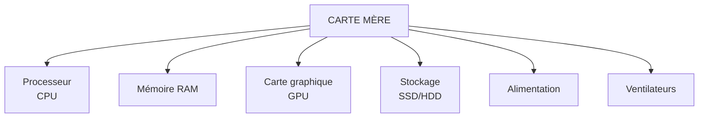

# Module 2 - Les composants matériels (Hardware)

!!! info "Objectifs du module"
    À la fin de ce module, tu sauras :

    - Identifier les composants internes d'un ordinateur
    - Connaître le rôle de chaque composant
    - Distinguer les périphériques d'entrée et de sortie
    - Comprendre comment tout est connecté

    **Durée estimée : 1-2 heures** | **Pré-requis : Module 1**

---

## Leçon 1 : À l'intérieur de l'ordinateur

### Hardware vs Software

!!! tip "Définitions"
    - **Hardware** (matériel) : tout ce qu'on peut **toucher** (composants physiques)
    - **Software** (logiciel) : tout ce qu'on ne peut **pas toucher** (programmes)

    *Astuce pour retenir : "Hard" = dur = physique*

### Les composants principaux

### Vue d'ensemble

!!! info "Les composants essentiels"
    | Composant | Rôle | Analogie |
    |-----------|------|----------|
    | **Carte mère** | Connecte tout | La colonne vertébrale |
    | **Processeur (CPU)** | Effectue les calculs | Le cerveau |
    | **RAM** | Mémoire de travail | Le bureau de travail |
    | **Stockage (SSD/HDD)** | Garde les données | L'armoire de rangement |
    | **Carte graphique (GPU)** | Affiche les images | L'artiste |
    | **Alimentation** | Fournit l'électricité | Le cœur |
    | **Boîtier** | Protège les composants | Le squelette |

---

## Exercices guidés - Leçon 1

### Exercice 1.1 : Hardware ou Software ?

!!! question "Classe ces éléments"
    a) Windows
    b) Clavier
    c) Minecraft
    d) Processeur
    e) Google Chrome
    f) Carte graphique

??? success "Correction"
    **Hardware** : b) Clavier, d) Processeur, f) Carte graphique

    **Software** : a) Windows, c) Minecraft, e) Google Chrome

---

## Leçon 2 : La carte mère

### Qu'est-ce que la carte mère ?

!!! info "Définition"
    La **carte mère** (motherboard) est le circuit imprimé principal qui :

    - Connecte tous les composants entre eux
    - Permet la communication entre les pièces
    - Distribue l'électricité

    C'est la "colonne vertébrale" de l'ordinateur !

### Les éléments de la carte mère

!!! tip "Ce qu'on trouve sur une carte mère"
    | Élément | Fonction |
    |---------|----------|
    | **Socket CPU** | Emplacement pour le processeur |
    | **Slots RAM** | Emplacements pour la mémoire |
    | **Slot PCIe** | Pour la carte graphique et extensions |
    | **Connecteurs SATA** | Pour les disques durs/SSD |
    | **Ports USB, HDMI...** | Connexions externes |
    | **BIOS/UEFI** | Programme de démarrage |
    | **Chipset** | Gère les communications |

### Le BIOS/UEFI

!!! info "Le premier programme"
    Le **BIOS** (ou UEFI sur les PC modernes) est un petit programme intégré à la carte mère qui :

    - S'exécute au démarrage de l'ordinateur
    - Vérifie que tous les composants fonctionnent
    - Lance le système d'exploitation

---

## Leçon 3 : L'alimentation

### Le bloc d'alimentation (PSU)

!!! info "Rôle"
    L'**alimentation** (Power Supply Unit) :

    - Convertit le courant électrique de la prise (220V) en courant utilisable par les composants (12V, 5V, 3.3V)
    - Fournit l'énergie à tous les composants
    - Se mesure en **Watts** (W)

### Choisir la bonne puissance

!!! tip "Puissance recommandée"
    | Type d'ordinateur | Puissance conseillée |
    |-------------------|---------------------|
    | Bureautique | 300-400 W |
    | Multimédia | 400-500 W |
    | Gaming | 550-750 W |
    | Haut de gamme | 750-1000+ W |

### Le refroidissement

!!! warning "Pourquoi refroidir ?"
    Les composants chauffent en fonctionnant. Trop de chaleur = panne !

    **Solutions de refroidissement :**

    - **Ventilateurs** : Poussent l'air frais / évacuent l'air chaud
    - **Ventirad** : Ventilateur + radiateur sur le processeur
    - **Watercooling** : Refroidissement par eau (plus efficace)
    - **Pâte thermique** : Aide à transférer la chaleur

---

## Exercices guidés - Leçon 3

### Exercice 3.1 : Vrai ou Faux

!!! question "Réponds"
    a) La carte mère connecte tous les composants.
    b) L'alimentation fournit du courant 220V aux composants.
    c) Un PC gaming a besoin de plus de watts qu'un PC bureautique.
    d) Le refroidissement n'est pas important.

??? success "Correction"
    a) **Vrai** - C'est son rôle principal
    b) **Faux** - Elle convertit en 12V, 5V, 3.3V
    c) **Vrai** - Les composants gaming consomment plus
    d) **Faux** - Sans refroidissement, les composants surchauffent et peuvent être endommagés

---

## Leçon 4 : Les périphériques

### Qu'est-ce qu'un périphérique ?

!!! info "Définition"
    Un **périphérique** est un appareil externe connecté à l'ordinateur.

    Il existe 3 types :

    - **Périphériques d'entrée** : envoient des données VERS l'ordinateur
    - **Périphériques de sortie** : reçoivent des données DEPUIS l'ordinateur
    - **Périphériques d'entrée/sortie** : font les deux

### Périphériques d'entrée

!!! tip "Exemples"
    | Périphérique | Fonction |
    |--------------|----------|
    | **Clavier** | Saisir du texte et des commandes |
    | **Souris** | Pointer et cliquer |
    | **Scanner** | Numériser des documents |
    | **Microphone** | Capter le son |
    | **Webcam** | Capter la vidéo |
    | **Manette de jeu** | Jouer aux jeux vidéo |

### Périphériques de sortie

!!! tip "Exemples"
    | Périphérique | Fonction |
    |--------------|----------|
    | **Écran (moniteur)** | Afficher l'image |
    | **Imprimante** | Imprimer sur papier |
    | **Haut-parleurs** | Diffuser le son |
    | **Casque audio** | Écouter le son |
    | **Vidéoprojecteur** | Projeter l'image |

### Périphériques d'entrée/sortie

!!! tip "Exemples"
    | Périphérique | Fonction |
    |--------------|----------|
    | **Écran tactile** | Afficher ET détecter le toucher |
    | **Casque VR** | Afficher ET détecter les mouvements |
    | **Clé USB** | Lire ET écrire des données |
    | **Disque dur externe** | Stocker ET récupérer des données |

### Les connecteurs

!!! info "Les types de ports"
    | Port | Utilisation | Image mentale |
    |------|-------------|---------------|
    | **USB** | Universel (clé, souris, clavier...) | Le plus courant |
    | **USB-C** | Nouveau standard, réversible | Petit et pratique |
    | **HDMI** | Vidéo + audio vers écran/TV | Pour l'image HD |
    | **DisplayPort** | Vidéo haute qualité | Pour les gamers |
    | **Jack 3.5mm** | Audio (casque, micro) | La prise ronde |
    | **Ethernet (RJ45)** | Internet par câble | Le câble réseau |

---

## Exercices guidés - Leçon 4

### Exercice 4.1 : Classer les périphériques

!!! question "Entrée, Sortie ou Entrée/Sortie ?"
    a) Imprimante
    b) Clavier
    c) Écran tactile
    d) Casque audio
    e) Scanner
    f) Clé USB

??? success "Correction"
    a) **Sortie** - L'ordinateur envoie des données à imprimer
    b) **Entrée** - Le clavier envoie des données à l'ordinateur
    c) **Entrée/Sortie** - Affiche (sortie) et détecte le toucher (entrée)
    d) **Sortie** - Reçoit le son de l'ordinateur
    e) **Entrée** - Envoie l'image numérisée à l'ordinateur
    f) **Entrée/Sortie** - On peut lire ET écrire dessus

### Exercice 4.2 : Quel port utiliser ?

!!! question "Associe le périphérique au port"
    a) Écran HD → ?
    b) Clé USB → ?
    c) Casque filaire → ?
    d) Connexion Internet filaire → ?

??? success "Correction"
    a) Écran HD → **HDMI** ou DisplayPort
    b) Clé USB → **USB**
    c) Casque filaire → **Jack 3.5mm**
    d) Internet filaire → **Ethernet (RJ45)**

---

## Leçon 5 : Monter un PC (théorie)

### L'ordre de montage

!!! tip "Étapes de montage d'un PC"
    1. **Installer le processeur** sur la carte mère
    2. **Mettre la pâte thermique** et le ventirad
    3. **Installer la RAM** dans les slots
    4. **Fixer la carte mère** dans le boîtier
    5. **Installer l'alimentation**
    6. **Connecter le stockage** (SSD/HDD)
    7. **Installer la carte graphique**
    8. **Brancher tous les câbles**
    9. **Fermer le boîtier** et tester

### Les précautions

!!! danger "Règles de sécurité"
    - **Éteindre et débrancher** l'ordinateur avant toute manipulation
    - **Se décharger de l'électricité statique** (toucher un objet métallique)
    - **Ne jamais forcer** une pièce qui ne s'emboîte pas
    - **Manipuler les composants par les bords** (ne pas toucher les circuits)
    - **Travailler sur une surface propre et non conductrice**

---

## Entraînement

### Série 1 : Les composants

1. Quel composant est surnommé "le cerveau" de l'ordinateur ?
2. À quoi sert la carte mère ?
3. Pourquoi faut-il refroidir un ordinateur ?

??? success "Corrections"
    1. Le **processeur (CPU)**
    2. Elle **connecte tous les composants** et permet leur communication
    3. Parce que les composants **chauffent** en fonctionnant, et une surchauffe peut les endommager

### Série 2 : Les périphériques

1. Cite 3 périphériques d'entrée.
2. Cite 2 périphériques de sortie.
3. Pourquoi l'écran tactile est-il un périphérique d'entrée/sortie ?

??? success "Corrections"
    1. Clavier, souris, scanner, microphone, webcam (3 au choix)
    2. Écran, imprimante, haut-parleurs, casque (2 au choix)
    3. Parce qu'il **affiche** des informations (sortie) et **détecte** le toucher (entrée)

### Série 3 : Les connecteurs

1. Quel port utilise-t-on généralement pour connecter un écran ?
2. Quel est l'avantage du port USB-C ?
3. À quoi sert le port Ethernet ?

??? success "Corrections"
    1. **HDMI** ou DisplayPort
    2. Il est **réversible** (on peut le brancher dans les deux sens) et très polyvalent
    3. À connecter l'ordinateur à **Internet par câble**

---

## Évaluation du module (sur 20)

**Q1.** Quelle est la différence entre hardware et software ? (2 pts)

**Q2.** Quel composant connecte tous les autres composants ? (1 pt)

**Q3.** Quel est le rôle de l'alimentation ? (2 pts)

**Q4.** Cite les 3 types de périphériques. (3 pts)

**Q5.** Le clavier est un périphérique de quel type ? (1 pt)

**Q6.** Cite 2 solutions de refroidissement. (2 pts)

**Q7.** À quoi sert le port HDMI ? (1 pt)

**Q8.** Pourquoi la clé USB est-elle un périphérique d'entrée/sortie ? (2 pts)

**Q9.** Qu'est-ce que le BIOS/UEFI ? (2 pts)

**Q10.** Cite 3 précautions à prendre avant de manipuler les composants. (4 pts)

??? success "Corrections"
    Q1. Hardware = parties physiques qu'on peut toucher / Software = programmes qu'on ne peut pas toucher
    Q2. La **carte mère**
    Q3. Convertir le courant électrique et fournir l'énergie aux composants
    Q4. Entrée, sortie, entrée/sortie
    Q5. **Entrée**
    Q6. Ventilateurs, ventirad, watercooling (2 au choix)
    Q7. Transmettre la vidéo (et l'audio) vers un écran ou une TV
    Q8. Parce qu'on peut lire des données (entrée) ET écrire des données (sortie) dessus
    Q9. Le premier programme qui s'exécute au démarrage, vérifie les composants et lance le système
    Q10. Éteindre/débrancher, se décharger de l'électricité statique, ne pas forcer, manipuler par les bords, travailler sur surface propre (3 au choix)

---

## Prochaine étape

!!! success "Bravo !"
    Tu connais maintenant les composants matériels d'un ordinateur !
    Dans le prochain module, on va approfondir le **processeur** et la **mémoire**.

[Module 3 - Le processeur et la mémoire](module-03-cpu-memoire.md){ .md-button .md-button--primary }

[Retour à l'index](index.md){ .md-button }
