# Module 2 - Les composants matériels (Hardware)

!!! info "Objectifs du module"
    À la fin de ce module, tu sauras :

    - Identifier les composants internes d'un ordinateur
    - Connaître le rôle de chaque composant
    - Distinguer les périphériques d'entrée et de sortie
    - Comprendre comment tout est connecté

    **Durée estimée : 1-2 heures** | **Pré-requis : Module 1**

---

## Leçon 1 : À l'intérieur de l'ordinateur

### Hardware vs Software

!!! tip "Définitions"
    - **Hardware** (matériel) : tout ce qu'on peut **toucher** (composants physiques)
    - **Software** (logiciel) : tout ce qu'on ne peut **pas toucher** (programmes)

    *Astuce pour retenir : "Hard" = dur = physique*

### Les composants principaux

```mermaid
graph TD
    CM[CARTE MÈRE] --> CPU[Processeur<br>CPU]
    CM --> RAM[Mémoire RAM]
    CM --> GPU[Carte graphique<br>GPU]
    CM --> STO[Stockage<br>SSD/HDD]
    CM --> ALI[Alimentation]
    CM --> VENT[Ventilateurs]
```



### Vue d'ensemble

!!! info "Les composants essentiels"
    | Composant | Rôle | Analogie |
    |-----------|------|----------|
    | **Carte mère** | Connecte tout | La colonne vertébrale |
    | **Processeur (CPU)** | Effectue les calculs | Le cerveau |
    | **RAM** | Mémoire de travail | Le bureau de travail |
    | **Stockage (SSD/HDD)** | Garde les données | L'armoire de rangement |
    | **Carte graphique (GPU)** | Affiche les images | L'artiste |
    | **Alimentation** | Fournit l'électricité | Le cœur |
    | **Boîtier** | Protège les composants | Le squelette |

!!! tip "L'ordinateur, c'est comme un corps humain ! 🧑"
    { loading=lazy }

---

## Exercices guidés - Leçon 1

### Exercice 1.1 : Hardware ou Software ?

!!! question "Classe ces éléments"
    a) Windows
    b) Clavier
    c) Minecraft
    d) Processeur
    e) Google Chrome
    f) Carte graphique

??? success "Correction"
    **Hardware** : b) Clavier, d) Processeur, f) Carte graphique

    **Software** : a) Windows, c) Minecraft, e) Google Chrome

---

## Leçon 2 : La carte mère

### Qu'est-ce que la carte mère ?

!!! info "Définition"
    La **carte mère** (motherboard) est le circuit imprimé principal qui :

    - Connecte tous les composants entre eux
    - Permet la communication entre les pièces
    - Distribue l'électricité

    C'est la "colonne vertébrale" de l'ordinateur !

!!! example "Schéma simplifié d'une carte mère 🔌"
    { loading=lazy }

### Les éléments de la carte mère

!!! tip "Ce qu'on trouve sur une carte mère"
    | Élément | Fonction |
    |---------|----------|
    | **Socket CPU** | Emplacement pour le processeur |
    | **Slots RAM** | Emplacements pour la mémoire |
    | **Slot PCIe** | Pour la carte graphique et extensions |
    | **Connecteurs SATA** | Pour les disques durs/SSD |
    | **Ports USB, HDMI...** | Connexions externes |
    | **BIOS/UEFI** | Programme de démarrage |
    | **Chipset** | Gère les communications |

### Le BIOS/UEFI

!!! info "Le premier programme"
    Le **BIOS** (ou UEFI sur les PC modernes) est un petit programme intégré à la carte mère qui :

    - S'exécute au démarrage de l'ordinateur
    - Vérifie que tous les composants fonctionnent
    - Lance le système d'exploitation

---

## Leçon 3 : L'alimentation

### Le bloc d'alimentation (PSU)

!!! info "Rôle"
    L'**alimentation** (Power Supply Unit) :

    - Convertit le courant électrique de la prise (220V) en courant utilisable par les composants (12V, 5V, 3.3V)
    - Fournit l'énergie à tous les composants
    - Se mesure en **Watts** (W)

### Choisir la bonne puissance

!!! tip "Puissance recommandée"
    | Type d'ordinateur | Puissance conseillée |
    |-------------------|---------------------|
    | Bureautique | 300-400 W |
    | Multimédia | 400-500 W |
    | Gaming | 550-750 W |
    | Haut de gamme | 750-1000+ W |

### Le refroidissement

!!! warning "Pourquoi refroidir ?"
    Les composants chauffent en fonctionnant. Trop de chaleur = panne !

    **Solutions de refroidissement :**

    - **Ventilateurs** : Poussent l'air frais / évacuent l'air chaud
    - **Ventirad** : Ventilateur + radiateur sur le processeur
    - **Watercooling** : Refroidissement par eau (plus efficace)
    - **Pâte thermique** : Aide à transférer la chaleur

!!! example "🎮 Pourquoi ton PC ou ta PS5 fait du bruit quand tu joues ?"
    Tu as peut-être remarqué que quand tu joues à un jeu vidéo gourmand (comme Forza Horizon 5 ou Hogwarts Legacy), ton ordinateur ou ta console fait plus de bruit...

    **C'est normal !** Voici ce qui se passe :

    1. Le jeu demande beaucoup de calculs → le processeur travaille à fond
    2. Le processeur qui travaille → il chauffe (comme toi quand tu cours !)
    3. Le processeur chauffe → les ventilateurs tournent plus vite pour le refroidir
    4. Les ventilateurs tournent vite → ça fait du bruit !

    **C'est pour ça que :**

    - Ta PS5 souffle fort pendant les jeux
    - Ton PC portable chauffe sur tes genoux
    - Les streamers ont des PC avec plein de ventilateurs LED !

!!! example "💡 L'alimentation, c'est comme une multiprise intelligente !"
    Chez toi, la prise murale fournit du 220V. Mais ton téléphone, lui, a besoin de seulement 5V pour charger.

    **C'est pareil pour l'ordinateur :**

    - La prise murale : **220V** (trop puissant !)
    - Le processeur a besoin de : **12V**
    - La RAM a besoin de : **3.3V**
    - Les ventilateurs : **5V ou 12V**

    L'alimentation transforme le courant pour que chaque composant reçoive exactement ce qu'il lui faut. Sans elle, tout grillerait comme un toast resté trop longtemps dans le grille-pain ! 🍞💥

---

## Exercices guidés - Leçon 3

### Exercice 3.1 : Vrai ou Faux

!!! question "Réponds"
    a) La carte mère connecte tous les composants.
    b) L'alimentation fournit du courant 220V aux composants.
    c) Un PC gaming a besoin de plus de watts qu'un PC bureautique.
    d) Le refroidissement n'est pas important.

??? success "Correction"
    a) **Vrai** - C'est son rôle principal
    b) **Faux** - Elle convertit en 12V, 5V, 3.3V
    c) **Vrai** - Les composants gaming consomment plus
    d) **Faux** - Sans refroidissement, les composants surchauffent et peuvent être endommagés

---

## Leçon 4 : Les périphériques

### Qu'est-ce qu'un périphérique ?

!!! info "Définition"
    Un **périphérique** est un appareil externe connecté à l'ordinateur.

    Il existe 3 types :

    - **Périphériques d'entrée** : envoient des données VERS l'ordinateur
    - **Périphériques de sortie** : reçoivent des données DEPUIS l'ordinateur
    - **Périphériques d'entrée/sortie** : font les deux

!!! example "Visualise les flux de données ! 🔄"
    ```
    ENTRÉE (vers l'ordi)           SORTIE (depuis l'ordi)
    ─────────────────────          ─────────────────────
          ⌨️ Clavier ──────┐    ┌────── 🖥️ Écran
          🖱️ Souris ───────┤    │
          🎤 Micro ────────┼──▶ 💻 ──▶├────── 🔊 Haut-parleurs
          📷 Webcam ───────┤    │      │
          🎮 Manette ──────┘    └────── 🖨️ Imprimante


    ENTRÉE/SORTIE (les deux sens)
    ─────────────────────────────
          💾 Clé USB ◀──────▶ 💻
          🖥️ Écran tactile ◀──▶ 💻
    ```

### Périphériques d'entrée

!!! tip "Exemples"
    | Périphérique | Fonction |
    |--------------|----------|
    | **Clavier** | Saisir du texte et des commandes |
    | **Souris** | Pointer et cliquer |
    | **Scanner** | Numériser des documents |
    | **Microphone** | Capter le son |
    | **Webcam** | Capter la vidéo |
    | **Manette de jeu** | Jouer aux jeux vidéo |

!!! example "🎮 Quand tu joues à Forza avec une manette..."
    Imagine : tu appuies sur le bouton pour accélérer dans Forza Horizon 5.

    **Voici le voyage de ton appui de bouton :**

    1. **Ton doigt** appuie sur le bouton de saut 🕹️
    2. **La manette** détecte l'appui et envoie un signal électrique
    3. **Le câble USB** (ou le Bluetooth) transporte ce signal vers le PC/console
    4. **Le processeur** reçoit le signal et calcule : "OK, le joueur veut sauter"
    5. **Le jeu** fait sauter ton personnage
    6. **L'écran** affiche le saut (sortie !)
    7. **Les haut-parleurs** jouent le son du saut (sortie aussi !)

    Tout ça en moins de **0,01 seconde** ! C'est pour ça que tu as l'impression que c'est instantané.

### Périphériques de sortie

!!! tip "Exemples"
    | Périphérique | Fonction |
    |--------------|----------|
    | **Écran (moniteur)** | Afficher l'image |
    | **Imprimante** | Imprimer sur papier |
    | **Haut-parleurs** | Diffuser le son |
    | **Casque audio** | Écouter le son |
    | **Vidéoprojecteur** | Projeter l'image |

### Périphériques d'entrée/sortie

!!! tip "Exemples"
    | Périphérique | Fonction |
    |--------------|----------|
    | **Écran tactile** | Afficher ET détecter le toucher |
    | **Casque VR** | Afficher ET détecter les mouvements |
    | **Clé USB** | Lire ET écrire des données |
    | **Disque dur externe** | Stocker ET récupérer des données |

### Les connecteurs

!!! info "Les types de ports"
    | Port | Utilisation | Image mentale |
    |------|-------------|---------------|
    | **USB** | Universel (clé, souris, clavier...) | Le plus courant |
    | **USB-C** | Nouveau standard, réversible | Petit et pratique |
    | **HDMI** | Vidéo + audio vers écran/TV | Pour l'image HD |
    | **DisplayPort** | Vidéo haute qualité | Pour les gamers |
    | **Jack 3.5mm** | Audio (casque, micro) | La prise ronde |
    | **Ethernet (RJ45)** | Internet par câble | Le câble réseau |

!!! example "Reconnais les ports ! 🔌"
    ```
    À L'ARRIÈRE DE L'ORDINATEUR (ou sur le côté du portable)
    ═══════════════════════════════════════════════════════

    ┌─────┐  USB-A (classique)     ┌───┐  USB-C (réversible)
    │     │  Le rectangle qu'on    │   │  Petit, ovale, moderne
    └─────┘  met toujours à        └───┘  (comme sur les téléphones)
             l'envers du 1er coup 😅

    ┌─────────┐  HDMI               ┌─────────┐  DisplayPort
    │  ╲   ╱  │  Trapèze pour       │ ╲     ╱ │  Comme HDMI mais
    └─────────┘  la vidéo HD        └─────────┘  avec un coin coupé

    ⚪  Jack 3.5mm                  ┌───────┐  Ethernet (RJ45)
       Rond, pour le casque         │ ║║║║║ │  Gros, pour Internet
       ou le micro                  └───────┘  par câble
    ```

---

## Exercices guidés - Leçon 4

### Exercice 4.1 : Classer les périphériques

!!! question "Entrée, Sortie ou Entrée/Sortie ?"
    a) Imprimante
    b) Clavier
    c) Écran tactile
    d) Casque audio
    e) Scanner
    f) Clé USB

??? success "Correction"
    a) **Sortie** - L'ordinateur envoie des données à imprimer
    b) **Entrée** - Le clavier envoie des données à l'ordinateur
    c) **Entrée/Sortie** - Affiche (sortie) et détecte le toucher (entrée)
    d) **Sortie** - Reçoit le son de l'ordinateur
    e) **Entrée** - Envoie l'image numérisée à l'ordinateur
    f) **Entrée/Sortie** - On peut lire ET écrire dessus

### Exercice 4.2 : Quel port utiliser ?

!!! question "Associe le périphérique au port"
    a) Écran HD → ?
    b) Clé USB → ?
    c) Casque filaire → ?
    d) Connexion Internet filaire → ?

??? success "Correction"
    a) Écran HD → **HDMI** ou DisplayPort
    b) Clé USB → **USB**
    c) Casque filaire → **Jack 3.5mm**
    d) Internet filaire → **Ethernet (RJ45)**

---

## Leçon 5 : Monter un PC (théorie)

### L'ordre de montage

!!! tip "Étapes de montage d'un PC"
    1. **Installer le processeur** sur la carte mère
    2. **Mettre la pâte thermique** et le ventirad
    3. **Installer la RAM** dans les slots
    4. **Fixer la carte mère** dans le boîtier
    5. **Installer l'alimentation**
    6. **Connecter le stockage** (SSD/HDD)
    7. **Installer la carte graphique**
    8. **Brancher tous les câbles**
    9. **Fermer le boîtier** et tester

### Les précautions

!!! danger "Règles de sécurité"
    - **Éteindre et débrancher** l'ordinateur avant toute manipulation
    - **Se décharger de l'électricité statique** (toucher un objet métallique)
    - **Ne jamais forcer** une pièce qui ne s'emboîte pas
    - **Manipuler les composants par les bords** (ne pas toucher les circuits)
    - **Travailler sur une surface propre et non conductrice**

---

## Entraînement

### Série 1 : Les composants

1. Quel composant est surnommé "le cerveau" de l'ordinateur ?
2. À quoi sert la carte mère ?
3. Pourquoi faut-il refroidir un ordinateur ?

??? success "Corrections"
    1. Le **processeur (CPU)**
    2. Elle **connecte tous les composants** et permet leur communication
    3. Parce que les composants **chauffent** en fonctionnant, et une surchauffe peut les endommager

### Série 2 : Les périphériques

1. Cite 3 périphériques d'entrée.
2. Cite 2 périphériques de sortie.
3. Pourquoi l'écran tactile est-il un périphérique d'entrée/sortie ?

??? success "Corrections"
    1. Clavier, souris, scanner, microphone, webcam (3 au choix)
    2. Écran, imprimante, haut-parleurs, casque (2 au choix)
    3. Parce qu'il **affiche** des informations (sortie) et **détecte** le toucher (entrée)

### Série 3 : Les connecteurs

1. Quel port utilise-t-on généralement pour connecter un écran ?
2. Quel est l'avantage du port USB-C ?
3. À quoi sert le port Ethernet ?

??? success "Corrections"
    1. **HDMI** ou DisplayPort
    2. Il est **réversible** (on peut le brancher dans les deux sens) et très polyvalent
    3. À connecter l'ordinateur à **Internet par câble**

---

## Évaluation du module (sur 20)

**Q1.** Quelle est la différence entre hardware et software ? (2 pts)

**Q2.** Quel composant connecte tous les autres composants ? (1 pt)

**Q3.** Quel est le rôle de l'alimentation ? (2 pts)

**Q4.** Cite les 3 types de périphériques. (3 pts)

**Q5.** Le clavier est un périphérique de quel type ? (1 pt)

**Q6.** Cite 2 solutions de refroidissement. (2 pts)

**Q7.** À quoi sert le port HDMI ? (1 pt)

**Q8.** Pourquoi la clé USB est-elle un périphérique d'entrée/sortie ? (2 pts)

**Q9.** Qu'est-ce que le BIOS/UEFI ? (2 pts)

**Q10.** Cite 3 précautions à prendre avant de manipuler les composants. (4 pts)

??? success "Corrections"
    Q1. Hardware = parties physiques qu'on peut toucher / Software = programmes qu'on ne peut pas toucher
    Q2. La **carte mère**
    Q3. Convertir le courant électrique et fournir l'énergie aux composants
    Q4. Entrée, sortie, entrée/sortie
    Q5. **Entrée**
    Q6. Ventilateurs, ventirad, watercooling (2 au choix)
    Q7. Transmettre la vidéo (et l'audio) vers un écran ou une TV
    Q8. Parce qu'on peut lire des données (entrée) ET écrire des données (sortie) dessus
    Q9. Le premier programme qui s'exécute au démarrage, vérifie les composants et lance le système
    Q10. Éteindre/débrancher, se décharger de l'électricité statique, ne pas forcer, manipuler par les bords, travailler sur surface propre (3 au choix)

---

## Prochaine étape

!!! success "Bravo !"
    Tu connais maintenant les composants matériels d'un ordinateur !
    Dans le prochain module, on va approfondir le **processeur** et la **mémoire**.

[Module 3 - Le processeur et la mémoire](module-03-cpu-memoire.md){ .md-button .md-button--primary }

[Retour à l'index](index.md){ .md-button }
