# Module 5 - Le système d'exploitation

!!! info "Objectifs du module"
    À la fin de ce module, tu sauras :

    - Comprendre le rôle d'un système d'exploitation
    - Connaître les principaux systèmes (Windows, macOS, Linux)
    - Utiliser le bureau et les fenêtres
    - Comprendre les systèmes mobiles (Android, iOS)

    **Durée estimée : 1-2 heures** | **Pré-requis : Module 4**

---

## Leçon 1 : Qu'est-ce qu'un système d'exploitation ?

### Définition

!!! tip "Le système d'exploitation (OS)"
    Le **système d'exploitation** (OS = Operating System) est le programme principal qui :

    - **Gère** tous les composants de l'ordinateur
    - **Fait le lien** entre toi et la machine
    - **Permet** aux logiciels de fonctionner
    - **Organise** les fichiers et la mémoire

    C'est le **chef d'orchestre** de l'ordinateur !

!!! example "L'OS, c'est comme un chef d'orchestre ! 🎼"
    ```
    Sans le CHEF D'ORCHESTRE,             Avec le CHEF D'ORCHESTRE,
    chacun joue n'importe quoi !          tout est harmonieux !

    🎺 Tut tuuut !                         🎼 Le chef coordonne :
    🎻 Scriiii !        = 😵 CHAOS !           🎺 "Toi, joue maintenant"
    🥁 Boum boum !                             🎻 "Toi, attends"
    🎹 Plink plink !                           🥁 "Toi, doucement"

    ┌─────────────────────────────────────────────────────────────┐
    │                                                             │
    │      SYSTÈME D'EXPLOITATION = CHEF D'ORCHESTRE              │
    │                                                             │
    │                        🎩                                   │
    │                       /|\\                                   │
    │                      / | \\                                   │
    │            ┌────────┴─┴─┴────────┐                          │
    │            │                      │                          │
    │    ┌───────▼──────┐      ┌───────▼──────┐                   │
    │    │  🎺 CPU      │      │  🎻 RAM      │                   │
    │    │  (calculs)   │      │  (mémoire)   │                   │
    │    └──────────────┘      └──────────────┘                   │
    │            │                      │                          │
    │    ┌───────▼──────┐      ┌───────▼──────┐                   │
    │    │  🥁 Disque   │      │  🎹 Écran    │                   │
    │    │  (stockage)  │      │  (affichage) │                   │
    │    └──────────────┘      └──────────────┘                   │
    │                                                             │
    │      L'OS coordonne TOUT pour que ça fonctionne !          │
    └─────────────────────────────────────────────────────────────┘
    ```

### Sans système d'exploitation...

!!! warning "Impossible d'utiliser l'ordinateur !"
    Sans OS, tu verrais juste un écran noir.
    Le système d'exploitation est **indispensable** pour :

    - Afficher le bureau et les fenêtres
    - Utiliser la souris et le clavier
    - Lancer des programmes
    - Gérer les fichiers

### Les rôles de l'OS

```mermaid
graph TD
    OS[SYSTÈME D'EXPLOITATION]
    OS --> A[Gestion du processeur]
    OS --> B[Gestion de la mémoire]
    OS --> C[Gestion des fichiers]
    OS --> D[Gestion des périphériques]
    OS --> E[Interface utilisateur]
    OS --> F[Sécurité]
```



!!! info "Détail des rôles"
    | Rôle | Description |
    |------|-------------|
    | **Gestion du processeur** | Répartit le temps de calcul entre les programmes |
    | **Gestion de la mémoire** | Distribue la RAM aux applications |
    | **Gestion des fichiers** | Organise le stockage sur le disque |
    | **Gestion des périphériques** | Communique avec clavier, souris, imprimante... |
    | **Interface utilisateur** | Affiche le bureau, les fenêtres, les icônes |
    | **Sécurité** | Protège contre les virus, gère les mots de passe |

---

## Exercices guidés - Leçon 1

### Exercice 1.1 : Vrai ou Faux

!!! question "Réponds"
    a) Un ordinateur peut fonctionner sans système d'exploitation.
    b) L'OS gère la communication avec les périphériques.
    c) Windows est un système d'exploitation.
    d) Le système d'exploitation ne sert qu'à afficher le bureau.

??? success "Correction"
    a) **Faux** - L'OS est indispensable
    b) **Vrai** - C'est une de ses fonctions
    c) **Vrai** - C'est le plus répandu sur PC
    d) **Faux** - Il a de nombreux rôles (mémoire, fichiers, sécurité...)

---

## Leçon 2 : Les principaux systèmes d'exploitation

### Windows

!!! info "Microsoft Windows"
    - **Créateur** : Microsoft (Bill Gates)
    - **Première version** : 1985
    - **Version actuelle** : Windows 11
    - **Part de marché PC** : ~75%

    **Points forts** :

    - Le plus répandu sur PC
    - Compatible avec la plupart des logiciels et jeux
    - Facile à utiliser

### macOS

!!! info "Apple macOS"
    - **Créateur** : Apple (Steve Jobs)
    - **Première version** : 2001 (Mac OS X)
    - **Version actuelle** : macOS Sonoma
    - **Exclusif** aux Mac (ordinateurs Apple)

    **Points forts** :

    - Design élégant
    - Très stable
    - Bien intégré avec iPhone/iPad

### Linux

!!! info "Linux"
    - **Créateur** : Linus Torvalds
    - **Première version** : 1991
    - **Particularité** : **Open source** (gratuit et modifiable)
    - **Distributions** : Ubuntu, Debian, Fedora, Mint...

    **Points forts** :

    - Gratuit
    - Très sécurisé
    - Personnalisable
    - Utilisé sur les serveurs et superordinateurs

### Comparatif

!!! tip "Tableau comparatif"
    | Critère | Windows | macOS | Linux |
    |---------|:-------:|:-----:|:-----:|
    | **Prix** | Payant | Inclus avec Mac | Gratuit |
    | **Matériel** | Tout PC | Mac uniquement | Tout PC |
    | **Jeux vidéo** | ⭐⭐⭐⭐⭐ | ⭐⭐ | ⭐⭐ |
    | **Bureautique** | ⭐⭐⭐⭐⭐ | ⭐⭐⭐⭐ | ⭐⭐⭐⭐ |
    | **Personnalisation** | ⭐⭐⭐ | ⭐⭐ | ⭐⭐⭐⭐⭐ |
    | **Sécurité** | ⭐⭐⭐ | ⭐⭐⭐⭐ | ⭐⭐⭐⭐⭐ |

!!! example "Les 3 OS en image 🖥️"
    ```
    ╔═══════════════════════════════════════════════════════════════╗
    ║                  LES 3 SYSTÈMES D'EXPLOITATION                ║
    ╠═══════════════════════════════════════════════════════════════╣
    ║                                                               ║
    ║   🪟 WINDOWS              🍎 macOS              🐧 LINUX      ║
    ║   ┌─────────────┐        ┌─────────────┐      ┌─────────────┐ ║
    ║   │ ┌───┬───┐   │        │  ○ ○ ○      │      │ $ _         │ ║
    ║   │ │   │   │   │        │ ┌─────────┐ │      │ Terminal    │ ║
    ║   │ ├───┼───┤   │        │ │  Dock   │ │      │ ou Bureau   │ ║
    ║   │ │   │   │   │        │ └─────────┘ │      │ graphique   │ ║
    ║   │ └───┴───┘   │        └─────────────┘      └─────────────┘ ║
    ║   └─────────────┘                                             ║
    ║                                                               ║
    ║   75% des PC         Macs uniquement         Serveurs, geeks  ║
    ║   Jeux, bureau         Design, créatifs        Gratuit, libre ║
    ║                                                               ║
    ╚═══════════════════════════════════════════════════════════════╝
    ```

---

## Exercices guidés - Leçon 2

### Exercice 2.1 : Associer

!!! question "Quel OS pour quelle situation ?"
    a) Je veux jouer aux derniers jeux vidéo sur PC.
    b) J'ai un budget limité et je veux un OS gratuit.
    c) J'ai acheté un MacBook.
    d) Je veux le système le plus répandu.

??? success "Correction"
    a) **Windows** - Le plus compatible avec les jeux
    b) **Linux** - Gratuit et open source
    c) **macOS** - C'est le système des Mac
    d) **Windows** - ~75% de part de marché

---

## Leçon 3 : Les systèmes mobiles

### Android

!!! info "Google Android"
    - **Créateur** : Google
    - **Basé sur** : Linux
    - **Utilisé par** : Samsung, Xiaomi, Huawei, OnePlus...
    - **Part de marché** : ~70% des smartphones

    **Points forts** :

    - Très personnalisable
    - Large choix d'appareils (tous les prix)
    - Magasin d'apps : **Google Play Store**

### iOS

!!! info "Apple iOS"
    - **Créateur** : Apple
    - **Utilisé par** : iPhone, iPad
    - **Part de marché** : ~28% des smartphones

    **Points forts** :

    - Très fluide et stable
    - Mises à jour longtemps
    - Bien intégré avec Mac
    - Magasin d'apps : **App Store**

### Comparatif mobile

!!! tip "Android vs iOS"
    | Critère | Android | iOS |
    |---------|:-------:|:---:|
    | **Prix des appareils** | Varié (entrée de gamme à premium) | Premium uniquement |
    | **Personnalisation** | ⭐⭐⭐⭐⭐ | ⭐⭐ |
    | **Mises à jour** | 2-3 ans | 5-6 ans |
    | **Sécurité** | ⭐⭐⭐ | ⭐⭐⭐⭐⭐ |
    | **Choix d'apps** | ⭐⭐⭐⭐⭐ | ⭐⭐⭐⭐⭐ |

---

## Leçon 4 : L'interface utilisateur

### Le bureau (Desktop)

!!! info "Éléments du bureau"
    | Élément | Description |
    |---------|-------------|
    | **Fond d'écran** | L'image de fond |
    | **Icônes** | Raccourcis vers fichiers et programmes |
    | **Barre des tâches** | En bas, avec les programmes ouverts |
    | **Menu Démarrer** | Accès à tous les programmes (Windows) |
    | **Zone de notification** | En bas à droite (heure, Wi-Fi, batterie) |

### Les fenêtres

!!! tip "Anatomie d'une fenêtre"
    | Élément | Fonction |
    |---------|----------|
    | **Barre de titre** | Nom du programme/fichier |
    | **Bouton Réduire** (—) | Cache la fenêtre dans la barre des tâches |
    | **Bouton Agrandir** (□) | Passe en plein écran |
    | **Bouton Fermer** (×) | Ferme la fenêtre |
    | **Bordures** | Pour redimensionner la fenêtre |

### Raccourcis clavier essentiels

!!! danger "À retenir absolument !"
    | Raccourci | Action |
    |-----------|--------|
    | **Ctrl + C** | Copier |
    | **Ctrl + V** | Coller |
    | **Ctrl + X** | Couper |
    | **Ctrl + Z** | Annuler |
    | **Ctrl + S** | Sauvegarder |
    | **Ctrl + A** | Tout sélectionner |
    | **Alt + Tab** | Changer de fenêtre |
    | **Alt + F4** | Fermer la fenêtre/programme |
    | **Windows + E** | Ouvrir l'explorateur de fichiers |
    | **Windows + L** | Verrouiller l'ordinateur |

### Le multitâche

!!! info "Plusieurs programmes en même temps"
    Le système d'exploitation permet d'exécuter **plusieurs programmes** à la fois :

    - Écouter de la musique **et** faire ses devoirs
    - Naviguer sur Internet **et** discuter sur une messagerie
    - Regarder une vidéo **et** prendre des notes

    C'est le **multitâche** !

!!! example "Le multitâche, c'est comme un jongleur ! 🤹"
    ```
    SANS multitâche :                  AVEC multitâche :
    Une chose à la fois               Plusieurs choses en même temps !

    D'abord musique...                      🤹 L'OS jongle !
    puis navigateur...                 ┌─────────────────────┐
    puis messagerie...                 │   🎵    🌐    💬    │
    = TRÈS LENT !                      │   ↓     ↓     ↓    │
                                       │ Musique Web  Chat  │
                                       │                    │
    ┌─────────────────┐                │  Tout en même      │
    │  🎵 Attends...  │                │    temps !         │
    │  🌐 Attends...  │                └─────────────────────┘
    │  💬 Attends...  │
    └─────────────────┘                L'OS donne un peu de temps
                                       à chaque programme, si vite
                                       qu'on a l'impression que
                                       tout tourne ensemble !
    ```

---

## Exercices guidés - Leçon 4

### Exercice 4.1 : Raccourcis

!!! question "Quel raccourci pour..."
    a) Copier du texte ?
    b) Annuler la dernière action ?
    c) Sauvegarder un fichier ?
    d) Fermer une fenêtre ?

??? success "Correction"
    a) **Ctrl + C**
    b) **Ctrl + Z**
    c) **Ctrl + S**
    d) **Alt + F4** (ou cliquer sur ×)

---

## Leçon 5 : Les mises à jour

### Pourquoi mettre à jour ?

!!! warning "Les mises à jour sont importantes !"
    Les mises à jour servent à :

    1. **Corriger les bugs** (erreurs dans le programme)
    2. **Combler les failles de sécurité** (contre les virus)
    3. **Ajouter de nouvelles fonctionnalités**
    4. **Améliorer les performances**

### Types de mises à jour

!!! info "Différents types"
    | Type | Fréquence | Contenu |
    |------|-----------|---------|
    | **Mises à jour de sécurité** | Régulier | Corrections urgentes |
    | **Mises à jour fonctionnelles** | Mensuel | Nouvelles fonctions |
    | **Mises à jour majeures** | Annuel | Nouvelle version |

### Bonnes pratiques

!!! tip "Conseils"
    - **Active** les mises à jour automatiques
    - **Redémarre** quand c'est demandé
    - **Sauvegarde** avant une mise à jour majeure
    - **Ne repousse pas** trop longtemps les mises à jour de sécurité

---

## Entraînement

### Série 1 : Définitions

1. Qu'est-ce qu'un système d'exploitation ?
2. Cite 3 rôles du système d'exploitation.
3. Que se passe-t-il si on démarre un PC sans OS ?

??? success "Corrections"
    1. Le programme principal qui gère l'ordinateur et fait le lien avec l'utilisateur
    2. Gestion du processeur, de la mémoire, des fichiers, des périphériques, interface utilisateur, sécurité (3 au choix)
    3. Écran noir, impossible d'utiliser l'ordinateur

### Série 2 : Les OS

1. Quel est le système le plus répandu sur PC ?
2. Quel système est gratuit et open source ?
3. Quel système est exclusif aux ordinateurs Apple ?

??? success "Corrections"
    1. **Windows**
    2. **Linux**
    3. **macOS**

### Série 3 : Interface et raccourcis

1. À quoi sert Ctrl + Z ?
2. Comment passer une fenêtre en plein écran ?
3. Que permet le multitâche ?

??? success "Corrections"
    1. Annuler la dernière action
    2. Cliquer sur le bouton Agrandir (□) ou double-cliquer sur la barre de titre
    3. Exécuter plusieurs programmes en même temps

---

## Évaluation du module (sur 20)

**Q1.** Qu'est-ce qu'un système d'exploitation et à quoi sert-il ? (3 pts)

**Q2.** Cite les 3 principaux systèmes d'exploitation pour PC. (3 pts)

**Q3.** Quel système est le plus utilisé pour les jeux vidéo sur PC ? (1 pt)

**Q4.** Qu'est-ce que Linux a de particulier par rapport à Windows ? (2 pts)

**Q5.** Cite les 2 systèmes d'exploitation pour smartphones. (2 pts)

**Q6.** Que font ces raccourcis : Ctrl+C, Ctrl+V, Ctrl+Z ? (3 pts)

**Q7.** Qu'est-ce que le multitâche ? (2 pts)

**Q8.** Pourquoi les mises à jour sont-elles importantes ? (2 pts)

**Q9.** Cite 3 éléments visibles sur le bureau Windows. (2 pts)

??? success "Corrections"
    Q1. Programme principal qui gère l'ordinateur (processeur, mémoire, fichiers, périphériques) et permet à l'utilisateur de l'utiliser
    Q2. Windows, macOS, Linux
    Q3. Windows
    Q4. Linux est gratuit et open source (code modifiable par tous)
    Q5. Android (Google) et iOS (Apple)
    Q6. Ctrl+C = copier, Ctrl+V = coller, Ctrl+Z = annuler
    Q7. La capacité d'exécuter plusieurs programmes en même temps
    Q8. Corriger les bugs, combler les failles de sécurité, ajouter des fonctionnalités
    Q9. Fond d'écran, icônes, barre des tâches, menu Démarrer, zone de notification (3 au choix)

---

## Prochaine étape

!!! success "Bravo !"
    Tu comprends maintenant le rôle du système d'exploitation !
    Dans le prochain module, on va apprendre à **organiser les fichiers et dossiers**.

[Module 6 - Les fichiers et dossiers](module-06-fichiers.md){ .md-button .md-button--primary }

[Retour à l'index](index.md){ .md-button }
