# Formation Maths 6ème

!!! success "Bienvenue dans ta formation !"
    Cette formation est conçue pour t'accompagner tout au long de l'année de 6ème en mathématiques. Elle est divisée en **10 modules progressifs** à suivre dans l'ordre.

---

## Comment utiliser cette formation ?

### Le parcours

```mermaid
graph LR
    M0[Module 0<br>Test initial] --> M1[Module 1<br>Nombres entiers]
    M1 --> M2[Module 2<br>Opérations]
    M2 --> M3[Module 3<br>Décimaux]
    M3 --> M4[Module 4<br>Fractions]
    M4 --> M5[Module 5<br>Proportionnalité]
    M5 --> M6[Module 6<br>Géométrie]
    M6 --> M7[Module 7<br>Périmètres & Aires]
    M7 --> M8[Module 8<br>Symétrie]
    M8 --> M9[Module 9<br>Grandeurs & Mesures]
    M9 --> M10[Module 10<br>Problèmes]
```

### Durée estimée

| Module | Durée conseillée |
|--------|:----------------:|
| Module 0 | 30 min |
| Modules 1-10 | 2-3 heures chacun |
| **Total** | ~25-30 heures |

!!! tip "Conseil"
    Travaille **20-30 minutes par jour** plutôt que plusieurs heures d'un coup. C'est plus efficace !

### Structure de chaque module

Chaque module contient :

| Section | Contenu |
|---------|---------|
| 🎯 **Objectifs** | Ce que tu vas apprendre |
| 📚 **Leçon** | Explications claires avec exemples |
| ✏️ **Exercices guidés** | Exercices avec aide pas à pas |
| 🏋️ **Entraînement** | Exercices à faire seul |
| 🏆 **Évaluation** | Quiz pour valider le module |
| 🎮 **Bonus** | Défis et jeux |

### Système de progression

| Symbole | Signification |
|:-------:|---------------|
| ⬜ | Pas encore commencé |
| 🟡 | En cours |
| ✅ | Validé |
| ⭐ | Maîtrisé (bonus réussi) |

---

## Les 10 modules

### 📊 Module 0 - Point de départ
> Test de positionnement pour identifier tes points forts et axes de travail

[➡️ Commencer le Module 0](module-00-depart.md){ .md-button .md-button--primary }

---

### 🔢 Module 1 - Les nombres entiers
> Révisions CM2 : lire, écrire, comparer et ordonner les grands nombres

| Compétences | Pré-requis |
|-------------|------------|
| Lire et écrire les grands nombres | Aucun |
| Comparer et ranger | Aucun |
| Repérage sur une droite | Aucun |

[➡️ Accéder au Module 1](module-01-entiers.md){ .md-button }

---

### ➕ Module 2 - Les quatre opérations
> Addition, soustraction, multiplication et division posées

| Compétences | Pré-requis |
|-------------|------------|
| Additions et soustractions posées | Module 1 |
| Multiplications posées | Module 1 |
| Divisions euclidiennes | Module 1 |
| Tables de multiplication | — |

[➡️ Accéder au Module 2](module-02-operations.md){ .md-button }

---

### 🔵 Module 3 - Les nombres décimaux
> Comprendre, comparer et calculer avec les décimaux

| Compétences | Pré-requis |
|-------------|------------|
| Comprendre la notation décimale | Module 1 |
| Comparer des décimaux | Module 1 |
| Opérations avec décimaux | Module 2 |

[➡️ Accéder au Module 3](module-03-decimaux.md){ .md-button }

---

### 🍕 Module 4 - Les fractions
> Découvrir, comparer et calculer avec les fractions

| Compétences | Pré-requis |
|-------------|------------|
| Comprendre une fraction | Module 1 |
| Fractions et droite graduée | Module 1 |
| Comparer des fractions | Module 3 |
| Fractions décimales | Module 3 |

[➡️ Accéder au Module 4](module-04-fractions.md){ .md-button }

---

### ⚖️ Module 5 - La proportionnalité
> Reconnaître et utiliser des situations de proportionnalité

| Compétences | Pré-requis |
|-------------|------------|
| Reconnaître la proportionnalité | Modules 2, 3 |
| Tableaux de proportionnalité | Module 2 |
| Pourcentages | Modules 3, 4 |
| Échelles | Module 3 |

[➡️ Accéder au Module 5](module-05-proportionnalite.md){ .md-button }

---

### 📐 Module 6 - Géométrie de base
> Points, droites, segments, angles et figures

| Compétences | Pré-requis |
|-------------|------------|
| Vocabulaire géométrique | Aucun |
| Utiliser les instruments | Aucun |
| Droites remarquables | — |
| Angles | — |

[➡️ Accéder au Module 6](module-06-geometrie.md){ .md-button }

---

### 📏 Module 7 - Périmètres et aires
> Calculer le périmètre et l'aire des figures

| Compétences | Pré-requis |
|-------------|------------|
| Périmètre des polygones | Modules 2, 6 |
| Aire du rectangle et carré | Modules 2, 6 |
| Aire du triangle | Modules 2, 4 |
| Aire du disque | Modules 3, 6 |

[➡️ Accéder au Module 7](module-07-perimetres-aires.md){ .md-button }

---

### 🔄 Module 8 - La symétrie axiale
> Construire le symétrique d'une figure

| Compétences | Pré-requis |
|-------------|------------|
| Reconnaître un axe de symétrie | Module 6 |
| Construire un symétrique | Module 6 |
| Propriétés de la symétrie | Module 6 |

[➡️ Accéder au Module 8](module-08-symetrie.md){ .md-button }

---

### 📊 Module 9 - Grandeurs et mesures
> Longueurs, masses, durées, volumes

| Compétences | Pré-requis |
|-------------|------------|
| Conversions de longueurs | Module 3 |
| Conversions de masses | Module 3 |
| Calculs de durées | Module 2 |
| Volumes | Module 7 |

[➡️ Accéder au Module 9](module-09-grandeurs.md){ .md-button }

---

### 🧩 Module 10 - Résolution de problèmes
> Méthodes et stratégies pour résoudre tous types de problèmes

| Compétences | Pré-requis |
|-------------|------------|
| Comprendre un énoncé | Tous les modules |
| Choisir l'opération | Modules 2-5 |
| Problèmes de géométrie | Modules 6-8 |
| Problèmes complexes | Tous |

[➡️ Accéder au Module 10](module-10-problemes.md){ .md-button }

---

## Suivi de progression

### Ta fiche de suivi

Imprime ou recopie ce tableau pour suivre ta progression :

| Module | Démarré le | Terminé le | Score éval | Statut |
|:------:|:----------:|:----------:|:----------:|:------:|
| 0 | ___/___/___ | ___/___/___ | ___/20 | ⬜ |
| 1 | ___/___/___ | ___/___/___ | ___/20 | ⬜ |
| 2 | ___/___/___ | ___/___/___ | ___/20 | ⬜ |
| 3 | ___/___/___ | ___/___/___ | ___/20 | ⬜ |
| 4 | ___/___/___ | ___/___/___ | ___/20 | ⬜ |
| 5 | ___/___/___ | ___/___/___ | ___/20 | ⬜ |
| 6 | ___/___/___ | ___/___/___ | ___/20 | ⬜ |
| 7 | ___/___/___ | ___/___/___ | ___/20 | ⬜ |
| 8 | ___/___/___ | ___/___/___ | ___/20 | ⬜ |
| 9 | ___/___/___ | ___/___/___ | ___/20 | ⬜ |
| 10 | ___/___/___ | ___/___/___ | ___/20 | ⬜ |

### Barème de validation

| Score | Statut | Action |
|:-----:|:------:|--------|
| 16-20/20 | ✅ Validé | Passe au module suivant |
| 12-15/20 | 🟡 À consolider | Refais les exercices ratés |
| 0-11/20 | 🔴 À revoir | Reprends la leçon |

---

## Conseils pour réussir

!!! tip "Les 5 règles d'or"
    1. **Régularité** : 20-30 min par jour, c'est mieux que 3h d'un coup
    2. **Pas de calculatrice** : sauf indication contraire
    3. **Écris tout** : les calculs intermédiaires comptent
    4. **Vérifie** : relis toujours ta réponse
    5. **Demande de l'aide** : si tu bloques plus de 10 min

!!! warning "Avant de commencer"
    Assure-toi d'avoir :

    - [ ] Un cahier ou des feuilles
    - [ ] Un crayon à papier et une gomme
    - [ ] Une règle graduée
    - [ ] Un compas
    - [ ] Une équerre
    - [ ] Un rapporteur

---

## Prêt à commencer ?

[🚀 Démarrer avec le Module 0](module-00-depart.md){ .md-button .md-button--primary }
