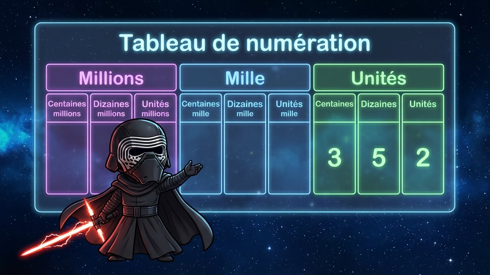
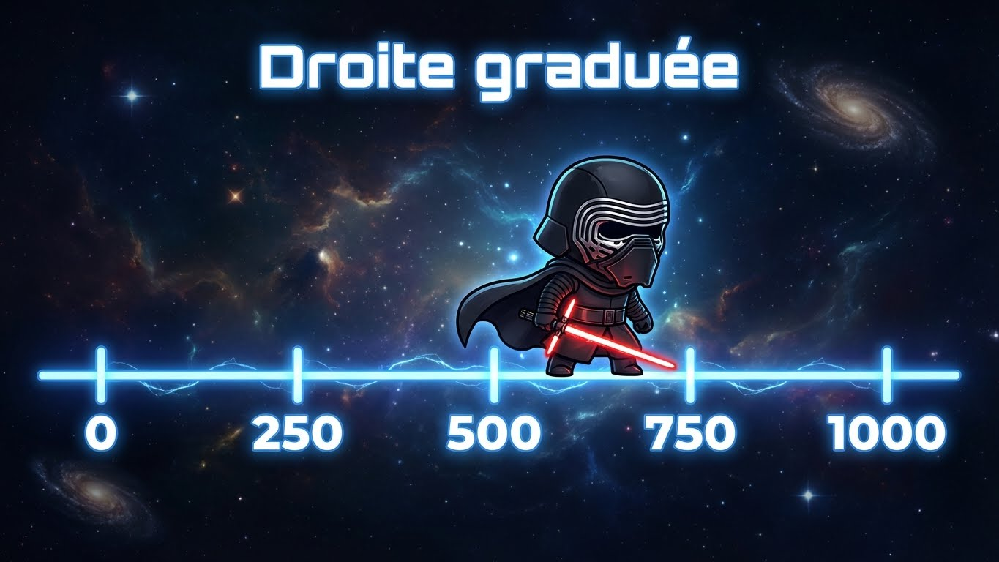

# Module 1 - Les nombres entiers

!!! info "Objectifs du module"
    À la fin de ce module, tu sauras :

    - ✅ Lire et écrire les grands nombres (jusqu'aux millions)
    - ✅ Décomposer un nombre
    - ✅ Comparer et ranger des nombres
    - ✅ Placer des nombres sur une droite graduée
    - ✅ Arrondir un nombre

    **Durée estimée : 2-3 heures** | **Pré-requis : Aucun**

---

## 🎮 Dans la vraie vie : pourquoi les grands nombres ?

!!! tip "Tu utilises déjà les grands nombres sans le savoir !"

    **Dans les jeux vidéo :**
    - Dans Minecraft, un stack = **64** blocs, et tu peux en avoir des **milliers** !
    - Tes crédits dans Forza Horizon 5 : tu peux avoir **2 500 000 CR** sur ton compte
    - Les XP dans Hogwarts Legacy pour débloquer les sorts : des **dizaines de milliers**

    **Sur YouTube et TikTok :**
    - "Cette vidéo a **12 millions** de vues"
    - "Ce créateur a **3,5 millions** d'abonnés"
    - Quand tu vois "1,2M vues" → ça veut dire **1 200 000** vues !

    **Dans le sport :**
    - Le stade de France peut accueillir **80 000** personnes
    - Le salaire de Mbappé : environ **72 millions** d'euros par an !
    - Record du monde du 100m : **9,58** secondes (là c'est des décimaux, on verra plus tard !)

    **Dans la vie de tous les jours :**
    - La population de la France : environ **68 millions** d'habitants
    - Le prix d'une maison : souvent entre **200 000** et **500 000** euros
    - La distance Terre-Lune : **384 400** km

!!! example "Mini-exercice fun"
    Si ton YouTubeur préféré a **2 340 000** abonnés et qu'il en gagne **15 000** par jour, combien en aura-t-il dans une semaine ?

    ??? success "Réponse"
        15 000 × 7 = 105 000 nouveaux abonnés
        2 340 000 + 105 000 = **2 445 000 abonnés** !

---

## 📚 Leçon 1 : Lire et écrire les grands nombres

### Le tableau de numération

| Classe des millions | Classe des milliers | Classe des unités |
|:-------------------:|:-------------------:|:-----------------:|
| C | D | U | C | D | U | C | D | U |
| Centaines de millions | Dizaines de millions | Millions | Centaines de milliers | Dizaines de milliers | Milliers | Centaines | Dizaines | Unités |

{ loading=lazy }

!!! example "Exemple : Le nombre 45 236 781"
    | C | D | U | C | D | U | C | D | U |
    |:-:|:-:|:-:|:-:|:-:|:-:|:-:|:-:|:-:|
    | | 4 | 5 | 2 | 3 | 6 | 7 | 8 | 1 |

    On lit : **quarante-cinq millions deux cent trente-six mille sept cent quatre-vingt-un**

### Règles d'écriture

!!! tip "Les espaces"
    On sépare les classes par des espaces (pas de points !) :

    - ✅ 45 236 781
    - ❌ 45.236.781

!!! tip "Les tirets"
    On met des tirets entre tous les mots d'un nombre composé :

    - ✅ vingt-et-un, quatre-vingt-trois
    - ✅ deux-cent-quarante-cinq

### Chiffre vs Nombre

!!! warning "Ne pas confondre !"
    - **Chiffre** : symbole (0, 1, 2, 3, 4, 5, 6, 7, 8, 9)
    - **Nombre** : quantité (ex: 47, 1 234, etc.)

    Dans **3 456** :
    - Le **chiffre** des dizaines est **5**
    - Le **nombre** de dizaines est **345** (car 3 456 = 345 dizaines + 6 unités)

??? warning "⚠️ Pièges à éviter : les grands nombres"
    **Piège 1 : Confondre "chiffre de" et "nombre de"**

    Dans **45 678** :
    - ❌ "Le nombre des centaines est 6" → FAUX !
    - ✅ Le **chiffre** des centaines est **6**
    - ✅ Le **nombre** de centaines est **456** (car 45 678 = 456 × 100 + 78)

    ---

    **Piège 2 : Oublier les zéros intercalés**

    - "Trois millions cinq mille" = **3 005 000** (pas 35 000 !)
    - "Sept cent mille" = **700 000** (pas 70 000 !)

    **Astuce : place chaque groupe dans le tableau de numération !**

    ---

    **Piège 3 : Les espaces dans les grands nombres**

    - ❌ 45.236.781 (points = version anglaise)
    - ❌ 45,236,781 (virgules = version anglaise)
    - ✅ 45 236 781 (espaces = version française)

    ---

    **Piège 4 : L'arrondi - regarder le BON chiffre**

    Pour arrondir à la centaine, regarde le chiffre des **dizaines** (pas des centaines !)

    - 4 3**4**7 arrondi à la centaine → 4 300 (car 4 < 5)
    - 4 3**6**7 arrondi à la centaine → 4 400 (car 6 ≥ 5)

??? abstract "🔄 Autre façon de comprendre : Chiffre vs Nombre"
    **Pense aux lettres et aux mots :**

    - **Chiffre** = comme une **lettre** (A, B, C... → 0, 1, 2...)
    - **Nombre** = comme un **mot** (formé de lettres → formé de chiffres)

    Le mot "CHAT" est composé des lettres C, H, A, T.
    Le nombre **3456** est composé des chiffres 3, 4, 5, 6.

    ---

    **Autre image : les étages d'un immeuble**

    { loading=lazy }

    Le **chiffre** des dizaines (5) = combien d'appartements à l'étage 2
    Le **nombre** de dizaines (345) = combien de "paquets de 10" au total

---

## ✏️ Exercices guidés - Leçon 1

### Exercice 1.1 : Écrire en chiffres

!!! question "Écris en chiffres"
    a) Deux millions trois cent mille

    b) Quinze millions quarante-deux mille cinq cents

    c) Sept cent millions

??? success "Correction"
    a) **2 300 000**

    b) **15 042 500**

    c) **700 000 000**

### Exercice 1.2 : Écrire en lettres

!!! question "Écris en lettres"
    a) 3 040 500

    b) 12 007 000

??? success "Correction"
    a) **trois millions quarante mille cinq cents**

    b) **douze millions sept mille**

### Exercice 1.3 : Chiffre ou nombre ?

!!! question "Dans le nombre 5 847 236"
    a) Quel est le chiffre des centaines ?

    b) Quel est le chiffre des dizaines de milliers ?

    c) Quel est le nombre de milliers ?

??? success "Correction"
    a) Le chiffre des centaines est **2**

    b) Le chiffre des dizaines de milliers est **4**

    c) Le nombre de milliers est **5 847** (car 5 847 236 = 5 847 milliers + 236)

---

## 📚 Leçon 2 : Décomposer un nombre

### Décomposition additive

!!! info "Principe"
    On décompose en additionnant les valeurs de chaque chiffre selon sa position.

!!! example "Exemple"
    **4 527** = 4 000 + 500 + 20 + 7

    Ou encore :
    **4 527** = (4 × 1 000) + (5 × 100) + (2 × 10) + (7 × 1)

### Décomposition avec puissances de 10

!!! info "Les puissances de 10"
    | Puissance | Valeur | Nom |
    |:---------:|:------:|-----|
    | 10⁰ | 1 | Un |
    | 10¹ | 10 | Dix |
    | 10² | 100 | Cent |
    | 10³ | 1 000 | Mille |
    | 10⁴ | 10 000 | Dix-mille |
    | 10⁵ | 100 000 | Cent-mille |
    | 10⁶ | 1 000 000 | Million |

!!! example "Exemple"
    **4 527** = (4 × 10³) + (5 × 10²) + (2 × 10¹) + (7 × 10⁰)

??? abstract "🔄 Autre façon de comprendre : la décomposition"
    **Imagine des billets et des pièces :**

    Pour payer **4 527 €**, tu pourrais utiliser :
    - 4 billets de 1 000 € = 4 000 €
    - 5 billets de 100 € = 500 €
    - 2 billets de 10 € = 20 €
    - 7 pièces de 1 € = 7 €

    **Total : 4 000 + 500 + 20 + 7 = 4 527 €**

    ---

    **Les puissances de 10, c'est juste compter les zéros !**

    | Puissance | Compte les zéros |
    |-----------|-----------------|
    | 10¹ = 10 | 1 zéro |
    | 10² = 100 | 2 zéros |
    | 10³ = 1 000 | 3 zéros |
    | 10⁶ = 1 000 000 | 6 zéros |

    **L'exposant = le nombre de zéros !**

---

## ✏️ Exercices guidés - Leçon 2

### Exercice 2.1 : Décomposition additive

!!! question "Décompose ces nombres"
    a) 7 845

    b) 23 506

    c) 140 320

??? success "Correction"
    a) **7 845** = 7 000 + 800 + 40 + 5

    b) **23 506** = 20 000 + 3 000 + 500 + 6

    c) **140 320** = 100 000 + 40 000 + 300 + 20

### Exercice 2.2 : Recomposer un nombre

!!! question "Trouve le nombre"
    a) 3 × 1 000 + 4 × 100 + 7 × 10 + 2

    b) 5 × 10 000 + 8 × 100 + 3

??? success "Correction"
    a) 3 000 + 400 + 70 + 2 = **3 472**

    b) 50 000 + 800 + 3 = **50 803**

---

## 📚 Leçon 3 : Comparer et ranger

### Comparer deux nombres

!!! info "Méthode"
    1. Compte le nombre de chiffres
    2. Si même nombre de chiffres → compare chiffre par chiffre en partant de la gauche

!!! example "Exemple : 45 231 et 45 312"
    - Même nombre de chiffres (5)
    - Premier chiffre : 4 = 4 ✓
    - Deuxième chiffre : 5 = 5 ✓
    - Troisième chiffre : 2 < 3

    Donc **45 231 < 45 312**

### Ranger des nombres

!!! info "Vocabulaire"
    - **Ordre croissant** : du plus petit au plus grand (↗️)
    - **Ordre décroissant** : du plus grand au plus petit (↘️)

!!! example "Ranger : 3 401 ; 3 140 ; 3 410 ; 3 104"
    - Ordre croissant : **3 104 < 3 140 < 3 401 < 3 410**
    - Ordre décroissant : **3 410 > 3 401 > 3 140 > 3 104**

### Encadrer un nombre

!!! info "Encadrement"
    Encadrer un nombre, c'est trouver deux nombres qui l'entourent.

!!! example "Encadre 4 567 à la centaine près"
    4 500 < **4 567** < 4 600

---

## ✏️ Exercices guidés - Leçon 3

### Exercice 3.1 : Comparer

!!! question "Compare avec < , > ou ="
    a) 45 678 ... 45 687

    b) 123 456 ... 98 765

    c) 7 007 007 ... 7 007 007

??? success "Correction"
    a) 45 678 **<** 45 687

    b) 123 456 **>** 98 765 (6 chiffres > 5 chiffres)

    c) 7 007 007 **=** 7 007 007

### Exercice 3.2 : Ranger

!!! question "Range dans l'ordre croissant"
    52 403 ; 52 430 ; 52 043 ; 52 304

??? success "Correction"
    **52 043 < 52 304 < 52 403 < 52 430**

### Exercice 3.3 : Encadrer

!!! question "Encadre 78 456"
    a) À la dizaine près

    b) À la centaine près

    c) Au millier près

??? success "Correction"
    a) 78 450 < 78 456 < 78 460

    b) 78 400 < 78 456 < 78 500

    c) 78 000 < 78 456 < 79 000

---

## 📚 Leçon 4 : La droite graduée

### Placer un nombre sur une droite

{ loading=lazy }

!!! info "Méthode"
    1. Regarde la graduation (de combien en combien ?)
    2. Repère les nombres donnés
    3. Place le nombre au bon endroit

!!! example "Place 350 sur cette droite"
    350 est entre 300 et 400, au milieu.

### Lire un nombre sur une droite

!!! info "Méthode"
    1. Identifie la graduation
    2. Compte les graduations depuis le repère connu

---

## ✏️ Exercices guidés - Leçon 4

### Exercice 4.1 : Lire sur une droite

!!! question "Quels nombres sont indiqués par A, B et C ?"
    ```
    |----|----|----|----|----|----|----|----|----|----|
    0        2000       4000       6000       8000    10000
         A             B                  C
    ```

??? success "Correction"
    - **A = 1 000** (entre 0 et 2 000)
    - **B = 4 000**
    - **C = 7 000** (entre 6 000 et 8 000)

---

## 📚 Leçon 5 : Arrondir un nombre

### Qu'est-ce qu'arrondir ?

!!! info "Définition"
    Arrondir, c'est remplacer un nombre par une valeur approchée plus simple.

### Méthode pour arrondir

!!! tip "Règle"
    - Si le chiffre suivant est **< 5** → on garde (arrondi par défaut)
    - Si le chiffre suivant est **≥ 5** → on ajoute 1 (arrondi par excès)

!!! example "Arrondir 4 567 à la centaine près"
    On regarde le chiffre des dizaines : **6**

    6 ≥ 5 → on passe à la centaine supérieure

    **4 567 ≈ 4 600**

!!! example "Arrondir 4 523 à la centaine près"
    On regarde le chiffre des dizaines : **2**

    2 < 5 → on garde la centaine

    **4 523 ≈ 4 500**

---

## ✏️ Exercices guidés - Leçon 5

### Exercice 5.1 : Arrondir

!!! question "Arrondis ces nombres"
    a) 3 847 à la centaine près

    b) 56 432 au millier près

    c) 789 à la dizaine près

??? success "Correction"
    a) 3 8**4**7 → 4 < 5 → **3 800**

    b) 56 **4**32 → 4 < 5 → **56 000**

    c) 78**9** → 9 ≥ 5 → **790**

---

## 🏋️ Entraînement

### Série 1 : Lecture et écriture (facile)

!!! note "Exercices à faire sur ton cahier"
    1. Écris en chiffres : six millions sept cent mille
    2. Écris en lettres : 8 045 000
    3. Dans 12 345 678, quel est le chiffre des dizaines de milliers ?
    4. Décompose 45 607

??? success "Corrections"
    1. **6 700 000**
    2. **huit millions quarante-cinq mille**
    3. **4**
    4. 45 607 = 40 000 + 5 000 + 600 + 7

### Série 2 : Comparaison (moyen)

!!! note "Exercices à faire sur ton cahier"
    1. Range dans l'ordre croissant : 807 452 ; 870 452 ; 807 425 ; 870 245
    2. Encadre 567 890 au millier près
    3. Trouve un nombre entre 45 000 et 46 000 qui a 7 comme chiffre des centaines

??? success "Corrections"
    1. **807 425 < 807 452 < 870 245 < 870 452**
    2. **567 000 < 567 890 < 568 000**
    3. Exemples : **45 700** ou **45 723** (tout nombre de la forme 45 7XX)

### Série 3 : Arrondi et droite graduée (difficile)

!!! note "Exercices à faire sur ton cahier"
    1. Arrondis 4 785 632 au million près
    2. Place sur une droite graduée de 0 à 10 000 (graduation de 1 000) : A = 2 500 ; B = 7 800
    3. Quel nombre est à égale distance de 3 000 et 4 000 ?

??? success "Corrections"
    1. 4 785 632 → **5 000 000** (7 ≥ 5)
    2. A est au milieu entre 2 000 et 3 000, B est proche de 8 000
    3. **3 500**

---

## 🏆 Évaluation du module

!!! warning "Conditions"
    - À faire **sans aide** et **sans calculatrice**
    - Note tes réponses sur une feuille
    - Compte 1 point par bonne réponse

### Questions (sur 20)

**Q1.** Écris en chiffres : vingt-trois millions cinq cent mille (1 pt)

**Q2.** Écris en lettres : 7 008 040 (1 pt)

**Q3.** Dans 45 678 123, quel est le chiffre des centaines de milliers ? (1 pt)

**Q4.** Dans 45 678 123, quel est le nombre de milliers ? (1 pt)

**Q5.** Décompose 340 506 (2 pts)

**Q6.** Recompose : 5 × 10 000 + 7 × 1 000 + 3 × 10 + 8 (1 pt)

**Q7.** Compare : 456 789 ... 465 789 (1 pt)

**Q8.** Range dans l'ordre décroissant : 34 521 ; 35 421 ; 34 512 ; 35 412 (2 pts)

**Q9.** Encadre 78 345 à la centaine près (1 pt)

**Q10.** Encadre 78 345 au millier près (1 pt)

**Q11.** Arrondis 6 847 à la centaine près (1 pt)

**Q12.** Arrondis 6 847 au millier près (1 pt)

**Q13.** Quel nombre est représenté par A ? (1 pt)
```
|----|----|----|----|----|----|
0   10000     30000     50000
                   A
```

**Q14.** Trouve le plus grand nombre de 5 chiffres avec uniquement les chiffres 3, 0, 7, 1, 9 (1 pt)

**Q15.** Trouve le plus petit nombre de 6 chiffres (1 pt)

**Q16-20.** Problème (4 pts) : La population d'une ville est de 234 567 habitants. Arrondis ce nombre au millier près, puis à la dizaine de milliers près. Écris ensuite le résultat arrondi au millier en lettres.

??? success "Corrections de l'évaluation"
    **Q1.** 23 500 000

    **Q2.** sept millions huit mille quarante

    **Q3.** 6

    **Q4.** 45 678

    **Q5.** 340 506 = 300 000 + 40 000 + 500 + 6

    **Q6.** 57 038

    **Q7.** 456 789 < 465 789

    **Q8.** 35 421 > 35 412 > 34 521 > 34 512

    **Q9.** 78 300 < 78 345 < 78 400

    **Q10.** 78 000 < 78 345 < 79 000

    **Q11.** 6 800 (4 < 5)

    **Q12.** 7 000 (8 ≥ 5)

    **Q13.** A = 40 000

    **Q14.** 97 310

    **Q15.** 100 000

    **Q16-20.**
    - Arrondi au millier : 235 000 (5 ≥ 5)
    - Arrondi à la dizaine de milliers : 230 000 (4 < 5)
    - En lettres : deux cent trente-cinq mille

---

## 🎮 Bonus : Défis

??? question "Défi 1 : Le nombre mystère"
    Je suis un nombre de 6 chiffres.
    Mon chiffre des milliers est 7.
    Mon chiffre des centaines est le double de 3.
    Mon chiffre des dizaines est 0.
    Mon chiffre des unités est 5.
    Mon chiffre des dizaines de milliers est 2.
    Mon chiffre des centaines de milliers est 4.

    Qui suis-je ?

    ??? success "Réponse"
        **427 605**

??? question "Défi 2 : Combien de nombres ?"
    Combien y a-t-il de nombres entiers entre 100 et 200 (100 et 200 compris) ?

    ??? success "Réponse"
        **101 nombres** (200 - 100 + 1 = 101)

??? question "Défi 3 : Le plus grand et le plus petit"
    Avec les chiffres 2, 0, 4, 7, 1 (utilisés une seule fois chacun), écris :

    a) Le plus grand nombre possible

    b) Le plus petit nombre possible de 5 chiffres

    ??? success "Réponse"
        a) **74 210**

        b) **10 247** (on ne peut pas commencer par 0)

---

## Prochaine étape

!!! success "Module validé si score ≥ 14/20"
    Tu peux passer au module suivant !

[➡️ Module 2 - Les quatre opérations](module-02-operations.md){ .md-button .md-button--primary }

[⬅️ Retour à l'index](index.md){ .md-button }
