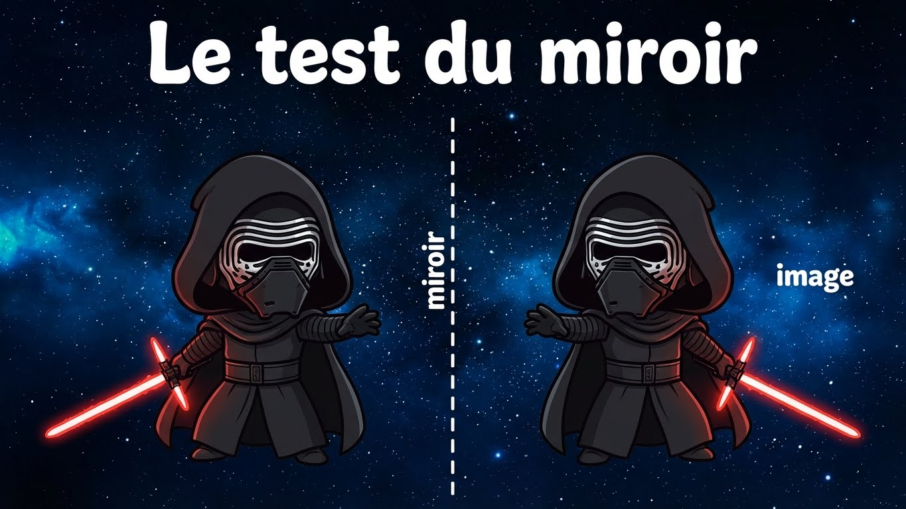
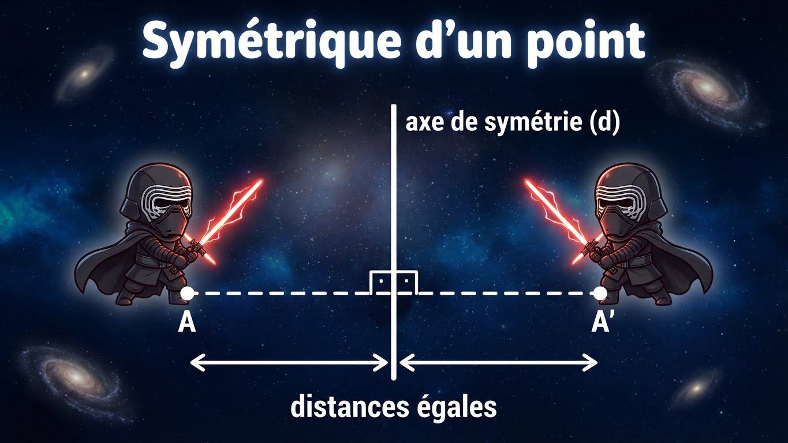

# Module 8 - La symétrie axiale

!!! info "Objectifs du module"
    À la fin de ce module, tu sauras :

    - Reconnaître un axe de symétrie
    - Identifier les figures qui ont des axes de symétrie
    - Construire le symétrique d'un point
    - Construire le symétrique d'une figure
    - Connaître les propriétés de la symétrie

    **Durée estimée : 2-3 heures** | **Pré-requis : Module 6**

---

## 🎮 Dans la vraie vie : la symétrie partout !

!!! tip "La symétrie, c'est l'équilibre parfait !"

    **Sur ton corps :**
    - Ton visage est (presque) symétrique : œil gauche / œil droit
    - Tes mains sont symétriques l'une de l'autre
    - Main droite + miroir = main gauche !

    **Dans la nature :**
    - Un papillon 🦋 : les deux ailes sont identiques
    - Une feuille d'arbre : symétrique par rapport à la nervure centrale
    - Un flocon de neige ❄️ : 6 axes de symétrie !
    - Ton reflet dans l'eau 🌊

    **Dans les logos et marques :**
    - Logo McDonald's (M) : symétrique
    - Logo Adidas : 3 bandes symétriques
    - Logo Mercedes : étoile à 3 branches (symétrie de rotation !)
    - Beaucoup de logos de voitures sont symétriques

    **Dans les jeux :**
    - Les cartes à jouer (roi, dame...) : symétriques pour être lues dans les deux sens
    - Le plateau d'échecs : symétrique
    - Les terrains de sport : symétriques pour être équitables

    **En architecture :**
    - La Tour Eiffel : symétrique
    - Le Taj Mahal : parfaitement symétrique
    - La plupart des bâtiments importants

!!! example "Test rapide : cette lettre est-elle symétrique ?"
    ```
    A → OUI (axe vertical │)
    B → NON (les deux bosses ne sont pas identiques)
    F → NON
    H → OUI (2 axes ! │ et ─)
    O → OUI (plein d'axes !)
    S → NON (attention piège, elle n'est PAS symétrique !)
    ```

---

## Leçon 1 : Qu'est-ce que la symétrie axiale ?

### Définition

!!! info "Symétrie axiale"
    Deux figures sont **symétriques par rapport à un axe** si,
    en pliant la feuille le long de cet axe, les deux figures se superposent.

{ loading=lazy }

Les deux ailes du papillon sont symétriques par rapport à l'axe central (le corps).

### L'axe de symétrie

!!! info "Axe de symétrie d'une figure"
    Une figure a un **axe de symétrie** si elle peut être pliée en deux
    parties qui se superposent parfaitement.

!!! example "Exemples de la vie courante"
    - Le visage humain (à peu près !)
    - Un papillon
    - Un sapin de Noël
    - Les lettres : A, C, D, E, H, I, M, O, T, U, V, W, X, Y
    - Un coeur ♥

    { loading=lazy }

### Figures sans axe de symétrie

!!! warning "Attention"
    Certaines figures n'ont **aucun** axe de symétrie :

    - Le parallélogramme (qui n'est pas un rectangle)
    - Les lettres : F, G, J, L, N, P, Q, R, S, Z
    - Un escalier

??? abstract "🔄 Autre façon de comprendre : la symétrie"
    **Le test du miroir :**

    { loading=lazy }

    Place un miroir vertical au milieu de ton dessin.
    Si le reflet complète parfaitement l'image → c'est symétrique !

    ---

    **Le test du pliage :**

    Imagine que tu plies ta feuille le long de l'axe.
    Si les deux parties se superposent exactement → c'est symétrique !

    ---

    **Construire un symétrique :**

    Pour chaque point A, son symétrique A' est :
    - À la **même distance** de l'axe
    - De l'**autre côté** de l'axe
    - Sur une droite **perpendiculaire** à l'axe

    **A et A' sont comme dans un miroir !**

---

## Exercices guidés - Leçon 1

### Exercice 1.1 : Reconnaître la symétrie

!!! question "Ces figures ont-elles un axe de symétrie ?"
    a) Un rectangle
    b) Un triangle quelconque
    c) Un triangle isocèle
    d) Un cercle

??? success "Correction"
    a) **Oui** (2 axes : par les milieux des côtés opposés)

    b) **Non** (en général)

    c) **Oui** (1 axe : la médiatrice de la base)

    d) **Oui** (une infinité d'axes : tous les diamètres !)

### Exercice 1.2 : Lettres symétriques

!!! question "Combien d'axes de symétrie ont ces lettres ?"
    a) A
    b) H
    c) O
    d) F

??? success "Correction"
    a) **1 axe** (vertical)

    b) **2 axes** (vertical et horizontal)

    c) **Infinité d'axes** (comme un cercle)

    d) **0 axe** (pas de symétrie)

---

## Leçon 2 : Axes de symétrie des figures usuelles

### Tableau récapitulatif

| Figure | Nombre d'axes | Représentation |
|:------:|:-------------:|:--------------:|
| Triangle équilatéral | 3 | Les 3 médianes |
| Triangle isocèle | 1 | La médiane issue du sommet |
| Carré | 4 | 2 diagonales + 2 par les milieux |
| Rectangle | 2 | Par les milieux des côtés opposés |
| Losange | 2 | Les 2 diagonales |
| Cercle | ∞ | Tous les diamètres |

### Le carré : 4 axes

!!! example "Les 4 axes du carré"
    { loading=lazy }

    - 2 axes passant par les milieux des côtés opposés (médianes)
    - 2 axes passant par les sommets opposés (diagonales)

### Le rectangle : 2 axes

!!! example "Les 2 axes du rectangle"
    { loading=lazy }

    - 1 axe vertical passant par les milieux des largeurs
    - 1 axe horizontal passant par les milieux des longueurs

!!! warning "Piège fréquent"
    Les **diagonales** du rectangle ne sont **PAS** des axes de symétrie !
    (sauf si c'est un carré)

### Le losange : 2 axes

!!! example "Les 2 axes du losange"
    { loading=lazy }

    Les deux diagonales du losange sont ses axes de symétrie.

??? warning "⚠️ Pièges à éviter : symétrie"
    **Piège 1 : Croire que la lettre S est symétrique**

    - ❌ La lettre S a un axe de symétrie → FAUX !
    - ✅ S n'a PAS d'axe de symétrie (elle a une symétrie centrale, mais pas axiale)

    Lettres SANS axe : F, G, J, L, N, P, Q, R, S, Z

    ---

    **Piège 2 : Les diagonales du rectangle**

    | Figure | Diagonales = axes ? |
    |--------|:-------------------:|
    | Carré | ✅ OUI |
    | Rectangle | ❌ NON |
    | Losange | ✅ OUI |

    ---

    **Piège 3 : Oublier que la distance est la même des deux côtés**

    Pour construire le symétrique de A :
    - Distance de A à l'axe = Distance de A' à l'axe
    - A et A' sont sur une droite **perpendiculaire** à l'axe

    ---

    **Piège 4 : Compter les axes d'un polygone régulier**

    Un polygone régulier à n côtés a **n axes** de symétrie :
    - Triangle équilatéral : 3 axes
    - Carré : 4 axes
    - Pentagone régulier : 5 axes
    - Hexagone régulier : 6 axes

### Le triangle équilatéral : 3 axes

!!! example "Les 3 axes du triangle équilatéral"
    { loading=lazy }

    Chaque axe passe par un sommet et le milieu du côté opposé (les 3 médianes).

---

## Exercices guidés - Leçon 2

### Exercice 2.1 : Combien d'axes ?

!!! question "Combien d'axes de symétrie ?"
    a) Un losange
    b) Un triangle rectangle isocèle
    c) Un hexagone régulier

??? success "Correction"
    a) **2 axes** (les diagonales)

    b) **1 axe** (la bissectrice de l'angle droit)

    c) **6 axes** (3 par les sommets opposés + 3 par les milieux)

### Exercice 2.2 : Vrai ou Faux

!!! question "Vrai ou Faux ?"
    a) Un rectangle a 4 axes de symétrie

    b) Un cercle a une infinité d'axes de symétrie

    c) Les diagonales d'un rectangle sont des axes de symétrie

??? success "Correction"
    a) **Faux** - Un rectangle a 2 axes (sauf s'il est carré : 4)

    b) **Vrai** - Chaque diamètre est un axe

    c) **Faux** - Seul le carré a ses diagonales comme axes

---

## Leçon 3 : Construire le symétrique d'un point

### Méthode avec la règle et l'équerre

!!! tip "Étapes de construction"
    Pour construire le symétrique A' du point A par rapport à l'axe (d) :

    1. Trace la **perpendiculaire** à (d) passant par A
    2. Mesure la distance de A à (d)
    3. Reporte cette même distance **de l'autre côté** de (d)

    { loading=lazy }

    La distance de A à l'axe (d) est égale à la distance de A' à l'axe (d).

### Méthode avec le compas

!!! tip "Alternative au compas"
    1. Trace un arc de cercle centré en A qui coupe (d) en deux points
    2. Depuis ces deux points, trace deux arcs de même rayon
    3. L'intersection de ces arcs donne A'

### Propriété fondamentale

!!! info "Propriété"
    Le symétrique A' d'un point A par rapport à un axe (d) est tel que :

    - (d) est la **médiatrice** du segment [AA']
    - (d) est **perpendiculaire** à [AA'] et passe par son **milieu**

---

## Exercices guidés - Leçon 3

### Exercice 3.1 : Construire un symétrique

!!! question "Construis le symétrique du point A par rapport à l'axe (d)"
    ```
                (d)
                 │
                 │
       A •       │
                 │
                 │
    ```

??? success "Correction"
    ```
                (d)
                 │
                 │
       A •───────┼───────• A'
                 │
                 │

    1. Tracer la perpendiculaire de A à (d)
    2. Mesurer la distance A-(d) = x
    3. Reporter x de l'autre côté → A'
    ```

### Exercice 3.2 : Trouver le milieu

!!! question "A et A' sont symétriques par rapport à (d). La distance AA' est 8 cm. Quelle est la distance de A à (d) ?"

??? success "Correction"
    La distance de A à (d) est la **moitié** de AA'.

    Distance = 8 ÷ 2 = **4 cm**

---

## Leçon 4 : Construire le symétrique d'une figure

### Méthode

!!! tip "Pour construire le symétrique d'une figure"
    1. Construis le symétrique de **chaque sommet**
    2. Relie les points symétriques dans le **même ordre**

!!! example "Symétrique d'un triangle"
    ```
         (d)
          │
       A  │
       │\ │
       │ \│
       │  │\
    B──┴──┼─C'
          │\
          │ \
          │  A'
          │ /
          │/
         B'

    A' symétrique de A
    B' symétrique de B
    C' symétrique de C
    Triangle A'B'C' = symétrique de ABC
    ```

### Propriétés de la symétrie axiale

!!! info "Ce qui est conservé"
    La symétrie axiale **conserve** :

    - Les **longueurs** (distances)
    - Les **angles**
    - Les **aires**
    - L'**alignement** des points
    - Le **parallélisme**

!!! warning "Ce qui change"
    La symétrie axiale **inverse** le sens de parcours (comme dans un miroir).

    ```
    Figure         Symétrique
      1→2            2'←1'
      ↓                ↑
      3              3'
    ```

---

## Exercices guidés - Leçon 4

### Exercice 4.1 : Propriétés conservées

!!! question "Le triangle ABC a pour symétrique A'B'C'. AB = 5 cm, angle ABC = 60°"
    a) Quelle est la mesure de A'B' ?
    b) Quelle est la mesure de l'angle A'B'C' ?

??? success "Correction"
    a) A'B' = **5 cm** (la symétrie conserve les longueurs)

    b) Angle A'B'C' = **60°** (la symétrie conserve les angles)

### Exercice 4.2 : Construire le symétrique

!!! question "Construis le symétrique du carré ABCD par rapport à l'axe (d)"
    ```
           (d)
            │
    ┌───┐   │
    │   │   │
    │   │   │
    └───┘   │
    A B     │
    ```

??? success "Correction"
    ```
           (d)
            │
    ┌───┐   │   ┌───┐
    │   │   │   │   │
    │   │   │   │   │
    └───┘   │   └───┘
    A B     │   B' A'

    Le carré symétrique est de l'autre côté de l'axe,
    à la même distance.
    ```

---

## Entraînement

### Série 1 : Axes de symétrie

1. Combien d'axes de symétrie a un pentagone régulier ?
2. La lettre "S" a-t-elle un axe de symétrie ?
3. Trace les axes de symétrie d'un triangle isocèle.

??? success "Corrections"
    1. **5 axes** (autant que de côtés pour un polygone régulier)
    2. **Non** (la lettre S n'a pas d'axe de symétrie)
    3. Un seul axe : la médiatrice de la base (passe par le sommet principal)

### Série 2 : Constructions

1. Construis le symétrique d'un segment [AB] par rapport à un axe (d) parallèle à [AB].
2. Construis le symétrique d'un cercle de centre O par rapport à un axe (d).
3. Quel est le symétrique d'un point situé SUR l'axe (d) ?

??? success "Corrections"
    1. Le segment symétrique est parallèle à [AB], de même longueur, de l'autre côté de (d)
    2. Le cercle symétrique a pour centre O' (symétrique de O) et même rayon
    3. Un point sur l'axe est son **propre symétrique** !

### Série 3 : Propriétés

1. Un rectangle ABCD a un périmètre de 24 cm. Son symétrique a-t-il le même périmètre ?
2. Si deux droites sont parallèles, leurs symétriques sont-elles parallèles ?
3. Le symétrique d'un angle droit est-il un angle droit ?

??? success "Corrections"
    1. **Oui** (la symétrie conserve les longueurs, donc le périmètre)
    2. **Oui** (la symétrie conserve le parallélisme)
    3. **Oui** (la symétrie conserve les angles)

---

## Évaluation du module (sur 20)

**Q1.** Qu'est-ce qu'un axe de symétrie d'une figure ? (2 pts)

**Q2.** Combien d'axes de symétrie a un carré ? Un rectangle ? (2 pts)

**Q3.** La lettre "M" a-t-elle un axe de symétrie ? Si oui, lequel ? (1 pt)

**Q4.** Cite 3 propriétés conservées par la symétrie axiale (3 pts)

**Q5.** Un point A est à 3 cm de l'axe (d). À quelle distance de (d) se trouve A' ? (1 pt)

**Q6.** Un segment AB = 7 cm. Combien mesure son symétrique A'B' ? (1 pt)

**Q7.** Vrai ou Faux : Les diagonales d'un losange sont ses axes de symétrie (1 pt)

**Q8.** Construis le symétrique du point M par rapport à l'axe (d) (3 pts)

**Q9.** Construis le symétrique du triangle ABC par rapport à l'axe (d) (4 pts)

**Q10.** Un triangle équilatéral a une aire de 20 cm². Quelle est l'aire de son symétrique ? (2 pts)

??? success "Corrections"
    Q1. Une droite telle que si on plie la figure le long de cette droite, les deux parties se superposent.
    Q2. Carré : **4** | Rectangle : **2**
    Q3. **Oui**, un axe vertical (passant par le milieu)
    Q4. Longueurs, angles, aires, alignement, parallélisme (3 au choix)
    Q5. **3 cm** (même distance de l'autre côté)
    Q6. **7 cm** (conservation des longueurs)
    Q7. **Vrai**
    Q8. Construction avec perpendiculaire et report de distance
    Q9. Construction des 3 sommets symétriques puis tracé
    Q10. **20 cm²** (conservation des aires)

---

## Prochaine étape

[Module 9 - Grandeurs et mesures](module-09-grandeurs.md){ .md-button .md-button--primary }

[Retour à l'index](index.md){ .md-button }
