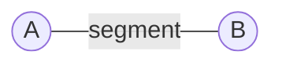
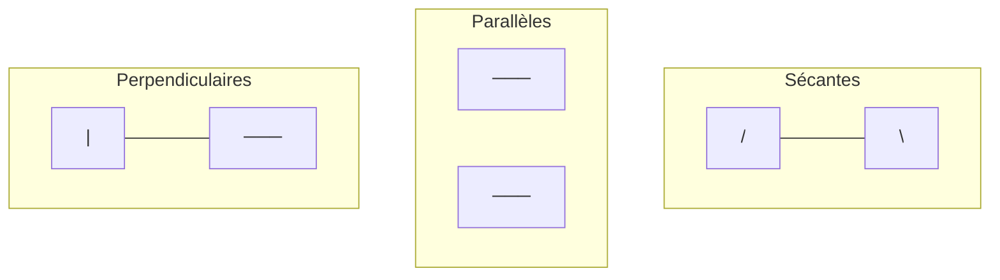
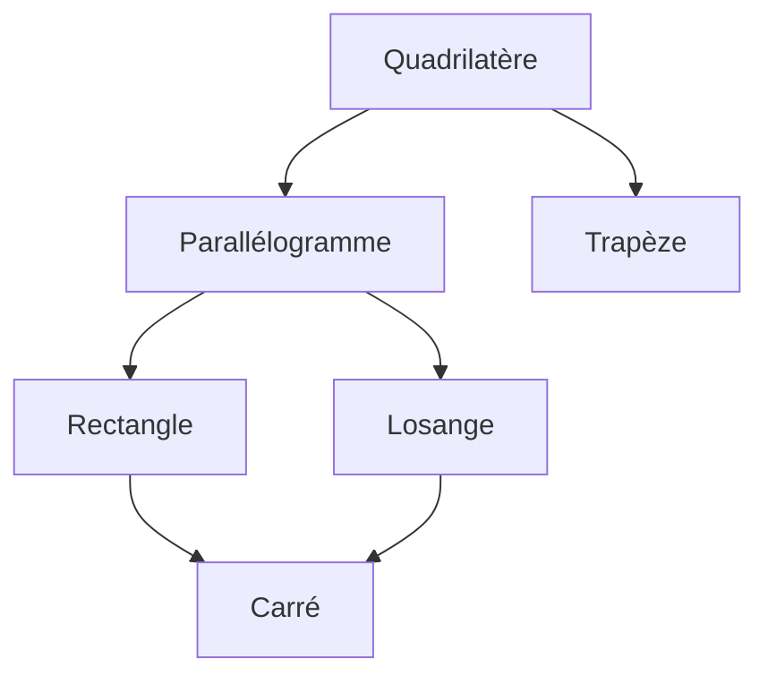

# Espace & Géométrie

## Vocabulaire de base

### Points, droites et segments



| Objet | Notation | Description |
|-------|:---:|-------------|
| **Point** | A | Position dans l'espace (majuscule) |
| **Droite** | (AB) ou (d) | Infinie des deux côtés |
| **Segment** | [AB] | Portion de droite entre A et B |
| **Demi-droite** | [AB) | Origine A, infinie vers B |

### Positions relatives de droites



| Position | Symbole | Description |
|----------|:---:|-------------|
| **Parallèles** | (d₁) // (d₂) | Ne se croisent jamais |
| **Sécantes** | - | Se croisent en un point |
| **Perpendiculaires** | (d₁) ⊥ (d₂) | Se croisent à angle droit (90°) |

---

## Les angles

### Vocabulaire

```
        B
       /
      /
     / ) angle
    A ─────────── C
```

!!! info "Notation"
    L'angle se note **∠BAC** ou **BAĈ** (le sommet est au milieu)

### Types d'angles

| Type | Mesure | Représentation |
|------|:---:|:---:|
| **Nul** | 0° | Côtés superposés |
| **Aigu** | 0° < x < 90° | "Pointu" |
| **Droit** | 90° | Carré dans l'angle |
| **Obtus** | 90° < x < 180° | "Ouvert" |
| **Plat** | 180° | Demi-tour |

### Angles particuliers

!!! note "Angles complémentaires"
    Deux angles sont **complémentaires** si leur somme = **90°**

    Exemple : 30° et 60° sont complémentaires

!!! note "Angles supplémentaires"
    Deux angles sont **supplémentaires** si leur somme = **180°**

    Exemple : 110° et 70° sont supplémentaires

---

## Les triangles

### Classification par les côtés

| Type | Propriété | Schéma |
|------|-----------|:---:|
| **Quelconque** | Aucun côté égal | △ |
| **Isocèle** | 2 côtés égaux | △ avec marques |
| **Équilatéral** | 3 côtés égaux | △ parfait |

### Classification par les angles

| Type | Propriété |
|------|-----------|
| **Rectangle** | Un angle droit (90°) |
| **Acutangle** | Trois angles aigus |
| **Obtusangle** | Un angle obtus |

!!! warning "Propriété fondamentale"
    La somme des angles d'un triangle = **180°**

!!! example "Exemple"
    Triangle avec angles 50° et 70° → 3ème angle = 180° - 50° - 70° = **60°**

### Construire un triangle

!!! note "Avec 3 côtés (règle + compas)"
    1. Tracer le plus grand côté [AB]
    2. Ouvrir le compas à la longueur AC, pointer en A
    3. Ouvrir le compas à la longueur BC, pointer en B
    4. L'intersection des arcs donne C

---

## Les quadrilatères

### Famille des quadrilatères



### Propriétés

| Figure | Côtés | Angles | Diagonales |
|--------|-------|--------|------------|
| **Parallélogramme** | Opposés // et égaux | Opposés égaux | Se coupent en leur milieu |
| **Rectangle** | Opposés égaux | 4 angles droits | Égales, se coupent en leur milieu |
| **Losange** | 4 côtés égaux | Opposés égaux | Perpendiculaires |
| **Carré** | 4 côtés égaux | 4 angles droits | Égales et perpendiculaires |

!!! tip "Astuce"
    Le **carré** est à la fois un rectangle ET un losange !

---

## Le cercle

### Vocabulaire

```
         ·  ·  ·
      ·           ·
     ·      r      ·
    ·    O───────A  ·   ← rayon r
     ·             ·
      ·    d      ·
         ·  ·  ·
           ↑
        diamètre d = 2r
```

| Élément | Description |
|---------|-------------|
| **Centre** O | Point équidistant de tous les points du cercle |
| **Rayon** r | Distance du centre à un point du cercle |
| **Diamètre** d | Segment passant par O, d'un bord à l'autre (d = 2r) |
| **Corde** | Segment joignant 2 points du cercle |
| **Arc** | Portion du cercle |

### Disque vs Cercle

!!! warning "Attention"
    - **Cercle** = la ligne (le contour)
    - **Disque** = la surface (l'intérieur)

---

## La symétrie axiale

### Définition

!!! info "Symétrique d'un point"
    Deux points A et A' sont **symétriques par rapport à une droite (d)** si :

    - (d) est la **médiatrice** de [AA']
    - (d) passe par le **milieu** de [AA'] et est **perpendiculaire** à [AA']

### Construire un symétrique

!!! note "Méthode (équerre + compas)"
    1. Tracer la perpendiculaire à (d) passant par A
    2. Mesurer la distance de A à (d)
    3. Reporter cette distance de l'autre côté
    4. Le point obtenu est A'

### Figures ayant des axes de symétrie

| Figure | Nombre d'axes |
|--------|:---:|
| Segment | 2 |
| Triangle isocèle | 1 |
| Triangle équilatéral | 3 |
| Rectangle | 2 |
| Losange | 2 |
| Carré | 4 |
| Cercle | ∞ |

---

## Solides de l'espace

### Les prismes droits

!!! info "Définition"
    Un prisme droit a deux bases **parallèles et superposables** et des faces latérales **rectangulaires**

| Prisme | Base | Faces latérales |
|--------|------|:---:|
| **Cube** | Carrée | 4 carrés |
| **Pavé droit** | Rectangulaire | 4 rectangles |
| **Prisme triangulaire** | Triangulaire | 3 rectangles |

### Le cylindre

Base = disque → Faces latérales = surface courbe

### Pyramides et cônes

| Solide | Base | Sommet |
|--------|------|--------|
| **Pyramide** | Polygone | 1 sommet (apex) |
| **Cône** | Disque | 1 sommet |

### Patrons

!!! tip "Astuce"
    Le patron est le "développé" d'un solide : on déplie toutes les faces à plat

---

## Quiz express

??? question "Combien de côtés égaux a un triangle isocèle ?"
    **2 côtés égaux**

??? question "Quelle est la somme des angles d'un triangle ?"
    **180°**

??? question "Si un angle mesure 35°, quel est son complémentaire ?"
    90° - 35° = **55°**

??? question "Combien d'axes de symétrie a un carré ?"
    **4 axes** (2 diagonales + 2 médiatrices des côtés)

??? question "Si le rayon d'un cercle est 5 cm, quel est son diamètre ?"
    d = 2 × r = 2 × 5 = **10 cm**
