# Formation Sciences & Technologie 6ème

!!! success "Bienvenue dans ta formation !"
    Cette formation est conçue pour t'accompagner tout au long de l'année de 6ème en Sciences et Technologie. Elle est divisée en **10 modules progressifs** couvrant les trois grands thèmes du programme.

---

## Comment utiliser cette formation ?

### Le parcours

```mermaid
graph LR
    M0[Module 0<br>Test initial] --> M1[Module 1<br>La matière]
    M1 --> M2[Module 2<br>États matière]
    M2 --> M3[Module 3<br>Mélanges]
    M3 --> M4[Module 4<br>Mouvement]
    M4 --> M5[Module 5<br>Êtres vivants]
    M5 --> M6[Module 6<br>La cellule]
    M6 --> M7[Module 7<br>Nutrition]
    M7 --> M8[Module 8<br>Système solaire]
    M8 --> M9[Module 9<br>Phénomènes]
    M9 --> M10[Module 10<br>Environnement]
```

### Organisation du programme

| Partie | Thèmes | Modules |
|--------|--------|:-------:|
| **Matière & Mouvement** | États, mélanges, énergie | 1 à 4 |
| **Le Vivant** | Cellule, nutrition, développement | 5 à 7 |
| **La Terre & l'Environnement** | Système solaire, phénomènes, écologie | 8 à 10 |

### Durée estimée

| Module | Durée conseillée |
|--------|:----------------:|
| Module 0 | 30 min |
| Modules 1-10 | 2-3 heures chacun |
| **Total** | ~25-30 heures |

!!! tip "Conseil"
    Travaille **20-30 minutes par jour** plutôt que plusieurs heures d'un coup. Fais des expériences quand c'est possible !

### Structure de chaque module

Chaque module contient :

| Section | Contenu |
|---------|---------|
| 🎯 **Objectifs** | Ce que tu vas apprendre |
| 📚 **Cours** | Leçon complète avec schémas |
| 🔬 **Expériences** | Manipulations à faire |
| ✏️ **Exercices guidés** | Exercices avec aide pas à pas |
| 🏋️ **Entraînement** | Exercices à faire seul |
| 🏆 **Évaluation** | Quiz pour valider le module |
| 🎮 **Bonus** | Anecdotes et défis |

### Système de progression

| Symbole | Signification |
|:-------:|---------------|
| ⬜ | Pas encore commencé |
| 🟡 | En cours |
| ✅ | Validé |
| ⭐ | Maîtrisé (bonus réussi) |

---

## Les 10 modules

### 📊 Module 0 - Point de départ
> Test de positionnement pour identifier tes points forts et axes de travail

[➡️ Commencer le Module 0](module-00-depart.md){ .md-button .md-button--primary }

---

## MATIÈRE, MOUVEMENT, ÉNERGIE

### 🧪 Module 1 - Qu'est-ce que la matière ?
> Découvrir ce qui constitue tout ce qui nous entoure

| Compétences | Pré-requis |
|-------------|------------|
| Définir la matière | Aucun |
| Distinguer matière et objet | Aucun |
| Connaître les propriétés de la matière | Aucun |

[➡️ Accéder au Module 1](module-01-matiere.md){ .md-button }

---

### 💧 Module 2 - Les états de la matière
> Solide, liquide, gaz : comprendre les changements d'état

| Compétences | Pré-requis |
|-------------|------------|
| Identifier les trois états | Module 1 |
| Expliquer les changements d'état | Module 1 |
| Comprendre le cycle de l'eau | Module 1 |

[➡️ Accéder au Module 2](module-02-etats.md){ .md-button }

---

### 🥛 Module 3 - Les mélanges
> Mélanges homogènes, hétérogènes et techniques de séparation

| Compétences | Pré-requis |
|-------------|------------|
| Distinguer les types de mélanges | Module 2 |
| Connaître les techniques de séparation | Module 2 |
| Comprendre la dissolution | Module 2 |

[➡️ Accéder au Module 3](module-03-melanges.md){ .md-button }

---

### 🚀 Module 4 - Le mouvement
> Décrire et caractériser un mouvement

| Compétences | Pré-requis |
|-------------|------------|
| Décrire un mouvement | Module 1 |
| Utiliser la notion de vitesse | Calculs de base |
| Comprendre l'énergie | Module 1 |

[➡️ Accéder au Module 4](module-04-mouvement.md){ .md-button }

---

## LE VIVANT, SA DIVERSITÉ ET SES FONCTIONS

### 🌿 Module 5 - Les êtres vivants
> Caractéristiques du vivant et classification

| Compétences | Pré-requis |
|-------------|------------|
| Définir un être vivant | Aucun |
| Classer les êtres vivants | Aucun |
| Comprendre la biodiversité | — |

[➡️ Accéder au Module 5](module-05-vivant.md){ .md-button }

---

### 🔬 Module 6 - La cellule
> L'unité de base du vivant

| Compétences | Pré-requis |
|-------------|------------|
| Observer et décrire une cellule | Module 5 |
| Comparer cellule animale et végétale | Module 5 |
| Utiliser un microscope | — |

[➡️ Accéder au Module 6](module-06-cellule.md){ .md-button }

---

### 🍎 Module 7 - Nutrition et organisation
> Comment les êtres vivants se nourrissent et fonctionnent

| Compétences | Pré-requis |
|-------------|------------|
| Comprendre la nutrition des plantes | Modules 5, 6 |
| Comprendre la nutrition des animaux | Modules 5, 6 |
| Connaître les organes | Modules 5, 6 |

[➡️ Accéder au Module 7](module-07-nutrition.md){ .md-button }

---

## LA PLANÈTE TERRE ET L'ENVIRONNEMENT

### 🌍 Module 8 - La Terre dans le système solaire
> Notre place dans l'Univers

| Compétences | Pré-requis |
|-------------|------------|
| Situer la Terre dans le système solaire | Aucun |
| Expliquer jour/nuit et saisons | Aucun |
| Connaître les phases de la Lune | — |

[➡️ Accéder au Module 8](module-08-systeme-solaire.md){ .md-button }

---

### 🌋 Module 9 - Les phénomènes naturels
> Volcans, séismes, météo

| Compétences | Pré-requis |
|-------------|------------|
| Expliquer les séismes | Module 8 |
| Expliquer les volcans | Module 8 |
| Comprendre la météo | Module 2 |

[➡️ Accéder au Module 9](module-09-phenomenes.md){ .md-button }

---

### ♻️ Module 10 - L'environnement et l'Homme
> Écosystèmes, impact humain et développement durable

| Compétences | Pré-requis |
|-------------|------------|
| Définir un écosystème | Modules 5-7 |
| Comprendre l'impact de l'Homme | Tous les modules |
| Agir pour l'environnement | — |

[➡️ Accéder au Module 10](module-10-environnement.md){ .md-button }

---

## Suivi de progression

### Ta fiche de suivi

Imprime ou recopie ce tableau pour suivre ta progression :

| Module | Démarré le | Terminé le | Score éval | Statut |
|:------:|:----------:|:----------:|:----------:|:------:|
| 0 | ___/___/___ | ___/___/___ | ___/20 | ⬜ |
| 1 | ___/___/___ | ___/___/___ | ___/20 | ⬜ |
| 2 | ___/___/___ | ___/___/___ | ___/20 | ⬜ |
| 3 | ___/___/___ | ___/___/___ | ___/20 | ⬜ |
| 4 | ___/___/___ | ___/___/___ | ___/20 | ⬜ |
| 5 | ___/___/___ | ___/___/___ | ___/20 | ⬜ |
| 6 | ___/___/___ | ___/___/___ | ___/20 | ⬜ |
| 7 | ___/___/___ | ___/___/___ | ___/20 | ⬜ |
| 8 | ___/___/___ | ___/___/___ | ___/20 | ⬜ |
| 9 | ___/___/___ | ___/___/___ | ___/20 | ⬜ |
| 10 | ___/___/___ | ___/___/___ | ___/20 | ⬜ |

### Barème de validation

| Score | Statut | Action |
|:-----:|:------:|--------|
| 16-20/20 | ✅ Validé | Passe au module suivant |
| 12-15/20 | 🟡 À consolider | Refais les exercices ratés |
| 0-11/20 | 🔴 À revoir | Reprends la leçon |

---

## Conseils pour réussir

!!! tip "Les 5 règles d'or"
    1. **Observe** : les sciences commencent par l'observation
    2. **Expérimente** : fais les manipulations proposées
    3. **Note** : écris tes observations et conclusions
    4. **Questionne** : pose-toi des questions sur ce que tu vois
    5. **Relie** : fais des liens entre les différents chapitres

!!! warning "Avant de commencer"
    Assure-toi d'avoir :

    - [ ] Un cahier ou des feuilles
    - [ ] Des crayons de couleur
    - [ ] Un crayon à papier et une gomme
    - [ ] Une loupe (si possible)
    - [ ] Du matériel pour les expériences simples

---

## Prêt à commencer ?

[🚀 Démarrer avec le Module 0](module-00-depart.md){ .md-button .md-button--primary }
