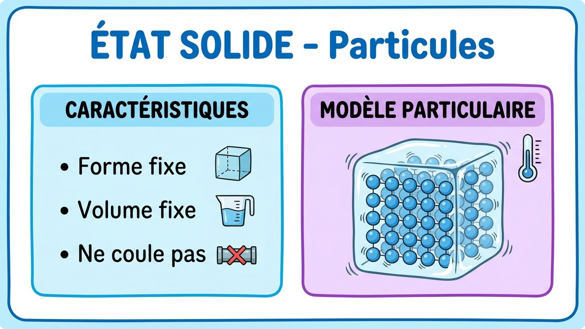
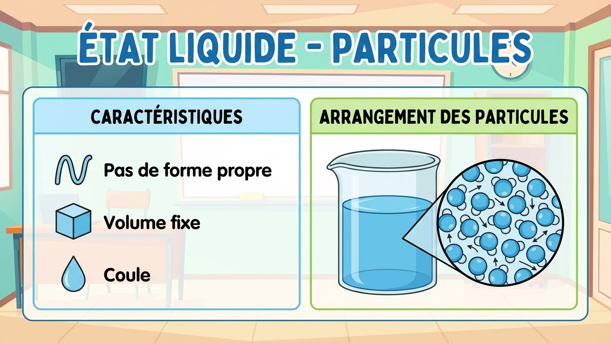
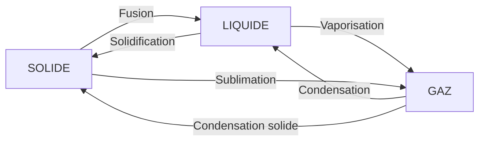
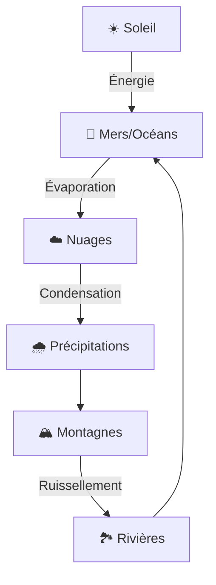

# Module 2 - Les états de la matière

!!! info "Objectifs du module"
    À la fin de ce module, tu sauras :

    - 🎯 Identifier les trois états de la matière
    - 🎯 Décrire les caractéristiques de chaque état
    - 🎯 Expliquer les changements d'état
    - 🎯 Comprendre le cycle de l'eau

    **Durée estimée : 2-3 heures**

---

## 🎮 Dans la vraie vie : les états de la matière au quotidien

!!! tip "Tu observes les changements d'état tous les jours !"

    **Dans ta cuisine :**

    | Observation | Changement d'état |
    |-------------|-------------------|
    | Glaçons qui fondent | Fusion (solide → liquide) |
    | Eau qui bout | Vaporisation (liquide → gaz) |
    | Buée sur la vitre | Liquéfaction (gaz → liquide) |
    | Givre dans le congélateur | Solidification (liquide → solide) |

    **Dehors :**

    | Observation | Changement d'état |
    |-------------|-------------------|
    | Neige qui fond | Fusion |
    | Rosée du matin | Liquéfaction |
    | Flaques qui sèchent | Évaporation |
    | Verglas sur la route | Solidification |

!!! example "Les états de la matière dans les jeux"

    **Dans Minecraft :**

    - **Eau** → Coule, forme des lacs (liquide)
    - **Glace** → On peut marcher dessus (solide)
    - **Lave** → Coule aussi (liquide très chaud !)

    **L'eau peut se transformer en glace si tu la mets dans un biome neigeux !**

    **Dans Pokémon :**

    - Types **Glace** → Attaques de solidification
    - Types **Eau** → État liquide
    - Types **Feu** → Provoquent la vaporisation

!!! warning "Les températures clés de l'eau"
    { loading=lazy }

    **À retenir :**

    - 0°C = l'eau gèle (ou fond)
    - 100°C = l'eau bout (à pression normale)

??? warning "⚠️ Pièges à éviter : les états de la matière"

    **Piège 1 : Confondre fusion et dissolution**

    | Fusion | Dissolution |
    |--------|-------------|
    | Solide → Liquide | Solide qui "disparaît" dans un liquide |
    | Changement d'**état** | Changement de **mélange** |
    | Ex : Glace qui fond | Ex : Sucre dans l'eau |
    | La glace **devient** eau | Le sucre **reste** du sucre (dissous) |

    **Test :** Si tu évapores l'eau sucrée, tu retrouves le sucre → c'était une dissolution !

    ---

    **Piège 2 : Confondre vapeur d'eau et buée/nuages**

    - ❌ "La vapeur d'eau, c'est le nuage blanc au-dessus de la casserole"
    - ✅ La **vraie vapeur** est **invisible** (c'est un gaz)

    Ce qu'on voit (nuage blanc) = de minuscules **gouttelettes d'eau liquide** = condensation !

    ---

    **Piège 3 : Inverser les noms des changements d'état**

    | Changement | Nom correct | Erreur fréquente |
    |------------|-------------|------------------|
    | Solide → Liquide | **Fusion** | ≠ Solidification |
    | Liquide → Solide | **Solidification** | ≠ Fusion |
    | Liquide → Gaz | **Vaporisation** | ≠ Condensation |
    | Gaz → Liquide | **Condensation** | ≠ Vaporisation |

    **Astuce :** Le nom indique le résultat → "solidification" = ça devient solide !

    ---

    **Piège 4 : Croire que la température change pendant un changement d'état**

    - ❌ "Pendant que la glace fond, la température augmente"
    - ✅ Pendant la fusion, la température reste à **0°C** (palier de température)

    Toute l'énergie sert à **changer l'état**, pas à chauffer !

    ---

    **Piège 5 : Confondre évaporation et ébullition**

    | Évaporation | Ébullition |
    |-------------|-----------|
    | À **toute température** | À **100°C** (pour l'eau) |
    | Lente, en surface | Rapide, dans tout le liquide |
    | Ex : Flaque qui sèche | Ex : Eau qui bout |

!!! example "Le cycle de l'eau dans la nature"

    **Tu l'observes tout le temps :**

    1. **Évaporation** : Le soleil chauffe les océans → l'eau s'évapore
    2. **Condensation** : La vapeur refroidit en altitude → nuages
    3. **Précipitations** : Pluie, neige, grêle
    4. **Ruissellement** : L'eau retourne vers la mer

    **Et ça recommence à l'infini depuis des milliards d'années !**

---

## Introduction

!!! question "Problématique"
    **Pourquoi l'eau peut-elle être glace, liquide ou vapeur ?**

La matière peut exister sous trois formes différentes appelées **états**. L'eau est l'exemple parfait : glaçon (solide), eau du robinet (liquide), vapeur (gaz).

{ loading=lazy }

---

## 1. Les trois états de la matière

### 1.1 L'état solide

!!! success "À retenir"
    À l'état **solide**, la matière a une **forme propre** et un **volume propre**. Elle ne coule pas et ne se déforme pas facilement.

??? abstract "🔄 Autre façon de comprendre : les 3 états"
    **Imagine les particules comme des élèves dans une classe !**

    **SOLIDE = élèves assis à leur place**
    - Chacun à sa place, bien rangés
    - Ils peuvent bouger un peu (vibrer) mais restent assis
    - La forme de la classe ne change pas

    **LIQUIDE = élèves debout qui circulent**
    - Ils peuvent se déplacer, mais restent dans la salle
    - Ils se croisent, se poussent
    - Prennent la forme de la pièce mais ne sortent pas

    **GAZ = récréation, tout le monde court partout !**
    - Les élèves courent dans tous les sens
    - Ils occupent tout l'espace disponible
    - Ils se cognent et rebondissent

    ---

    **Le tableau récapitulatif :**

    | État | Forme | Volume | Les particules... |
    |------|-------|--------|-------------------|
    | SOLIDE | Fixe | Fixe | Vibrent sur place |
    | LIQUIDE | Variable | Fixe | Glissent les unes sur les autres |
    | GAZ | Variable | Variable | Bougent dans tous les sens |

    ---

    **L'astuce pour retenir :**

    "Un solide est **solide** comme un roc"
    "Un liquide est **liquide** comme l'eau"
    "Un gaz **s'envole** comme l'air"

{ loading=lazy }

**Exemples :** glace, pierre, bois, métal, sel

### 1.2 L'état liquide

!!! success "À retenir"
    À l'état **liquide**, la matière n'a **pas de forme propre** (elle prend la forme du récipient) mais a un **volume propre**. Elle coule.

{ loading=lazy }

**Exemples :** eau, huile, lait, essence

### 1.3 L'état gazeux

!!! success "À retenir"
    À l'état **gazeux**, la matière n'a **ni forme propre ni volume propre**. Elle occupe tout l'espace disponible. Les gaz sont souvent invisibles.

{ loading=lazy }

**Exemples :** air, vapeur d'eau, CO₂, hélium

### 1.4 Tableau récapitulatif

| Propriété | Solide | Liquide | Gaz |
|-----------|:------:|:-------:|:---:|
| Forme propre | ✅ Oui | ❌ Non | ❌ Non |
| Volume propre | ✅ Oui | ✅ Oui | ❌ Non |
| Compressible | ❌ Non | ❌ Non | ✅ Oui |
| Coule | ❌ Non | ✅ Oui | ✅ Oui |
| Particules | Très serrées | Proches | Très espacées |

---

## 2. Les changements d'état

### 2.1 Vue d'ensemble

!!! success "À retenir"
    Un **changement d'état** est le passage d'un état à un autre. Il se produit à une **température précise** et nécessite un **apport ou une perte de chaleur**.



### 2.2 Les six changements d'état

| Changement | De | Vers | Exemple |
|------------|:--:|:----:|---------|
| **Fusion** | Solide | Liquide | Glace → Eau |
| **Solidification** | Liquide | Solide | Eau → Glace |
| **Vaporisation** | Liquide | Gaz | Eau → Vapeur |
| **Condensation** (liquéfaction) | Gaz | Liquide | Vapeur → Eau |
| **Sublimation** | Solide | Gaz | Neige → Vapeur |
| **Condensation solide** | Gaz | Solide | Givre |

### 2.3 Températures de changement d'état

!!! success "À retenir"
    Pour l'eau (à pression normale) :

    - **Fusion/Solidification** : **0°C**
    - **Vaporisation/Condensation** : **100°C**

{ loading=lazy }

### 2.4 Énergie et changements d'état

!!! success "À retenir"
    - Pour **fondre** ou **s'évaporer**, il faut **apporter de la chaleur** (énergie)
    - Pour **se solidifier** ou **se condenser**, il faut **retirer de la chaleur**

{ loading=lazy }

---

## 3. Le cycle de l'eau

### 3.1 L'eau dans la nature

!!! success "À retenir"
    L'eau sur Terre se transforme en permanence selon le **cycle de l'eau**. Elle passe par les trois états grâce à l'énergie du Soleil.



### 3.2 Les étapes du cycle

1. **Évaporation** : L'eau des océans, lacs, rivières s'évapore sous l'effet du Soleil
2. **Condensation** : La vapeur d'eau monte, se refroidit et forme des nuages
3. **Précipitations** : L'eau retombe (pluie, neige, grêle)
4. **Ruissellement** : L'eau coule vers les rivières puis les océans
5. **Infiltration** : Une partie s'infiltre dans le sol (nappes phréatiques)

---

## 4. Expériences à faire

### Expérience 1 : La fusion de la glace

!!! example "Observer la fusion"
    **Matériel** : Glaçons, assiette, thermomètre

    **Protocole** :
    1. Place des glaçons dans une assiette
    2. Mesure la température régulièrement
    3. Note quand la glace commence à fondre

    **Observation** : La température reste à **0°C** pendant toute la fusion.

    **Conclusion** : La fusion se fait à température **constante**.

### Expérience 2 : La condensation

!!! example "Observer la condensation"
    **Matériel** : Un verre, de l'eau froide, des glaçons

    **Protocole** :
    1. Remplis un verre d'eau très froide avec des glaçons
    2. Observe l'extérieur du verre

    **Observation** : Des gouttelettes apparaissent sur l'extérieur du verre.

    **Conclusion** : La vapeur d'eau de l'air se **condense** au contact du verre froid.

### Expérience 3 : L'ébullition

!!! example "Observer l'ébullition (avec un adulte !)"
    **Matériel** : Casserole, eau, plaque chauffante, thermomètre de cuisine

    **Protocole** :
    1. Chauffe l'eau et mesure la température régulièrement
    2. Note quand apparaissent les bulles

    **Observation** : L'ébullition se produit à **100°C** et la température ne monte plus.

    **Conclusion** : L'ébullition se fait à température **constante** (100°C).

---

## Exercices guidés

### Exercice 1 : Identifier l'état

??? question "Indique l'état (solide, liquide ou gaz) de chaque élément"
    1. Un glaçon : ___
    2. De l'huile : ___
    3. De la fumée : ___
    4. Du sable : ___
    5. De la vapeur d'eau : ___

    ??? success "Correction"
        1. Un glaçon : **solide**
        2. De l'huile : **liquide**
        3. De la fumée : **gaz** (+ particules solides)
        4. Du sable : **solide** (ensemble de grains solides)
        5. De la vapeur d'eau : **gaz**

### Exercice 2 : Nommer les changements d'état

??? question "Donne le nom du changement d'état"
    1. Solide → Liquide : ___
    2. Liquide → Gaz : ___
    3. Gaz → Liquide : ___
    4. Liquide → Solide : ___

    ??? success "Correction"
        1. Solide → Liquide : **fusion**
        2. Liquide → Gaz : **vaporisation**
        3. Gaz → Liquide : **condensation** (ou liquéfaction)
        4. Liquide → Solide : **solidification**

### Exercice 3 : Vrai ou Faux

??? question "Réponds par vrai ou faux"
    1. Un gaz a un volume propre.
    2. Un liquide prend la forme de son récipient.
    3. La fusion de l'eau se fait à 100°C.
    4. Les particules d'un solide sont immobiles.
    5. La condensation nécessite de retirer de la chaleur.

    ??? success "Correction"
        1. **FAUX** - Un gaz occupe tout l'espace disponible
        2. **VRAI** - Le liquide n'a pas de forme propre
        3. **FAUX** - La fusion se fait à 0°C (l'ébullition à 100°C)
        4. **FAUX** - Elles vibrent sur place
        5. **VRAI** - Passage de gaz à liquide = perte de chaleur

---

## Entraînement

### Exercice 4 : Questions de cours

??? question "Réponds aux questions suivantes"
    1. Quels sont les trois états de la matière ?
    2. À quelle température l'eau gèle-t-elle ?
    3. Comment appelle-t-on le passage de l'état liquide à l'état gazeux ?
    4. Pourquoi dit-on que les gaz sont compressibles ?
    5. Qu'est-ce que le cycle de l'eau ?

    ??? success "Correction"
        1. **Solide, liquide, gazeux**
        2. **0°C**
        3. **Vaporisation** (ou évaporation, ébullition)
        4. Car les particules sont **très espacées** → on peut les rapprocher
        5. Le mouvement permanent de l'eau dans la nature (évaporation, condensation, précipitations, ruissellement)

### Exercice 5 : Schéma du cycle de l'eau

??? question "Complète le schéma avec les mots : évaporation, condensation, précipitations, ruissellement"
    ```
                ☁️ Nuages
               ↗       ↘
              ?         ?
             ↗           ↘
        🌊 Mer    ←    🏔️ Montagne
                  ?
    ```

    ??? success "Correction"
        - Mer → Nuages : **évaporation**
        - Nuages (formation) : **condensation**
        - Nuages → Montagne : **précipitations**
        - Montagne → Mer : **ruissellement**

---

## Évaluation

### Quiz de validation (10 questions)

??? question "Question 1 : Quels sont les trois états de la matière ?"
    - A) Chaud, froid, tiède
    - B) Solide, liquide, gazeux
    - C) Dur, mou, souple
    - D) Lourd, léger, moyen

    ??? success "Réponse"
        **B) Solide, liquide, gazeux**

??? question "Question 2 : Quel état a une forme et un volume propres ?"
    - A) Solide
    - B) Liquide
    - C) Gazeux
    - D) Les trois

    ??? success "Réponse"
        **A) Solide**

??? question "Question 3 : Comment appelle-t-on le passage solide → liquide ?"
    - A) Solidification
    - B) Vaporisation
    - C) Fusion
    - D) Condensation

    ??? success "Réponse"
        **C) Fusion**

??? question "Question 4 : À quelle température l'eau bout-elle ?"
    - A) 0°C
    - B) 50°C
    - C) 100°C
    - D) 200°C

    ??? success "Réponse"
        **C) 100°C** (à pression normale)

??? question "Question 5 : Quelle transformation observe-t-on quand des gouttes apparaissent sur un verre froid ?"
    - A) Évaporation
    - B) Fusion
    - C) Condensation
    - D) Sublimation

    ??? success "Réponse"
        **C) Condensation** (vapeur d'eau → gouttelettes)

??? question "Question 6 : Les particules d'un gaz sont..."
    - A) Très serrées et immobiles
    - B) Très espacées et rapides
    - C) Proches et lentes
    - D) Alignées et ordonnées

    ??? success "Réponse"
        **B) Très espacées et rapides**

??? question "Question 7 : Pour faire fondre de la glace, il faut..."
    - A) Retirer de la chaleur
    - B) Apporter de la chaleur
    - C) Ajouter de l'eau
    - D) Agiter fortement

    ??? success "Réponse"
        **B) Apporter de la chaleur**

??? question "Question 8 : Qu'est-ce que la sublimation ?"
    - A) Solide → Liquide
    - B) Liquide → Gaz
    - C) Solide → Gaz
    - D) Gaz → Liquide

    ??? success "Réponse"
        **C) Solide → Gaz** (passage direct sans passer par le liquide)

??? question "Question 9 : Dans le cycle de l'eau, qu'est-ce qui fournit l'énergie pour l'évaporation ?"

    ??? success "Réponse"
        **Le Soleil**

??? question "Question 10 : Un liquide a-t-il un volume propre ?"

    ??? success "Réponse"
        **Oui**, un liquide a un volume propre (mais pas de forme propre)

---

## Bonus

### Le savais-tu ?

!!! tip "Anecdotes fascinantes"
    - La **neige carbonique** (CO₂ solide) se sublime directement en gaz à -78°C !
    - Sur le **Mont Everest**, l'eau bout à seulement **70°C** car la pression est plus faible
    - Un nuage contient environ **500 tonnes d'eau** sous forme de gouttelettes
    - La **vapeur d'eau** est invisible ! Ce qu'on voit sortir d'une casserole, ce sont de fines gouttelettes d'eau (condensation)
    - Sur **Mars**, l'eau ne peut exister à l'état liquide : elle passe directement de glace à vapeur

### Défi

??? question "Défi : Crée un mini cycle de l'eau"
    **Mission** : Observe le cycle de l'eau dans un bocal !

    **Matériel** :
    - Un grand bocal en verre avec couvercle
    - De l'eau chaude
    - Des glaçons
    - Du colorant alimentaire (optionnel)

    **Protocole** :
    1. Verse de l'eau chaude au fond du bocal (2-3 cm)
    2. Pose le couvercle retourné avec des glaçons dessus
    3. Observe pendant 10 minutes

    **Observations attendues** :
    - Évaporation : l'eau chaude s'évapore
    - Condensation : la vapeur se condense sur le couvercle froid
    - Précipitations : les gouttes retombent

---

## Fiche de révision

!!! abstract "L'essentiel à retenir"

    **LES TROIS ÉTATS**

    | État | Forme | Volume | Particules |
    |------|:-----:|:------:|------------|
    | Solide | Propre | Propre | Serrées, ordonnées |
    | Liquide | Non | Propre | Proches, mobiles |
    | Gaz | Non | Non | Espacées, rapides |

    **CHANGEMENTS D'ÉTAT**

    - **Fusion** : solide → liquide (à 0°C pour l'eau)
    - **Solidification** : liquide → solide
    - **Vaporisation** : liquide → gaz (à 100°C pour l'eau)
    - **Condensation** : gaz → liquide

    **ÉNERGIE**

    - Fusion/Vaporisation : **apport** de chaleur
    - Solidification/Condensation : **perte** de chaleur

    **CYCLE DE L'EAU**

    Évaporation → Condensation (nuages) → Précipitations → Ruissellement

---

## Navigation

[⬅️ Module 1 - Qu'est-ce que la matière ?](module-01-matiere.md){ .md-button }
[➡️ Module 3 - Les mélanges](module-03-melanges.md){ .md-button .md-button--primary }
