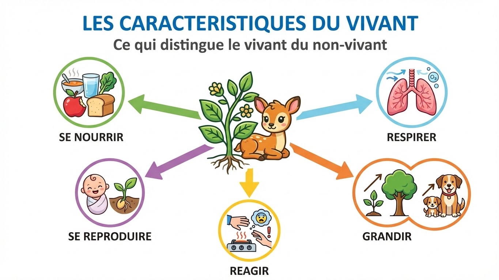

# Module 5 - Les êtres vivants

!!! info "Objectifs du module"
    À la fin de ce module, tu sauras :

    - 🎯 Identifier les caractéristiques du vivant
    - 🎯 Classer les êtres vivants
    - 🎯 Comprendre la biodiversité
    - 🎯 Utiliser une clé de détermination

    **Durée estimée : 2-3 heures**

---

## 🎮 Dans la vraie vie : le vivant autour de toi

!!! tip "Vivant ou non vivant ? Le test !"

    **Comment savoir si quelque chose est vivant ?**

    | Caractéristique | Exemple |
    |-----------------|---------|
    | Naître | Un chaton naît de sa mère |
    | Se nourrir | Tu manges pour avoir de l'énergie |
    | Grandir | Tu grandis chaque année |
    | Se reproduire | Les plantes font des graines |
    | Réagir | Tu fermes les yeux face au soleil |
    | Mourir | Les feuilles tombent en automne |

    **Si ça fait TOUT ça = VIVANT !**

!!! example "Les êtres vivants dans les jeux vidéo"

    **Dans Pokémon :**

    - Les Pokémon naissent d'œufs → Naître
    - Ils mangent des Pokéblocs → Se nourrir
    - Ils évoluent → Grandir
    - Ils pondent des œufs → Se reproduire
    - Ils réagissent aux attaques → Réagir

    **Dans Minecraft :**

    - Les animaux ont des bébés
    - Il faut les nourrir (blé pour les vaches)
    - Les arbres poussent à partir de graines

{ width="100%" loading=lazy }

!!! warning "Attention aux pièges !"

    **Ce qui SEMBLE vivant mais ne l'est PAS :**

    | Objet | Pourquoi pas vivant ? |
    |-------|----------------------|
    | Robot / IA | Ne se reproduit pas seul |
    | Feu | Ne se nourrit pas vraiment, ne se reproduit pas |
    | Voiture | Construite, pas née |
    | Nuage | N'a pas de cycle de vie |

    **Ce qui EST vivant mais surprend :**

    | Être vivant | Pourquoi vivant ? |
    |-------------|------------------|
    | Champignon | Se nourrit, se reproduit (spores) |
    | Corail | Animal marin ! (pas une plante) |
    | Bactérie | Naît, se nourrit, se reproduit |

??? warning "⚠️ Pièges à éviter : les êtres vivants"

    **Piège 1 : Confondre "bouge" et "vivant"**

    - ❌ "La voiture bouge, donc elle est vivante"
    - ✅ Bouger n'est **pas** un critère du vivant !

    Un arbre ne bouge pas (ou très peu) mais il est vivant.
    Une voiture bouge mais elle n'est pas vivante.

    ---

    **Piège 2 : Mal classer les champignons**

    - ❌ "Les champignons sont des plantes"
    - ✅ Les champignons sont un **règne à part** (ni plantes, ni animaux)

    | Plantes | Champignons |
    |---------|-------------|
    | Photosynthèse | Pas de photosynthèse |
    | Fabriquent leur nourriture | Se nourrissent de matière morte |
    | Vertes (chlorophylle) | Pas de couleur verte |

    ---

    **Piège 3 : Penser que les coraux sont des plantes**

    - ❌ "Le corail est une plante car il ne bouge pas"
    - ✅ Le corail est un **animal** (cnidaire)

    Le corail a des tentacules pour capturer sa nourriture !

    ---

    **Piège 4 : Confondre vertébrés et invertébrés**

    | Vertébrés | Invertébrés |
    |-----------|-------------|
    | Colonne vertébrale | Pas de colonne vertébrale |
    | ~70 000 espèces | ~1,3 million d'espèces |
    | Mammifères, oiseaux, poissons... | Insectes, araignées, mollusques... |

    **Les invertébrés sont beaucoup plus nombreux !**

    ---

    **Piège 5 : Confondre insectes et araignées**

    | Insectes | Araignées |
    |----------|-----------|
    | **6 pattes** | **8 pattes** |
    | 3 parties du corps | 2 parties du corps |
    | Souvent des ailes | Jamais d'ailes |
    | Ex : mouche, abeille | Ex : araignée, scorpion |

    **L'araignée n'est PAS un insecte, c'est un arachnide !**

!!! example "La biodiversité en chiffres"

    **Combien d'espèces sur Terre ?**

    - ~2 millions d'espèces connues
    - Peut-être 10 millions au total !
    - ~10 000 nouvelles espèces découvertes chaque année

    **Comparaisons :**

    - 1 forêt tropicale = plus d'espèces que toute l'Europe
    - 1 poignée de terre = des milliards de bactéries

---

## 1. Qu'est-ce qu'un être vivant ?

### 1.1 Les caractéristiques du vivant

!!! success "À retenir"
    Un **être vivant** est capable de :
    - **Naître** (ou germer pour les plantes)
    - **Se nourrir**
    - **Grandir** (croissance)
    - **Se reproduire**
    - **Réagir** à son environnement
    - **Mourir**

??? abstract "🔄 Autre façon de comprendre : vivant ou pas ?"
    **Le test des 6 critères !**

    Pour savoir si quelque chose est vivant, vérifie s'il peut :

    1. **N**aître
    2. **S**e nourrir
    3. **G**randir
    4. **S**e reproduire
    5. **R**éagir
    6. **M**ourir

    **Astuce mnémotechnique : "N'aie Surtout Grandi Sans Réfléchir Maintenant"**

    ---

    **Exemples :**

    | Chose | N | S | G | S | R | M | Vivant ? |
    |-------|---|---|---|---|---|---|----------|
    | Chien | ✅ | ✅ | ✅ | ✅ | ✅ | ✅ | OUI |
    | Robot | ❌ | ❌ | ❌ | ❌ | ✅ | ❌ | NON |
    | Feu | ❌ | ❌ | ✅ | ❌ | ✅ | ✅ | NON |
    | Arbre | ✅ | ✅ | ✅ | ✅ | ✅ | ✅ | OUI |

    ---

    **Les pièges classiques :**

    - Le **feu** semble vivant (il "grandit", "meurt") mais ne se reproduit pas vraiment
    - Les **virus** sont à la limite (ils ne se nourrissent pas seuls)
    - Les **coraux** sont des animaux (pas des plantes !)
    - Les **champignons** sont vivants (mais ni plantes, ni animaux)

```
    LE CYCLE DE VIE D'UN ÊTRE VIVANT

         NAISSANCE
             │
             ▼
        CROISSANCE ◄────── SE NOURRIR
             │
             ▼
       REPRODUCTION
             │
             ▼
           MORT

    + Réagir à l'environnement (bouger, se protéger...)
```

### 1.2 Vivant ou non vivant ?

| Êtres vivants | Non vivants |
|---------------|-------------|
| Arbre | Pierre |
| Champignon | Eau |
| Bactérie | Robot |
| Humain | Voiture |
| Corail | Nuage |

!!! warning "Attention !"
    Un objet qui **bouge** n'est pas forcément vivant (voiture, robot).
    Un être vivant peut être **immobile** (arbre, corail).

---

## 2. La classification du vivant

### 2.1 Les grands groupes

!!! success "À retenir"
    On classe les êtres vivants selon leurs **caractéristiques communes** (et non leur mode de vie).

```
    CLASSIFICATION SIMPLIFIÉE

                      ÊTRES VIVANTS
                           │
           ┌───────────────┼───────────────┐
           │               │               │
       ANIMAUX         VÉGÉTAUX      CHAMPIGNONS
           │               │               │
     ┌─────┴─────┐    (plantes)     (ni animal
     │           │                   ni plante)
  VERTÉBRÉS  INVERTÉBRÉS

  Avec colonne   Sans colonne
  vertébrale     vertébrale
```

### 2.2 Les vertébrés

| Groupe | Caractéristiques | Exemples |
|--------|------------------|----------|
| **Mammifères** | Poils, allaitent | Chien, baleine, humain |
| **Oiseaux** | Plumes, bec | Aigle, pingouin |
| **Reptiles** | Écailles, sang froid | Serpent, crocodile |
| **Amphibiens** | Peau nue, métamorphose | Grenouille, salamandre |
| **Poissons** | Écailles, branchies | Requin, saumon |

### 2.3 Les invertébrés

- **Insectes** : 6 pattes (mouche, fourmi)
- **Arachnides** : 8 pattes (araignée, scorpion)
- **Crustacés** : carapace (crabe, crevette)
- **Mollusques** : corps mou (escargot, pieuvre)
- **Vers** : corps allongé (ver de terre)

---

## 3. La biodiversité

### 3.1 Définition

!!! success "À retenir"
    La **biodiversité** est la diversité de tous les êtres vivants sur Terre. Elle comprend :
    - La diversité des **espèces**
    - La diversité des **écosystèmes**
    - La diversité **génétique** (au sein d'une espèce)

### 3.2 Menaces sur la biodiversité

```
    CAUSES DE LA PERTE DE BIODIVERSITÉ

    🏗️ Destruction des habitats (déforestation)
    🌡️ Changement climatique
    🏭 Pollution
    🎣 Surexploitation (pêche, chasse)
    🐀 Espèces invasives
```

---

## Exercices

??? question "Exercice 1 : Vivant ou non vivant ?"
    Classe ces éléments : champignon, rocher, virus, feu, bactérie

    ??? success "Correction"
        - Champignon : **vivant**
        - Rocher : **non vivant**
        - Virus : **frontière** (ne se reproduit qu'avec un hôte)
        - Feu : **non vivant** (réaction chimique)
        - Bactérie : **vivant**

??? question "Exercice 2 : Classe ces animaux en vertébrés/invertébrés"
    Chat, araignée, poisson, abeille, serpent, escargot

    ??? success "Correction"
        - Vertébrés : **chat** (mammifère), **poisson**, **serpent** (reptile)
        - Invertébrés : **araignée** (arachnide), **abeille** (insecte), **escargot** (mollusque)

---

## Évaluation

??? question "Question 1 : Cite 4 caractéristiques du vivant."

    ??? success "Réponse"
        Parmi : naître, se nourrir, grandir, se reproduire, réagir, mourir

??? question "Question 2 : Les animaux à colonne vertébrale sont appelés..."
    - A) Invertébrés
    - B) Vertébrés
    - C) Mammifères
    - D) Insectes

    ??? success "Réponse"
        **B) Vertébrés**

??? question "Question 3 : Un insecte a combien de pattes ?"

    ??? success "Réponse"
        **6 pattes**

??? question "Question 4 : Qu'est-ce que la biodiversité ?"

    ??? success "Réponse"
        La **diversité de tous les êtres vivants** sur Terre (espèces, écosystèmes, génétique)

---

## Fiche de révision

!!! abstract "L'essentiel à retenir"

    **CARACTÉRISTIQUES DU VIVANT**
    - Naître, se nourrir, grandir, se reproduire, réagir, mourir

    **CLASSIFICATION**
    - **Vertébrés** : mammifères, oiseaux, reptiles, amphibiens, poissons
    - **Invertébrés** : insectes (6 pattes), arachnides (8 pattes), mollusques, crustacés

    **BIODIVERSITÉ**
    - Diversité des espèces sur Terre
    - Menacée par : pollution, déforestation, changement climatique

---

## Navigation

[⬅️ Module 4 - Le mouvement](module-04-mouvement.md){ .md-button }
[➡️ Module 6 - La cellule](module-06-cellule.md){ .md-button .md-button--primary }
