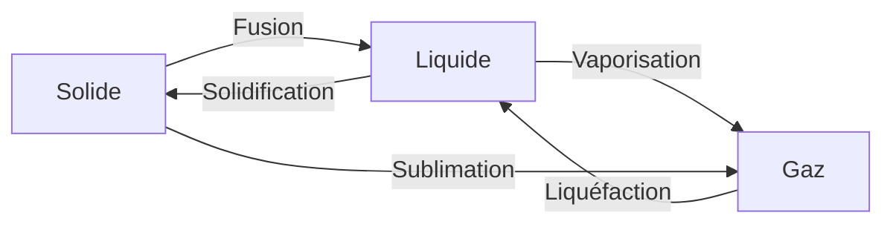
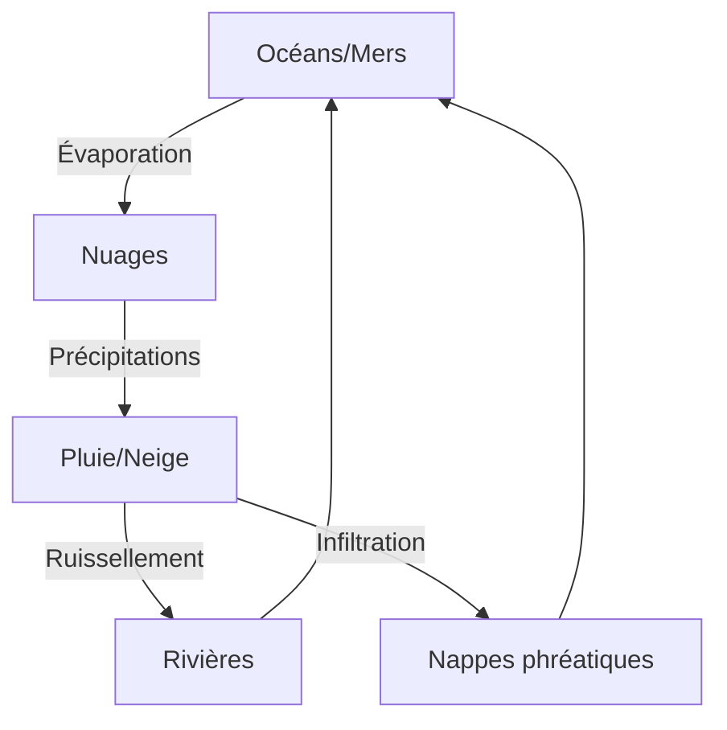

# Matière & Mouvement

## La matière

### Qu'est-ce que la matière ?

!!! info "Définition"
    La **matière** est tout ce qui a une masse et occupe un volume. Elle est constituée de particules microscopiques.

### Les trois états de la matière

| État | Forme | Volume | Particules |
|------|-------|--------|------------|
| **Solide** | Propre | Propre | Très serrées, vibrent sur place |
| **Liquide** | Celle du récipient | Propre | Proches, glissent les unes sur les autres |
| **Gaz** | Celle du récipient | Celui du récipient | Très espacées, se déplacent librement |

### Les changements d'état

| Changement | Départ → Arrivée | Exemple |
|------------|------------------|---------|
| **Fusion** | Solide → Liquide | Glace qui fond |
| **Solidification** | Liquide → Solide | Eau qui gèle |
| **Vaporisation** | Liquide → Gaz | Eau qui bout |
| **Liquéfaction** | Gaz → Liquide | Buée sur une vitre |
| **Sublimation** | Solide → Gaz | Neige carbonique |

!!! note "Température de changement d'état de l'eau"
    - **Fusion/Solidification** : 0°C
    - **Vaporisation/Liquéfaction** : 100°C (à pression atmosphérique)

!!! warning "Conservation de la masse"
    Lors d'un changement d'état, la **masse ne change pas**, seul le volume peut varier.

---

## La masse et le volume

### La masse

!!! info "Définition"
    La **masse** mesure la quantité de matière d'un objet. Elle se mesure en **grammes (g)** ou **kilogrammes (kg)**.

| Instrument | Usage |
|------------|-------|
| **Balance** | Mesurer la masse |
| **Balance électronique** | Mesure précise |

### Le volume

!!! info "Définition"
    Le **volume** mesure l'espace occupé par un objet ou un liquide. Il se mesure en **litres (L)** ou **centimètres cubes (cm³)**.

| Instrument | Usage |
|------------|-------|
| **Éprouvette graduée** | Mesurer le volume d'un liquide |
| **Règle/Mètre** | Calculer le volume d'un solide |

!!! tip "Mesurer le volume d'un liquide"
    Placer l'œil **au niveau du liquide** et lire la graduation au niveau du **ménisque** (creux du liquide).

### Relation masse-volume

!!! note "Masse volumique"
    La **masse volumique** (ρ) = masse / volume

    $$\rho = \frac{m}{V}$$

    Unité : g/cm³ ou kg/L

| Substance | Masse volumique |
|-----------|:---:|
| Eau | 1 g/cm³ |
| Huile | 0,9 g/cm³ |
| Fer | 7,9 g/cm³ |
| Air | 0,0013 g/cm³ |

!!! example "Pourquoi l'huile flotte sur l'eau ?"
    L'huile a une masse volumique (0,9) **inférieure** à celle de l'eau (1).

---

## Les mélanges

### Mélanges homogènes et hétérogènes

| Type | Définition | Exemple |
|------|------------|---------|
| **Homogène** | On ne distingue pas les constituants | Eau salée, sirop |
| **Hétérogène** | On distingue les constituants | Eau + sable, vinaigrette |

### Techniques de séparation

| Technique | Usage | Principe |
|-----------|-------|----------|
| **Décantation** | Séparer liquide/solide | Laisser reposer, le solide tombe |
| **Filtration** | Séparer liquide/solide | Le solide reste dans le filtre |
| **Évaporation** | Récupérer le solide dissous | L'eau s'évapore, le sel reste |
| **Distillation** | Séparer des liquides | Différentes températures d'ébullition |

!!! example "Obtenir du sel à partir d'eau de mer"
    1. **Décantation** : éliminer le sable
    2. **Filtration** : éliminer les impuretés
    3. **Évaporation** : l'eau s'évapore, le sel reste

---

## L'eau

### L'eau dans la nature

!!! info "Le cycle de l'eau"
    L'eau circule en permanence entre l'atmosphère, les océans et les continents.

### Eau potable et eau non potable

| Critère | Eau potable | Eau non potable |
|---------|-------------|-----------------|
| Aspect | Claire, incolore | Peut être trouble |
| Odeur | Sans odeur | Peut avoir une odeur |
| Goût | Agréable | Peut avoir un goût |
| Micro-organismes | Très peu | Peut en contenir |

!!! warning "L'eau potable"
    Même limpide, une eau peut être **non potable** si elle contient des micro-organismes dangereux.

### Production d'eau potable

| Étape | Objectif |
|-------|----------|
| **Pompage** | Prélever l'eau brute |
| **Décantation** | Éliminer les particules lourdes |
| **Filtration** | Éliminer les particules fines |
| **Désinfection** | Éliminer les micro-organismes (chlore, ozone, UV) |
| **Stockage** | Château d'eau |
| **Distribution** | Réseau de canalisations |

---

## Le mouvement

### Décrire un mouvement

!!! info "Référentiel"
    Pour décrire un mouvement, il faut choisir un **référentiel** (objet de référence considéré comme immobile).

!!! example "Le passager dans le train"
    - Dans le **référentiel train** : le passager est immobile
    - Dans le **référentiel gare** : le passager est en mouvement

### Trajectoire

!!! info "Définition"
    La **trajectoire** est l'ensemble des positions occupées par un objet au cours du temps.

| Type | Forme | Exemple |
|------|-------|---------|
| **Rectiligne** | Ligne droite | Chute libre, train |
| **Circulaire** | Cercle | Aiguille de montre |
| **Curviligne** | Courbe quelconque | Ballon lancé |

### Vitesse

!!! info "Définition"
    La **vitesse** indique la distance parcourue par unité de temps.

    $$v = \frac{d}{t}$$

    - v : vitesse (m/s ou km/h)
    - d : distance (m ou km)
    - t : temps (s ou h)

!!! example "Calcul de vitesse"
    Un cycliste parcourt 30 km en 2 h.

    v = 30 / 2 = **15 km/h**

### Conversion m/s ↔ km/h

!!! tip "Méthode"
    - **m/s → km/h** : multiplier par 3,6
    - **km/h → m/s** : diviser par 3,6

| km/h | m/s |
|:---:|:---:|
| 36 km/h | 10 m/s |
| 90 km/h | 25 m/s |
| 120 km/h | 33,3 m/s |

### Types de mouvement

| Type | Vitesse | Exemple |
|------|---------|---------|
| **Uniforme** | Constante | Voiture sur autoroute |
| **Accéléré** | Augmente | Voiture qui démarre |
| **Ralenti** | Diminue | Voiture qui freine |

---

## L'énergie

### Les formes d'énergie

| Forme | Description | Exemple |
|-------|-------------|---------|
| **Cinétique** | Énergie du mouvement | Voiture en marche |
| **Potentielle** | Énergie de position | Objet en hauteur |
| **Thermique** | Liée à la chaleur | Feu, radiateur |
| **Électrique** | Transport par courant | Prise, pile |
| **Lumineuse** | Portée par la lumière | Soleil, lampe |
| **Chimique** | Dans les liaisons chimiques | Essence, aliments |
| **Nucléaire** | Dans le noyau des atomes | Centrale nucléaire |

### Conversion d'énergie

!!! info "Principe"
    L'énergie peut se **transformer** d'une forme à une autre.

| Système | Entrée | Sortie |
|---------|--------|--------|
| Lampe | Électrique | Lumineuse + thermique |
| Voiture | Chimique | Cinétique + thermique |
| Éolienne | Cinétique (vent) | Électrique |
| Panneau solaire | Lumineuse | Électrique |

!!! warning "Conservation de l'énergie"
    L'énergie ne se crée pas, ne se détruit pas, elle se **transforme**.

---

## Quiz express

??? question "Quels sont les trois états de la matière ?"
    **Solide**, **liquide** et **gaz**

??? question "Comment s'appelle le passage de l'état liquide à l'état gazeux ?"
    La **vaporisation**

??? question "Un cycliste parcourt 45 km en 3 h. Quelle est sa vitesse ?"
    v = 45 / 3 = **15 km/h**

??? question "Pourquoi le bois flotte-t-il sur l'eau ?"
    Car sa **masse volumique** est inférieure à celle de l'eau.

??? question "Comment séparer le sel de l'eau de mer ?"
    Par **évaporation** : l'eau s'évapore et le sel reste.
