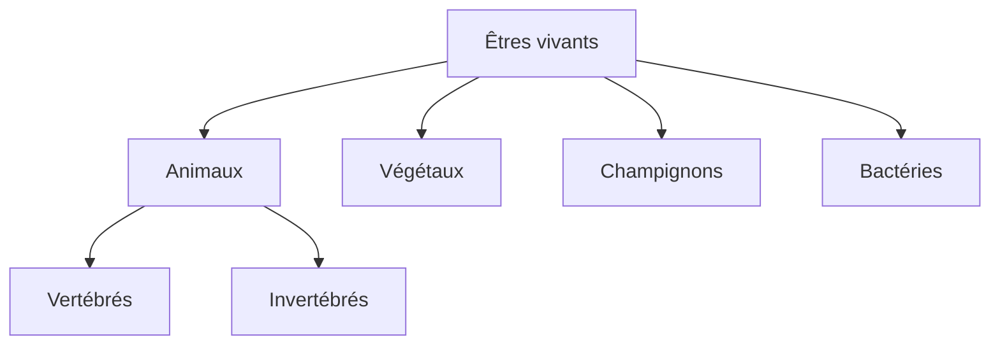

# Le Vivant

## Caractéristiques du vivant

### Qu'est-ce qu'un être vivant ?

!!! info "Définition"
    Un **être vivant** est un organisme qui :

    - Se nourrit
    - Respire
    - Grandit
    - Se reproduit
    - Réagit à son environnement

### La cellule, unité du vivant

!!! info "Définition"
    La **cellule** est l'unité de base de tous les êtres vivants.

| Élément | Rôle |
|---------|------|
| **Membrane** | Enveloppe, échanges avec l'extérieur |
| **Cytoplasme** | Milieu gélatineux, réactions chimiques |
| **Noyau** | Contient l'ADN, contrôle la cellule |

### Unicellulaires vs pluricellulaires

| Type | Description | Exemples |
|------|-------------|----------|
| **Unicellulaire** | 1 seule cellule | Bactérie, paramécie |
| **Pluricellulaire** | Plusieurs cellules | Humain, arbre |

---

## Classification du vivant

### Les grands groupes



### Les vertébrés

!!! info "Définition"
    Les **vertébrés** possèdent un squelette interne avec une colonne vertébrale.

| Groupe | Caractéristiques | Exemples |
|--------|------------------|----------|
| **Mammifères** | Poils, allaitement | Chat, baleine, humain |
| **Oiseaux** | Plumes, bec, ailes | Aigle, pingouin |
| **Reptiles** | Écailles, sang froid | Serpent, crocodile |
| **Amphibiens** | Peau nue, vie eau/terre | Grenouille, salamandre |
| **Poissons** | Écailles, branchies, nageoires | Requin, truite |

### Les invertébrés

| Groupe | Caractéristiques | Exemples |
|--------|------------------|----------|
| **Insectes** | 6 pattes, 3 parties | Abeille, fourmi |
| **Arachnides** | 8 pattes | Araignée, scorpion |
| **Crustacés** | Carapace, milieu aquatique | Crabe, crevette |
| **Mollusques** | Corps mou, coquille ou non | Escargot, pieuvre |
| **Vers** | Corps allongé | Ver de terre, sangsue |

### Les végétaux

| Type | Caractéristiques |
|------|------------------|
| **Plantes à fleurs** | Fleurs, fruits, graines |
| **Conifères** | Cônes (pommes de pin), aiguilles |
| **Fougères** | Pas de fleurs ni graines, spores |
| **Mousses** | Petites, milieux humides |
| **Algues** | Milieu aquatique |

---

## La nutrition

### Nutrition des végétaux

!!! info "Autotrophes"
    Les végétaux fabriquent leur propre matière organique grâce à la **photosynthèse**.

**Équation de la photosynthèse :**
```
Eau + Dioxyde de carbone + Lumière → Glucose + Dioxygène
      (CO₂)                           (sucre)   (O₂)
```

| Besoin | Source |
|--------|--------|
| Eau | Racines (sol) |
| Sels minéraux | Racines (sol) |
| CO₂ | Feuilles (air) |
| Lumière | Soleil |

!!! tip "Échange gazeux"
    - **Jour** : photosynthèse → absorbe CO₂, rejette O₂
    - **Nuit** : respiration uniquement → absorbe O₂, rejette CO₂

### Nutrition des animaux

!!! info "Hétérotrophes"
    Les animaux se nourrissent d'autres êtres vivants (végétaux ou animaux).

| Régime | Alimentation | Exemples |
|--------|--------------|----------|
| **Herbivore** | Végétaux | Vache, lapin |
| **Carnivore** | Animaux | Lion, aigle |
| **Omnivore** | Végétaux et animaux | Humain, ours |
| **Détritivore** | Matière morte | Ver de terre |

### La digestion

!!! info "Définition"
    La **digestion** transforme les aliments en nutriments absorbables par l'organisme.

| Organe | Rôle |
|--------|------|
| **Bouche** | Mastication, salive |
| **Œsophage** | Transport vers l'estomac |
| **Estomac** | Brassage, sucs gastriques |
| **Intestin grêle** | Digestion, absorption des nutriments |
| **Gros intestin** | Absorption de l'eau, déchets |

---

## La respiration

### Respiration et échanges gazeux

!!! info "Définition"
    La **respiration** permet de récupérer le dioxygène (O₂) et de rejeter le dioxyde de carbone (CO₂).

### Les différents types de respiration

| Type | Organe | Milieu | Exemples |
|------|--------|--------|----------|
| **Pulmonaire** | Poumons | Air | Mammifères, oiseaux, reptiles |
| **Branchiale** | Branchies | Eau | Poissons, crustacés |
| **Trachéenne** | Trachées | Air | Insectes |
| **Cutanée** | Peau | Air/Eau | Grenouille, ver de terre |

### Le trajet de l'air (humain)

```
Nez/Bouche → Trachée → Bronches → Bronchioles → Alvéoles
                                                    ↓
                                              Échanges gazeux
                                              (O₂ ↔ CO₂)
```

---

## La reproduction

### Reproduction sexuée

!!! info "Définition"
    Reproduction faisant intervenir deux individus de sexes différents et des **cellules reproductrices** (gamètes).

| Gamète | Sexe | Provenance |
|--------|------|------------|
| **Spermatozoïde** | Mâle | Testicules |
| **Ovule** | Femelle | Ovaires |

!!! note "Fécondation"
    Fusion d'un spermatozoïde et d'un ovule → cellule-œuf → embryon

| Type | Description | Exemples |
|------|-------------|----------|
| **Fécondation interne** | À l'intérieur du corps | Mammifères, oiseaux |
| **Fécondation externe** | Dans l'eau | Poissons, grenouilles |

### Développement

| Type | Description | Exemples |
|------|-------------|----------|
| **Vivipare** | Développement dans le ventre | Mammifères |
| **Ovipare** | Développement dans un œuf | Oiseaux, reptiles |
| **Ovovivipare** | Œuf gardé dans le corps | Certains requins |

### Reproduction asexuée

!!! info "Définition"
    Reproduction avec **un seul individu**, sans fécondation.

| Mode | Description | Exemple |
|------|-------------|---------|
| **Bourgeonnement** | Nouvel individu qui pousse | Hydre, levure |
| **Bouturage** | Morceau qui donne un nouvel individu | Plantes |
| **Division** | Cellule qui se divise en deux | Bactéries |

### Reproduction des plantes à fleurs

| Étape | Description |
|-------|-------------|
| 1. **Pollinisation** | Pollen transporté vers le pistil (vent, insectes) |
| 2. **Fécondation** | Grain de pollen + ovule |
| 3. **Formation du fruit** | La fleur se transforme en fruit |
| 4. **Dispersion des graines** | Vent, animaux, eau |
| 5. **Germination** | La graine donne une nouvelle plante |

---

## Relations entre les êtres vivants

### Les chaînes alimentaires

!!! info "Définition"
    Une **chaîne alimentaire** montre "qui mange qui".

```
Végétal → Herbivore → Carnivore
 (producteur)  (consommateur 1)  (consommateur 2)
```

!!! example "Exemple"
    Herbe → Sauterelle → Grenouille → Serpent → Aigle

### Le réseau trophique

!!! info "Définition"
    Ensemble des chaînes alimentaires d'un milieu, interconnectées.

### Producteurs, consommateurs, décomposeurs

| Rôle | Description | Exemples |
|------|-------------|----------|
| **Producteurs** | Fabriquent la matière organique | Végétaux |
| **Consommateurs** | Se nourrissent d'autres êtres | Animaux |
| **Décomposeurs** | Recyclent la matière morte | Champignons, bactéries |

### Relations entre espèces

| Relation | Description | Exemple |
|----------|-------------|---------|
| **Prédation** | Un mange l'autre | Lion-zèbre |
| **Parasitisme** | Un profite, l'autre souffre | Puce-chien |
| **Symbiose** | Les deux profitent | Anémone-poisson-clown |
| **Compétition** | Lutte pour les ressources | Deux prédateurs |

---

## Quiz express

??? question "Quelle est l'unité de base du vivant ?"
    La **cellule**

??? question "Comment les végétaux fabriquent-ils leur nourriture ?"
    Par la **photosynthèse** : eau + CO₂ + lumière → glucose + O₂

??? question "Qu'est-ce qu'un animal omnivore ?"
    Un animal qui mange à la fois des **végétaux** et des **animaux**.

??? question "Comment respirent les poissons ?"
    Par leurs **branchies** (respiration branchiale).

??? question "Qu'est-ce qu'une chaîne alimentaire ?"
    Une suite d'êtres vivants où chacun **mange le précédent**.

??? question "Quel est le rôle des décomposeurs ?"
    Ils **recyclent la matière morte** en matière minérale.
