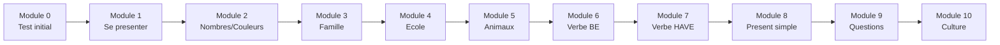

# Formation Anglais CM1

Bienvenue dans la formation complete **Anglais** !

---

## Progression

---

## Les modules

| Module | Theme | Duree |
|--------|-------|-------|
| [Module 0](module-00-positioning.md) | Test de positionnement | 30 min |
| [Module 1](module-01-introduce.md) | Se presenter | 1h |
| [Module 2](module-02-numbers-colours.md) | Nombres et couleurs | 1h |
| [Module 3](module-03-family.md) | La famille | 1h |
| [Module 4](module-04-school.md) | L'ecole | 1h |
| [Module 5](module-05-animals.md) | Les animaux | 1h |
| [Module 6](module-06-verb-be.md) | Le verbe BE | 1h |
| [Module 7](module-07-verb-have.md) | Le verbe HAVE | 1h |
| [Module 8](module-08-present-simple.md) | Le present simple | 1h |
| [Module 9](module-09-questions.md) | Poser des questions | 1h |
| [Module 10](module-10-culture.md) | Culture anglophone | 1h |

---

## Organisation

!!! info "Comment utiliser cette formation"
    1. **Commence par le Module 0** pour evaluer ton niveau
    2. **Ecoute bien les prononciations** (demande a ton professeur)
    3. **Repete a voix haute** les mots et les phrases
    4. **Complete les exercices** de chaque module

---

## Objectifs de l'annee

A la fin de cette formation, tu sauras :

- [ ] Te presenter en anglais
- [ ] Compter jusqu'a 100
- [ ] Parler de ta famille et de l'ecole
- [ ] Utiliser les verbes BE et HAVE
- [ ] Conjuguer au present simple
- [ ] Poser des questions simples

[:octicons-arrow-right-24: Commencer le Module 0](module-00-positioning.md)
