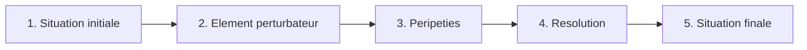

# Lecture & Litterature

!!! info "Objectifs du chapitre"
    A la fin de ce chapitre, tu sauras :

    - Identifier les differents genres litteraires
    - Comprendre la structure d'un recit
    - Reperer les personnages, le narrateur et le point de vue
    - Analyser un texte et repondre a des questions de comprehension

---

## Les genres litteraires

### Le conte

Le **conte** est un recit imaginaire, souvent merveilleux, avec une morale.

!!! example "Caracteristiques"
    - Commence souvent par "Il etait une fois..."
    - Personnages types : prince, princesse, sorciere, fee, ogre
    - Elements magiques : baguette, tapis volant, sortilege
    - Fin heureuse (en general)
    - **Morale** a la fin

!!! note "Exemples celebres"
    Cendrillon, Le Petit Chaperon Rouge, La Belle au Bois Dormant, Blanche-Neige

---

### Le roman

Le **roman** est un long recit de fiction en prose.

!!! example "Caracteristiques"
    - Histoire inventee mais souvent realiste
    - Personnages developpes avec une psychologie
    - Plusieurs chapitres
    - Differents types : aventure, policier, fantastique, historique...

---

### La poesie

La **poesie** joue avec les mots, les sons et les rythmes.

!!! example "Caracteristiques"
    - Ecrite en **vers** (lignes)
    - Souvent des **rimes** (sons qui se repetent)
    - Utilise des **images** (metaphores, comparaisons)
    - Exprime des emotions, des sentiments

!!! note "Vocabulaire de la poesie"
    - **Vers** : une ligne du poeme
    - **Strophe** : groupe de vers
    - **Rime** : meme son a la fin de deux vers

---

### Le theatre

Le **theatre** est un texte ecrit pour etre joue par des acteurs.

!!! example "Caracteristiques"
    - Dialogue entre personnages
    - **Didascalies** : indications de mise en scene (en italique)
    - Division en **actes** et **scenes**
    - Noms des personnages avant leurs repliques

---

### La bande dessinee (BD)

La **BD** raconte une histoire avec des dessins et du texte.

!!! example "Caracteristiques"
    - **Vignettes** (cases) avec images
    - **Bulles** (phylacteres) pour les paroles
    - **Cartouches** pour la narration
    - **Onomatopees** pour les sons (BOUM, SPLASH...)

---

## La structure du recit

Un recit suit generalement un **schema narratif** en 5 etapes :

| Etape | Description | Exemple |
|-------|-------------|---------|
| **1. Situation initiale** | Presentation des personnages, du lieu, du temps | "Il etait une fois une princesse qui vivait..." |
| **2. Element perturbateur** | Evenement qui declenche l'histoire | "Un jour, un dragon attaqua le royaume..." |
| **3. Peripeties** | Actions, aventures, problemes | "Le prince combattit le dragon..." |
| **4. Resolution** | Solution au probleme | "Finalement, le prince vainquit le dragon..." |
| **5. Situation finale** | Comment se termine l'histoire | "Ils vecurent heureux..." |

---

## Les personnages

### Le heros / la heroine

Le **personnage principal** est celui autour de qui tourne l'histoire.

### Les personnages secondaires

Ils accompagnent ou s'opposent au heros :

- **Adjuvants** : ceux qui aident le heros (ami, mentor, fee...)
- **Opposants** : ceux qui font obstacle (mechant, rival, monstre...)

### Caracteriser un personnage

Pour decrire un personnage, observe :

| Aspect | Questions |
|--------|-----------|
| **Portrait physique** | A quoi ressemble-t-il ? Taille, cheveux, vetements... |
| **Portrait moral** | Comment est-il ? Gentil, courageux, timide... |
| **Actions** | Que fait-il ? |
| **Paroles** | Que dit-il ? |
| **Relations** | Avec qui ? Amis, ennemis... |

---

## Le narrateur

Le **narrateur** est celui qui raconte l'histoire. Ce n'est pas toujours l'auteur !

### Narrateur interne ("je")

Le narrateur est **un personnage** de l'histoire.

!!! example "Exemple"
    "**Je** me reveillai en sursaut. **Mon** coeur battait tres fort."

### Narrateur externe ("il/elle")

Le narrateur est **exterieur** a l'histoire.

!!! example "Exemple"
    "**Le jeune garcon** se reveilla en sursaut. **Son** coeur battait tres fort."

---

## Comprendre un texte

### Methode de lecture

!!! note "Les 4 etapes"
    1. **Lire** le texte une premiere fois en entier
    2. **Relire** en cherchant les mots difficiles
    3. **Repondre** aux questions (qui, quoi, ou, quand, pourquoi, comment)
    4. **Justifier** en citant le texte

### Les questions de comprehension

| Type de question | Exemple | Ou trouver la reponse |
|------------------|---------|----------------------|
| **Litterale** | "Ou se passe l'histoire ?" | Directement dans le texte |
| **Inference** | "Que ressent le personnage ?" | En deduisant du texte |
| **Interpretation** | "Pourquoi agit-il ainsi ?" | En reflechissant |

!!! tip "Astuce : citer le texte"
    Quand tu justifies, utilise des **guillemets** et precise la ligne :

    "Le personnage est triste car il dit : « Je ne reverrai jamais mon ami » (ligne 12)."

---

## Les figures de style

### La comparaison

Compare deux elements avec un mot-outil (**comme**, tel que, pareil a...).

!!! example "Exemple"
    "Il est fort **comme** un lion."

### La metaphore

Compare deux elements **sans** mot-outil.

!!! example "Exemple"
    "Cet homme est **un lion**." (= il est fort et courageux)

### La personnification

Donne des caracteristiques humaines a un animal ou un objet.

!!! example "Exemple"
    "Le vent **murmure** dans les arbres."

---

## Exercices

### Exercice 1 : Genres litteraires

!!! question "Identifie le genre"
    1. "Il etait une fois une fee qui vivait dans une foret enchantee..."
    2. "SCENE 1. Le salon. JULIE : Ou est mon frere ?"
    3. "Dans la nuit noire / Une etoile d'or / Brille encore"

??? success "Correction"
    1. **Conte** (il etait une fois, fee, foret enchantee)
    2. **Theatre** (scene, nom du personnage, dialogue)
    3. **Poesie** (vers, rimes noire/or/encore)

### Exercice 2 : Schema narratif

!!! question "Identifie l'etape"
    1. "Un jour, le roi tomba gravement malade."
    2. "Il etait une fois un roi qui vivait dans un grand chateau."
    3. "Le prince retrouva la plante magique et guerit son pere."

??? success "Correction"
    1. **Element perturbateur** (evenement declencheur)
    2. **Situation initiale** (presentation)
    3. **Resolution** (solution au probleme)

### Exercice 3 : Narrateur

!!! question "Narrateur interne ou externe ?"
    1. "Je courus aussi vite que je pouvais."
    2. "Le garcon courut aussi vite qu'il pouvait."

??? success "Correction"
    1. **Narrateur interne** (utilise "je")
    2. **Narrateur externe** (utilise "il")
