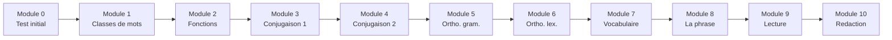

# Formation Francais CM1

Bienvenue dans la **formation complete** de Francais CM1 ! Ce parcours structure te guide pas a pas pour maitriser toutes les notions essentielles.

---

## Progression

---

## Les modules

| Module | Titre | Contenu | Duree |
|:------:|-------|---------|:-----:|
| 0 | [Test de positionnement](module-00-positioning.md) | Evaluation initiale | 30 min |
| 1 | [Les classes de mots](module-01-word-classes.md) | Nom, verbe, adjectif, determinant, pronom, adverbe | 2h |
| 2 | [Les fonctions](module-02-functions.md) | Sujet, COD, COI, complements circonstanciels | 2h |
| 3 | [Conjugaison 1](module-03-conjugation-1.md) | Present, imparfait, futur | 2h |
| 4 | [Conjugaison 2](module-04-conjugation-2.md) | Passe compose, passe simple | 2h |
| 5 | [Orthographe grammaticale](module-05-grammar-spelling.md) | Accords, homophones | 2h |
| 6 | [Orthographe lexicale](module-06-lexical-spelling.md) | Lettres muettes, doubles consonnes | 1h30 |
| 7 | [Vocabulaire](module-07-vocabulary.md) | Synonymes, antonymes, familles de mots | 1h30 |
| 8 | [La phrase](module-08-sentence.md) | Types et formes de phrases, ponctuation | 1h30 |
| 9 | [Lecture](module-09-reading.md) | Comprehension, genres litteraires | 2h |
| 10 | [Redaction](module-10-writing.md) | Ecrire un recit, un dialogue, une description | 2h |

---

## Comment utiliser cette formation ?

!!! tip "Conseils"
    1. **Commence par le Module 0** pour evaluer ton niveau
    2. **Suis l'ordre** des modules (ils sont progressifs)
    3. **Fais tous les exercices** avant de regarder les corrections
    4. **Note tes scores** pour suivre ta progression
    5. **Reviens** sur les modules ou tu as des difficultes

---

## Temps total estime

- **Test initial** : 30 minutes
- **10 modules** : environ 18 heures
- **Total** : ~20 heures de formation

!!! info "A ton rythme"
    Tu peux faire un module par semaine, ou avancer plus vite si tu te sens a l'aise. L'important est de bien comprendre chaque notion avant de passer a la suivante.
