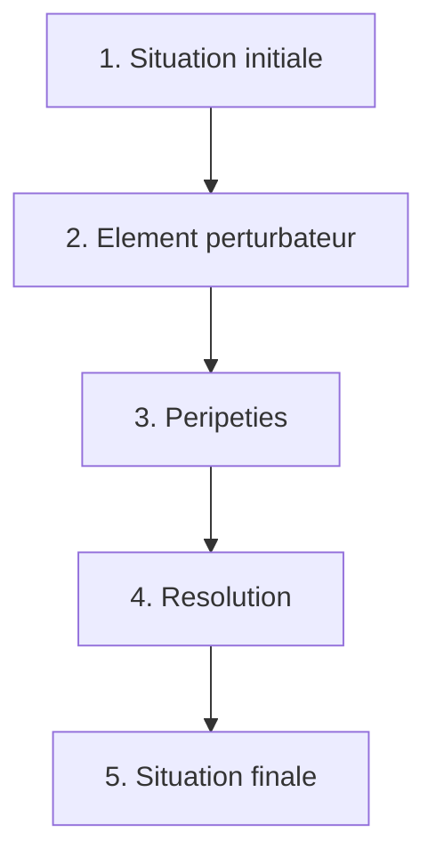

# Module 9 - Lecture

!!! abstract "Objectifs"
    A la fin de ce module, tu sauras :

    - Identifier les differents types de textes
    - Comprendre la structure d'un recit
    - Repondre aux questions de comprehension
    - Analyser un texte litteraire

    **Duree estimee** : 2 heures

---

## Les types de textes

### Le texte narratif (recit)

Il **raconte une histoire** avec des personnages et des evenements.

!!! example "Caracteristiques"
    - Personnages, lieu, temps
    - Actions, evenements
    - Schema narratif (debut, peripeties, fin)
    - Temps : passe simple, imparfait (ou passe compose)

**Exemples** : conte, roman, nouvelle, fable

---

### Le texte descriptif

Il **decrit** une personne, un lieu, un objet.

!!! example "Caracteristiques"
    - Adjectifs nombreux
    - Details precis (couleurs, formes, tailles)
    - Organisation spatiale (en haut, a droite...)
    - Temps : present ou imparfait

---

### Le texte explicatif

Il **explique** quelque chose, donne des informations.

!!! example "Caracteristiques"
    - Informations objectives
    - Vocabulaire precis, technique
    - Connecteurs logiques (car, donc, parce que)
    - Temps : present de verite generale

**Exemples** : article de dictionnaire, documentaire

---

### Le texte argumentatif

Il **defend une opinion**, cherche a convaincre.

!!! example "Caracteristiques"
    - These (opinion) + arguments
    - Connecteurs (premierement, de plus, en conclusion)
    - Exemples pour illustrer

---

### Le texte injonctif

Il **donne des ordres**, des instructions.

!!! example "Caracteristiques"
    - Verbes a l'imperatif ou a l'infinitif
    - Etapes numerotees
    - Vocabulaire precis

**Exemples** : recette, regles de jeu, mode d'emploi

---

## Le schema narratif

Un recit suit 5 etapes :

| Etape | Description |
|-------|-------------|
| **1. Situation initiale** | Presentation (qui, ou, quand) |
| **2. Element perturbateur** | Evenement qui declenche l'histoire |
| **3. Peripeties** | Actions, aventures |
| **4. Resolution** | Solution au probleme |
| **5. Situation finale** | Comment ca se termine |

---

## Les personnages

### Le heros

Le **personnage principal** autour de qui tourne l'histoire.

### Les personnages secondaires

- **Adjuvants** : ceux qui **aident** le heros
- **Opposants** : ceux qui **s'opposent** au heros

### Analyser un personnage

| Aspect | Questions |
|--------|-----------|
| Portrait physique | A quoi ressemble-t-il ? |
| Portrait moral | Quel est son caractere ? |
| Actions | Que fait-il ? |
| Paroles | Que dit-il ? |
| Evolution | Change-t-il au cours du recit ? |

---

## Le narrateur

### Narrateur interne

Le narrateur est **un personnage** de l'histoire. Il utilise "je".

!!! example "Exemple"
    "**Je** marchai longtemps dans la foret. **Mon** coeur battait."

### Narrateur externe

Le narrateur est **exterieur** a l'histoire. Il utilise "il/elle".

!!! example "Exemple"
    "**Le garcon** marcha longtemps. **Son** coeur battait."

---

## Methode de comprehension

### Les 4 etapes

!!! note "Methode"
    1. **Lire** le texte une premiere fois en entier
    2. **Relire** en soulignant les mots importants
    3. **Repondre** aux questions du texte
    4. **Justifier** en citant le texte

### Types de questions

| Type | Reponse |
|------|---------|
| **Litterale** | Directement dans le texte |
| **Inference** | A deduire du texte |
| **Interpretation** | A partir de ta reflexion |

### Comment justifier ?

!!! tip "Cite le texte"
    Utilise des **guillemets** et indique la ligne :

    "Le personnage est triste car il dit : « Je ne reverrai jamais mon ami » (ligne 12)."

---

## Exercice guide : analyse de texte

### Texte

> *Il etait une fois, dans un petit village, une jeune fille nommee Rose. Elle vivait seule avec sa grand-mere depuis la mort de ses parents. Un jour, alors qu'elle cueillait des fleurs dans la foret, elle decouvrit une grotte mysterieuse. A l'interieur brillait une lumiere etrange. Rose s'approcha doucement...*

### Questions et reponses

!!! question "Questions"
    1. Quel est le genre de ce texte ?
    2. Qui est le personnage principal ?
    3. Ou se passe l'histoire ?
    4. Quel est l'element perturbateur ?

??? success "Correction"
    1. C'est un **conte** (il etait une fois, elements merveilleux).
    2. Le personnage principal est **Rose**, une jeune fille.
    3. L'histoire se passe dans **un petit village** et dans **une foret**.
    4. L'element perturbateur est la **decouverte de la grotte mysterieuse**.

---

## Entrainement

### Texte 1

> *Le renard courait a perdre haleine. Derriere lui, les chiens de chasse aboyaient furieusement. Il devait trouver une cachette, et vite ! Soudain, il apercut un terrier sous un vieux chene. Sans hesiter, il s'y engouffra.*

!!! note "Questions"
    1. Qui sont les personnages ?
    2. Quel est le probleme du renard ?
    3. Comment le resout-il ?
    4. Le narrateur est-il interne ou externe ?

??? success "Corrections"
    1. Les personnages sont **le renard** (heros) et **les chiens** (opposants).
    2. Le renard est **poursuivi par des chiens de chasse**.
    3. Il trouve **un terrier sous un chene** et s'y cache.
    4. Narrateur **externe** (il utilise "il", pas "je").

---

## Evaluation

Lis ce texte puis reponds aux questions.

> *Ce matin-la, Theo se reveilla avec une etrange sensation. Quelque chose avait change dans sa chambre. En ouvrant les yeux, il comprit : tout etait devenu minuscule ! Ses meubles, ses jouets, meme son chat Moustache semblait tenir dans le creux de sa main. Theo se leva d'un bond. Il avait grandi pendant la nuit, enormement grandi !*

!!! warning "A faire sans aide"

**Q1.** Quel est le type de ce texte ?

**Q2.** Qui est le personnage principal ?

**Q3.** Quel est l'element perturbateur ?

**Q4.** Le narrateur est-il interne ou externe ? Justifie.

**Q5.** Releve un indice qui montre que l'histoire est fantastique.

??? success "Corrections"
    **Q1.** C'est un texte **narratif** (recit fantastique).

    **Q2.** Le personnage principal est **Theo**.

    **Q3.** L'element perturbateur est que **tout semble minuscule** / **Theo a enormement grandi pendant la nuit**.

    **Q4.** Narrateur **externe** car le texte utilise "il" et "Theo", pas "je".

    **Q5.** Indices fantastiques : "Il avait grandi pendant la nuit, enormement grandi" ou "tout etait devenu minuscule" → evenement impossible dans la realite.

---

## Bilan

!!! summary "Ce que tu dois retenir"
    - **5 types de textes** : narratif, descriptif, explicatif, argumentatif, injonctif
    - **Schema narratif** : 5 etapes (situation initiale → element perturbateur → peripeties → resolution → situation finale)
    - **Personnages** : heros, adjuvants, opposants
    - **Narrateur** : interne (je) ou externe (il/elle)
    - **Justifier** : toujours citer le texte

[:octicons-arrow-right-24: Module suivant : Redaction](module-10-writing.md)
