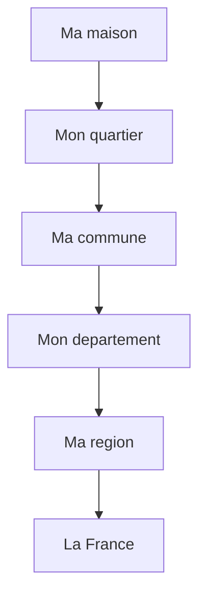

# Geographie CM1

!!! info "Programme officiel"
    Le programme de geographie CM1 s'articule autour de **3 themes** :

    1. **Decouvrir le(s) lieu(x) ou j'habite**
    2. **Se loger, travailler, se cultiver, avoir des loisirs en France**
    3. **Consommer en France**

    La notion centrale est **HABITER** : vivre dans un lieu, s'y deplacer, le partager.

---

## Theme 1 : Decouvrir ou j'habite

### Les differentes echelles

| Echelle | Description |
|---------|-------------|
| **Quartier** | Partie d'une ville avec ses rues et commerces |
| **Commune** | Village ou ville dirige par un maire |
| **Departement** | Regroupe plusieurs communes (101 en France) |
| **Region** | Regroupe plusieurs departements (13 en metropole) |

### L'organisation administrative

### Les 13 regions metropolitaines

| Region | Chef-lieu |
|--------|-----------|
| Ile-de-France | Paris |
| Hauts-de-France | Lille |
| Grand Est | Strasbourg |
| Normandie | Rouen |
| Bretagne | Rennes |
| Pays de la Loire | Nantes |
| Centre-Val de Loire | Orleans |
| Bourgogne-Franche-Comte | Dijon |
| Nouvelle-Aquitaine | Bordeaux |
| Occitanie | Toulouse |
| Auvergne-Rhone-Alpes | Lyon |
| Provence-Alpes-Cote d'Azur | Marseille |
| Corse | Ajaccio |

---

## Theme 2 : Se loger, travailler, avoir des loisirs

### Espaces urbains et ruraux

| Critere | Espace urbain (ville) | Espace rural (campagne) |
|---------|----------------------|-------------------------|
| **Population** | Forte densite | Faible densite |
| **Logements** | Immeubles | Maisons |
| **Transports** | Bus, metro | Voiture |
| **Services** | Nombreux et proches | Eloignes |

### La zone periurbaine

!!! note "Definition"
    La **zone periurbaine** est situee entre la ville et la campagne :
    - Pavillons et lotissements
    - Centres commerciaux
    - Habitants qui travaillent en ville

### Les lieux de travail

| Lieu | Type de travail |
|------|-----------------|
| Bureau | Administration, services |
| Usine | Industrie |
| Magasin | Commerce |
| Ecole | Education |
| Hopital | Sante |

### Les lieux de loisirs

- **Sport** : stade, gymnase, piscine
- **Culture** : cinema, theatre, musee, bibliotheque
- **Detente** : parc, jardin public

---

## Theme 3 : Consommer en France

### L'eau

| Etape | Description |
|-------|-------------|
| Captage | L'eau est prelevee dans une nappe ou riviere |
| Traitement | L'eau est purifiee |
| Distribution | L'eau arrive au robinet |

!!! warning "A savoir"
    Un Francais consomme en moyenne **150 litres d'eau par jour** !

### L'energie

| Type | Exemples | Renouvelable ? |
|------|----------|----------------|
| **Fossile** | Petrole, gaz, charbon | Non |
| **Nucleaire** | Centrales nucleaires | Non |
| **Renouvelable** | Solaire, eolien, hydraulique | Oui |

!!! note "En France"
    L'electricite est produite a **70% par le nucleaire** et **20% par le renouvelable**.

### L'alimentation

| Circuit | Description | Exemple |
|---------|-------------|---------|
| **Court** | Peu d'intermediaires, local | Marche, ferme |
| **Long** | Beaucoup d'intermediaires | Supermarche |

### Consommer responsable

!!! tip "Gestes eco-responsables"
    - **Eau** : fermer le robinet, douche rapide
    - **Energie** : eteindre la lumiere, LED
    - **Alimentation** : produits locaux et de saison
    - **Dechets** : trier, recycler

---

## Exercices

!!! question "Q1. Combien y a-t-il de regions en France metropolitaine ?"

??? success "Correction"
    **13 regions**

!!! question "Q2. Qu'est-ce qu'une zone periurbaine ?"

??? success "Correction"
    Une zone entre la ville et la campagne, avec des pavillons et des centres commerciaux.

!!! question "Q3. Cite 2 energies renouvelables"

??? success "Correction"
    Solaire, eolienne, hydraulique (2 parmi ces reponses)
