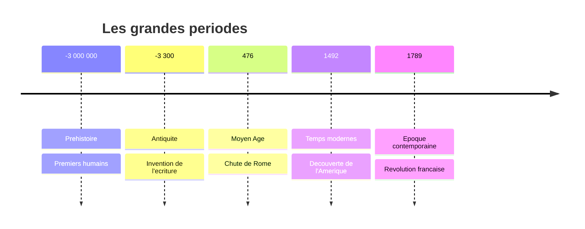

# Histoire

!!! info "Objectifs du chapitre"
    A la fin de ce chapitre, tu sauras :

    - Situer les grandes periodes sur une frise chronologique
    - Connaitre les premiers humains et leur mode de vie
    - Comprendre la civilisation gauloise et la conquete romaine
    - Decouvrir le Moyen Age avec Clovis et Charlemagne

---

## Les grandes periodes de l'histoire

---

## La Prehistoire

### Les premiers humains

Les premiers humains sont apparus en **Afrique** il y a environ **3 millions d'annees**.

!!! note "Evolution humaine"
    - **Australopitheque** : premiers hominides, marchent debout
    - **Homo habilis** : premiers outils (galets tailles)
    - **Homo erectus** : maitrise du feu, sort d'Afrique
    - **Homo sapiens** : notre espece, art et langage

### La maitrise du feu

Le feu a ete maitrise il y a environ **400 000 ans**.

!!! tip "A quoi sert le feu ?"
    - Se **chauffer** et s'eclairer
    - **Cuire** les aliments
    - Se **proteger** des animaux
    - **Fabriquer** des outils (durcir le bois)

### Le Paleolithique (age de la pierre taillee)

Les hommes du Paleolithique sont des **chasseurs-cueilleurs** nomades.

| Caracteristique | Description |
|-----------------|-------------|
| Mode de vie | Nomade (se deplace) |
| Nourriture | Chasse, peche, cueillette |
| Habitat | Grottes, huttes |
| Outils | Pierre taillee (silex) |

### Le Neolithique (age de la pierre polie)

Vers **-10 000 ans**, les humains deviennent **sedentaires** (ils s'installent).

!!! note "Les grandes inventions du Neolithique"
    - **Agriculture** : cultiver des cereales
    - **Elevage** : domestiquer les animaux
    - **Poterie** : fabriquer des recipients
    - **Tissage** : fabriquer des vetements

### L'art prehistorique

!!! example "La grotte de Lascaux"
    Decouverte en 1940 en Dordogne, elle contient des peintures datant de **-18 000 ans** : chevaux, taureaux, cerfs...

    Les hommes prehistoriques utilisaient des pigments naturels (ocre, charbon) pour peindre.

---

## L'Antiquite

### Les Gaulois

Les **Gaulois** sont des peuples celtes installes en Gaule (la France actuelle) a partir de **-500**.

!!! note "La societe gauloise"
    - **Druides** : pretres, savants, juges
    - **Guerriers** : nobles qui combattent
    - **Artisans** : forgerons, potiers, bijoutiers
    - **Paysans** : cultivent la terre

### La conquete romaine

En **-58**, Jules Cesar commence la conquete de la Gaule.

!!! example "Vercingetorix"
    Chef gaulois qui unifie les tribus gauloises contre les Romains.

    **-52** : Bataille d'**Alesia**. Vercingetorix est vaincu et se rend a Cesar.

### La Gaule romaine

Apres la conquete, la Gaule devient une province romaine pendant **500 ans**.

!!! note "L'heritage romain"
    - **Routes** : voies romaines pavees
    - **Villes** : arenes, thermes, aqueducs
    - **Langue** : le latin devient le francais
    - **Droit** : lois romaines

!!! example "Monuments romains en France"
    - Pont du Gard (aqueduc)
    - Arenes de Nimes
    - Theatre d'Orange
    - Maison Carree de Nimes

---

## Le Moyen Age

### Les grandes invasions

A partir du **Ve siecle**, des peuples "barbares" envahissent l'Empire romain :

- **Wisigoths** : sud de la France
- **Burgondes** : est de la France
- **Francs** : nord de la France

### Clovis et les Francs

**Clovis** (465-511) est le premier roi des Francs a unifier la Gaule.

!!! note "Dates cles"
    - **486** : Victoire de Soissons, Clovis unifie le nord
    - **496** : Bapteme de Clovis a Reims → il devient chretien

!!! tip "Pourquoi le bapteme est important ?"
    En se convertissant au christianisme, Clovis obtient le soutien de l'Eglise et de la population gallo-romaine.

### Charlemagne

**Charlemagne** (742-814) est le plus celebre des rois francs.

!!! note "Dates cles"
    - **768** : Charlemagne devient roi des Francs
    - **800** : Il est couronne **Empereur** a Rome
    - Il agrandit son empire et developpe l'education

!!! example "L'ecole de Charlemagne"
    Charlemagne cree des ecoles dans les monasteres pour former des clercs et des administrateurs. C'est l'origine de l'expression "C'est Charlemagne qui a invente l'ecole !"

### Seigneurs et paysans

Au Moyen Age, la societe est organisee en **trois ordres** :

| Ordre | Role | Exemple |
|-------|------|---------|
| **Ceux qui prient** | Prieres, education | Moines, pretres |
| **Ceux qui combattent** | Protection | Seigneurs, chevaliers |
| **Ceux qui travaillent** | Production | Paysans, artisans |

### La vie au chateau

!!! note "Le chateau fort"
    - **Donjon** : tour principale, refuge en cas d'attaque
    - **Remparts** : murs de protection
    - **Douves** : fosses remplis d'eau
    - **Pont-levis** : pont mobile

### La vie des paysans

La majorite de la population est composee de **paysans** (ou serfs).

!!! note "La vie quotidienne"
    - Travaillent la terre du seigneur
    - Paient des **impots** (redevances)
    - Vivent dans des maisons simples
    - Subissent famines et epidemies

---

## Frise chronologique resume

| Date | Evenement |
|------|-----------|
| -3 000 000 | Premiers humains en Afrique |
| -400 000 | Maitrise du feu |
| -10 000 | Debut du Neolithique |
| -52 | Vercingetorix vaincu a Alesia |
| 496 | Bapteme de Clovis |
| 800 | Charlemagne empereur |

---

## Exercices

### Exercice 1 : Periodes

!!! question "A quelle periode appartiennent ces elements ?"
    1. La grotte de Lascaux
    2. Les arenes de Nimes
    3. Le chateau fort

??? success "Correction"
    1. **Prehistoire** (Paleolithique)
    2. **Antiquite** (Gaule romaine)
    3. **Moyen Age**

### Exercice 2 : Dates

!!! question "Associe les dates aux evenements"
    - -52
    - 496
    - 800

??? success "Correction"
    - -52 : **Bataille d'Alesia** (defaite de Vercingetorix)
    - 496 : **Bapteme de Clovis**
    - 800 : **Couronnement de Charlemagne**
