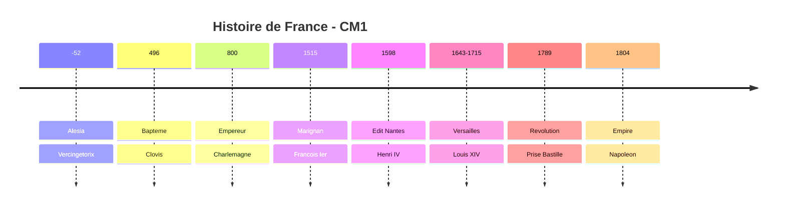

# Histoire CM1

!!! info "Programme officiel"
    Le programme d'histoire CM1 s'articule autour de **3 themes** :

    1. **Et avant la France ?** - Des premiers hommes a Charlemagne
    2. **Le temps des rois** - Louis IX, Francois Ier, Henri IV, Louis XIV
    3. **La Revolution et l'Empire** - 1789 et Napoleon

---

## Theme 1 : Et avant la France ?

### La Prehistoire

Les premiers humains apparaissent en **Afrique** il y a environ 3 millions d'annees.

| Periode | Caracteristiques |
|---------|------------------|
| **Paleolithique** | Chasseurs-cueilleurs nomades, outils en pierre taillee |
| **Neolithique** | Sedentarisation, agriculture, elevage, poterie |

### Les Gaulois

Les **Gaulois** sont des peuples celtes installes en Gaule a partir de -500.

!!! note "La societe gauloise"
    - **Druides** : pretres et savants
    - **Guerriers** : nobles
    - **Artisans** : forgerons, bijoutiers
    - **Paysans** : cultivateurs

### La conquete romaine

- **-58** : Jules Cesar commence la conquete de la Gaule
- **-52** : Bataille d'**Alesia**, defaite de **Vercingetorix**
- La Gaule devient une province romaine pendant 500 ans

### Clovis et Charlemagne

| Personnage | Dates | Evenement majeur |
|------------|-------|------------------|
| **Clovis** | 465-511 | Bapteme en 496, premier roi chretien |
| **Charlemagne** | 742-814 | Couronne empereur en 800 |

---

## Theme 2 : Le temps des rois

### Les 4 grands rois

| Roi | Siecle | Ce qu'il faut retenir |
|-----|--------|----------------------|
| **Louis IX** | XIIIe | Roi chretien, Sainte-Chapelle, justice |
| **Francois Ier** | XVIe | Renaissance, Leonard de Vinci, Chambord |
| **Henri IV** | XVIe-XVIIe | Edit de Nantes, tolerance religieuse |
| **Louis XIV** | XVIIe-XVIIIe | Roi Soleil, Versailles, monarchie absolue |

### La monarchie absolue

Sous **Louis XIV**, le roi concentre tous les pouvoirs :

- **Executif** : dirige le gouvernement
- **Legislatif** : fait les lois
- **Judiciaire** : rend la justice

!!! example "Versailles"
    Louis XIV fait construire le chateau de Versailles pour montrer sa puissance et surveiller la noblesse.

---

## Theme 3 : La Revolution et l'Empire

### 1789 : L'annee revolutionnaire

| Date | Evenement |
|------|-----------|
| 20 juin | Serment du Jeu de Paume |
| **14 juillet** | **Prise de la Bastille** |
| 4 aout | Abolition des privileges |
| 26 aout | Declaration des droits de l'homme |

### Les grands principes de 1789

!!! note "Declaration des droits de l'homme"
    - **Liberte** : d'opinion, d'expression, de religion
    - **Egalite** : devant la loi et l'impot
    - **Propriete** : droit sacre

### La fin de la royaute

- **21 janvier 1793** : Execution de **Louis XVI**, dernier roi de l'Ancien Regime
- **22 septembre 1792** : Proclamation de la **1ere Republique**

### Napoleon Bonaparte

| Date | Evenement |
|------|-----------|
| 1799 | Coup d'Etat, Napoleon prend le pouvoir |
| 1804 | Napoleon devient **Empereur** |
| 1815 | Defaite de **Waterloo** |

!!! tip "Heritage de Napoleon"
    - Le **Code civil** (ensemble des lois)
    - Les lycees
    - La Legion d'honneur

---

## Frise chronologique

---

## Exercices

!!! question "Q1. Cite les 4 grands rois etudies en CM1"

??? success "Correction"
    Louis IX, Francois Ier, Henri IV, Louis XIV

!!! question "Q2. Quelle est la date de la prise de la Bastille ?"

??? success "Correction"
    **14 juillet 1789**

!!! question "Q3. Qui est le dernier roi de l'Ancien Regime ?"

??? success "Correction"
    **Louis XVI**, execute le 21 janvier 1793
