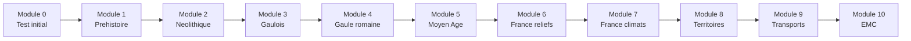

# Formation Histoire-Geographie CM1

Bienvenue dans la **formation complete** d'Histoire-Geographie CM1 ! Ce parcours te fait voyager de la Prehistoire au Moyen Age, tout en decouvrant la France.

---

## Progression

---

## Les modules

| Module | Titre | Contenu | Duree |
|:------:|-------|---------|:-----:|
| 0 | [Test de positionnement](module-00-positioning.md) | Evaluation initiale | 30 min |
| 1 | [La Prehistoire](module-01-prehistory.md) | Premiers humains, feu, outils | 2h |
| 2 | [Le Neolithique](module-02-neolithic.md) | Agriculture, sedentarisation | 1h30 |
| 3 | [Les Gaulois](module-03-gauls.md) | Societe gauloise, Vercingetorix | 1h30 |
| 4 | [La Gaule romaine](module-04-roman-gaul.md) | Conquete, romanisation | 1h30 |
| 5 | [Le Moyen Age](module-05-middle-ages.md) | Clovis, Charlemagne, feodalite | 2h |
| 6 | [La France : reliefs](module-06-france-relief.md) | Montagnes, plaines, fleuves | 1h30 |
| 7 | [La France : climats](module-07-france-climate.md) | Climats, regions | 1h30 |
| 8 | [Les territoires](module-08-territories.md) | Villes, campagnes, littoraux | 1h30 |
| 9 | [Se deplacer](module-09-transport.md) | Transports en France | 1h30 |
| 10 | [EMC](module-10-civics.md) | Republique, droits, devoirs | 2h |

---

## Comment utiliser cette formation ?

!!! tip "Conseils"
    1. **Commence par le Module 0** pour evaluer ton niveau
    2. **Suis l'ordre** des modules (histoire puis geo)
    3. **Fais des fiches** avec les dates et lieux importants
    4. **Situe** toujours les evenements sur une frise chronologique
    5. **Localise** les lieux sur une carte

---

## Temps total estime

- **Test initial** : 30 minutes
- **5 modules Histoire** : environ 8h30
- **4 modules Geographie** : environ 6h
- **1 module EMC** : 2h
- **Total** : ~17 heures de formation
