# Formation Histoire-Geographie CM1

Bienvenue dans la **formation complete** d'Histoire-Geographie CM1 !

---

## Programme officiel

Cette formation suit le programme officiel de l'Education nationale :

### Histoire : 3 themes

1. **Et avant la France ?** - Des premiers hommes a Charlemagne
2. **Le temps des rois** - Louis IX, Francois Ier, Henri IV, Louis XIV
3. **La Revolution et l'Empire** - 1789, Napoleon

### Geographie : 3 themes

1. **Decouvrir ou j'habite** - Quartier, commune, departement, region
2. **Se loger, travailler, avoir des loisirs** - Espaces urbains et ruraux
3. **Consommer en France** - Eau, energie, alimentation

---

## Progression

```mermaid
flowchart LR
    M0[Module 0<br>Test initial] --> M1[Module 1<br>Prehistoire]
    M1 --> M2[Module 2<br>Neolithique]
    M2 --> M3[Module 3<br>Gaulois/Romains]
    M3 --> M4[Module 4<br>Clovis/Charlemagne]
    M4 --> M5[Module 5<br>Les rois]
    M5 --> M6[Module 6<br>Revolution]
    M6 --> M7[Module 7<br>Ou j'habite]
    M7 --> M8[Module 8<br>Loger/Travailler]
    M8 --> M9[Module 9<br>Consommer]
    M9 --> M10[Module 10<br>EMC]
```

---

## Les modules

### Histoire (Modules 1-6)

| Module | Theme officiel | Contenu | Duree |
|:------:|----------------|---------|:-----:|
| 0 | - | [Test de positionnement](module-00-positioning.md) | 30 min |
| 1 | Et avant la France | [La Prehistoire](module-01-prehistory.md) | 2h |
| 2 | Et avant la France | [Le Neolithique](module-02-neolithic.md) | 1h30 |
| 3 | Et avant la France | [Les Gaulois](module-03-gauls.md) | 1h30 |
| 4 | Et avant la France | [La Gaule romaine](module-04-roman-gaul.md) | 1h30 |
| 5 | Le temps des rois | [Les grands rois](module-05-kings.md) | 2h |
| 6 | Revolution et Empire | [1789 et Napoleon](module-06-revolution.md) | 2h |

### Geographie (Modules 7-9)

| Module | Theme officiel | Contenu | Duree |
|:------:|----------------|---------|:-----:|
| 7 | Decouvrir ou j'habite | [Mon lieu de vie](module-07-my-place.md) | 1h30 |
| 8 | Se loger, travailler | [Espaces en France](module-08-live-work.md) | 1h30 |
| 9 | Consommer en France | [Eau, energie, alimentation](module-09-consume.md) | 1h30 |

### EMC (Module 10)

| Module | Theme | Contenu | Duree |
|:------:|-------|---------|:-----:|
| 10 | Vivre ensemble | [Republique et citoyennete](module-10-civics.md) | 2h |

---

## Comment utiliser cette formation ?

!!! tip "Conseils"
    1. **Commence par le Module 0** pour evaluer ton niveau
    2. **Suis l'ordre** des modules (histoire puis geo)
    3. **Fais des fiches** avec les dates et personnages importants
    4. **Situe** les evenements sur une frise chronologique
    5. **Localise** les lieux sur une carte

---

## Temps total estime

- **Test initial** : 30 minutes
- **6 modules Histoire** : environ 10h30
- **3 modules Geographie** : environ 4h30
- **1 module EMC** : 2h
- **Total** : ~17h30 de formation

---

## Dates cles a retenir

| Date | Evenement |
|------|-----------|
| -52 | Vercingetorix vaincu a Alesia |
| 496 | Bapteme de Clovis |
| 800 | Charlemagne empereur |
| 1515 | Victoire de Marignan (Francois Ier) |
| 1598 | Edit de Nantes (Henri IV) |
| 14 juillet 1789 | Prise de la Bastille |
| 1804 | Napoleon empereur |
