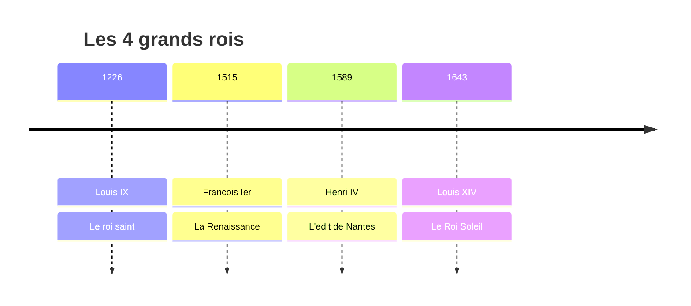

# Module 5 - Le temps des rois

!!! abstract "Objectifs"
    - Connaitre 4 grands rois de France
    - Comprendre leur role dans la construction du royaume
    - Situer leur regne sur une frise chronologique

    **Duree** : 2 heures

---

## Introduction

Apres Charlemagne, la France est gouvernee par des **rois** pendant pres de 1000 ans. Nous allons etudier 4 rois importants qui ont marque l'histoire de France.

---

## Louis IX (Saint Louis)

### Qui est Louis IX ?

!!! note "Fiche d'identite"
    - **Dates** : 1214-1270
    - **Regne** : 1226-1270 (44 ans)
    - **Surnom** : Saint Louis
    - **Dynastie** : Capetiens

### Un roi chretien

Louis IX est un roi tres **pieux** (religieux). Il :

- Prie plusieurs fois par jour
- Fait construire la **Sainte-Chapelle** a Paris
- Part en **croisade** pour delivrer Jerusalem
- Est **canonise** (devenu saint) en 1297

### Un roi juste

!!! example "Le chene de Vincennes"
    Louis IX rend la justice lui-meme, assis sous un chene dans le bois de Vincennes. Tous les sujets, riches ou pauvres, peuvent venir lui presenter leurs problemes.

### Ses actions

| Domaine | Action |
|---------|--------|
| **Justice** | Interdit les duels, cree des enqueteurs royaux |
| **Monnaie** | Cree une monnaie royale unique |
| **Religion** | Construit la Sainte-Chapelle |

---

## Francois Ier

### Qui est Francois Ier ?

!!! note "Fiche d'identite"
    - **Dates** : 1494-1547
    - **Regne** : 1515-1547 (32 ans)
    - **Surnom** : Le roi chevalier
    - **Dynastie** : Valois

### Le roi de la Renaissance

Francois Ier est passionne par l'**art** et la **culture** de la Renaissance italienne.

!!! example "Leonard de Vinci"
    Francois Ier invite **Leonard de Vinci** en France. Le celebre artiste apporte la **Joconde**, aujourd'hui au musee du Louvre.

### Ses grandes realisations

| Domaine | Realisation |
|---------|-------------|
| **Architecture** | Chateaux de Chambord, Fontainebleau |
| **Culture** | Creation du College de France |
| **Langue** | Ordonnance de Villers-Cotterets (francais officiel) |
| **Imprimerie** | Developpement du livre |

### Victoires et defaites

- **1515** : Victoire de **Marignan** (Italie)
- **1525** : Defaite de Pavie, Francois Ier est prisonnier

---

## Henri IV

### Qui est Henri IV ?

!!! note "Fiche d'identite"
    - **Dates** : 1553-1610
    - **Regne** : 1589-1610 (21 ans)
    - **Surnom** : Le bon roi Henri, le Vert-Galant
    - **Dynastie** : Bourbons (1er roi Bourbon)

### Les guerres de religion

A cette epoque, les **catholiques** et les **protestants** se font la guerre en France. Henri IV est d'abord protestant.

!!! note "Pour devenir roi"
    Henri IV se convertit au catholicisme pour etre accepte par Paris (capitale catholique).

    Sa phrase celebre : **"Paris vaut bien une messe"**

### L'edit de Nantes (1598)

!!! tip "Document important"
    L'**edit de Nantes** accorde aux protestants le droit de pratiquer leur religion.

    C'est un acte de **tolerance** pour ramener la paix en France.

### Un roi populaire

Henri IV veut que tous les Francais vivent bien.

!!! example "La poule au pot"
    Henri IV aurait dit : "Je veux que chaque laboureur de mon royaume puisse mettre la **poule au pot** le dimanche."

### Mort tragique

En **1610**, Henri IV est assassine par **Ravaillac**, un catholique fanatique.

---

## Louis XIV

### Qui est Louis XIV ?

!!! note "Fiche d'identite"
    - **Dates** : 1638-1715
    - **Regne** : 1643-1715 (72 ans, le plus long !)
    - **Surnom** : Le Roi Soleil
    - **Dynastie** : Bourbons

### Pourquoi "le Roi Soleil" ?

Louis XIV choisit le **soleil** comme embleme car :

- Le soleil est au centre de l'univers
- Il eclaire et rechauffe tout
- Comme lui, le roi est au centre du royaume

### La monarchie absolue

!!! warning "Definition"
    **Monarchie absolue** = le roi a tous les pouvoirs.

    Louis XIV dit : **"L'Etat, c'est moi !"**

Louis XIV concentre tous les pouvoirs :

| Pouvoir | Role du roi |
|---------|-------------|
| **Executif** | Dirige le gouvernement |
| **Legislatif** | Fait les lois |
| **Judiciaire** | Rend la justice |

### Versailles

!!! example "Le chateau de Versailles"
    Louis XIV fait construire un immense **chateau a Versailles** pour montrer sa puissance.

    - Plus de 700 pieces
    - Jardins magnifiques
    - La **Galerie des Glaces** (357 miroirs)

### Vie a Versailles

La **noblesse** vit au chateau pour que le roi la surveille.

- Lever du roi (le matin)
- Coucher du roi (le soir)
- Fetes et spectacles

### Bilan du regne

| Positif | Negatif |
|---------|---------|
| Rayonnement culturel | Guerres couteuses |
| Puissance de la France | Revocation edit de Nantes (1685) |
| Arts (Moliere, La Fontaine) | Peuple appauvri |

---

## Frise recapitulative

| Date | Roi | Evenement |
|------|-----|-----------|
| 1226-1270 | Louis IX | Justice sous le chene |
| 1515 | Francois Ier | Victoire de Marignan |
| 1598 | Henri IV | Edit de Nantes |
| 1643-1715 | Louis XIV | Chateau de Versailles |

---

## Exercices

!!! question "Q1. Quel roi a fait construire Versailles ?"

??? success "Correction"
    **Louis XIV** (le Roi Soleil)

!!! question "Q2. Qu'est-ce que l'edit de Nantes ?"

??? success "Correction"
    Un texte signe par **Henri IV** en 1598 qui accorde aux protestants le droit de pratiquer leur religion.

!!! question "Q3. Quel artiste celebre Francois Ier a-t-il invite en France ?"

??? success "Correction"
    **Leonard de Vinci**

!!! question "Q4. Pourquoi Louis IX est-il surnomme 'Saint Louis' ?"

??? success "Correction"
    Parce qu'il etait tres **pieux** (religieux) et qu'il a ete **canonise** (devenu saint) par l'Eglise.

---

!!! summary "Bilan"
    - **Louis IX** : roi chretien et juste (Sainte-Chapelle)
    - **Francois Ier** : roi de la Renaissance (Chambord, Leonard de Vinci)
    - **Henri IV** : edit de Nantes, tolerance religieuse
    - **Louis XIV** : Roi Soleil, Versailles, monarchie absolue

[:octicons-arrow-right-24: Module suivant](module-06-revolution.md)
