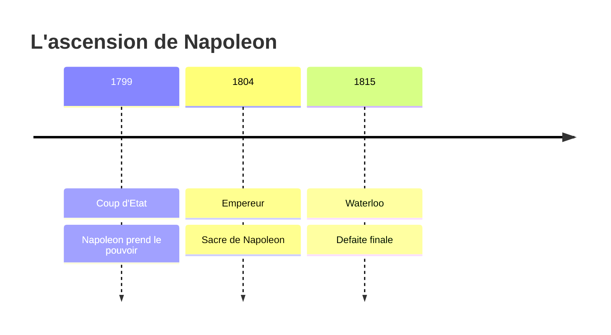

# Module 6 - La Revolution et l'Empire

!!! abstract "Objectifs"
    - Comprendre les causes de la Revolution francaise
    - Connaitre les evenements cles de 1789
    - Decouvrir Napoleon Bonaparte et l'Empire

    **Duree** : 2 heures

---

## Avant la Revolution

### La societe d'Ancien Regime

Avant 1789, la societe francaise est divisee en **3 ordres** :

| Ordre | Qui ? | Privileges |
|-------|-------|------------|
| **Clerge** | Pretres, moines | Ne paie pas d'impots |
| **Noblesse** | Seigneurs | Ne paie pas d'impots |
| **Tiers etat** | Paysans, bourgeois, artisans | Paie tous les impots ! |

!!! warning "Injustice"
    Le **Tiers etat** represente 97% de la population mais n'a aucun pouvoir et paie tous les impots !

### Les causes de la Revolution

| Cause | Explication |
|-------|-------------|
| **Crise financiere** | Le royaume est en faillite (guerres, Versailles) |
| **Mauvaises recoltes** | Famine, prix du pain tres eleve |
| **Injustice fiscale** | Le peuple paie tous les impots |
| **Idees nouvelles** | Les philosophes reclament l'egalite |

---

## L'annee 1789

### Les Etats generaux (mai 1789)

Le roi **Louis XVI** convoque les Etats generaux a Versailles pour resoudre la crise financiere.

- **Clerge** : 291 deputes
- **Noblesse** : 270 deputes
- **Tiers etat** : 578 deputes

!!! note "Conflit"
    Le Tiers etat veut voter **par tete** (1 homme = 1 voix).
    Le roi veut voter **par ordre** (1 ordre = 1 voix → 2 contre 1).

### Le serment du Jeu de Paume (20 juin 1789)

Les deputes du Tiers etat, chasses de leur salle, se reunissent dans la salle du **Jeu de Paume**.

!!! example "Le serment"
    Ils jurent de ne pas se separer avant d'avoir donne une **Constitution** a la France (des regles ecrites pour gouverner).

### La prise de la Bastille (14 juillet 1789)

!!! tip "Date a retenir"
    Le **14 juillet 1789**, le peuple de Paris prend d'assaut la prison de la **Bastille**, symbole du pouvoir royal.

    C'est le debut de la Revolution. Le **14 juillet** est aujourd'hui la fete nationale francaise.

### La nuit du 4 aout 1789

L'Assemblee nationale **abolit les privileges** :

- Fin des droits seigneuriaux
- Egalite devant l'impot
- Fin de la societe d'ordres

---

## La Declaration des droits de l'homme

### Le 26 aout 1789

L'Assemblee adopte la **Declaration des droits de l'homme et du citoyen**.

!!! note "Les grands principes"
    - Article 1 : "Les hommes naissent et demeurent **libres et egaux** en droits"
    - **Liberte** d'opinion, de religion, d'expression
    - **Egalite** devant la loi et l'impot
    - **Propriete** : droit sacre

### Un texte fondateur

Cette Declaration inspire encore aujourd'hui :

- La Constitution francaise
- La Declaration universelle des droits de l'homme (1948)
- Les lois de nombreux pays

---

## La fin de la royaute

### Louis XVI, dernier roi

| Date | Evenement |
|------|-----------|
| Octobre 1789 | Le roi est ramene a Paris |
| Juin 1791 | Fuite a Varennes (le roi essaie de fuir) |
| Septembre 1792 | Abolition de la royaute |
| 21 janvier 1793 | **Execution de Louis XVI** |

!!! warning "Fin de la monarchie"
    Louis XVI est le dernier roi de l'**Ancien Regime**. Il est guillotine le 21 janvier 1793.

### La Republique

Le 22 septembre 1792, la France devient une **Republique** :

- Plus de roi
- Le peuple est **souverain** (il a le pouvoir)
- C'est la **1ere Republique**

---

## Napoleon Bonaparte

### Qui est Napoleon ?

!!! note "Fiche d'identite"
    - **Dates** : 1769-1821
    - **Origine** : Ne en Corse
    - **Metier** : General d'armee
    - **Pouvoir** : Consul (1799), Empereur (1804)

### Du general a l'Empereur

### L'Empire (1804-1815)

En 1804, Napoleon se fait couronner **Empereur des Francais**.

| Conquetes | Heritage |
|-----------|----------|
| Presque toute l'Europe | **Code civil** (lois) |
| Batailles celebres | Lycees |
| Grande Armee | Legion d'honneur |
|  | Prefecture |

!!! example "Le Code civil"
    Napoleon cree le **Code civil** : un ensemble de lois qui organisent la vie des Francais (mariage, propriete, famille). Ce code existe encore aujourd'hui !

### La chute de Napoleon

| Date | Evenement |
|------|-----------|
| 1812 | Echec de la campagne de Russie |
| 1814 | Napoleon abdique, exile a l'ile d'Elbe |
| 1815 | Retour (les Cent-Jours), defaite de **Waterloo** |
| 1821 | Mort a Sainte-Helene |

---

## Frise recapitulative

| Date | Evenement |
|------|-----------|
| 14 juillet 1789 | Prise de la Bastille |
| 26 aout 1789 | Declaration des droits de l'homme |
| 21 janvier 1793 | Execution de Louis XVI |
| 1804 | Napoleon devient Empereur |
| 1815 | Defaite de Waterloo |

---

## Exercices

!!! question "Q1. Quelle est la date de la prise de la Bastille ?"

??? success "Correction"
    Le **14 juillet 1789**

!!! question "Q2. Cite 2 principes de la Declaration des droits de l'homme"

??? success "Correction"
    **Liberte** et **egalite** (ou : liberte d'expression, egalite devant la loi, droit de propriete)

!!! question "Q3. Quel est le nom du dernier roi de l'Ancien Regime ?"

??? success "Correction"
    **Louis XVI**

!!! question "Q4. Quel texte de lois Napoleon a-t-il cree ?"

??? success "Correction"
    Le **Code civil**

---

!!! summary "Bilan"
    - **1789** : Revolution francaise, prise de la Bastille, Declaration des droits
    - **Louis XVI** : dernier roi, execute en 1793
    - **1ere Republique** : 1792, le peuple est souverain
    - **Napoleon** : Empereur (1804-1815), Code civil

---

!!! success "Felicitations !"
    Tu as termine la partie **Histoire** du programme !

[:octicons-arrow-right-24: Module suivant](module-07-my-place.md)
