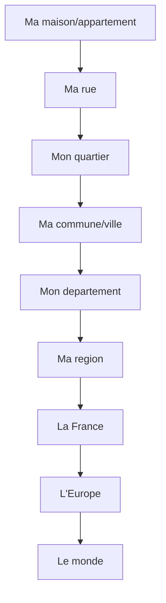

# Module 7 - Decouvrir le(s) lieu(x) ou j'habite

!!! abstract "Objectifs"
    - Localiser ton lieu de vie a differentes echelles
    - Connaitre ton quartier, ta commune, ton departement
    - Comprendre comment est organise ton espace quotidien

    **Duree** : 1h30

---

## Introduction : Qu'est-ce qu'habiter ?

!!! note "Definition"
    **Habiter** un lieu, c'est :

    - Y **resider** (y avoir sa maison)
    - Y **vivre** (se deplacer, faire ses courses, aller a l'ecole)
    - Y **rencontrer** des gens
    - Le **partager** avec d'autres habitants

---

## Les differentes echelles

### Du plus petit au plus grand

### Vocabulaire

| Echelle | Definition |
|---------|------------|
| **Quartier** | Partie d'une ville avec ses commerces, ecoles |
| **Commune** | Village ou ville avec un maire |
| **Departement** | Regroupe plusieurs communes (ex: Gironde) |
| **Region** | Regroupe plusieurs departements (ex: Nouvelle-Aquitaine) |

---

## Mon quartier

### Observer son quartier

Quand tu te promenes dans ton quartier, tu peux observer :

| Element | Exemples |
|---------|----------|
| **Habitations** | Immeubles, maisons, pavillons |
| **Commerces** | Boulangerie, supermarche, pharmacie |
| **Services** | Ecole, mairie, poste, medecin |
| **Espaces verts** | Parc, jardin, square |
| **Transports** | Arret de bus, parking, piste cyclable |

### Plan du quartier

!!! tip "Activite"
    Dessine le plan de ton quartier avec :

    - Ta maison
    - Ton ecole
    - Les commerces que tu frequentes
    - Le chemin que tu fais tous les jours

---

## Ma commune

### Qu'est-ce qu'une commune ?

!!! note "Definition"
    La **commune** est la plus petite division administrative de la France.

    - Chaque commune a un **nom**
    - Elle est dirigee par un **maire** et un conseil municipal
    - Elle a une **mairie** (hotel de ville)

### Les services de la commune

| Service | Role |
|---------|------|
| **Mairie** | Administration, etat civil |
| **Ecole** | Education des enfants |
| **Bibliotheque** | Pret de livres |
| **Stade/Gymnase** | Activites sportives |
| **Cantine** | Repas des ecoliers |

### Commune urbaine ou rurale ?

| Type | Caracteristiques |
|------|------------------|
| **Commune urbaine** | Ville, nombreux habitants, immeubles |
| **Commune rurale** | Village, peu d'habitants, maisons |

---

## Mon departement

### Qu'est-ce qu'un departement ?

!!! note "Definition"
    Le **departement** regroupe plusieurs communes. La France en compte **101** (96 en metropole + 5 outre-mer).

Chaque departement a :

- Un **numero** (ex: 75 pour Paris, 33 pour la Gironde)
- Un **chef-lieu** (ville principale)
- Un **conseil departemental**

### A quoi sert le departement ?

| Competence | Exemple |
|------------|---------|
| **Routes** | Entretien des routes departementales |
| **Colleges** | Construction et entretien |
| **Solidarite** | Aide aux personnes agees |
| **Transports** | Bus scolaires |

---

## Ma region

### Les 13 regions metropolitaines

Depuis 2016, la France metropolitaine compte **13 regions** :

| Region | Chef-lieu |
|--------|-----------|
| Ile-de-France | Paris |
| Hauts-de-France | Lille |
| Grand Est | Strasbourg |
| Normandie | Rouen |
| Bretagne | Rennes |
| Pays de la Loire | Nantes |
| Centre-Val de Loire | Orleans |
| Bourgogne-Franche-Comte | Dijon |
| Nouvelle-Aquitaine | Bordeaux |
| Occitanie | Toulouse |
| Auvergne-Rhone-Alpes | Lyon |
| Provence-Alpes-Cote d'Azur | Marseille |
| Corse | Ajaccio |

### Le role de la region

| Competence | Exemple |
|------------|---------|
| **Lycees** | Construction et entretien |
| **Transports** | TER, cars regionaux |
| **Economie** | Aide aux entreprises |
| **Formation** | Formation professionnelle |

---

## Se reperer

### Lire une carte

Pour lire une carte, il faut connaitre :

| Element | A quoi ca sert |
|---------|----------------|
| **Titre** | Savoir ce que represente la carte |
| **Legende** | Comprendre les symboles |
| **Echelle** | Calculer les distances reelles |
| **Orientation** | Savoir ou est le nord |

### Les points cardinaux

| Point | Direction |
|-------|-----------|
| **Nord** | Vers le haut de la carte |
| **Sud** | Vers le bas |
| **Est** | A droite |
| **Ouest** | A gauche |

---

## Exercices

!!! question "Q1. Complete : La plus petite division administrative de la France est la ___"

??? success "Correction"
    La **commune**

!!! question "Q2. Combien y a-t-il de departements en France ?"

??? success "Correction"
    **101** (96 en metropole + 5 outre-mer)

!!! question "Q3. Qui dirige une commune ?"

??? success "Correction"
    Le **maire** (et le conseil municipal)

!!! question "Q4. Dans quelle region habites-tu ? Quel est le numero de ton departement ?"

??? success "Correction"
    Reponse personnelle. Exemple : J'habite en Ile-de-France, departement 75 (Paris).

---

!!! summary "Bilan"
    - **Habiter** = vivre dans un lieu, s'y deplacer, le partager
    - Echelles : quartier → commune → departement → region → France
    - **Commune** : mairie, maire, services publics
    - **101 departements**, **13 regions** en France metropolitaine

[:octicons-arrow-right-24: Module suivant](module-08-live-work.md)
