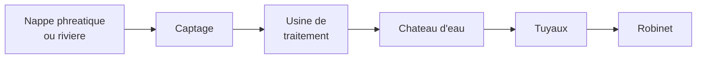

# Module 9 - Consommer en France

!!! abstract "Objectifs"
    - Comprendre d'ou vient ce que nous consommons
    - Connaitre les besoins en eau, energie et nourriture
    - Reflechir a une consommation responsable

    **Duree** : 1h30

---

## Introduction : Qu'est-ce que consommer ?

!!! note "Definition"
    **Consommer**, c'est utiliser des produits et des ressources pour satisfaire nos besoins quotidiens :

    - Se nourrir
    - Se chauffer
    - S'eclairer
    - Se deplacer
    - Se vetir

---

## L'eau : une ressource precieuse

### D'ou vient l'eau du robinet ?

### Les usages de l'eau

| Usage | Pourcentage |
|-------|-------------|
| **Bains et douches** | 39% |
| **Toilettes** | 20% |
| **Lave-linge** | 12% |
| **Vaisselle** | 10% |
| **Cuisine** | 6% |
| **Jardin** | 6% |
| **Boisson** | 1% |

!!! warning "A savoir"
    Un Francais consomme en moyenne **150 litres d'eau par jour** !

### Economiser l'eau

!!! tip "Gestes simples"
    - Fermer le robinet quand tu te brosses les dents
    - Prendre une douche plutot qu'un bain
    - Reparer les fuites
    - Recuperer l'eau de pluie pour le jardin

---

## L'energie : se chauffer et s'eclairer

### Les sources d'energie

| Source | Type | Exemples |
|--------|------|----------|
| **Fossile** | Non renouvelable | Petrole, gaz, charbon |
| **Nucleaire** | Non renouvelable | Centrales nucleaires |
| **Renouvelable** | Inepuisable | Soleil, vent, eau |

### L'energie en France

!!! note "Production d'electricite"
    En France, l'electricite est produite principalement par :

    - **Nucleaire** : environ 70%
    - **Renouvelable** : environ 20% (hydraulique, eolien, solaire)
    - **Fossile** : environ 10%

### Les energies renouvelables

| Energie | Comment ca marche ? |
|---------|---------------------|
| **Solaire** | Panneaux qui captent le soleil |
| **Eolienne** | Grandes helices tournees par le vent |
| **Hydraulique** | Barrages sur les rivieres |
| **Biomasse** | Combustion de vegetaux |

### Economiser l'energie

!!! tip "Gestes simples"
    - Eteindre la lumiere en sortant
    - Ne pas laisser les appareils en veille
    - Mettre un pull avant d'augmenter le chauffage
    - Utiliser des ampoules LED

---

## L'alimentation : se nourrir

### D'ou viennent nos aliments ?

| Aliment | Origine possible |
|---------|------------------|
| **Pain** | Ble francais |
| **Fruits** | France ou importation (Espagne, Maroc) |
| **Viande** | Elevages francais |
| **Poisson** | Peche ou elevage |
| **Chocolat** | Importation (Cote d'Ivoire, Ghana) |

### Circuits courts et circuits longs

| Circuit | Description | Exemple |
|---------|-------------|---------|
| **Court** | Peu d'intermediaires, local | Marche, ferme |
| **Long** | Beaucoup d'intermediaires | Supermarche, import |

!!! example "Exemple"
    - **Circuit court** : pommes du verger voisin vendues au marche
    - **Circuit long** : bananes cultivees en Equateur, transportees par bateau, vendues au supermarche

### Manger responsable

!!! tip "Bonnes pratiques"
    - Manger des **produits de saison** (fraises en ete, pas en hiver)
    - Privilegier les **produits locaux** (moins de transport)
    - Eviter le **gaspillage alimentaire**
    - Reduire les **emballages** plastiques

---

## Consommer responsable

### Qu'est-ce que le developpement durable ?

!!! note "Definition"
    Le **developpement durable** consiste a repondre aux besoins d'aujourd'hui sans compromettre ceux des generations futures.

    3 piliers :
    - **Economique** : creer des richesses
    - **Social** : bien-etre de tous
    - **Environnemental** : proteger la planete

### Les gestes eco-responsables

| Domaine | Geste |
|---------|-------|
| **Dechets** | Trier, recycler, composter |
| **Transport** | Marcher, velo, transports en commun |
| **Energie** | Eteindre, isoler, renouvelable |
| **Eau** | Economiser, ne pas polluer |
| **Alimentation** | Local, de saison, sans gaspillage |

---

## Exercices

!!! question "Q1. Combien de litres d'eau un Francais consomme-t-il en moyenne par jour ?"

??? success "Correction"
    **150 litres** par jour

!!! question "Q2. Cite 3 energies renouvelables"

??? success "Correction"
    Solaire, eolienne, hydraulique, biomasse (3 parmi ces reponses)

!!! question "Q3. Qu'est-ce qu'un circuit court ?"

??? success "Correction"
    Un circuit avec **peu d'intermediaires**, souvent **local** (ex: achat direct a la ferme)

!!! question "Q4. Cite 2 gestes pour economiser l'energie"

??? success "Correction"
    Eteindre la lumiere, eteindre les appareils en veille, mettre un pull, utiliser des LED (2 parmi ces reponses)

---

!!! summary "Bilan"
    - **Eau** : captage → traitement → distribution. 150 L/jour/Francais
    - **Energie** : fossile, nucleaire, renouvelable. 70% nucleaire en France
    - **Alimentation** : circuits courts (local) vs circuits longs (supermarche)
    - **Developpement durable** : economique + social + environnemental

---

!!! success "Felicitations !"
    Tu as termine la partie **Geographie** du programme !

[:octicons-arrow-right-24: Module suivant](module-10-civics.md)
