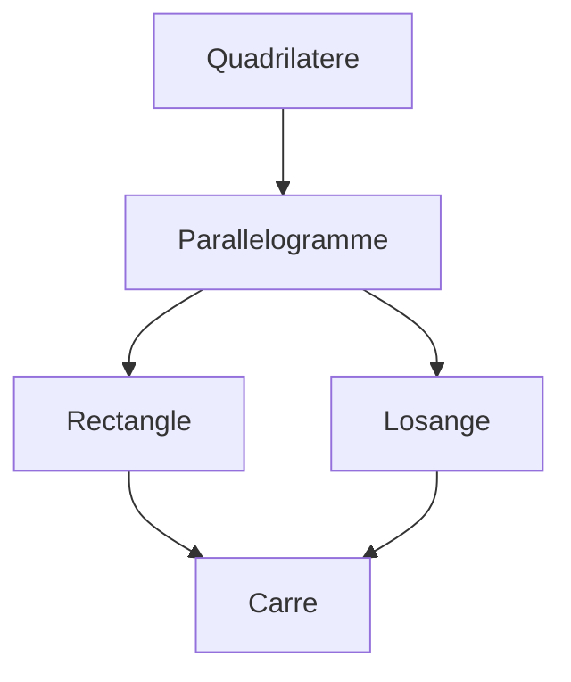

# Module 9 - Solides et figures

!!! info "Objectifs du module"
    A la fin de ce module, tu sauras :

    - Reconnaitre et nommer les polygones
    - Connaitre les proprietes des quadrilateres
    - Tracer un cercle avec un compas
    - Reconnaitre et decrire les solides
    - Calculer le perimetre des figures

    **Duree estimee : 2-3 heures** | **Pre-requis : Module 3**

---

## Les polygones

### Definition

!!! note "A retenir"
    Un **polygone** est une figure fermee composee de segments de droite.

| Nombre de cotes | Nom |
|-----------------|-----|
| 3 | Triangle |
| 4 | Quadrilatere |
| 5 | Pentagone |
| 6 | Hexagone |
| 8 | Octogone |

### Vocabulaire

| Element | Definition |
|---------|------------|
| **Cote** | Segment qui forme le bord |
| **Sommet** | Point ou deux cotes se rencontrent |
| **Angle** | Coin forme par deux cotes |

!!! example "Exemple : le triangle"
    Un triangle a **3 cotes**, **3 sommets** et **3 angles**.

---

## Les triangles

### Les differents types

| Type | Propriete |
|------|-----------|
| **Triangle quelconque** | Aucun cote egal |
| **Triangle isocele** | 2 cotes egaux |
| **Triangle equilateral** | 3 cotes egaux |
| **Triangle rectangle** | 1 angle droit |

### Comment les reconnaitre ?

!!! tip "Astuce"
    - **Isocele** : utilise le compas pour verifier 2 cotes egaux
    - **Equilateral** : les 3 cotes ont la meme longueur
    - **Rectangle** : utilise l'equerre pour verifier l'angle droit

---

## Les quadrilateres

### Definition

!!! note "A retenir"
    Un **quadrilatere** est un polygone a **4 cotes**.

### Les quadrilateres particuliers

| Figure | Proprietes |
|--------|------------|
| **Carre** | 4 cotes egaux + 4 angles droits |
| **Rectangle** | Cotes opposes egaux + 4 angles droits |
| **Losange** | 4 cotes egaux |
| **Parallelogramme** | Cotes opposes paralleles et egaux |

### Le carre

!!! note "Proprietes du carre"
    - **4 cotes** de meme longueur
    - **4 angles droits** (90°)
    - Cotes opposes **paralleles**

### Le rectangle

!!! note "Proprietes du rectangle"
    - **Longueur** et **largeur** differentes
    - **4 angles droits**
    - Cotes opposes **egaux** et **paralleles**

### Le losange

!!! note "Proprietes du losange"
    - **4 cotes** de meme longueur
    - Cotes opposes **paralleles**
    - Angles **pas forcement** droits

### Relations entre les figures

!!! tip "A retenir"
    Le **carre** est a la fois un rectangle ET un losange !

---

## Le cercle

### Vocabulaire

| Element | Definition |
|---------|------------|
| **Centre** | Point au milieu du cercle |
| **Rayon** | Segment du centre au bord |
| **Diametre** | Segment passant par le centre (2 fois le rayon) |

!!! note "Formule"
    **Diametre = 2 x Rayon**

    Si le rayon = 3 cm, alors le diametre = 6 cm

### Tracer un cercle

!!! tip "Methode avec le compas"
    1. Ecarte le compas de la longueur du rayon
    2. Place la pointe seche sur le centre
    3. Trace le cercle en faisant tourner le compas

---

## Les solides

### Definition

!!! note "A retenir"
    Un **solide** est une figure en **3 dimensions** (3D).

    Il a une **longueur**, une **largeur** et une **hauteur**.

### Les solides a connaitre

| Solide | Description | Faces |
|--------|-------------|-------|
| **Cube** | 6 faces carrees | 6 |
| **Pave droit** | 6 faces rectangulaires | 6 |
| **Pyramide** | Base + faces triangulaires | 5 (base carree) |
| **Cylindre** | 2 bases circulaires | 2 + 1 courbe |
| **Cone** | 1 base circulaire + pointe | 1 + 1 courbe |
| **Boule (sphere)** | Entierement arrondie | 0 (surface courbe) |

### Le cube

| Element | Nombre |
|---------|--------|
| Faces | 6 (carrees) |
| Aretes | 12 |
| Sommets | 8 |

### Le pave droit

| Element | Nombre |
|---------|--------|
| Faces | 6 (rectangles) |
| Aretes | 12 |
| Sommets | 8 |

### Patron du cube

!!! note "Definition"
    Un **patron** est le dessin a plat d'un solide qu'on peut plier pour le construire.

Le patron du cube est compose de **6 carres** disposes en croix.

---

## Perimetres

### Definition

!!! note "A retenir"
    Le **perimetre** est la longueur du **contour** d'une figure.

### Formules

| Figure | Formule |
|--------|---------|
| **Carre** | P = 4 x cote |
| **Rectangle** | P = 2 x (longueur + largeur) |
| **Triangle** | P = cote1 + cote2 + cote3 |

### Exemples

!!! example "Carre de 5 cm de cote"
    P = 4 x 5 = **20 cm**

!!! example "Rectangle de 8 cm sur 3 cm"
    P = 2 x (8 + 3) = 2 x 11 = **22 cm**

---

## Exercices guides

### Exercice 1 : Identifier

!!! question "Nomme ces figures"
    1. Polygone a 6 cotes
    2. Quadrilatere avec 4 angles droits et 4 cotes egaux
    3. Polygone a 3 cotes dont 2 sont egaux

??? success "Correction"
    1. **Hexagone**
    2. **Carre**
    3. **Triangle isocele**

### Exercice 2 : Cercle

!!! question "Calcule"
    Un cercle a un rayon de 4 cm. Quel est son diametre ?

??? success "Correction"
    Diametre = 2 x rayon = 2 x 4 = **8 cm**

### Exercice 3 : Perimetre

!!! question "Calcule le perimetre"
    1. Carre de cote 7 cm
    2. Rectangle de 12 cm sur 5 cm

??? success "Correction"
    1. P = 4 x 7 = **28 cm**
    2. P = 2 x (12 + 5) = 2 x 17 = **34 cm**

---

## Entrainement

### Serie 1 : Polygones

!!! note "Complete"
    1. Un quadrilatere a ... cotes
    2. Un pentagone a ... cotes
    3. Un triangle equilateral a ... cotes egaux

??? success "Corrections"
    1. 4 cotes
    2. 5 cotes
    3. 3 cotes egaux

### Serie 2 : Quadrilateres

!!! note "Vrai ou Faux ?"
    1. Le carre est un rectangle particulier
    2. Le losange a toujours 4 angles droits
    3. Le rectangle a ses cotes opposes paralleles
    4. Le carre est aussi un losange

??? success "Corrections"
    1. **Vrai** (4 angles droits, cotes opposes egaux)
    2. **Faux** (pas forcement d'angles droits)
    3. **Vrai**
    4. **Vrai** (4 cotes egaux)

### Serie 3 : Solides

!!! note "Combien de faces ?"
    1. Cube
    2. Pave droit
    3. Pyramide a base carree

??? success "Corrections"
    1. **6** faces
    2. **6** faces
    3. **5** faces (1 base + 4 triangles)

### Serie 4 : Perimetres

!!! note "Calcule"
    1. Carre de cote 9 cm
    2. Rectangle de 15 cm sur 8 cm
    3. Triangle equilateral de cote 6 cm

??? success "Corrections"
    1. P = 4 x 9 = 36 cm
    2. P = 2 x (15 + 8) = 46 cm
    3. P = 3 x 6 = 18 cm

---

## Evaluation

!!! warning "A faire sans aide"

**Q1-Q3.** Nomme les figures :

1. Polygone a 8 cotes : ...
2. Quadrilatere avec 4 cotes egaux et 4 angles droits : ...
3. Solide avec 6 faces carrees : ...

**Q4-Q5.** Cercle :

4. Le rayon d'un cercle mesure 5 cm. Quel est son diametre ?
5. Le diametre d'un cercle est 12 cm. Quel est son rayon ?

**Q6-Q8.** Solides :

6. Combien d'aretes a un cube ?
7. Combien de sommets a un pave droit ?
8. Combien de faces a une pyramide a base triangulaire ?

**Q9-Q10.** Perimetres :

9. Calcule le perimetre d'un carre de 11 cm de cote.
10. Calcule le perimetre d'un rectangle de 20 cm sur 7 cm.

??? success "Corrections"
    1. Octogone
    2. Carre
    3. Cube
    4. Diametre = 2 x 5 = 10 cm
    5. Rayon = 12 / 2 = 6 cm
    6. 12 aretes
    7. 8 sommets
    8. 4 faces (1 base + 3 triangles)
    9. P = 4 x 11 = 44 cm
    10. P = 2 x (20 + 7) = 54 cm

---

!!! summary "Bilan"
    - **Polygones** : triangle (3), quadrilatere (4), pentagone (5), hexagone (6)
    - **Quadrilateres** : carre, rectangle, losange, parallelogramme
    - **Cercle** : diametre = 2 x rayon
    - **Solides** : cube (6 faces), pave droit (6 faces), pyramide, cylindre, cone, boule
    - **Perimetre** : carre = 4 x c, rectangle = 2 x (L + l)

[:octicons-arrow-right-24: Module suivant : Mesures](module-10-measurements.md)
