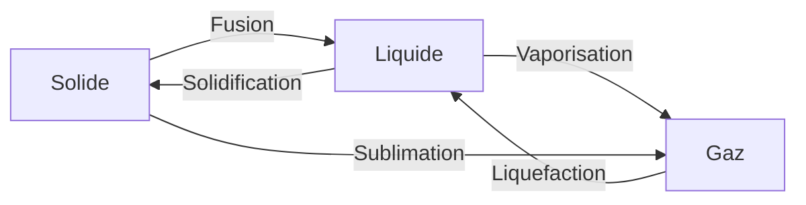

# La matiere

## Les etats de la matiere

### Les 3 etats

| Etat | Caracteristiques | Exemples |
|------|------------------|----------|
| **Solide** | Forme propre, volume fixe | Glace, bois, fer |
| **Liquide** | Pas de forme propre, volume fixe | Eau, lait, huile |
| **Gaz** | Ni forme ni volume fixe | Air, vapeur d'eau |

### Les changements d'etat

| Changement | De | Vers | Exemple |
|------------|-----|------|---------|
| **Fusion** | Solide | Liquide | Glace qui fond |
| **Solidification** | Liquide | Solide | Eau qui gele |
| **Vaporisation** | Liquide | Gaz | Eau qui bout |
| **Liquefaction** | Gaz | Liquide | Buee sur vitre |

---

## Le cycle de l'eau

### Les etapes

1. **Evaporation** : le soleil chauffe l'eau (mers, lacs)
2. **Condensation** : la vapeur forme les nuages
3. **Precipitations** : pluie, neige, grele
4. **Ruissellement** : l'eau rejoint les cours d'eau

!!! note "A retenir"
    L'eau sur Terre est toujours la meme, elle circule en permanence : c'est le **cycle de l'eau**.

---

## Les melanges

### Types de melanges

| Type | Definition | Exemple |
|------|------------|---------|
| **Melange homogene** | On ne voit pas les composants | Eau + sirop |
| **Melange heterogene** | On voit les composants | Eau + huile |

### Separer les melanges

| Technique | Utilisation |
|-----------|-------------|
| **Decantation** | Laisser reposer (sable + eau) |
| **Filtration** | Passer dans un filtre (cafe) |
| **Evaporation** | Chauffer (sel + eau → sel) |

---

## Les proprietes des materiaux

### Materiaux et proprietes

| Propriete | Definition | Materiaux |
|-----------|------------|-----------|
| **Conducteur** | Laisse passer l'electricite | Metaux (cuivre, fer) |
| **Isolant** | Bloque l'electricite | Plastique, bois, verre |
| **Opaque** | Ne laisse pas passer la lumiere | Bois, metal |
| **Transparent** | Laisse passer la lumiere | Verre, plastique |

---

## Exercices

!!! question "Q1. Cite les 3 etats de la matiere"

??? success "Correction"
    **Solide, liquide, gaz**

!!! question "Q2. Comment s'appelle le passage de liquide a gaz ?"

??? success "Correction"
    La **vaporisation** (ou evaporation)

!!! question "Q3. Est-ce que l'eau + huile est un melange homogene ou heterogene ?"

??? success "Correction"
    **Heterogene** (on voit les deux liquides separes)
