# Formation Sciences CM1

Bienvenue dans la formation complete **Sciences et Technologie** !

---

## Progression

```mermaid
graph LR
    M0[Module 0<br>Test initial] --> M1[Module 1<br>Etats matiere]
    M1 --> M2[Module 2<br>Changements etat]
    M2 --> M3[Module 3<br>Melanges]
    M3 --> M4[Module 4<br>Cycle eau]
    M4 --> M5[Module 5<br>Digestion]
    M5 --> M6[Module 6<br>Respiration]
    M6 --> M7[Module 7<br>Reproduction]
    M7 --> M8[Module 8<br>Volcans seismes]
    M8 --> M9[Module 9<br>Systeme solaire]
    M9 --> M10[Module 10<br>Technologie]
```

---

## Les modules

| Module | Theme | Duree |
|--------|-------|-------|
| [Module 0](module-00-positioning.md) | Test de positionnement | 30 min |
| [Module 1](module-01-matter-states.md) | Les etats de la matiere | 1h |
| [Module 2](module-02-state-changes.md) | Les changements d'etat | 1h |
| [Module 3](module-03-mixtures.md) | Les melanges | 1h |
| [Module 4](module-04-water-cycle.md) | Le cycle de l'eau | 1h |
| [Module 5](module-05-digestion.md) | La digestion | 1h30 |
| [Module 6](module-06-respiration.md) | La respiration | 1h |
| [Module 7](module-07-reproduction.md) | La reproduction | 1h30 |
| [Module 8](module-08-volcanoes.md) | Volcans et seismes | 1h30 |
| [Module 9](module-09-solar-system.md) | Le systeme solaire | 1h30 |
| [Module 10](module-10-technology.md) | Technologie et electricite | 1h30 |

---

## Organisation

!!! info "Comment utiliser cette formation"
    1. **Commence par le Module 0** pour evaluer ton niveau
    2. **Suis les modules dans l'ordre** (ils sont progressifs)
    3. **Fais les experiences** proposees quand c'est possible
    4. **Complete les exercices** de chaque module

---

## Objectifs de l'annee

A la fin de cette formation, tu sauras :

- [ ] Decrire les 3 etats de la matiere et leurs changements
- [ ] Expliquer le cycle de l'eau
- [ ] Connaitre les grandes fonctions du corps humain
- [ ] Decrire les phenomenes volcaniques et sismiques
- [ ] Nommer les planetes du systeme solaire
- [ ] Comprendre les bases de l'electricite

[:octicons-arrow-right-24: Commencer le Module 0](module-00-positioning.md)
