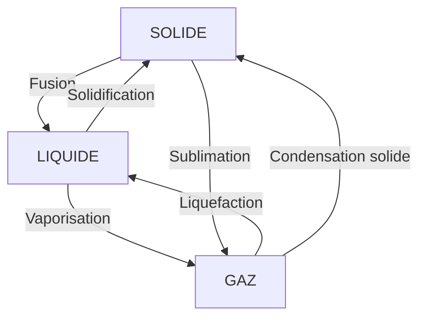

# Module 2 - Les changements d'etat

!!! abstract "Objectifs"
    - Nommer les changements d'etat
    - Comprendre le role de la temperature
    - Realiser des experiences simples

    **Duree** : 1 heure

---

## Les 6 changements d'etat

### Schema general

### Tableau des changements

| Changement | Depart | Arrivee | Exemple |
|------------|--------|---------|---------|
| **Fusion** | Solide | Liquide | Glace → eau |
| **Solidification** | Liquide | Solide | Eau → glace |
| **Vaporisation** | Liquide | Gaz | Eau → vapeur |
| **Liquefaction** | Gaz | Liquide | Vapeur → buee |
| **Sublimation** | Solide | Gaz | Neige carbonique |

---

## La fusion

!!! note "Definition"
    La **fusion** est le passage de l'etat solide a l'etat liquide.

| Corps | Temperature de fusion |
|-------|----------------------|
| Eau (glace) | 0°C |
| Beurre | 32°C |
| Fer | 1 538°C |

!!! example "Experience"
    Observe un glaçon a temperature ambiante : il fond (fusion).

---

## La solidification

!!! note "Definition"
    La **solidification** est le passage de l'etat liquide a l'etat solide.

C'est l'inverse de la fusion. La temperature est la meme !

!!! example "Experience"
    Mets de l'eau au congelateur : elle se transforme en glace a 0°C.

---

## La vaporisation

!!! note "Definition"
    La **vaporisation** est le passage de l'etat liquide a l'etat gazeux.

Deux types :
- **Ebullition** : a temperature fixe (100°C pour l'eau)
- **Evaporation** : a toute temperature (linge qui seche)

!!! example "Experience"
    Fais chauffer de l'eau : a 100°C, des bulles apparaissent (ebullition).

---

## La liquefaction (condensation liquide)

!!! note "Definition"
    La **liquefaction** est le passage de l'etat gazeux a l'etat liquide.

!!! example "Exemple quotidien"
    La **buee** sur une vitre froide : la vapeur d'eau de l'air se transforme en gouttelettes.

---

## Le role de la temperature

### Regle generale

!!! tip "A retenir"
    - **Chauffer** → fait passer a un etat plus "libre" (solide → liquide → gaz)
    - **Refroidir** → fait passer a un etat plus "ordonne" (gaz → liquide → solide)

### Les paliers de temperature

Pendant un changement d'etat, la temperature **reste constante** !

Exemple : glace fondante = toujours 0°C (meme si on chauffe)

---

## Exercices

!!! question "Q1. Comment s'appelle le passage de liquide a solide ?"

??? success "Correction"
    La **solidification**

!!! question "Q2. A quelle temperature l'eau bout-elle ?"

??? success "Correction"
    **100°C**

!!! question "Q3. La buee sur une vitre est un exemple de quel changement d'etat ?"

??? success "Correction"
    La **liquefaction** (gaz → liquide)

!!! question "Q4. Que faut-il faire pour transformer de la glace en eau ?"

??? success "Correction"
    La **chauffer** (fusion a 0°C)

---

!!! summary "Bilan"
    - **Fusion** : solide → liquide (chauffer)
    - **Solidification** : liquide → solide (refroidir)
    - **Vaporisation** : liquide → gaz (chauffer)
    - **Liquefaction** : gaz → liquide (refroidir)
    - La temperature reste **constante** pendant un changement d'etat

[:octicons-arrow-right-24: Module suivant](module-03-mixtures.md)
