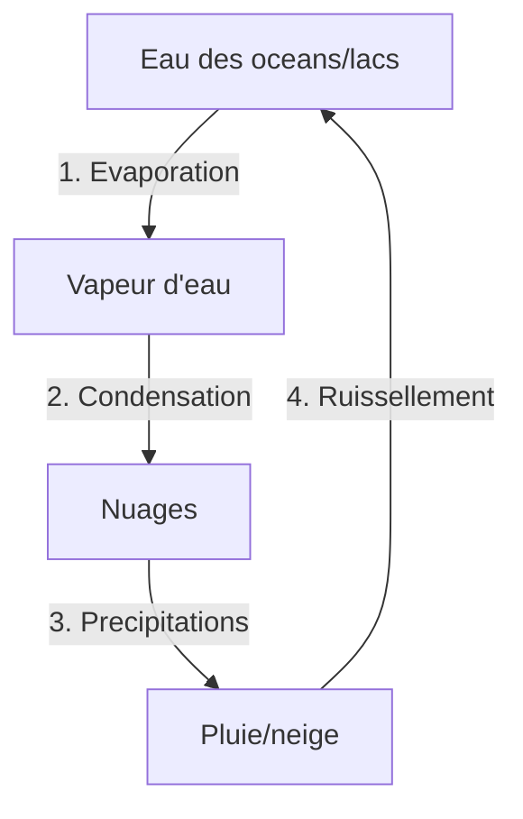

# Module 4 - Le cycle de l'eau

!!! abstract "Objectifs"
    - Comprendre le cycle de l'eau
    - Connaitre les differentes etapes
    - Savoir d'ou vient l'eau que nous buvons

    **Duree** : 1 heure

---

## L'eau sur Terre

### Repartition de l'eau

| Type d'eau | Proportion | Ou ? |
|------------|------------|------|
| **Eau salee** | 97,5% | Oceans, mers |
| **Eau douce** | 2,5% | Glaciers, lacs, rivieres, nappes |

!!! warning "Attention"
    Seule l'**eau douce** est utilisable pour boire, mais elle ne represente que 2,5% de l'eau terrestre !

---

## Le cycle de l'eau

### Les 4 grandes etapes

### Etape 1 : L'evaporation

!!! note "Definition"
    Le soleil chauffe l'eau des oceans, lacs et rivieres. L'eau liquide se transforme en **vapeur d'eau** (gaz invisible).

### Etape 2 : La condensation

!!! note "Definition"
    En altitude, l'air est froid. La vapeur d'eau se transforme en minuscules **gouttelettes** qui forment les **nuages**.

### Etape 3 : Les precipitations

!!! note "Definition"
    Quand les gouttelettes sont trop lourdes, elles tombent : c'est la **pluie**, la **neige** ou la **grele**.

### Etape 4 : Le ruissellement

!!! note "Definition"
    L'eau coule sur le sol, rejoint les **ruisseaux**, puis les **rivieres**, puis les **fleuves**, et retourne a la **mer**.

---

## L'eau dans le sol

### Les nappes phreatiques

!!! note "Definition"
    L'eau de pluie s'infiltre dans le sol et forme des reserves souterraines appelees **nappes phreatiques**.

| Element | Role |
|---------|------|
| **Nappe phreatique** | Reserve d'eau souterraine |
| **Source** | Endroit ou l'eau souterraine ressort |
| **Puits** | Trou pour atteindre la nappe |

---

## L'eau potable

### D'ou vient l'eau du robinet ?

1. **Captage** : on preleve l'eau (riviere ou nappe)
2. **Traitement** : on la nettoie (usine de potabilisation)
3. **Distribution** : on l'envoie dans les maisons (tuyaux)

### Pourquoi traiter l'eau ?

L'eau naturelle peut contenir :
- Des bacteries
- Des polluants
- Des particules de terre

!!! tip "A retenir"
    L'eau du robinet est **traitee** et **controlee** : elle est potable en France !

---

## Proteger l'eau

### Les gestes importants

| Geste | Pourquoi |
|-------|----------|
| Fermer le robinet | Economiser l'eau |
| Ne pas jeter de dechets | Eviter la pollution |
| Prendre des douches courtes | Limiter le gaspillage |
| Utiliser moins de produits chimiques | Proteger les nappes |

---

## Exercices

!!! question "Q1. Quelle est la premiere etape du cycle de l'eau ?"

??? success "Correction"
    L'**evaporation** (le soleil chauffe l'eau qui devient vapeur)

!!! question "Q2. Qu'est-ce qu'une nappe phreatique ?"

??? success "Correction"
    Une **reserve d'eau souterraine**

!!! question "Q3. Pourquoi traite-t-on l'eau avant de la distribuer ?"

??? success "Correction"
    Pour enlever les **bacteries**, **polluants** et **particules** et la rendre potable

!!! question "Q4. L'eau sur Terre est-elle toujours la meme ou se renouvelle-t-elle ?"

??? success "Correction"
    C'est **toujours la meme eau** qui circule (cycle)

---

!!! summary "Bilan"
    - Le cycle de l'eau : **evaporation → condensation → precipitations → ruissellement**
    - 97,5% d'eau salee, 2,5% d'eau douce
    - **Nappes phreatiques** = reserves souterraines
    - L'eau du robinet est **traitee** pour etre potable

[:octicons-arrow-right-24: Module suivant](module-05-digestion.md)
