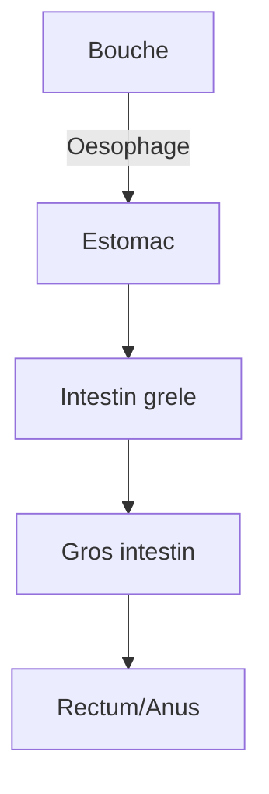

# Module 5 - La digestion

!!! abstract "Objectifs"
    - Connaitre les organes du tube digestif
    - Comprendre le trajet des aliments
    - Savoir ce que deviennent les nutriments

    **Duree** : 1h30

---

## Pourquoi digerer ?

!!! note "Definition"
    La **digestion** transforme les aliments en **nutriments** assez petits pour passer dans le sang et nourrir le corps.

Les aliments sont trop gros pour etre utilises directement par nos cellules !

---

## Le tube digestif

### Les organes

| Organe | Role |
|--------|------|
| **Bouche** | Mastication, debut de digestion (salive) |
| **Oesophage** | Transport vers l'estomac |
| **Estomac** | Broyage, sucs gastriques |
| **Intestin grele** | Digestion finale, absorption |
| **Gros intestin** | Absorption de l'eau |
| **Rectum/Anus** | Evacuation des dechets |

### Le trajet des aliments

---

## Etape par etape

### 1. La bouche

| Action | Description |
|--------|-------------|
| **Mastication** | Les dents broient les aliments |
| **Insalivation** | La salive humidifie et commence la digestion |
| **Deglutition** | On avale la bouchee |

!!! tip "A retenir"
    Bien macher facilite la digestion !

### 2. L'oesophage

Tube qui transporte les aliments de la bouche a l'estomac.
Duree : quelques secondes.

### 3. L'estomac

| Action | Description |
|--------|-------------|
| **Brassage** | Melange des aliments |
| **Sucs gastriques** | Liquide acide qui decompose les aliments |

Duree : 2 a 4 heures.

### 4. L'intestin grele

!!! note "Role principal"
    C'est ici que les **nutriments** passent dans le sang !

| Caracteristique | Detail |
|-----------------|--------|
| Longueur | 6 a 7 metres |
| Surface | Augmentee par les villosites |
| Role | Absorption des nutriments |

### 5. Le gros intestin

- Absorbe l'**eau** restante
- Forme les **selles** (dechets)

---

## Les glandes digestives

| Glande | Produit | Role |
|--------|---------|------|
| **Glandes salivaires** | Salive | Debut digestion dans la bouche |
| **Foie** | Bile | Digestion des graisses |
| **Pancreas** | Sucs pancreatiques | Digestion complete |

---

## Les nutriments

### Que contiennent les aliments ?

| Nutriment | Role | Aliments |
|-----------|------|----------|
| **Glucides** | Energie rapide | Pain, pates, sucre |
| **Lipides** | Energie de reserve | Beurre, huile |
| **Proteines** | Construction du corps | Viande, poisson, oeufs |
| **Vitamines** | Bon fonctionnement | Fruits, legumes |
| **Eau** | Hydratation | Eau, aliments |

---

## Exercices

!!! question "Q1. Quel est le role de la digestion ?"

??? success "Correction"
    Transformer les aliments en **nutriments** utilisables par le corps

!!! question "Q2. Dans quel organe les nutriments passent-ils dans le sang ?"

??? success "Correction"
    Dans l'**intestin grele**

!!! question "Q3. Que produit le foie pour aider la digestion ?"

??? success "Correction"
    La **bile** (qui aide a digerer les graisses)

!!! question "Q4. Remets dans l'ordre : estomac, bouche, gros intestin, intestin grele"

??? success "Correction"
    Bouche → estomac → intestin grele → gros intestin

---

!!! summary "Bilan"
    - Tube digestif : bouche → oesophage → estomac → intestin grele → gros intestin
    - **Intestin grele** : absorption des nutriments
    - Nutriments : glucides, lipides, proteines, vitamines, eau
    - Glandes : salivaires, foie, pancreas

[:octicons-arrow-right-24: Module suivant](module-06-respiration.md)
