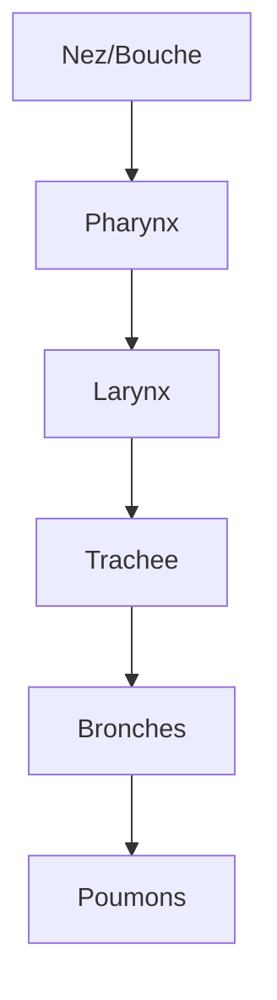

# Module 6 - La respiration

!!! abstract "Objectifs"
    - Connaitre les organes de la respiration
    - Comprendre les echanges gazeux
    - Savoir pourquoi on respire

    **Duree** : 1 heure

---

## Pourquoi respire-t-on ?

!!! note "Role de la respiration"
    La respiration apporte l'**oxygene** (O2) dont le corps a besoin pour fonctionner et rejette le **dioxyde de carbone** (CO2) produit par les cellules.

Sans oxygene, nos cellules ne peuvent pas produire d'energie !

---

## Les organes respiratoires

### L'appareil respiratoire

| Organe | Role |
|--------|------|
| **Nez/Bouche** | Entree de l'air |
| **Pharynx** | Carrefour air/aliments |
| **Larynx** | Contient les cordes vocales |
| **Trachee** | Conduit principal de l'air |
| **Bronches** | Division en deux (droite/gauche) |
| **Poumons** | Echanges gazeux |
| **Diaphragme** | Muscle de la respiration |

### Le trajet de l'air

---

## Les mouvements respiratoires

### L'inspiration

!!! note "Definition"
    L'**inspiration** fait entrer l'air dans les poumons.

| Ce qui se passe | Resultat |
|-----------------|----------|
| Le diaphragme descend | La cage thoracique s'agrandit |
| Les cotes s'ecartent | Les poumons se remplissent d'air |

### L'expiration

!!! note "Definition"
    L'**expiration** fait sortir l'air des poumons.

| Ce qui se passe | Resultat |
|-----------------|----------|
| Le diaphragme remonte | La cage thoracique se retrecit |
| Les cotes se rapprochent | L'air est expulse |

---

## Les echanges gazeux

### Dans les poumons (alveoles)

| Gaz | Direction |
|-----|-----------|
| **Oxygene (O2)** | Air → Sang |
| **Dioxyde de carbone (CO2)** | Sang → Air |

!!! tip "A retenir"
    On **inspire** de l'air riche en O2, on **expire** de l'air riche en CO2.

### Composition de l'air

| Gaz | Air inspire | Air expire |
|-----|-------------|------------|
| Oxygene | 21% | 16% |
| Dioxyde de carbone | 0,04% | 4% |
| Azote | 78% | 78% |

---

## Respiration et effort

### Pendant l'effort physique

| Changement | Pourquoi |
|------------|----------|
| Respiration plus rapide | Besoin de plus d'O2 |
| Coeur bat plus vite | Transporter l'O2 plus vite |

!!! example "Exemple"
    Apres avoir couru, tu es essouffle : ton corps a besoin de plus d'oxygene !

---

## Proteger ses poumons

### Les dangers

| Danger | Consequence |
|--------|-------------|
| **Tabac** | Maladies des poumons, cancer |
| **Pollution** | Irritation, maladies |
| **Allergies** | Asthme, difficultes a respirer |

!!! warning "Important"
    Le tabac detruit les poumons. Ne jamais commencer a fumer !

---

## Exercices

!!! question "Q1. Quel gaz absorbe-t-on en respirant ?"

??? success "Correction"
    L'**oxygene** (O2)

!!! question "Q2. Quel muscle est responsable de la respiration ?"

??? success "Correction"
    Le **diaphragme**

!!! question "Q3. Pourquoi respire-t-on plus vite pendant le sport ?"

??? success "Correction"
    Parce que le corps a besoin de **plus d'oxygene** pour l'effort

!!! question "Q4. Dans quels organes se font les echanges gazeux ?"

??? success "Correction"
    Dans les **poumons** (au niveau des alveoles)

---

!!! summary "Bilan"
    - Trajet : nez → pharynx → larynx → trachee → bronches → poumons
    - **Inspiration** : air entre (O2)
    - **Expiration** : air sort (CO2)
    - Le **diaphragme** est le muscle principal
    - Pendant l'effort, on respire plus vite

[:octicons-arrow-right-24: Module suivant](module-07-reproduction.md)
