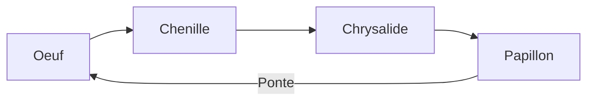

# Module 7 - La reproduction

!!! abstract "Objectifs"
    - Comprendre la reproduction des animaux
    - Comprendre la reproduction des plantes
    - Connaitre le vocabulaire de la reproduction

    **Duree** : 1h30

---

## La reproduction : pourquoi ?

!!! note "Definition"
    La **reproduction** permet aux etres vivants de donner naissance a de nouveaux individus de la meme espece.

Sans reproduction, les especes disparaitraient !

---

## Reproduction des animaux

### Les deux types

| Type | Definition | Exemples |
|------|------------|----------|
| **Ovipare** | L'animal pond des oeufs | Poule, tortue, poisson |
| **Vivipare** | Le petit se developpe dans le ventre de la mere | Chat, chien, humain |

### Le cycle de vie (exemple : papillon)

### Vocabulaire

| Terme | Definition |
|-------|------------|
| **Fecondation** | Rencontre de la cellule male et femelle |
| **Gestation** | Developpement du petit dans le ventre |
| **Metamorphose** | Transformation complete (chenille → papillon) |

---

## Reproduction des plantes a fleurs

### Les parties de la fleur

| Partie | Role |
|--------|------|
| **Petales** | Attirer les insectes |
| **Etamines** | Organe male (produit le pollen) |
| **Pistil** | Organe femelle (contient l'ovule) |
| **Sepales** | Proteger la fleur |

### Les etapes de la reproduction

1. **Pollinisation** : le pollen va sur le pistil
2. **Fecondation** : le pollen rejoint l'ovule
3. **Formation du fruit** : le pistil se transforme en fruit
4. **Graine** : le fruit contient les graines
5. **Germination** : la graine devient une nouvelle plante

### Comment le pollen voyage ?

| Agent | Comment |
|-------|---------|
| **Insectes** | Abeilles, papillons transportent le pollen |
| **Vent** | Pour les fleurs sans petales (arbres) |
| **Eau** | Pour les plantes aquatiques |

---

## De la graine a la plante

### La germination

!!! note "Definition"
    La **germination** est la transformation de la graine en jeune plante.

### Conditions necessaires

| Condition | Role |
|-----------|------|
| **Eau** | Reveiller la graine |
| **Chaleur** | Favoriser le developpement |
| **Air** | La plante respire |

!!! example "Experience"
    Plante des graines de haricot dans du coton humide. En quelques jours, tu verras la germination !

### Les etapes de la germination

1. La graine absorbe l'eau
2. La racine sort (radicule)
3. La tige sort (tigelle)
4. Les premieres feuilles apparaissent

---

## Reproduction vegetative

!!! note "Definition"
    Certaines plantes se reproduisent **sans graines**, a partir d'une partie de la plante.

| Methode | Exemple |
|---------|---------|
| **Bouturage** | Tige de geranium dans l'eau |
| **Marcottage** | Branche enterree (fraisier) |
| **Bulbe** | Tulipe, oignon |
| **Tubercule** | Pomme de terre |

---

## Exercices

!!! question "Q1. Un animal ovipare pond-il des oeufs ?"

??? success "Correction"
    **Oui**, ovipare = pond des oeufs

!!! question "Q2. Quel est le role des abeilles dans la reproduction des plantes ?"

??? success "Correction"
    Elles transportent le **pollen** d'une fleur a l'autre (pollinisation)

!!! question "Q3. Quelles sont les 3 conditions pour qu'une graine germe ?"

??? success "Correction"
    **Eau**, **chaleur** et **air**

!!! question "Q4. Comment appelle-t-on l'organe male de la fleur ?"

??? success "Correction"
    Les **etamines**

---

!!! summary "Bilan"
    - Animaux : **ovipares** (oeufs) ou **vivipares** (ventre)
    - Plantes : pollinisation → fecondation → fruit → graine → germination
    - Germination : eau + chaleur + air
    - Reproduction vegetative : sans graines (bouturage, bulbe...)

[:octicons-arrow-right-24: Module suivant](module-08-volcanoes.md)
