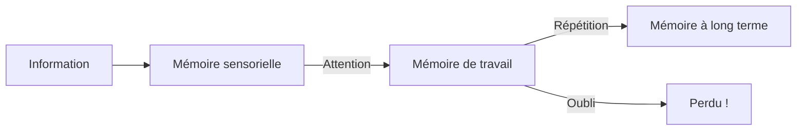

# Apprendre une leçon

## Comment fonctionne la mémoire ?

### Les trois types de mémoire



| Type | Durée | Capacité |
|------|-------|----------|
| **Mémoire sensorielle** | Quelques secondes | Grande |
| **Mémoire de travail** | Quelques minutes | Limitée (7 éléments) |
| **Mémoire à long terme** | Années | Illimitée |

!!! info "Objectif"
    Faire passer les informations de la **mémoire de travail** à la **mémoire à long terme** !

### La courbe de l'oubli

!!! warning "Sans révision..."
    - Après 20 min : on oublie **40%**
    - Après 1 jour : on oublie **70%**
    - Après 1 semaine : on oublie **90%**

!!! tip "La solution : la répétition espacée"
    Réviser plusieurs fois, à intervalles croissants :

    - **J** (jour même)
    - **J+1** (lendemain)
    - **J+3** (3 jours après)
    - **J+7** (1 semaine après)
    - **J+14** (2 semaines après)

---

## Les étapes pour apprendre

### 1. Comprendre avant d'apprendre

!!! danger "Règle fondamentale"
    **Ne jamais apprendre ce qu'on ne comprend pas !**

| Si tu ne comprends pas... | Alors... |
|--------------------------|----------|
| Un mot | Cherche la définition |
| Une règle | Demande au prof ou à un camarade |
| Un exercice | Refais-le avec la correction |

### 2. Organiser l'information

!!! tip "Techniques"
    - **Surligner** les mots importants
    - **Numéroter** les étapes ou les points
    - **Faire un schéma** ou une carte mentale
    - **Créer des liens** avec ce qu'on connaît déjà

### 3. Mémoriser activement

| Méthode passive ❌ | Méthode active ✅ |
|-------------------|------------------|
| Lire plusieurs fois | Réciter sans regarder |
| Recopier | Expliquer à quelqu'un |
| Surligner tout | Faire des exercices |
| Écouter distraitement | Poser des questions |

### 4. Vérifier et réviser

!!! info "Test yourself !"
    - Cache tes notes et récite
    - Fais des exercices sans aide
    - Explique à quelqu'un (ou à ton chat !)
    - Refais les exercices ratés

---

## Les techniques de mémorisation

### La carte mentale (Mind Map)

!!! info "Principe"
    Représenter visuellement les idées autour d'un thème central.

```
                    ┌─────────────┐
                    │   EXEMPLE   │
                    └──────┬──────┘
           ┌───────────────┼───────────────┐
           ▼               ▼               ▼
    ┌──────────┐    ┌──────────┐    ┌──────────┐
    │ Branche 1│    │ Branche 2│    │ Branche 3│
    └────┬─────┘    └────┬─────┘    └────┬─────┘
         │               │               │
    ┌────┴────┐     ┌────┴────┐     ┌────┴────┐
    │Sous-idée│     │Sous-idée│     │Sous-idée│
    └─────────┘     └─────────┘     └─────────┘
```

| Avantage | Explication |
|----------|-------------|
| **Visuel** | Le cerveau retient mieux les images |
| **Structuré** | On voit les liens entre les idées |
| **Créatif** | Couleurs, dessins = mémorisation |
| **Synthétique** | Tout sur une page |

### Les moyens mnémotechniques

!!! tip "Techniques pour retenir"

**Acronymes** : Première lettre de chaque mot
> **PEMDAS** = Parenthèses, Exposants, Multiplication, Division, Addition, Soustraction

**Phrases** : Créer une phrase avec les premières lettres
> "**M**on **V**ieux **T**u **M**'as **J**eté **S**ur **U**ne **N**uage" = ordre des planètes

**Rimes** : Mettre en vers
> "Mais où est donc Ornicar ?" = mais, ou, et, donc, or, ni, car

**Association d'images** : Créer une image mentale
> Pour retenir que "chat" = "cat" en anglais, imagine un chat qui attrape (catch) une souris

**La méthode des lieux** : Placer les éléments dans un lieu connu
> Imagine ta maison et place chaque élément à mémoriser dans une pièce

### Les flashcards (cartes mémoire)

!!! info "Principe"
    Des cartes avec une question d'un côté, la réponse de l'autre.

```
┌─────────────────┐    ┌─────────────────┐
│     RECTO       │    │     VERSO       │
│                 │    │                 │
│  Capitale de    │    │                 │
│  l'Italie ?     │    │     Rome        │
│                 │    │                 │
└─────────────────┘    └─────────────────┘
```

| Utilisation | Conseil |
|-------------|---------|
| **Vocabulaire** | Mot français / Mot anglais |
| **Dates** | Événement / Date |
| **Définitions** | Mot / Définition |
| **Formules** | Nom / Formule |

!!! tip "Méthode de tri"
    - ✅ **Je sais** : Mettre de côté
    - ❓ **Hésitation** : Revoir bientôt
    - ❌ **Je ne sais pas** : À réviser en priorité

### La technique de Feynman

!!! info "Principe"
    Expliquer simplement, comme si tu enseignais à un enfant de 6 ans.

| Étape | Action |
|:-----:|--------|
| 1 | **Choisis** un concept à apprendre |
| 2 | **Explique-le** simplement (à voix haute ou par écrit) |
| 3 | **Identifie** les points que tu n'arrives pas à expliquer |
| 4 | **Retourne** à tes notes pour combler les trous |
| 5 | **Simplifie** encore plus |

!!! example "Exemple"
    Au lieu de dire : "La photosynthèse est le processus par lequel les organismes autotrophes convertissent l'énergie lumineuse en énergie chimique."

    Dis plutôt : "Les plantes mangent la lumière du soleil pour fabriquer leur nourriture."

---

## Apprendre selon son profil

### Les trois profils d'apprentissage

| Profil | Comment tu apprends mieux | Techniques adaptées |
|--------|--------------------------|---------------------|
| **Visuel** 👁️ | En voyant | Schémas, couleurs, cartes mentales |
| **Auditif** 👂 | En écoutant | Lire à voix haute, enregistrer, écouter |
| **Kinesthésique** ✋ | En faisant | Manipuler, marcher en récitant, réécrire |

### Conseils selon ton profil

!!! tip "Si tu es VISUEL 👁️"
    - Utilise des **couleurs** différentes
    - Fais des **schémas** et des **dessins**
    - Utilise des **surligneurs**
    - Affiche tes fiches sur ton mur
    - Regarde des **vidéos** explicatives

!!! tip "Si tu es AUDITIF 👂"
    - Lis tes leçons **à voix haute**
    - **Enregistre-toi** et réécoute
    - Travaille avec un(e) ami(e) pour **discuter** du cours
    - Mets les informations en **chanson** ou en **rythme**
    - Écoute des **podcasts** éducatifs

!!! tip "Si tu es KINESTHÉSIQUE ✋"
    - **Marche** en récitant ta leçon
    - **Manipule** des objets (cartes, post-its)
    - **Récris** plusieurs fois
    - Fais des **gestes** associés aux concepts
    - Utilise des **jeux** éducatifs

---

## Les fiches de révision

### Comment faire une bonne fiche

!!! tip "Format idéal"
    - **Petite taille** : format A5 ou 1/2 feuille
    - **Titre clair** avec le chapitre
    - **Mots-clés** plutôt que phrases complètes
    - **Couleurs** pour organiser (2-3 max)
    - **Schémas** si possible

### Structure type d'une fiche

```
┌────────────────────────────────────────────┐
│  TITRE DU CHAPITRE               Date      │
├────────────────────────────────────────────┤
│                                            │
│  📌 DÉFINITIONS                            │
│  • Mot 1 : ...                             │
│  • Mot 2 : ...                             │
│                                            │
│  📌 POINTS ESSENTIELS                      │
│  1. ...                                    │
│  2. ...                                    │
│  3. ...                                    │
│                                            │
│  📌 FORMULES / RÈGLES                      │
│  • ...                                     │
│                                            │
│  📌 EXEMPLES                               │
│  • ...                                     │
│                                            │
│  📌 PIÈGES À ÉVITER                        │
│  ⚠️ ...                                    │
│                                            │
└────────────────────────────────────────────┘
```

### Ce qu'il faut mettre sur une fiche

| À inclure ✅ | À éviter ❌ |
|-------------|------------|
| Définitions | Texte recopié entièrement |
| Mots-clés | Phrases trop longues |
| Formules | Détails secondaires |
| Schémas | Trop de couleurs |
| Exemples | Informations non comprises |
| Dates importantes | Décorations inutiles |

---

## Avant un contrôle

### J-7 : Première révision

- [ ] Relire le cours entier
- [ ] Surligner les points importants
- [ ] Lister ce que tu ne comprends pas
- [ ] Demander des explications

### J-3 : Révision active

- [ ] Faire ou revoir ta fiche de révision
- [ ] Refaire les exercices du cours
- [ ] S'entraîner avec des exercices supplémentaires
- [ ] Réciter les définitions et formules

### J-1 : Révision finale

- [ ] Relire ta fiche (pas tout le cours !)
- [ ] Réciter les points essentiels
- [ ] Vérifier le matériel nécessaire
- [ ] Se coucher tôt !

### Jour J : Le contrôle

- [ ] Petit-déjeuner complet
- [ ] Arriver détendu
- [ ] Lire TOUT le sujet d'abord
- [ ] Commencer par ce qu'on sait
- [ ] Relire avant de rendre

---

## Les erreurs à éviter

| Erreur | Pourquoi c'est inefficace | Solution |
|--------|--------------------------|----------|
| **Relire sans réciter** | Illusion de savoir | Fermer le cahier et réciter |
| **Surligner tout** | Rien ne ressort | 3-4 mots-clés par paragraphe |
| **Apprendre par cœur** | Pas de compréhension | Reformuler avec ses mots |
| **Réviser la veille** | Stress, fatigue | Commencer une semaine avant |
| **Musique avec paroles** | Distraction | Silence ou musique instrumentale |

---

## Quiz express

??? question "Quelle est la règle fondamentale avant d'apprendre ?"
    **Comprendre avant d'apprendre** - Ne jamais apprendre ce qu'on ne comprend pas !

??? question "Qu'est-ce que la répétition espacée ?"
    Réviser **plusieurs fois à intervalles croissants** (J, J+1, J+3, J+7, J+14) pour mieux mémoriser.

??? question "Quels sont les trois profils d'apprentissage ?"
    - **Visuel** (en voyant)
    - **Auditif** (en écoutant)
    - **Kinesthésique** (en faisant)

??? question "Quelle est la technique de Feynman ?"
    **Expliquer simplement** comme si on enseignait à un enfant de 6 ans.

??? question "Pourquoi ne faut-il pas tout surligner ?"
    Car **rien ne ressort** - il faut surligner seulement 3-4 mots-clés par paragraphe.

??? question "Combien de temps avant faut-il commencer à réviser pour un contrôle ?"
    Au moins **une semaine avant**, pas la veille !
