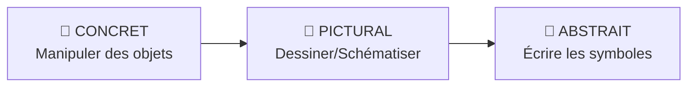
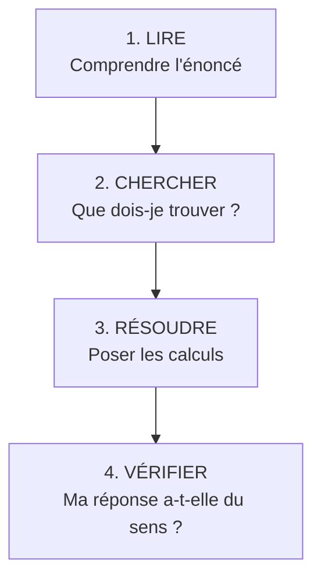

# Réussir en Maths

!!! tip "Pour les parents"
    Cette page regroupe des méthodes pédagogiques éprouvées, des moyens mnémotechniques et des astuces concrètes pour aider votre enfant à comprendre et aimer les maths.

---

## Comprendre les difficultés

### Pourquoi les maths semblent difficiles ?

| Cause fréquente | Solution |
|-----------------|----------|
| **Lacunes accumulées** | Les maths sont cumulatives : revenir aux bases |
| **Peur de l'erreur** | L'erreur est normale et formatrice |
| **Apprentissage par cœur** | Privilégier la compréhension |
| **Manque de pratique** | Les maths s'apprennent en faisant |
| **Abstraction** | Utiliser des objets concrets |

!!! danger "L'erreur principale"
    **Ne pas comprendre ≠ Être nul en maths**

    Un enfant qui ne comprend pas a souvent juste besoin d'une autre explication, d'un autre angle, d'un peu plus de temps.

### Les profils d'apprentissage en maths

| Profil | Caractéristiques | Méthodes adaptées |
|--------|------------------|-------------------|
| **Visuel** | Besoin de voir, schématiser | Dessins, couleurs, schémas |
| **Auditif** | Besoin d'entendre, verbaliser | Expliquer à voix haute |
| **Kinesthésique** | Besoin de manipuler | Objets, jeux, mouvement |

---

## Méthodes pédagogiques efficaces

### 1. La méthode Singapour (CPA)

!!! info "Concret → Pictural → Abstrait"
    La méthode Singapour décompose chaque concept en 3 étapes :



**Exemple pour 3 + 5 = 8 :**

| Étape | Action |
|-------|--------|
| **Concret** | Prendre 3 Legos + 5 Legos, compter |
| **Pictural** | Dessiner 3 ronds + 5 ronds |
| **Abstrait** | Écrire 3 + 5 = 8 |

!!! tip "Application maison"
    - **Addition** : bonbons, pièces, Legos
    - **Fractions** : pizza, gâteau, chocolat
    - **Géométrie** : papier plié, pailles, cure-dents
    - **Mesures** : règle, mètre, balance de cuisine

### 2. La verbalisation

!!! info "Principe"
    Faire **parler l'enfant** sur ce qu'il fait et pourquoi.

| Au lieu de... | Demander... |
|---------------|-------------|
| "C'est faux, recommence" | "Explique-moi comment tu as fait" |
| "La réponse est 42" | "Comment pourrais-tu trouver la réponse ?" |
| "Tu n'as pas compris" | "Qu'est-ce qui te bloque ?" |

**Questions magiques :**

- "Qu'est-ce que tu sais déjà ?"
- "Qu'est-ce qu'on te demande de trouver ?"
- "Par quoi pourrais-tu commencer ?"
- "Est-ce que ta réponse a du sens ?"

### 3. L'erreur positive

!!! success "L'erreur est un outil d'apprentissage"

    Chaque erreur montre **où** l'enfant en est et **ce qu'il** faut retravailler.

| Réaction négative ❌ | Réaction positive ✅ |
|---------------------|---------------------|
| "C'est faux !" | "Intéressant, montre-moi ton raisonnement" |
| "Tu aurais dû savoir" | "Qu'est-ce qui t'a mis sur cette piste ?" |
| "Recommence" | "Où est-ce que ça a coincé ?" |

### 4. Les petits pas

!!! info "Décomposer la difficulté"
    Un problème complexe = plusieurs petits problèmes simples.

**Exemple :** Calculer 47 + 38

| Étape | Calcul | Explication |
|:-----:|--------|-------------|
| 1 | 47 + 30 = 77 | D'abord les dizaines |
| 2 | 77 + 8 = 85 | Puis les unités |
| ✅ | **85** | Résultat ! |

---

## Moyens mnémotechniques

### L'ordre des opérations (PEMDAS)

!!! tip "Phrase mnémotechnique"
    **P**apa, **E**st-ce que **M**amie **D**anse **A**vec **S**on mari ?

| Lettre | Opération | Priorité |
|:------:|-----------|:--------:|
| **P** | **P**arenthèses | 1ère |
| **E** | **E**xposants (puissances) | 2ème |
| **M** | **M**ultiplication | 3ème |
| **D** | **D**ivision | 3ème |
| **A** | **A**ddition | 4ème |
| **S** | **S**oustraction | 4ème |

!!! example "Exemple"
    3 + 4 × 2 = ?

    ❌ 3 + 4 = 7, puis 7 × 2 = 14

    ✅ 4 × 2 = 8, puis 3 + 8 = **11** (multiplication d'abord !)

### Les tables de multiplication

#### La table de 9 avec les doigts

!!! tip "Méthode magique"
    Mets tes 10 doigts devant toi. Pour 9 × N, baisse le N-ème doigt.

```
9 × 3 = ?

Doigts : | | |↓| | | | | | |
         1 2  3 4 5 6 7 8 9 10

À gauche du doigt baissé : 2 doigts = 2 dizaines
À droite du doigt baissé : 7 doigts = 7 unités

Réponse : 27 ✅
```

| Calcul | Doigt baissé | Gauche | Droite | Résultat |
|:------:|:------------:|:------:|:------:|:--------:|
| 9 × 1 | 1er | 0 | 9 | **09** |
| 9 × 2 | 2ème | 1 | 8 | **18** |
| 9 × 3 | 3ème | 2 | 7 | **27** |
| 9 × 4 | 4ème | 3 | 6 | **36** |
| 9 × 5 | 5ème | 4 | 5 | **45** |
| 9 × 6 | 6ème | 5 | 4 | **54** |
| 9 × 7 | 7ème | 6 | 3 | **63** |
| 9 × 8 | 8ème | 7 | 2 | **72** |
| 9 × 9 | 9ème | 8 | 1 | **81** |

#### L'astuce de la table de 9

!!! tip "Le total fait toujours 9"
    Dans les résultats de la table de 9, la somme des chiffres = 9

    - 9 × 2 = 18 → 1 + 8 = **9** ✅
    - 9 × 7 = 63 → 6 + 3 = **9** ✅
    - 9 × 9 = 81 → 8 + 1 = **9** ✅

#### Les doubles (table de 2)

!!! tip "Doubler, c'est ajouter le même nombre"
    2 × 7 = 7 + 7 = **14**

#### La table de 5

!!! tip "Motif simple"
    - × un nombre **pair** → finit par **0** (5×2=10, 5×4=20)
    - × un nombre **impair** → finit par **5** (5×3=15, 5×7=35)

#### La table de 4 (doubler deux fois)

!!! tip "4× = 2× deux fois"
    4 × 7 = ?

    - 2 × 7 = 14
    - 2 × 14 = **28** ✅

#### Les carrés remarquables

| Carré | Résultat | Astuce mémorisation |
|:-----:|:--------:|---------------------|
| 1² | 1 | Le seul |
| 2² | 4 | 2+2 |
| 3² | 9 | 3×3 |
| 4² | 16 | 4×4 ou 2⁴ |
| 5² | 25 | Quart de 100 |
| 6² | 36 | 6×6 |
| 7² | 49 | 7 ans = âge de raison |
| 8² | 64 | Cases d'un échiquier |
| 9² | 81 | 9×9 (81-18 symétrie) |
| 10² | 100 | Le cent |

### Multiplier par 11

!!! tip "Astuce pour × 11"
    Pour un nombre à 2 chiffres : écarter les chiffres et mettre leur somme au milieu.

| Calcul | Décomposition | Résultat |
|:------:|---------------|:--------:|
| 11 × 23 | 2 _ 3 → 2 (2+3) 3 | **253** |
| 11 × 45 | 4 _ 5 → 4 (4+5) 5 | **495** |
| 11 × 36 | 3 _ 6 → 3 (3+6) 6 | **396** |

!!! warning "Si la somme dépasse 9"
    11 × 68 = 6 _ 8 → 6 (6+8=14) 8 → on retient : **748**

### Les fractions

#### Visualiser les fractions

!!! tip "La pizza magique"
    Une fraction, c'est une part de pizza !

```
    PIZZA ENTIÈRE          1/2              1/4              1/8

       ████████          ████████        ████████        ████████
      ██████████        ████████░░      ████░░░░░░      ██░░░░░░░░
     ████████████      ████████░░░░    ████░░░░░░░░    ██░░░░░░░░░░
     ████████████      ████████░░░░    ████░░░░░░░░    ██░░░░░░░░░░
      ██████████        ████████░░      ████░░░░░░      ██░░░░░░░░
       ████████          ████████        ████████        ████████
```

#### Comparer des fractions

!!! tip "Même dénominateur = facile"
    3/8 et 5/8 → On compare 3 et 5 → **3/8 < 5/8**

!!! tip "Même numérateur"
    1/3 et 1/5 → Plus le dénominateur est grand, plus la part est petite

    → **1/5 < 1/3** (1/5 de pizza < 1/3 de pizza)

#### Fractions décimales

| Fraction | Décimal | Mémo |
|:--------:|:-------:|------|
| 1/2 | 0,5 | La moitié |
| 1/4 | 0,25 | Le quart (pièce de 25 centimes) |
| 3/4 | 0,75 | 3 × 25 centimes |
| 1/5 | 0,2 | 5 × 0,2 = 1 |
| 1/10 | 0,1 | Un dixième |

### La conversion d'unités

#### Longueurs

!!! tip "L'escalier des unités"

```
        km
       /  \
      hm   × 10 à chaque marche
     /  \
    dam
   /  \
  m      ← On descend = on multiplie par 10
 / \
dm     ← On monte = on divise par 10
 \
  cm
   \
    mm
```

**Phrase mnémotechnique :** "**K**arine **H**abite **D**ans **M**a **D**emeure **C**hez **M**oi"

| Lettre | Unité | Valeur en mètres |
|:------:|-------|:----------------:|
| K | Kilomètre | 1000 m |
| H | Hectomètre | 100 m |
| D | Décamètre | 10 m |
| M | Mètre | 1 m |
| d | décimètre | 0,1 m |
| c | centimètre | 0,01 m |
| m | millimètre | 0,001 m |

#### Capacités

**Phrase :** "**H**enri **D**anse **L**a **d**anse **c**hez **m**oi"

(hL, daL, L, dL, cL, mL)

### Les angles

!!! tip "Reconnaître les angles"

| Angle | Mesure | Mémo visuel |
|-------|:------:|-------------|
| **Aigu** | < 90° | Comme un couteau (aigu = coupant) |
| **Droit** | = 90° | Comme le coin d'une feuille |
| **Obtus** | > 90° | Comme un fauteuil incliné |
| **Plat** | = 180° | Comme une ligne |

```
   AIGU           DROIT          OBTUS          PLAT

    /              |             \
   /               |              \
  /________________|_______________\_______________
```

### Le périmètre et l'aire

!!! tip "Ne pas confondre !"

    - **Périmètre** = le tour (comme une barrière autour d'un jardin)
    - **Aire** = la surface (comme le gazon à l'intérieur)

| Figure | Périmètre | Aire |
|--------|-----------|------|
| **Carré** | 4 × côté | côté × côté |
| **Rectangle** | 2 × (L + l) | L × l |
| **Triangle** | a + b + c | (base × hauteur) / 2 |
| **Cercle** | 2 × π × r | π × r² |

!!! tip "Mémo : Périmètre du rectangle"
    **2 × (L + l)** = "2 fois la somme de Longueur et largeur"

    Ou : L + L + l + l (tous les côtés)

---

## Techniques de calcul mental

### Ajouter 9

!!! tip "Ajouter 10, retirer 1"
    47 + 9 = 47 + 10 - 1 = 57 - 1 = **56**

### Ajouter 99

!!! tip "Ajouter 100, retirer 1"
    234 + 99 = 234 + 100 - 1 = 334 - 1 = **333**

### Soustraire 9

!!! tip "Soustraire 10, ajouter 1"
    52 - 9 = 52 - 10 + 1 = 42 + 1 = **43**

### Multiplier par 5

!!! tip "Diviser par 2, multiplier par 10"
    48 × 5 = (48 ÷ 2) × 10 = 24 × 10 = **240**

### Multiplier par 25

!!! tip "Diviser par 4, multiplier par 100"
    36 × 25 = (36 ÷ 4) × 100 = 9 × 100 = **900**

### Multiplier par 50

!!! tip "Diviser par 2, multiplier par 100"
    24 × 50 = (24 ÷ 2) × 100 = 12 × 100 = **1200**

### Le complément à 10

!!! tip "Pour additionner plus vite"
    Les paires qui font 10 : 1+9, 2+8, 3+7, 4+6, 5+5

    7 + 5 = 7 + **3** + 2 = 10 + 2 = **12**

---

## Résoudre un problème

### La méthode en 4 étapes



### Questions à se poser

| Étape | Questions |
|-------|-----------|
| **LIRE** | De quoi parle le problème ? Quelles sont les données ? |
| **CHERCHER** | Qu'est-ce qu'on me demande ? Quelle est l'inconnue ? |
| **RÉSOUDRE** | Quelle opération utiliser ? Dans quel ordre ? |
| **VÉRIFIER** | Le résultat est-il logique ? Ai-je répondu à la question ? |

### Mots-clés des opérations

| Mots dans l'énoncé | Opération probable |
|--------------------|-------------------|
| total, somme, en tout, ensemble | **Addition** |
| reste, différence, de moins | **Soustraction** |
| fois, double, triple, par | **Multiplication** |
| partager, diviser, chacun | **Division** |

!!! warning "Attention aux pièges"
    "De plus" peut indiquer une addition OU une comparaison !

    - "Il a 3 billes de plus" → addition si on cherche le total
    - "Il a 3 billes de plus que Paul" → comparaison

---

## Activités ludiques

### Jeux pour pratiquer

| Jeu | Compétence travaillée |
|----|----------------------|
| **Bataille navale** | Repérage dans un quadrillage |
| **Puissance 4** | Stratégie, alignements |
| **Monopoly** | Calcul mental, monnaie |
| **Uno** | Reconnaissance des nombres |
| **Yahtzee** | Calcul, probabilités |
| **Tangram** | Géométrie, formes |
| **Sudoku** | Logique |
| **Origami** | Géométrie, symétrie |

### Maths au quotidien

| Situation | Apprentissage |
|-----------|---------------|
| **Cuisine** | Proportions, mesures, fractions |
| **Courses** | Addition, soustraction, monnaie |
| **Trajet** | Durées, distances, horaires |
| **Sport** | Scores, statistiques, classements |
| **Bricolage** | Mesures, aires, volumes |

!!! example "Exemples concrets"
    - "La pizza est coupée en 8, tu en as mangé 3 parts. Quelle fraction reste-t-il ?"
    - "On part à 14h30, le trajet dure 45 min. À quelle heure arrive-t-on ?"
    - "Ce pull coûte 25€ avec 20% de réduction. Combien paie-t-on ?"

---

## Conseils aux parents

### Attitude positive

!!! success "À faire"
    - Valoriser les efforts, pas seulement les résultats
    - Dire "pas **encore**" au lieu de "tu n'y arrives pas"
    - Partager vos propres difficultés passées en maths
    - Fêter les progrès, même petits

!!! danger "À éviter"
    - "Je n'ai jamais été bon en maths" (ça se transmet !)
    - Comparer avec les frères/sœurs ou camarades
    - Faire les exercices à la place de l'enfant
    - S'énerver quand il ne comprend pas

### Routine de travail

| Conseil | Pourquoi |
|---------|----------|
| **Régularité** (15-20 min/jour) | Mieux que 2h une fois par semaine |
| **Même heure** chaque jour | Crée une habitude |
| **Endroit calme** | Concentration maximale |
| **Pause si blocage** | Le cerveau continue de travailler ! |

### Ressources complémentaires

| Type | Exemples |
|------|----------|
| **Applications** | Khan Academy, Mathador, DragonBox |
| **Sites web** | Lumni, Mathenpoche, Calculatice |
| **Vidéos** | Yvan Monka, Les Bons Profs |
| **Jeux de société** | Mathador, Dingo des Chiffres |

---

## Aide-mémoire express

### Formules essentielles 6ème

| Quoi | Formule |
|------|---------|
| **Périmètre carré** | P = 4 × c |
| **Périmètre rectangle** | P = 2 × (L + l) |
| **Aire carré** | A = c × c = c² |
| **Aire rectangle** | A = L × l |
| **Aire triangle** | A = (b × h) / 2 |
| **Volume pavé** | V = L × l × h |
| **Vitesse** | v = d / t |

### Conversions rapides

| Conversion | Règle |
|------------|-------|
| km → m | × 1000 |
| m → cm | × 100 |
| kg → g | × 1000 |
| L → mL | × 1000 |
| h → min | × 60 |
| min → s | × 60 |

### Critères de divisibilité

| Divisible par | Si... |
|:-------------:|-------|
| **2** | Le nombre est **pair** (finit par 0, 2, 4, 6, 8) |
| **3** | La somme des chiffres est divisible par 3 |
| **4** | Les 2 derniers chiffres forment un nombre divisible par 4 |
| **5** | Le nombre finit par **0** ou **5** |
| **9** | La somme des chiffres est divisible par 9 |
| **10** | Le nombre finit par **0** |

!!! example "Exemple : 342 est-il divisible par 3 ?"
    3 + 4 + 2 = 9

    9 est divisible par 3 → **Oui, 342 est divisible par 3** ✅

---

## Quiz express

??? question "Comment calculer 9 × 7 avec les doigts ?"
    Baisser le **7ème doigt**. À gauche : 6 doigts, à droite : 3 doigts.

    Résultat : **63**

??? question "Quelle est la phrase pour retenir l'ordre des opérations ?"
    **P**apa **E**st-ce que **M**amie **D**anse **A**vec **S**on mari ?

    (Parenthèses, Exposants, Multiplication, Division, Addition, Soustraction)

??? question "Comment multiplier rapidement par 5 ?"
    **Diviser par 2, puis multiplier par 10**

    Exemple : 48 × 5 = 24 × 10 = 240

??? question "Comment savoir si un nombre est divisible par 3 ?"
    La **somme de ses chiffres** doit être divisible par 3.

    Exemple : 123 → 1+2+3 = 6 → 6 ÷ 3 = 2 ✅

??? question "Quelle est la méthode CPA de Singapour ?"
    **Concret** (manipuler) → **Pictural** (dessiner) → **Abstrait** (écrire)
